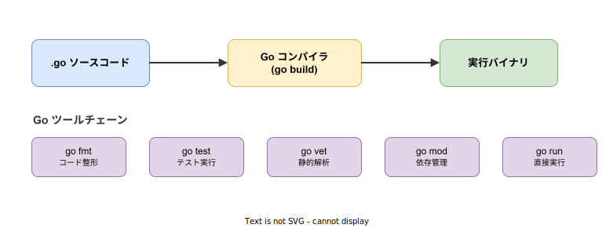

# Go: 概要

- 対象読者: 他言語（Python、JavaScript、Rust 等）の経験がある開発者
- 学習目標: Go の設計思想・特徴を理解し、基本的なプログラムを書けるようになる
- 所要時間: 約 40 分
- 対象バージョン: Go 1.24
- 最終更新日: 2026-04-12

## 1. このドキュメントで学べること

- Go がどのような課題を解決するために設計されたかを説明できる
- 基本的な型・制御構文・関数を使ったコードを書ける
- goroutine と channel を使った並行処理の概念を理解できる
- Go のツールチェーン（go build、go test 等）を使えるようになる

## 2. 前提知識

- 何らかのプログラミング言語でのコーディング経験
- 変数・関数・条件分岐・ループの基本概念
- ターミナル（コマンドライン）の基本操作

## 3. 概要

Go は Google の Robert Griesemer、Rob Pike、Ken Thompson が 2007 年に設計を開始し、2009 年にオープンソースとして公開、2012 年に 1.0 をリリースしたプログラミング言語である。

Google 社内で大規模な C++ / Java プロジェクトが抱えていた「コンパイル時間の長さ」「依存関係の複雑さ」「並行処理の難しさ」を解決するために設計された。主な特徴は以下の通りである。

- **シンプルな構文**: 予約語は 25 個のみ。学習コストが低い
- **高速なコンパイル**: 大規模プロジェクトでも数秒でビルドが完了する
- **組み込みの並行処理**: goroutine と channel により、軽量な並行処理を言語レベルでサポートする
- **ガベージコレクション**: 手動メモリ管理が不要である
- **静的型付け**: コンパイル時に型の不整合を検出する
- **単一バイナリ**: 依存ライブラリをすべて含む実行ファイルを生成する

## 4. 用語の整理

| 用語 | 説明 |
|------|------|
| goroutine | Go ランタイムが管理する軽量スレッド。`go` キーワードで起動する |
| channel | goroutine 間でデータを安全に受け渡すための通信路 |
| パッケージ（package） | コードをまとめる単位。すべての Go ファイルはいずれかのパッケージに属する |
| モジュール（module） | パッケージの集合を管理する単位。`go.mod` ファイルで定義する |
| インターフェース（interface） | メソッドのシグネチャの集合。暗黙的に実装される（implements 宣言不要） |
| スライス（slice） | 可変長の配列。Go で最も頻繁に使うコレクション型 |
| `error` | エラーを表す組み込みインターフェース。`Error() string` メソッドを持つ |
| `defer` | 関数の終了時に実行する処理を予約するキーワード |

## 5. 仕組み・アーキテクチャ

Go のソースコードは Go コンパイラによって依存ライブラリを含む単一の実行バイナリに変換される。Go ツールチェーンはビルドだけでなく、コード整形・テスト・静的解析・依存管理を統一的に提供する。



Go の最大の特徴である並行処理は、goroutine と channel の組み合わせで実現する。goroutine は OS スレッドより軽量（初期スタック数 KB）であり、数千〜数万の goroutine を同時に実行できる。channel はメッセージパッシングにより、共有メモリのロックなしで安全にデータを受け渡す。


## 6. 環境構築

### 6.1 必要なもの

- Go 1.24 以上
- テキストエディタ（VS Code + Go 拡張を推奨）

### 6.2 セットアップ手順

```bash
# Go をインストールする（公式サイトからダウンロード）
# https://go.dev/dl/ からインストーラを取得する

# バージョンを確認する
go version
```

### 6.3 動作確認

```bash
# 新しいモジュールを初期化する
mkdir hello-go && cd hello-go
go mod init example.com/hello

# main.go を作成して実行する
go run main.go
```

## 7. 基本の使い方

```go
// Go の基本構文を示すサンプルプログラム
package main

// fmt パッケージをインポートする
import "fmt"

// メイン関数: プログラムのエントリーポイント
func main() {
	// 変数を宣言する（型推論を使用）
	name := "Go"
	// フォーマット付きで標準出力に表示する
	fmt.Printf("Hello, %s!\n", name)

	// 明示的に型を指定して変数を宣言する
	var count int = 0
	// 値を変更する
	count++
	// 変数の値を表示する
	fmt.Println("count =", count)

	// 関数を呼び出して結果を受け取る
	result := add(3, 5)
	// 結果を表示する
	fmt.Printf("3 + 5 = %d\n", result)
}

// 2 つの整数を受け取り、合計を返す関数
func add(a, b int) int {
	// 合計を返す
	return a + b
}
```

### 解説

- `package main` と `func main()` がプログラムのエントリーポイントとなる
- `:=` は変数の宣言と初期化を同時に行う短縮構文である
- Go では未使用の変数やインポートはコンパイルエラーになる。この制約によりコードの整理が強制される
- 関数のパラメータは `名前 型` の順で記述する（C 系言語とは逆）

## 8. ステップアップ

### 8.1 構造体とメソッド

```go
// 構造体とメソッドのサンプルプログラム
package main

// fmt パッケージをインポートする
import "fmt"

// User 構造体を定義する
type User struct {
	// 名前フィールド
	Name string
	// 年齢フィールド
	Age int
}

// User の挨拶メソッドを定義する（値レシーバ）
func (u User) Greet() string {
	// フォーマットした文字列を返す
	return fmt.Sprintf("こんにちは、%sです（%d歳）", u.Name, u.Age)
}

// メイン関数
func main() {
	// User を生成する
	user := User{Name: "太郎", Age: 30}
	// メソッドを呼び出して表示する
	fmt.Println(user.Greet())
}
```

### 8.2 goroutine と channel

```go
// 並行処理のサンプルプログラム
package main

// fmt パッケージをインポートする
import "fmt"

// 二乗を計算して channel に送信する関数
func square(n int, ch chan<- int) {
	// 計算結果を channel に送信する
	ch <- n * n
}

// メイン関数
func main() {
	// int 型の channel を作成する
	ch := make(chan int, 3)

	// 3 つの goroutine を起動する
	go square(2, ch)
	go square(3, ch)
	go square(4, ch)

	// 3 つの結果を channel から受信して表示する
	for i := 0; i < 3; i++ {
		// channel からデータを受信する
		result := <-ch
		// 結果を表示する
		fmt.Println(result)
	}
}
```

## 9. よくある落とし穴

- **未使用変数・インポートのエラー**: Go では使わない変数やインポートがあるとコンパイルが通らない。開発中は `_` に代入するか、不要なものを削除する
- **スライスの参照共有**: スライスは内部配列への参照を持つため、コピーは同じ配列を指す。独立したコピーが必要な場合は `copy()` を使用する
- **goroutine のリーク**: channel の受信側がいない goroutine は永久にブロックする。`context` パッケージでキャンセルを実装する
- **エラーの握りつぶし**: `err` を `_` で無視すると問題の発見が遅れる。エラーは必ず処理する
- **ポインタレシーバと値レシーバの混同**: 値を変更するメソッドにはポインタレシーバ `(u *User)` を使用する。値レシーバ `(u User)` ではコピーに対して操作するため元の値は変わらない

## 10. ベストプラクティス

- `go fmt` でコードを整形し、チーム全体で統一されたスタイルを維持する
- エラーは戻り値で返し、呼び出し元で適切に処理する（例外機構は使わない）
- `go vet` と `staticcheck` で静的解析を実施し、潜在的なバグを検出する
- 小さなインターフェースを定義する（Go の標準ライブラリでは 1〜2 メソッドが一般的）
- goroutine を起動する際は、終了条件と channel のクローズを明確にする

## 11. 演習問題

1. 文字列のスライスを受け取り、各要素を大文字に変換した新しいスライスを返す関数を作成せよ
2. `error` インターフェースを実装したカスタムエラー型を定義し、エラーメッセージにコンテキスト情報を含めるプログラムを作成せよ
3. 複数の URL に対して goroutine で並行に HTTP GET リクエストを送り、最初に応答が返った結果を表示するプログラムを作成せよ

## 12. さらに学ぶには

- 公式チュートリアル: https://go.dev/tour/
- Effective Go: https://go.dev/doc/effective_go
- Go by Example: https://gobyexample.com/
- 関連 Knowledge: 並行処理の詳細は `go_concurrency.md`（作成予定）を参照

## 13. 参考資料

- The Go Programming Language Specification: https://go.dev/ref/spec
- Go Documentation: https://go.dev/doc/
- Go Standard Library: https://pkg.go.dev/std
