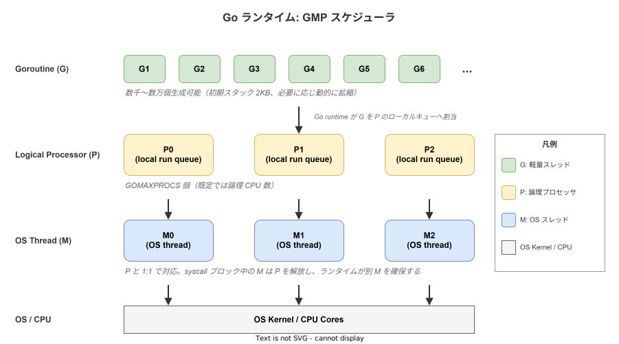
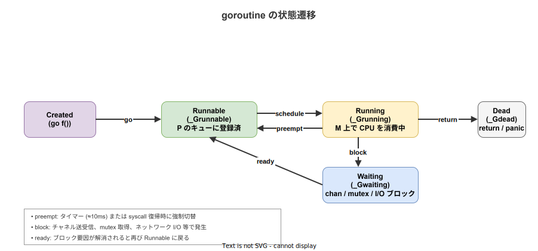

# Go: ゴルーチン (goroutine)

- 対象読者: 何らかの言語で並行/並列処理に触れたことがあり、Go の基本構文（[`go_basics.md`](go_basics.md) レベル）を一通り読んだ開発者
- 学習目標: ゴルーチンの実行モデル (GMP) を説明でき、起動・終了・同期の基本パターンを使い分けられる
- 所要時間: 約 50 分
- 対象バージョン: Go 1.24
- 最終更新日: 2026-04-27

## 1. このドキュメントで学べること

- ゴルーチンが「OS スレッドではない」こと、その理由を説明できる
- GMP モデル (G/P/M) の役割と関係を説明できる
- `go` キーワード・`sync.WaitGroup`・`channel` を使った典型的な並行処理パターンを書ける
- ゴルーチンリーク・データ競合といった代表的な落とし穴を回避できる

## 2. 前提知識

- Go の基本構文（→ [`go_basics.md`](go_basics.md)）
- スレッド・プロセス・スタックの基礎
- 並行 (concurrency) と並列 (parallelism) の違い

## 3. 概要

ゴルーチン (goroutine) は Go ランタイムが管理する軽量実行単位である。OS スレッドとの対応関係は M:N（多数のゴルーチンを少数の OS スレッドへ多重化）であり、`go func()` というキーワード 1 個で起動できる。

OS スレッドとの主な違いは次の通り。

- 初期スタックが 2KB と小さく、必要に応じ動的に拡縮する（OS スレッドは通常 1〜8MB 固定）
- スイッチコストはユーザ空間で数百 ns 程度。OS スレッド (μs オーダー) より 1〜2 桁安い
- カーネルではなく Go ランタイムがスケジュールするため、syscall 集約型の負荷でも独自最適化（netpoller 等）が効く

これにより、サーバ実装で「コネクション 1 本 = 1 ゴルーチン」という素直な設計が現実解として成立する。Erlang のプロセスや Java の仮想スレッド (Loom) と同系統の発想だが、Go は言語自身が runtime を抱え込み、`go` キーワードを原始操作として露出した点に特徴がある。

## 4. 用語の整理

| 用語 | 説明 |
|------|------|
| ゴルーチン (G) | Go ランタイムが管理する軽量実行単位。`go f()` で起動 |
| 論理プロセッサ (P) | スケジューラがゴルーチンを割り当てる仮想 CPU。既定で `GOMAXPROCS` 個 |
| OS スレッド (M) | 実際に CPU を消費する OS レベルのスレッド (machine の M) |
| ローカルキュー | 各 P が保持する Runnable な G の FIFO キュー（容量 256） |
| グローバルキュー | どの P にも属さない G を入れるキュー。負荷分散時に参照される |
| ワークスティーリング | 自分の P のキューが空になった M が、他 P のキューから G を半分奪う仕組み |
| `GOMAXPROCS` | 同時に Go コードを実行できる P の上限。既定は `runtime.NumCPU()` |

## 5. 仕組み・アーキテクチャ

### 5.1 GMP モデル

ゴルーチンの実行は G・P・M の 3 種の構造体の協調で成り立つ。G は実行されるべきタスク本体、P はその実行権、M はカーネルから見えるスレッドである。M は「P を 1 つ持っている時に限り Go コードを実行できる」という制約を持ち、この制約が `GOMAXPROCS` による並列度制御を可能にする。



P は `GOMAXPROCS` 個で固定（実行時変更可）。G は数千〜数万まで増える。M は OS スレッドなので、I/O や syscall でブロックする間は別の M が必要になり、ランタイムが追加生成する。M が syscall から戻った時、対応していた P が他 M に既に渡っていれば、戻った M は G とともに別の空き P を探すか、見つからなければ G をグローバルキューに戻して M 自身は休眠する。

ローカルキューが空になった M は、グローバルキューを覗いた後、ランダムに選んだ他 P のローカルキューから半分の G を奪う（ワークスティーリング）。これにより、明示的なロードバランサなしに作業がならされる。

### 5.2 状態遷移

G は内部的に `_Grunnable` / `_Grunning` / `_Gwaiting` / `_Gdead` といった状態を持ち、`go` 文の実行・スケジューリング・チャネル受信などのイベントで遷移する。



`_Grunnable` は P のローカルキュー（あるいはグローバルキュー）に並んだ状態を指す。`_Grunning` は M に乗って CPU を消費している状態。`_Gwaiting` はチャネル送受信や `sync.Mutex.Lock`、ネットワーク I/O などでブロックされた状態で、ブロック要因が解消されると再び `_Grunnable` に戻る。プリエンプションは Go 1.14 以降は非協調的（非同期シグナル）で、純粋計算ループでも 10ms 程度で強制切替される。

## 6. 環境構築

特別な追加ツールは不要。Go 1.24 が動く環境ならそのまま検証できる。`go_basics.md` の手順で `hello-go` モジュールを作成済みなら、`go run` で本ドキュメントのコードをそのまま試せる。

`GOMAXPROCS` の挙動を確認したい場合は環境変数で上書きできる。

```bash
# 既定値（論理 CPU 数）で実行する
go run main.go

# 並列度を 1 に絞って実行する
GOMAXPROCS=1 go run main.go
```text
データ競合検出は `-race` フラグを付けるだけで有効化される。CI では常時有効が定石である。

```bash
# レース検出を有効にして実行する
go run -race main.go

# テストでも同様に使える
go test -race ./...
```text
## 7. 基本の使い方

```go
// ゴルーチンを起動して並行に出力する最小例
package main

// 標準出力と sync を使う
import (
	"fmt"
	"sync"
)

// メイン関数: 3 個のゴルーチンを起動して全部の終了を待つ
func main() {
	// 終了同期用の WaitGroup を初期化する
	var wg sync.WaitGroup

	// 3 回ループしてゴルーチンを起動する
	for i := 0; i < 3; i++ {
		// 起動前にカウンタを 1 増やす（必ず go の前で行う）
		wg.Add(1)
		// クロージャに i をコピーで渡してデータ競合を回避する
		go func(id int) {
			// 関数終了時に WaitGroup を 1 デクリメントする
			defer wg.Done()
			// 自身の ID を出力する
			fmt.Printf("goroutine %d 実行\n", id)
		}(i)
	}

	// 全ゴルーチンの完了を待つ
	wg.Wait()
}
```text
### 解説

- `go func(...)` で関数呼び出しを別ゴルーチンに切り出す。呼び出し元はブロックされない
- `sync.WaitGroup` は「これから N 個始める／1 個終わった」という終了同期を担う。`Add(1)` は **必ず `go` より前** で呼ぶ。後ろで呼ぶと `Wait` が `Add` を取りこぼす競合になる
- ループ変数 `i` を直接クロージャで参照すると Go 1.21 以前では全ゴルーチンが最後の `i` を見るバグが頻発した。Go 1.22 以降はループごとに新変数になったが、明示的に引数で渡すパターンは移植性が高く、現在も推奨される

## 8. ステップアップ

### 8.1 channel と select で多重待ち

```go
// 複数の入力源から最初に到着した値を取る
package main

// fmt と time を使う
import (
	"fmt"
	"time"
)

// 指定時間後に文字列を送るゴルーチンを起動して channel を返す
func after(d time.Duration, msg string) <-chan string {
	// バッファなし channel を作る
	ch := make(chan string)
	// 別ゴルーチンで sleep 後に送信する
	go func() {
		// 指定時間スリープする
		time.Sleep(d)
		// 結果を送信する
		ch <- msg
	}()
	// 受信専用 channel として返す
	return ch
}

// メイン関数: 2 つの結果を select で同時待ちする
func main() {
	// 100ms 後に "fast" を送るゴルーチンを起動する
	a := after(100*time.Millisecond, "fast")
	// 200ms 後に "slow" を送るゴルーチンを起動する
	b := after(200*time.Millisecond, "slow")

	// どちらか先に到着した方を 1 件だけ拾う
	select {
	case v := <-a:
		fmt.Println("a:", v)
	case v := <-b:
		fmt.Println("b:", v)
	}
}
```text
`select` は複数 channel の準備完了を待ち、到着したケースをランダムに 1 件だけ実行する。タイムアウトは `time.After(d)` を 1 ケースとして混ぜることで実装できる。なお、本例では遅い方のゴルーチンは送信先を誰も受信せず残ったままになる。実コードでは「全ケースに対する受信側を保証する」「`context` で打ち切る」のいずれかでリーク対策を行う必要がある。

### 8.2 context によるキャンセル伝播

長時間動くゴルーチンには「外部から停止指示を受け取る口」が必要である。Go では `context.Context` が事実上の標準で、`ctx.Done()` チャネルが閉じたらゴルーチンは速やかに帰投する規約を共有する。

```go
// context で停止できる定期処理ゴルーチン
package main

// context, fmt, time を使う
import (
	"context"
	"fmt"
	"time"
)

// 定期的にメッセージを出力するワーカ。ctx 経由で停止する
func worker(ctx context.Context) {
	// 100ms 周期の Ticker を作る
	t := time.NewTicker(100 * time.Millisecond)
	// 関数終了時に必ず停止する（リーク防止）
	defer t.Stop()
	// メインループ
	for {
		// 先に発火した方を処理する
		select {
		case <-ctx.Done():
			// キャンセル伝播を受けたら帰投する
			fmt.Println("worker stop:", ctx.Err())
			return
		case now := <-t.C:
			// チック毎に現在時刻を出力する
			fmt.Println("tick", now.Format("15:04:05.000"))
		}
	}
}

// メイン関数: 350ms 後にキャンセルする
func main() {
	// キャンセル可能な context を生成する
	ctx, cancel := context.WithCancel(context.Background())
	// ワーカを別ゴルーチンで起動する
	go worker(ctx)
	// 350ms 待機する
	time.Sleep(350 * time.Millisecond)
	// キャンセル信号を送る
	cancel()
	// ワーカが帰投する余地を与える
	time.Sleep(50 * time.Millisecond)
}
```text
`context.WithTimeout` / `context.WithDeadline` を使うと、明示的な `cancel()` なしに期限切れで自動キャンセルされる。実運用では HTTP サーバや gRPC サーバが受け取った `ctx` を下流に「素通し」していくのが典型形で、リクエスト中断時に DB クエリや外部 API 呼び出しまで一斉に打ち切れる。

## 9. よくある落とし穴

- **ゴルーチンリーク**: 受信側がいない channel に送信し続ける／`ctx.Done()` を見ずブロックし続けると、ゴルーチンが永久に滞留する。プロセスメモリが緩慢に増え続ける典型原因。`pprof` の goroutine プロファイルで張り込み中の数を可視化する
- **データ競合 (race condition)**: 同じ変数を複数ゴルーチンから読み書きするとコンパイラ最適化や CPU 並べ替えで未定義動作になる。`go run -race` / `go test -race` で常時検出すること（CI に組み込むのが定石）
- **`sync.WaitGroup.Add` の位置ミス**: ゴルーチン起動後に `wg.Add(1)` を呼ぶと、`Wait` 側が `Add` を見ずに通り抜ける場合がある。**`Add` は必ず `go` より前**で呼ぶ
- **for ループ変数のキャプチャ**: Go 1.22 で挙動が変わったが、移植性のためにも引数渡し `go func(i int){...}(i)` で書く方が安全
- **`time.Sleep` で同期する**: 「100ms 待てば終わるだろう」式の同期はテストでも本番でも非決定性の温床。channel か `WaitGroup` で明示同期する

## 10. ベストプラクティス

- ゴルーチンを起動した側に **終了の責務** を置く。受け側が `ctx.Done()` を見るか、特定 channel のクローズで帰投するかは起動側が決める
- channel のクローズは **送信側のみ** が行う。受信側で閉じると送信側が `panic` する
- 「Add → go → defer Done」を 3 点セットで徹底する。`Done` は必ず `defer` で書き、途中 return / panic でも漏れない形にする
- 共有状態に触る箇所は `sync.Mutex` で囲うか、`channel` で持ち回るかのいずれかに統一する。両方を混ぜるとデバッグが難しくなる
- 起動前に `runtime.NumGoroutine()` でベースラインを取り、終了後に同値へ戻ることを E2E テストで確認するとリーク検出が容易になる

## 11. 演習問題

1. 整数のスライスを 4 等分し、各部分和を別ゴルーチンで計算してから合算する関数 `parallelSum([]int) int` を実装せよ。`sync.WaitGroup` ではなく channel のみで同期すること
2. URL のリストを受け取り、最大 10 並列で HTTP GET し、最初に 200 を返したものの本文を返す関数を `context.WithCancel` を使って実装せよ。残りのリクエストは速やかにキャンセルすること
3. `go test -race` で競合を検出する小さなプログラムを意図的に書き、その後 `sync.Mutex` で修正して再実行し、レースが消えることを確認せよ

## 12. さらに学ぶには

- A Tour of Go - Concurrency: <https://go.dev/tour/concurrency/1>
- Effective Go - Concurrency 章: <https://go.dev/doc/effective_go#concurrency>
- Go memory model: <https://go.dev/ref/mem>
- 関連 Knowledge: 基本構文は [`go_basics.md`](go_basics.md)、channel 設計の深掘りは別途切り出し予定

## 13. 参考資料

- The Go Programming Language Specification - Go statements: <https://go.dev/ref/spec#Go_statements>
- Dmitry Vyukov, "Scalable Go Scheduler Design Doc"（Go 公式設計資料）
- Go runtime ソース: <https://github.com/golang/go/tree/master/src/runtime>
- Go memory model: <https://go.dev/ref/mem>
