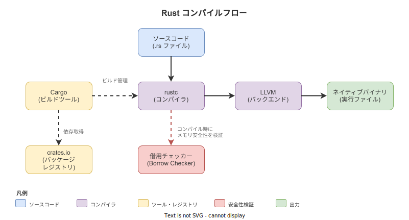
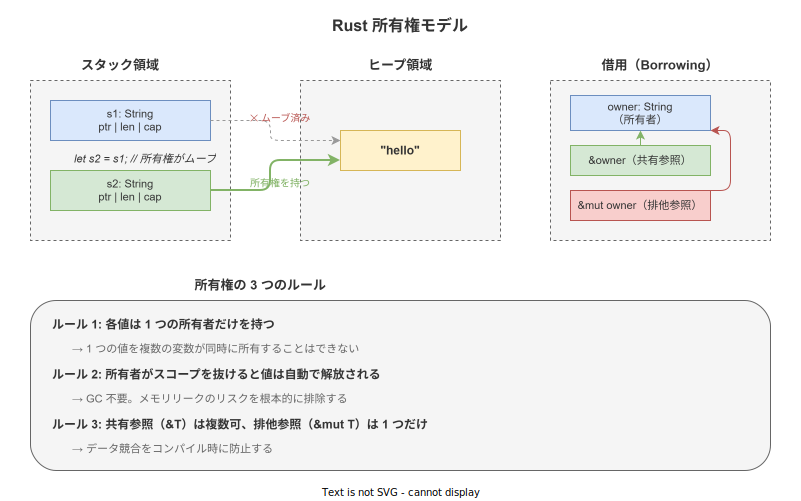

# Rust: 概要

- 対象読者: 他言語（Python、JavaScript、Go 等）の経験がある開発者
- 学習目標: Rust の設計思想・特徴を理解し、基本的なプログラムを書けるようになる
- 所要時間: 約 40 分
- 対象バージョン: Rust Edition 2024（rustc 1.85+）
- 最終更新日: 2026-04-12

## 1. このドキュメントで学べること

- Rust がどのような課題を解決するために設計されたかを説明できる
- 所有権・借用の基本ルールを理解できる
- 基本的な型（プリミティブ・構造体・列挙型）を使ったコードを書ける
- Cargo を使ってプロジェクトの作成・ビルド・実行ができる

## 2. 前提知識

- 何らかのプログラミング言語でのコーディング経験
- 変数・関数・条件分岐・ループの基本概念
- ターミナル（コマンドライン）の基本操作

## 3. 概要

Rust は Mozilla Research が 2010 年に開発を開始し、2015 年に 1.0 をリリースしたシステムプログラミング言語である。C/C++ と同等の実行性能を持ちながら、ガベージコレクション（GC）なしでメモリ安全性とスレッド安全性をコンパイル時に保証する。

従来のシステム言語では、メモリの解放忘れ（リーク）や二重解放、ダングリングポインタといったバグが実行時に発生していた。Rust はこれらを「所有権システム」によってコンパイル時に検出し、プログラムが実行される前に排除する。

## 4. 用語の整理

| 用語 | 説明 |
|------|------|
| 所有権（Ownership） | 各値には 1 つの所有者変数があり、所有者がスコープを抜けると値が解放される仕組み |
| 借用（Borrowing） | 所有権を移動させずに値を参照する仕組み。`&T`（共有参照）と `&mut T`（排他参照）がある |
| ムーブ（Move） | 値の所有権が別の変数に移動すること。元の変数は使用不可になる |
| トレイト（Trait） | 型が持つべき振る舞いを定義するインターフェースに相当する機能 |
| クレート（Crate） | Rust のコンパイル単位であり、パッケージの配布単位 |
| Cargo | Rust の公式ビルドツール兼パッケージマネージャ |
| `Result<T, E>` | 成功（`Ok(T)`）または失敗（`Err(E)`）を表す列挙型。例外の代わりに使用する |
| `Option<T>` | 値の有無を表す列挙型。`Some(T)` または `None` を返す。null の代わりに使用する |

## 5. 仕組み・アーキテクチャ

Rust のソースコードは、コンパイラ（rustc）によって借用チェックを経た後、LLVM バックエンドでネイティブバイナリに変換される。GC やランタイムを持たないため、C/C++ と同等の実行速度を実現する。



所有権システムはコンパイル時に動作し、以下の 3 つのルールでメモリ安全性を保証する。



## 6. 環境構築

### 6.1 必要なもの

- rustup（Rust ツールチェーン管理ツール）
- テキストエディタ（VS Code + rust-analyzer 拡張を推奨）

### 6.2 セットアップ手順

```bash
# rustup をインストールする（公式インストーラ）
curl --proto '=https' --tlsv1.2 -sSf https://sh.rustup.rs | sh

# パスを反映する
source $HOME/.cargo/env

# バージョンを確認する
rustc --version
cargo --version
```

### 6.3 動作確認

```bash
# 新しいプロジェクトを作成する
cargo new hello-rust

# プロジェクトに移動してビルド・実行する
cd hello-rust
cargo run
```

`Hello, world!` と表示されればセットアップ完了である。

## 7. 基本の使い方

```rust
// Rust の基本構文を示すサンプルプログラム

// メイン関数: プログラムのエントリーポイント
fn main() {
    // 不変の変数を宣言する（デフォルトは不変）
    let name = "Rust";
    // フォーマット付きで標準出力に表示する
    println!("Hello, {}!", name);

    // 可変の変数を宣言する（mut キーワードが必要）
    let mut count = 0;
    // 値を変更する
    count += 1;
    // 変数の値を表示する
    println!("count = {}", count);

    // 関数を呼び出して結果を受け取る
    let result = add(3, 5);
    // 結果を表示する
    println!("3 + 5 = {}", result);
}

// 2 つの整数を受け取り、合計を返す関数
fn add(a: i32, b: i32) -> i32 {
    // 最後の式が戻り値になる（セミコロンを付けない）
    a + b
}
```

### 解説

- `let` で変数を宣言する。Rust の変数はデフォルトで不変（イミュータブル）である
- 変更が必要な場合のみ `mut` を付ける。この設計により意図しない変更を防止する
- 関数の戻り値は最後の式で表現する。`return` キーワードは早期リターン時のみ使用する
- 型注釈は省略可能だが、関数のパラメータと戻り値には必須である

## 8. ステップアップ

### 8.1 所有権とムーブ

```rust
// 所有権のムーブを示すサンプルプログラム

// メイン関数
fn main() {
    // String 型はヒープにデータを持つ
    let s1 = String::from("hello");
    // s1 の所有権が s2 にムーブする（s1 は使用不可になる）
    let s2 = s1;
    // s2 を表示する
    println!("{}", s2);

    // 明示的にコピーしたい場合は clone を使う
    let s3 = s2.clone();
    // s2 と s3 の両方が使用可能
    println!("s2 = {}, s3 = {}", s2, s3);

    // i32 などの Copy トレイトを実装する型はコピーされる
    let x = 42;
    // x はコピーされるため、両方使用可能
    let y = x;
    // x と y を表示する
    println!("x = {}, y = {}", x, y);
}
```

### 8.2 パターンマッチとエラーハンドリング

```rust
// パターンマッチとエラーハンドリングのサンプルプログラム

// 文字列を整数に変換し、結果を返す関数
fn parse_number(input: &str) -> Result<i32, std::num::ParseIntError> {
    // ? 演算子でエラーを呼び出し元に伝播する
    let number = input.parse::<i32>()?;
    // 成功時は Ok で包んで返す
    Ok(number)
}

// メイン関数
fn main() {
    // parse_number の結果をパターンマッチで処理する
    match parse_number("42") {
        // 成功時の処理
        Ok(n) => println!("parsed: {}", n),
        // 失敗時の処理
        Err(e) => println!("error: {}", e),
    }

    // Option 型の使用例
    let numbers = vec![1, 2, 3];
    // 最初の要素を取得する（Option<&i32> を返す）
    match numbers.first() {
        // 値が存在する場合
        Some(first) => println!("first: {}", first),
        // 値が存在しない場合
        None => println!("empty"),
    }
}
```

## 9. よくある落とし穴

- **ムーブ後の使用**: `let s2 = s1;` の後に `s1` を使うとコンパイルエラーになる。ムーブではなくコピーが必要な場合は `clone()` を使用する
- **不変変数への再代入**: `let x = 5; x = 10;` はエラーになる。変更が必要なら `let mut x = 5;` と宣言する
- **借用ルール違反**: 共有参照（`&T`）と排他参照（`&mut T`）を同時に持つことはできない。コンパイラが検出する
- **文字列型の混同**: `String`（所有権あり・可変）と `&str`（参照・不変）は異なる型である。変換には `.as_str()` や `.to_string()` を使う

## 10. ベストプラクティス

- 変数はデフォルトで不変にし、必要な場合のみ `mut` を付ける
- `unwrap()` を本番コードで使わず、`match` や `?` 演算子で適切にエラーを処理する
- `clippy`（Rust の lint ツール）を使ってコードの品質を維持する
- 型エイリアスや構造体で意味のある名前を付け、可読性を高める

## 11. 演習問題

1. 2 つの `String` を受け取り、結合した新しい `String` を返す関数を作成せよ。所有権のムーブに注意すること
2. 整数のベクタから最大値を返す関数を `Option<i32>` で作成せよ。空のベクタには `None` を返すこと
3. ファイルの読み込みを `Result` で処理し、成功時は内容を、失敗時はエラーメッセージを表示するプログラムを作成せよ

## 12. さらに学ぶには

- 公式ドキュメント（The Rust Programming Language）: <https://doc.rust-lang.org/book/>
- Rust by Example: <https://doc.rust-lang.org/rust-by-example/>
- Rust リファレンス: <https://doc.rust-lang.org/reference/>
- 関連 Knowledge: [Rust: 所有権（Ownership）](./rust_ownership.md)

## 13. 参考資料

- The Rust Reference: <https://doc.rust-lang.org/reference/>
- Comprehensive Rust（Google）: <https://google.github.io/comprehensive-rust/>
- Rust Edition Guide: <https://doc.rust-lang.org/edition-guide/>
