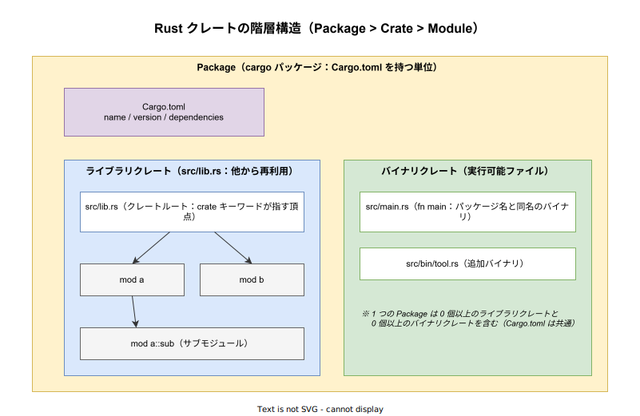
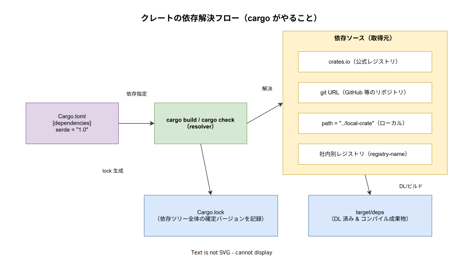

# Rust: クレート（Crate）とは

- 対象読者: Rust の入門段階を終え、`cargo new` までは触ったが「クレート」と「モジュール」と「パッケージ」の違いがあいまいな開発者
- 学習目標: クレート・モジュール・パッケージの関係を説明でき、外部クレートを Cargo.toml で取り込んで使えるようになる
- 所要時間: 約 30 分
- 対象バージョン: Rust Edition 2024（rustc 1.85+）/ Cargo 1.85+
- 最終更新日: 2026-04-27

## 1. このドキュメントで学べること

- 「クレート」が Rust において何の単位を指すかを説明できる
- パッケージ・クレート・モジュールの 3 階層を区別できる
- ライブラリクレートとバイナリクレートの違いと配置ルールを理解できる
- `Cargo.toml` で外部クレートを依存に追加し、`use` で参照できる
- `Cargo.lock` の役割と、ライブラリ／バイナリでの扱いの違いを理解できる

## 2. 前提知識

- Rust の基本構文（`fn` / `let` / `struct` 程度）
- ターミナルで `cargo` コマンドを実行できる
- 関連 Knowledge: [Rust: 概要](./rust_basics.md)

## 3. 概要

クレート（crate）は **Rust コンパイラ rustc が一度に処理する最小のコンパイル単位** である。一回の rustc 起動が消費する入力（≒ 1 つの crate root から辿れるソースツリー全体）が 1 クレートに対応し、出力として 1 つのライブラリ（`.rlib` / `.so` 等）または 1 つの実行可能ファイルが生成される。

ここで重要なのは、クレートは **ファイル 1 つではなく木構造全体** を指す点である。`src/lib.rs` を頂点に `mod a;` で読み込まれた子モジュール、その孫モジュール…までを含めて「ひとつのクレート」と呼ぶ。モジュールはあくまでクレート内部の名前空間であり、クレートそのものを分割しない。

クレートの上位概念が **パッケージ（package）** である。パッケージは `Cargo.toml` を 1 枚持つディレクトリで、その中に最大 1 つのライブラリクレートと 0 個以上のバイナリクレートを束ねる。Cargo（公式ビルドツール）が扱う配布・公開・依存解決の単位はパッケージであり、クレートではない。

つまり 3 階層の関係は次のとおり: **パッケージ ⊇ クレート ⊇ モジュール**。

## 4. 用語の整理

| 用語 | 説明 |
|------|------|
| クレート（Crate） | rustc の 1 回のコンパイル単位。クレートルートから到達可能なモジュール木全体 |
| クレートルート（Crate root） | クレートの頂点となるソースファイル。ライブラリは `src/lib.rs`、バイナリは `src/main.rs` |
| ライブラリクレート | 他クレートから再利用される。1 パッケージに最大 1 つ |
| バイナリクレート | `fn main()` を持つ実行可能ファイル。1 パッケージに 0 個以上 |
| モジュール（Module） | クレート内部の名前空間。`mod` キーワードで定義 |
| パッケージ（Package） | `Cargo.toml` を 1 枚持つディレクトリ。クレートを束ねた配布単位 |
| crates.io | Rust 公式のパッケージレジストリ。`cargo publish` でパッケージを公開する |
| `Cargo.toml` | パッケージのメタデータと依存を宣言するファイル |
| `Cargo.lock` | 依存ツリー全体の確定バージョンを記録するロックファイル |

## 5. 仕組み・アーキテクチャ

### 5.1 階層構造（パッケージ／クレート／モジュール）

下図のとおり、1 つのパッケージは `Cargo.toml`・最大 1 つのライブラリクレート・0 個以上のバイナリクレートからなる。各クレートはモジュール木を内包する。



ライブラリクレートのルートは規約により `src/lib.rs` 固定で、ここから `mod a;` と書くと `src/a.rs` または `src/a/mod.rs` がモジュールとして取り込まれる。バイナリクレートのルートは `src/main.rs`（パッケージ名と同名のバイナリ）と、追加分の `src/bin/<name>.rs`（任意個）である。

### 5.2 依存解決フロー

`cargo build` を実行すると、cargo の resolver が `Cargo.toml` の `[dependencies]` を読み、依存ソース（crates.io / git / path / 別レジストリ）から各クレートを取得する。確定したバージョン組み合わせは `Cargo.lock` に記録され、`target/deps` 以下にコンパイル成果物が配置される。



## 6. 環境構築

`rustup` 経由で Rust ツールチェーンを導入していれば cargo は同梱されているため、追加のインストールは不要である。導入手順は [Rust: 概要 §6](./rust_basics.md) を参照。

```bash
# バージョンを確認する（cargo は rustup 経由で同梱）
rustc --version
cargo --version
```text
## 7. 基本の使い方

最小構成として、ライブラリクレートを 1 つ作り、バイナリクレートから呼び出す例を示す。

```bash
# 新規パッケージを作成する（デフォルトでバイナリクレート構成）
cargo new hello-crates
# プロジェクトに移動する
cd hello-crates
# ライブラリクレートも追加する（src/lib.rs を新規作成）
touch src/lib.rs
```text
```rust
// src/lib.rs : ライブラリクレートのルート
// 公開する関数 greet を定義する（pub をつけないと外部から見えない）
pub fn greet(name: &str) -> String {
    // フォーマット文字列で挨拶を組み立てて返す
    format!("Hello, {}!", name)
}
```text
```rust
// src/main.rs : バイナリクレートのルート（同パッケージ内の lib を呼ぶ）
// 同パッケージのライブラリクレートを use で取り込む
use hello_crates::greet;

// プログラムのエントリーポイント
fn main() {
    // ライブラリの関数を呼び出して結果を表示する
    println!("{}", greet("Rust"));
}
```text
```bash
# ビルドして実行する
cargo run
```text
### 解説

- 同一パッケージ内のライブラリクレートは、バイナリ側からは `<パッケージ名>::<項目>` で参照する。`hello-crates` パッケージのライブラリは `hello_crates`（ハイフンはアンダースコアに変換）として見える
- `pub` を付けない項目はクレート外から不可視になる。これは「クレートが API 境界を決める」ことの直接的な現れである

## 8. ステップアップ

### 8.1 外部クレートを追加する

`Cargo.toml` の `[dependencies]` に書くか、`cargo add` で追加する。

```toml
# Cargo.toml の依存セクション例
[dependencies]
serde = { version = "1.0", features = ["derive"] }
```text
```rust
// src/main.rs : 外部クレート serde を使う最小例
// derive マクロを取り込む
use serde::Serialize;

// シリアライズ可能な構造体を宣言する
#[derive(Serialize)]
struct User {
    // ユーザー名フィールド
    name: String,
}

// プログラムのエントリーポイント
fn main() {
    // 構造体の値を生成する
    let u = User { name: "alice".into() };
    // JSON にシリアライズして表示する（serde_json も dependencies に必要）
    println!("{}", serde_json::to_string(&u).unwrap());
}
```text
### 8.2 ワークスペースで複数クレートを束ねる

複数のクレート（パッケージ）を 1 つのリポジトリで管理する仕組みが **ワークスペース** である。ルートに `Cargo.toml` を置き `[workspace]` セクションでメンバーを列挙すると、`Cargo.lock` と `target/` が共有され、依存解決が一貫する。

```toml
# ワークスペースルートの Cargo.toml
[workspace]
resolver = "2"
members = ["app", "core", "adapters/db"]
```text
### 8.3 バージョン指定の意味

`serde = "1.0"` は `^1.0` と等価で、「1.0 以上、2.0 未満の最新」を意味する（Cargo の SemVer 互換ルール）。固定したい場合は `=1.0.197` のように明示する。

## 9. よくある落とし穴

- **「ファイル＝クレート」と思い込む**: モジュール（`mod`）はクレートを分割しない。`src/lib.rs` から `mod a; mod b;` で読み込んだファイル群はすべて同一クレートに属する
- **ハイフンとアンダースコアの不一致**: パッケージ名 `hello-crates` は Rust コードからは `hello_crates` として見える。`use hello-crates::*` はパースエラーになる
- **`Cargo.lock` をライブラリでコミットする／しない**: バイナリ／アプリケーションでは `Cargo.lock` をコミットして再現性を保つ。ライブラリでは原則コミットしない（利用側の lock が優先されるため）
- **`pub` 忘れ**: クレートルートで `pub` していない項目は外部から見えない。`mod foo;` も `pub mod foo;` でないと外部に公開されない
- **同名の依存衝突**: 異なるバージョンの同じクレートが依存ツリー内に同居することは可能だが、型は別物として扱われる。`Box<dyn Trait>` のような境界で型不一致になる場合がある

## 10. ベストプラクティス

- ライブラリクレートでは API 境界を `pub` で意識的に絞る。`pub(crate)` でクレート内限定にもできる
- 共通ロジックはライブラリクレート（`src/lib.rs`）に置き、`src/main.rs` は薄いエントリポイントに留める。テストや再利用が容易になる
- 巨大化したらワークスペースで複数クレートに分割する。コンパイル単位が小さくなれば差分ビルドが速くなる
- バージョン指定は `cargo add` に任せる。手で書くと SemVer の暗黙ルールを誤ることがある
- 公開前に `cargo publish --dry-run` で内容を確認する

## 11. 演習問題

1. `mylib` というパッケージを `cargo new --lib mylib` で作成し、`pub fn add(a: i32, b: i32) -> i32` を実装せよ。`cargo test` で動作確認できる単体テストも書くこと
2. 上記 `mylib` を別パッケージ `myapp` から `path = "../mylib"` で取り込み、`fn main` で呼び出すワークスペースを構築せよ
3. `serde` と `serde_json` を使い、構造体を JSON にシリアライズして標準出力に表示するバイナリクレートを書け

## 12. さらに学ぶには

- The Rust Programming Language 第 7 章「Managing Growing Projects with Packages, Crates, and Modules」: <https://doc.rust-lang.org/book/ch07-00-managing-growing-projects-with-packages-crates-and-modules.html>
- Cargo Book（公式）: <https://doc.rust-lang.org/cargo/>
- 関連 Knowledge: [Rust: 概要](./rust_basics.md) / [Rust: 所有権](./rust_ownership.md)

## 13. 参考資料

- The Rust Reference, "Crates and source files": <https://doc.rust-lang.org/reference/crates-and-source-files.html>
- The Cargo Book, "The Manifest Format": <https://doc.rust-lang.org/cargo/reference/manifest.html>
- The Cargo Book, "Workspaces": <https://doc.rust-lang.org/cargo/reference/workspaces.html>
- The Cargo Book, "Specifying Dependencies": <https://doc.rust-lang.org/cargo/reference/specifying-dependencies.html>
