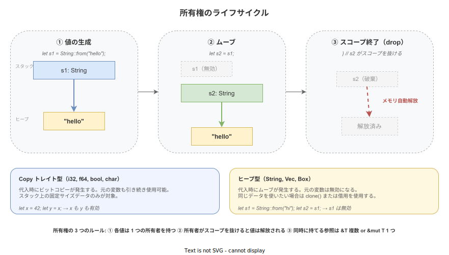
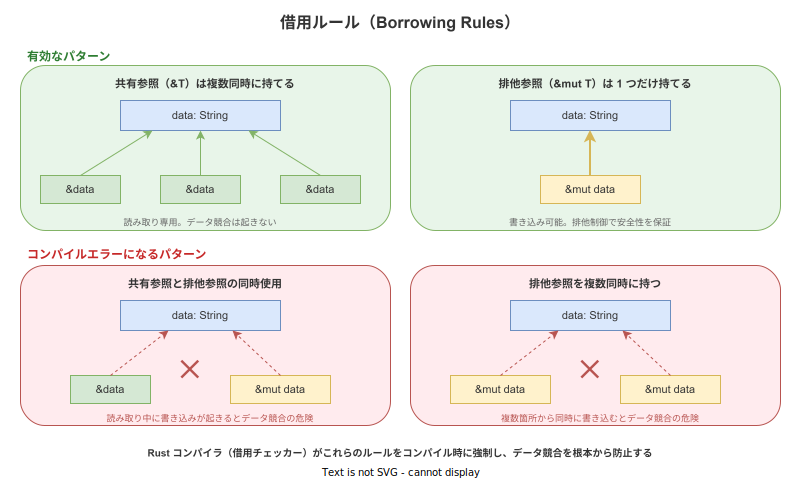

# Rust: 所有権（Ownership）

- 対象読者: 他言語経験があるが Rust は未経験の開発者
- 学習目標: 所有権・借用・ライフタイムの基本ルールを説明でき、コンパイルエラーなくコードを書けるようになる
- 所要時間: 約 45 分
- 対象バージョン: Rust Edition 2024（rustc 1.85+）
- 最終更新日: 2026-04-14

## 1. このドキュメントで学べること

- 所有権が「なぜ」必要なのかを説明できる
- ムーブとコピーの違いを区別できる
- 借用ルール（&T と &mut T）を正しく理解し使える
- ライフタイムの基本概念を理解できる

## 2. 前提知識

- 何らかのプログラミング言語でのコーディング経験
- スタックとヒープの違いについての基礎知識（スタックは関数呼び出しごとに自動管理される高速なメモリ領域、ヒープはプログラマが明示的に確保・解放する柔軟なメモリ領域）
- 関連 Knowledge: [Rust: 概要](./rust_basics.md)

## 3. 概要

多くのプログラミング言語では、メモリ管理をガベージコレクション（GC）に任せるか、プログラマが手動で管理するかの二択である。GC は安全だが実行時にコストがかかる。手動管理は高速だがメモリリークや二重解放などのバグを招きやすい。

Rust は「所有権（Ownership）」という独自の仕組みでこの問題を解決する。各値には必ず 1 つの「所有者」となる変数があり、所有者がスコープを抜けると値は自動的に解放される。このルールをコンパイラが静的に検証するため、GC なしでメモリ安全性を実現する。実行時のオーバーヘッドはゼロである。

## 4. 用語の整理

| 用語 | 説明 |
|------|------|
| 所有権（Ownership） | 各値に対して 1 つの変数が「所有者」となる仕組み。所有者がスコープを抜けると値が解放される |
| ムーブ（Move） | 所有権が別の変数に移動すること。移動後、元の変数は使用不可になる |
| コピー（Copy） | 値のビット列がそのまま複製されること。Copy トレイトを実装する型でのみ発生する |
| クローン（Clone） | `.clone()` メソッドによる明示的な深いコピー。ヒープデータも含めて複製する |
| 借用（Borrowing） | 所有権を移動させずに値を参照する仕組み |
| 共有参照（&T） | 読み取り専用の参照。複数同時に存在できる |
| 排他参照（&mut T） | 読み書き可能な参照。同時に 1 つだけ存在できる |
| ライフタイム（Lifetime） | 参照が有効な期間。コンパイラが自動推論するが、明示的な注釈が必要な場合もある |
| Drop トレイト | スコープ終了時に自動実行されるクリーンアップ処理を定義するトレイト |

## 5. 仕組み・アーキテクチャ

所有権システムは、値の生成からムーブ、スコープ終了時の自動解放（drop）までのライフサイクルを管理する。



借用ルールにより、参照を通じた安全なデータアクセスが保証される。共有参照は複数同時に持てるが、排他参照は 1 つだけに制限される。



## 6. 環境構築

Rust の開発環境セットアップは [Rust: 概要](./rust_basics.md) のセクション 6 を参照のこと。

## 7. 基本の使い方

```rust
// 所有権の基本動作を示すサンプルプログラム

// メイン関数
fn main() {
    // String 型の値を生成する（ヒープにメモリを確保）
    let s1 = String::from("hello");
    // s1 の所有権が s2 にムーブする
    let s2 = s1;
    // s2 を通じて値にアクセスする（s1 は使用不可）
    println!("{}", s2);

    // 明示的にコピーしたい場合は clone を使う
    let s3 = s2.clone();
    // clone 後は s2 と s3 の両方が使用可能
    println!("s2 = {}, s3 = {}", s2, s3);

    // Copy トレイトを実装する型（i32 等）はコピーされる
    let x = 42;
    // x はコピーされるため、両方使用可能
    let y = x;
    // x と y の両方が有効
    println!("x = {}, y = {}", x, y);

    // 関数に値を渡すと所有権がムーブする
    let s4 = String::from("world");
    // s4 の所有権が関数に移動する
    take_ownership(s4);
    // s4 はここでは使用不可

    // 関数から値を返すと所有権が呼び出し元に移動する
    let s5 = give_ownership();
    // s5 が所有権を持つ
    println!("{}", s5);
}

// 文字列の所有権を受け取り、スコープ終了時に解放する関数
fn take_ownership(s: String) {
    // 受け取った文字列を表示する
    println!("{}", s);
    // 関数終了時に s が drop される
}

// 新しい文字列を生成して所有権を返す関数
fn give_ownership() -> String {
    // 新しい String を生成する
    let s = String::from("returned");
    // 所有権を呼び出し元に移動する
    s
}
```

### 解説

- `String::from("hello")` はヒープにメモリを確保して文字列データを格納する
- `let s2 = s1;` で所有権がムーブし、`s1` は無効になる。これにより二重解放を防止する
- `clone()` はヒープデータも含めた深いコピーを行う。コストが高いため必要な場合のみ使用する
- `i32` などの固定サイズ型は `Copy` トレイトを実装しており、代入時にビットコピーが発生する
- 関数への引数渡しでも所有権のムーブが発生する

## 8. ステップアップ

### 8.1 借用と参照

```rust
// 借用（参照）の使い方を示すサンプルプログラム

// 文字列の長さを返す関数（共有参照で借用する）
fn calculate_length(s: &String) -> usize {
    // 参照を通じて値を読み取る（所有権は移動しない）
    s.len()
}

// 文字列に文字を追加する関数（排他参照で借用する）
fn append_world(s: &mut String) {
    // 排他参照を通じて値を変更する
    s.push_str(", world");
}

// メイン関数
fn main() {
    // 可変な String を生成する
    let mut greeting = String::from("hello");

    // 共有参照で借用する（所有権は greeting が保持したまま）
    let len = calculate_length(&greeting);
    // greeting は引き続き使用可能
    println!("長さ: {}", len);

    // 排他参照で借用し、値を変更する
    append_world(&mut greeting);
    // 変更が反映されている
    println!("{}", greeting);

    // 共有参照は複数同時に持てる
    let r1 = &greeting;
    let r2 = &greeting;
    // r1 と r2 は同時に使用可能
    println!("{}, {}", r1, r2);
}
```

### 8.2 ライフタイムの基本

ライフタイムとは、参照が有効な期間のことである。多くの場合コンパイラが自動推論するが、複数の参照が関わる場合は明示的な注釈が必要になる。

```rust
// ライフタイム注釈の基本を示すサンプルプログラム

// 2 つの文字列参照のうち長い方を返す関数
// 'a は両方の引数と戻り値が同じライフタイムを持つことを示す
fn longest<'a>(x: &'a str, y: &'a str) -> &'a str {
    // 長さを比較して長い方を返す
    if x.len() > y.len() {
        // x の方が長い場合
        x
    } else {
        // y の方が長いか同じ場合
        y
    }
}

// メイン関数
fn main() {
    // 1 つ目の文字列を用意する
    let string1 = String::from("long string");
    // longest の結果を格納する変数
    let result;
    {
        // 2 つ目の文字列を内側のスコープで用意する
        let string2 = String::from("xyz");
        // longest 関数で長い方の参照を取得する
        result = longest(string1.as_str(), string2.as_str());
        // string2 のスコープ内なので result は有効
        println!("longer: {}", result);
    }
}
```

ライフタイム注釈 `'a` は「この参照は少なくともライフタイム `'a` の間は有効である」ことをコンパイラに伝える。これにより、ダングリング参照（無効なメモリを指す参照）をコンパイル時に防止する。

## 9. よくある落とし穴

- **ムーブ後の使用**: `let s2 = s1;` の後に `s1` を使うとコンパイルエラーになる。値を両方で使いたい場合は `clone()` または借用を使用する
- **借用中のムーブ**: 参照が存在する間に所有者をムーブするとコンパイルエラーになる。参照のスコープが終了してからムーブする
- **共有参照と排他参照の混在**: `&T` が存在する間に `&mut T` を取得するとコンパイルエラーになる。同時に使わないようスコープを分離する
- **ダングリング参照**: 関数内で生成した値の参照を返そうとするとコンパイルエラーになる。値そのものを返す（所有権をムーブする）か、引数の参照を返す

## 10. ベストプラクティス

- 可能な限り借用（`&T`）を使い、所有権のムーブを避ける。関数の引数は参照で受け取ることを基本とする
- `clone()` はコストが高いため、安易に多用しない。ただし所有権の問題を回避するために必要な場合は使用してよい
- 構造体にライフタイム注釈が必要な場合、設計を見直して所有型（`String` 等）を持たせることを検討する
- 複数の所有者が必要な場合は `Rc<T>`（参照カウント）や `Arc<T>`（スレッド安全な参照カウント）を使用する

## 11. 演習問題

1. `String` を受け取って最初の単語を `&str` として返す関数 `first_word` を作成せよ。借用とライフタイムに注意すること
2. 2 つの `Vec<i32>` を受け取り、両方の要素を含む新しい `Vec<i32>` を返す関数を、所有権を消費する版と借用する版の両方で実装せよ
3. 以下のコードがコンパイルエラーになる理由を説明し、修正せよ:

```rust
// コンパイルエラーになるコード
fn main() {
    // 可変な String を生成する
    let mut s = String::from("hello");
    // 共有参照を取得する
    let r1 = &s;
    // 排他参照を取得する（共有参照と同時に存在できない）
    let r2 = &mut s;
    // 両方の参照を使用する
    println!("{}, {}", r1, r2);
}
```

## 12. さらに学ぶには

- The Rust Programming Language Chapter 4: <https://doc.rust-lang.org/book/ch04-00-understanding-ownership.html>
- Rust by Example - Ownership and moves: <https://doc.rust-lang.org/rust-by-example/scope/move.html>
- 関連 Knowledge: [Rust: 概要](./rust_basics.md)

## 13. 参考資料

- The Rust Reference - Type system: <https://doc.rust-lang.org/reference/type-system.html>
- Rust RFC 2094 - Non-lexical lifetimes: <https://rust-lang.github.io/rfcs/2094-nll.html>
- The Rustonomicon: <https://doc.rust-lang.org/nomicon/>
