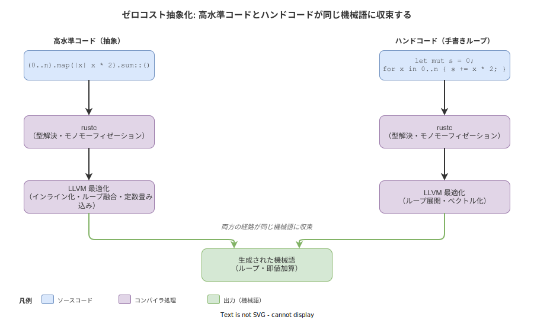
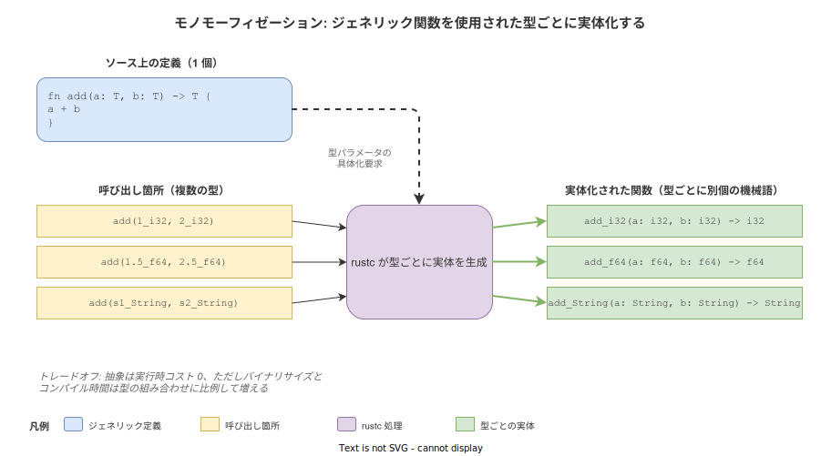

# Rust: ゼロコスト抽象化（Zero-Cost Abstractions）

- 対象読者: Rust の基本構文を一通り読める開発者で、抽象化のコストを意識せず使ってよい場面と注意すべき場面を見分けたい人
- 学習目標: ゼロコスト抽象化の定義を Rust の文脈で説明でき、典型的にゼロコストな機能とそうでない機能を区別できる
- 所要時間: 約 40 分
- 対象バージョン: Rust Edition 2024（rustc 1.85+）
- 最終更新日: 2026-04-27

## 1. このドキュメントで学べること

- ゼロコスト抽象化とは「実行時コストが手書きの低水準コードと同等」という意味であり、「コンパイル時コストもゼロ」ではないことを説明できる
- イテレータ・ジェネリクス・クロージャ・`Option`/`Result` がなぜゼロコストになるのかを、コンパイラの処理レベルで説明できる
- `dyn Trait` や `Arc<Mutex<T>>` のように **ゼロコストではない** 抽象を区別できる
- 抽象を使うか手書きするかを、根拠を持って判断できる

## 2. 前提知識

- Rust の所有権・借用・トレイト・ジェネリクスの初歩（[Rust: 概要](./rust_basics.md) / [Rust: 所有権](./rust_ownership.md)）
- スタックとヒープ、関数呼び出しのコスト（プロローグ・エピローグ・引数渡し）の基礎概念
- インライン化（コンパイラが関数呼び出しを呼び出し側に展開する最適化）の概念

## 3. 概要

ゼロコスト抽象化は C++ 言語設計者 Bjarne Stroustrup の原則に由来する。Rust 公式ブックでは次のように述べられている: 「使わない機能には対価を払わない。使う機能については、それを手書きしたコードと同等以上に効率的に実装できる」。

つまりゼロコスト抽象化とは、**便利な高水準の書き方をしても、対応する低水準の手書きコードと同じ機械語に落ちる**性質のことである。`for` ループを手で書いても、イテレータチェーンで書いても、最終的な機械語は同じになる。これはコンパイル時に rustc + LLVM が抽象を解体してインライン化・展開・最適化を行うため成立する。

注意点として、「コスト」が指すのは **実行時コスト**（CPU サイクル・メモリ・命令数）に限られる。コンパイル時間・バイナリサイズ・人間の理解コストは別軸で、これらはむしろ抽象を多用するほど増えることがある。

## 4. 用語の整理

| 用語 | 説明 |
|------|------|
| ゼロコスト抽象化 | 高水準の抽象表現が、対応する手書き低水準コードと同等の機械語に展開される性質。実行時コストのみを対象とする |
| モノモーフィゼーション（Monomorphization） | ジェネリック関数を、呼び出された具体的な型ごとに別個の関数として実体化する処理。rustc が行う |
| インライン化（Inlining） | 関数呼び出しを、呼び出し先の本体で置き換える最適化。LLVM が積極的に行う |
| 静的ディスパッチ | 呼び出す関数がコンパイル時に決定される方式。ジェネリクスはこちらに該当する |
| 動的ディスパッチ | 呼び出す関数が実行時に vtable 経由で決定される方式。`dyn Trait` がこちらに該当する |
| vtable | トレイトオブジェクトが指すメソッドポインタの表。動的ディスパッチで関数アドレスを引くために使う |

## 5. 仕組み・アーキテクチャ

ゼロコスト抽象化は単一の機能ではなく、コンパイラの複数の最適化が連携して実現する性質である。Rust ソースコードは rustc で MIR（中間表現）に変換され、モノモーフィゼーションでジェネリクスが具体型に解決される。その後 LLVM IR に変換され、インライン化・ループ展開・定数畳み込み・ベクトル化などの古典的最適化が適用される。最終的な機械語は、同じ計算を手で書いた場合と区別がつかなくなる。



ジェネリクス特有の処理として **モノモーフィゼーション** がある。ジェネリック関数 `fn add<T: Add>(a: T, b: T) -> T` は、`add(1_i32, 2_i32)` と `add(1.5_f64, 2.5_f64)` の両方で呼ばれた場合、コンパイラが内部的に `add_i32` と `add_f64` の 2 つの関数を生成する。実行時に型情報を引き回す必要がなく、各関数は自身の型に特化した最適化を受けられる。



このトレードオフとして、ジェネリック関数を多くの型で使うほどバイナリサイズとコンパイル時間が増える。これは「実行時コスト」ではなく「コンパイル時コスト」なので、ゼロコスト抽象化の定義には反していない。

## 6. 環境構築

ゼロコスト性を自分の目で確認するには、生成されたアセンブリや LLVM IR を読む必要がある。`cargo` の標準機能と `cargo-show-asm` を使う。

```bash
# ジェネレートされたアセンブリを読みやすく整形して表示するツールをインストールする
cargo install cargo-show-asm

# 確認用プロジェクトを作成する
cargo new zca-demo
cd zca-demo
```text
`cargo asm --rust <関数のフルパス> --release` で、リリースビルドのアセンブリを Rust ソースと並べて表示できる。実行時コストの比較には必ず `--release`（最適化有効）を付けること。デバッグビルドはインライン化や定数畳み込みが抑制されており、ゼロコスト性は成立しない。

## 7. 基本の使い方

イテレータチェーンが手書き `for` ループと同じ機械語に展開される例を示す。

```rust
// イテレータチェーンと手書きループが同じ機械語に展開されることを確認するサンプル

// イテレータチェーン版: 0..n の要素を 2 倍して総和を取る
#[inline(never)]
pub fn sum_with_iter(n: i32) -> i32 {
    // map で各要素を変換し sum で畳み込む
    (0..n).map(|x| x * 2).sum()
}

// 手書きループ版: 同じ計算を for ループで書く
#[inline(never)]
pub fn sum_with_loop(n: i32) -> i32 {
    // 累算用の可変変数を用意する
    let mut s = 0;
    // 0 から n-1 まで反復する
    for x in 0..n {
        // 各ステップで 2 倍して加算する
        s += x * 2;
    }
    // 最終結果を返す
    s
}
```text
`#[inline(never)]` は両関数の機械語を独立に観察するためで、本番コードでは付けない。`cargo asm --rust zca_demo::sum_with_iter --release` と `cargo asm --rust zca_demo::sum_with_loop --release` を比較すると、命令列がほぼ同一であることが確認できる（ループ展開やベクトル化のされ方も一致する）。

### 解説

- `0..n` は `Range<i32>` で、`Iterator` トレイトを実装している
- `.map(|x| x * 2)` はクロージャを取り、各要素を 2 倍する `Map<I, F>` 構造体を返す（**この時点では何も計算しない**: 遅延評価）
- `.sum()` で初めて反復が走る。コンパイラはこの全体をインライン化し、結局のところ「`0..n` を回して `s += x * 2` する」コードに展開する

## 8. ステップアップ

### 8.1 クロージャはゼロコスト

クロージャは無名構造体に展開され、キャプチャ変数を構造体のフィールドとして保持する。呼び出しは静的ディスパッチで、関数ポインタを介さない。

```rust
// クロージャの内部表現を理解するための例
fn main() {
    // x をキャプチャするクロージャ（コンパイラ内部では無名構造体 + Fn トレイト実装に変換される）
    let x = 10;
    // |y| x + y は { x: 10 } を持つ無名構造体になる
    let add_x = |y: i32| x + y;
    // 呼び出しは構造体のメソッド呼び出しに展開され、インライン化される
    println!("{}", add_x(5));
}
```text
クロージャを引数に取る関数も、`fn f<F: Fn(i32) -> i32>(callback: F)` のようにジェネリックに受ければ静的ディスパッチになる。`Box<dyn Fn(i32) -> i32>` で受けると動的ディスパッチになりゼロコストではなくなる。

### 8.2 `Option<T>` のニッチ最適化

`Option<&T>` や `Option<Box<T>>` は、内部的に **追加のタグビットを持たない**。参照やボックスは「null になり得ない」ことが型システムで保証されているため、コンパイラは `None` を「全ビット 0」のパターンに割り当てる。結果として `Option<&T>` は生のポインタ 1 個分のサイズで済む（C 言語で `T*` を null チェック付きで使うのと同じコスト）。

### 8.3 ゼロコストではない抽象を見抜く

以下は実行時コストを伴う抽象であり、必要があって初めて使うべきもの:

| 抽象 | 追加コスト | 使う動機 |
|------|------------|----------|
| `Box<dyn Trait>` | vtable 経由の動的ディスパッチ、ヒープ割り当て | 異なる型を同一コレクションに格納したい |
| `Arc<T>` | アトミック参照カウント（CAS 命令） | 複数スレッドで所有権を共有したい |
| `Mutex<T>` / `RwLock<T>` | OS のロックプリミティブ | 共有可変状態を保護したい |
| `async fn` の `.await` | ステートマシン化された Future + ランタイム実行のオーバーヘッド | I/O を多重化したい |
| `Rc<RefCell<T>>` | 参照カウント + 実行時借用チェック | グラフ構造を単一スレッドで共有したい |

これらは「ゼロコスト抽象化の原則に反する」のではなく、「**そのコストを払う対価として何かを得ている**」ものである。原則の核心は「使わない機能には払わない」であり、使う以上はコストが発生する。

## 9. よくある落とし穴

- **デバッグビルドで判断する**: `cargo run` や `cargo test` のデフォルトはデバッグビルドで、最適化が無効。ゼロコスト性は成立しない。性能を語るときは必ず `--release` を付ける
- **`dyn Trait` をゼロコストと誤認する**: トレイトオブジェクトは vtable 経由の間接呼び出しで、インライン化されない。CPU の分岐予測も外れやすい
- **クロージャが必ず構造体になると思う**: 環境を何もキャプチャしないクロージャは関数ポインタにも変換可能だが、キャプチャがあれば構造体になる。サイズはキャプチャ内容に依存する
- **モノモーフィゼーションを忘れる**: ジェネリック関数を 100 種類の型で呼ぶと、機械語の関数も 100 個生成される。バイナリサイズとコンパイル時間に直結する
- **イテレータが「遅い」と思い込む**: ベンチマークしないままで `for` ループに書き換えると、生産性を犠牲にして同じ機械語を得るだけになることが多い

## 10. ベストプラクティス

- 性能を測る前に抽象を捨てない。`cargo bench` や `criterion` で実測し、機械語を `cargo asm` で確認してから判断する
- 静的ディスパッチをデフォルトにし、動的ディスパッチは「異種コレクションを格納したい」「コードサイズを抑えたい」など明確な動機がある時だけ使う
- ジェネリック関数のパラメータが極端に多くなる場合は、本体を非ジェネリック関数に切り出して呼び分けると、モノモーフィゼーションによるバイナリ膨張を抑えられる（"thin wrapper" パターン）
- ホットパスでは `#[inline]` ヒントを慎重に使う。多くは LLVM が自動判断するため、不要な指定はかえって最適化を妨げる
- `clippy::needless_collect` などのリント規則を有効化し、無駄な中間アロケーションを検出する

## 11. 演習問題

1. `Vec<i32>` から偶数だけを 2 倍して合計する関数を、(a) イテレータチェーン版、(b) `for` ループ版の 2 通りで書け。`cargo asm --release` で両者の機械語を比較し、命令数の差を述べよ
2. 同じ振る舞いを `fn run(callbacks: &[Box<dyn Fn(i32) -> i32>])` と `fn run<F: Fn(i32) -> i32>(callbacks: &[F])` の 2 通りのシグネチャで実装し、ベンチマークを取って性能差を測定せよ
3. `Option<&str>` と `Option<i32>` のサイズを `std::mem::size_of` で確認し、なぜ前者がポインタ 1 個分で済むのかを説明せよ

## 12. さらに学ぶには

- 公式ブック（ゼロコスト抽象化の章）: <https://doc.rust-lang.org/book/ch13-04-performance.html>
- The Rustonomicon（unsafe Rust と表現コスト）: <https://doc.rust-lang.org/nomicon/>
- 関連 Knowledge: [Rust: 概要](./rust_basics.md) / [Rust: 所有権](./rust_ownership.md) / [Rust: クレートとモジュール](./rust_crates.md)
- 推奨記事: Aleksey Kladov "Zero Cost Abstractions" (matklad.github.io)

## 13. 参考資料

- The Rust Programming Language（公式ブック）: <https://doc.rust-lang.org/book/>
- The Rust Reference: <https://doc.rust-lang.org/reference/>
- Rust Performance Book: <https://nnethercote.github.io/perf-book/>
- Bjarne Stroustrup "Foundations of C++" (Proceedings of ESOP 2012) — ゼロオーバーヘッド原則の原典
