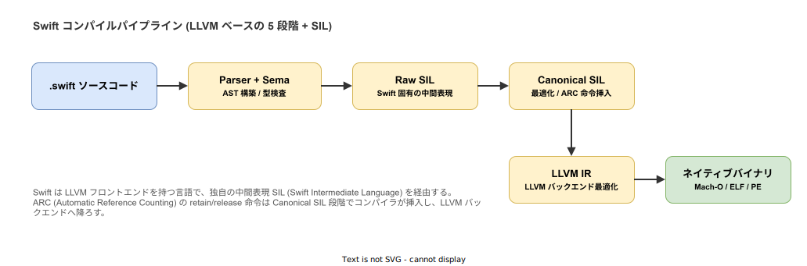
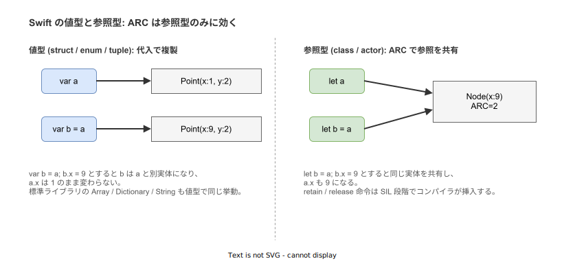

# Swift: 概要

- 対象読者: 他言語（Objective-C、C++、Kotlin、TypeScript、Rust 等）の経験がある開発者
- 学習目標: Swift の設計思想・型システム・実行モデルを理解し、基本的なプログラムを書けるようになる
- 所要時間: 約 40 分
- 対象バージョン: Swift 6.0（2024-09 リリース、strict concurrency が既定）
- 最終更新日: 2026-04-28

## 1. このドキュメントで学べること

- Swift がどのような目的で設計され、現在どこで使われているかを説明できる
- 値型（struct / enum）と参照型（class / actor）の違い、ARC によるメモリ管理を区別できる
- Optional / Generics / Protocol-Oriented Programming など主要言語機能の役割を理解できる
- async / await・actor・Sendable による strict concurrency モデルの全体像を説明できる
- Swift コンパイラが SIL (Swift Intermediate Language) を経由して LLVM IR に到達するパイプラインを理解できる

## 2. 前提知識

- 何らかのプログラミング言語でのコーディング経験
- クラス・継承・インターフェース（プロトコル）などオブジェクト指向の基本概念
- 同期処理と非同期処理の区別、コールバック・Future・Promise の概念
- ターミナル（コマンドライン）の基本操作

## 3. 概要

Swift は Apple が 2014 年の WWDC で発表したプログラミング言語である（設計主導者は Chris Lattner、後の LLVM プロジェクトリーダー）。Apple プラットフォーム（macOS / iOS / iPadOS / watchOS / tvOS / visionOS）の主言語であった Objective-C を置き換える目的で設計され、2015 年 12 月に Apache 2.0 ライセンスでオープンソース化された。現在は Linux と Windows の公式バイナリも提供され、Apple 外プラットフォームでもサーバサイド（Vapor）や CLI ツールに用いられる。

主要バージョンの節目を押さえると現在の Swift 像が掴みやすい。Swift 5.5（2021）で `async / await` と `actor` が導入され、Swift 5.7（2022）で existential type の構文が整理（`any` キーワード）、Swift 5.9（2023）でマクロが正式機能となり、Swift 6.0（2024）では strict concurrency checking が既定となってデータ競合をコンパイル時に排除する方針へ転換した。

現在の Swift には次の特徴がある。

- **静的型付け + 型推論**: コンパイル時に型を厳格に検査するが、リテラルや式の右辺から左辺の型を導ける
- **値型優先**: `String` / `Array` / `Dictionary` を含む標準ライブラリの大半が値型（`struct`）。コピーオンライト最適化で実用的なコストに抑えられている
- **ARC によるメモリ管理**: 参照型（`class` / `actor`）は GC ではなく Automatic Reference Counting で解放される。retain / release 命令は SIL 段階でコンパイラが挿入する
- **Protocol-Oriented Programming**: プロトコルにデフォルト実装を持たせ、値型でも継承相当の再利用を実現する
- **Strict Concurrency**: `Sendable` で並行境界を跨げる型を制約し、`actor` で参照型のデータ競合をコンパイル時に排除する
- **マルチターゲット**: macOS / iOS / Linux / Windows のネイティブに加え、Embedded Swift や WebAssembly（SwiftWasm）にも対応

## 4. 用語の整理

| 用語 | 説明 |
|------|------|
| Optional | 値が存在しないことを型で表現する `Optional<T>`（糖衣構文 `T?`）。null pointer に相当する状態を型に持ち上げる |
| ARC | Automatic Reference Counting。参照型インスタンスを参照カウント方式で自動解放する仕組み |
| 値型 / 参照型 | `struct` / `enum` は代入時にコピーされる値型、`class` / `actor` は参照を共有する参照型 |
| Protocol | 他言語のインターフェースに相当。`extension` でデフォルト実装を持てる点が特徴 |
| SIL | Swift Intermediate Language。Swift 専用の中間表現で、最適化と ARC 命令挿入はここで行われる |
| Sendable | スレッド境界を跨いで安全に渡せる型に与えられるプロトコル制約 |
| actor | 内部状態へのアクセスを直列化することでデータ競合を排除する参照型 |
| Result Builder | DSL を構築する仕組み。SwiftUI の view 階層構文 (`@ViewBuilder`) はこれに基づく |
| Property Wrapper | プロパティのアクセスに前後処理を差し込む機構。`@State` や `@Published` などが代表例 |
| SwiftPM | Swift Package Manager。`Package.swift` で依存・ビルド・テスト・公開を一括管理する |

## 5. 仕組み・アーキテクチャ

Swift のソースコードは Parser で AST に変換され、Sema（意味解析）で型検査と式の解決が行われる。その後 Swift 固有の中間表現 SIL に降ろされる。SIL は 2 段階で進行し、Raw SIL ではプログラムの素直な変換を行い、Canonical SIL では最適化と ARC の retain / release 命令挿入を行う。最終的に LLVM IR に変換され、LLVM バックエンドがネイティブバイナリ（Mach-O / ELF / PE）を生成する。



実行時のメモリモデルでは、値型と参照型の区別が言語使用上の最大の分岐となる。値型は代入で複製されるためデータ共有による副作用が起きず、参照型は同一実体への参照を共有するため変更が呼び出し側にも波及する。Swift では標準コレクションが値型なので、副作用に対する直感が他言語（Java / Python など）と異なる点に注意する必要がある。



## 6. 環境構築

### 6.1 必要なもの

- Swift Toolchain 6.0 以上（Apple プラットフォームでは Xcode に同梱、Linux / Windows は <https://www.swift.org/install/> から取得）
- テキストエディタ（VS Code + Swift 拡張、または Xcode）

### 6.2 セットアップ手順

```bash
# macOS の例。Xcode を入れると swift コマンドが付属する
xcode-select --install

# Linux / Windows は公式インストーラまたは swiftly を利用する
# https://www.swift.org/install/ を参照

# バージョンを確認する
swift --version
```

### 6.3 動作確認

```bash
# 新しい実行可能パッケージを生成する
swift package init --type executable --name hello_swift
cd hello_swift

# ビルドして実行する
swift run
```

## 7. 基本の使い方

```swift
// Swift の基本構文を示すサンプルプログラム (main.swift 想定)
// トップレベルコードがそのままエントリーポイントになる

// 型推論で String 定数を宣言する
let name = "Swift"
// 文字列補間で値を埋め込んで標準出力に表示する
print("Hello, \(name)!")

// 明示的に型を指定して可変変数を宣言する
var count: Int = 0
// 値を変更する
count += 1
// 計算結果を表示する
print("count = \(count)")

// 関数を呼び出して戻り値を受け取る
let result = add(3, 5)
// 結果を表示する
print("3 + 5 = \(result)")

// 2 つの整数を受け取り、その合計を返す関数
func add(_ a: Int, _ b: Int) -> Int {
    // 合計を返す
    return a + b
}
```

### 解説

- 実行可能パッケージの `main.swift` ではトップレベルコードがそのままエントリーポイントになる（`@main` 属性で明示することも可能）
- `let` は再代入を禁止する不変束縛、`var` は可変束縛である。`final` ではなく束縛側で可変性を制御する点が他言語と異なる
- 文字列リテラル中の `\(式)` で値を埋め込める（文字列補間）
- 文末のセミコロンは不要で、1 行に複数の文を書く場合のみ必要
- 関数引数の `_` は外部引数ラベルを省略する記法。省略しなければ `add(a: 3, b: 5)` のように呼び出す

## 8. ステップアップ

### 8.1 Optional とパターンマッチ

```swift
// Optional の安全な扱いを示すサンプル
// 値が存在しない可能性のある関数: Optional<Int> を返す
func parseInt(_ s: String) -> Int? {
    // String → Int 変換は失敗し得る
    return Int(s)
}

// if let 構文で Optional をアンラップする
if let n = parseInt("42") {
    // 値が存在する場合のみここに到達する
    print("parsed = \(n)")
} else {
    // nil の場合の処理
    print("parse failed")
}

// guard let 構文で早期離脱パターンを書く
func double(_ s: String) -> Int {
    // 失敗時は 0 を返して終わる
    guard let n = parseInt(s) else { return 0 }
    // ここから先は n が非 Optional として扱える
    return n * 2
}

// 結果を表示する
print(double("21"))
```

### 8.2 値型 / 参照型と Protocol

```swift
// Protocol-Oriented Programming のサンプル
// 共通プロトコル: 名前を持つもの
protocol Named {
    // 必須プロパティ要件
    var name: String { get }
}

// プロトコル拡張でデフォルト実装を提供する
extension Named {
    // 自己紹介はデフォルト実装で十分
    func greet() -> String { "Hi, I'm \(name)" }
}

// 値型: struct はインスタンス代入で複製される
struct User: Named {
    // プロトコル要件のプロパティ
    let name: String
}

// 参照型: class は ARC で管理される
final class Robot: Named {
    // プロトコル要件のプロパティ
    let name: String
    // イニシャライザ
    init(name: String) { self.name = name }
}

// 値型と参照型の両方を同じプロトコルで束ねる
let u = User(name: "Alice")
let r = Robot(name: "R2")
// any Named はプロトコル境界を持つ existential 型
let xs: [any Named] = [u, r]
// それぞれ greet を呼び出す
for x in xs { print(x.greet()) }
```

### 8.3 async / await と actor

```swift
// Swift Concurrency のサンプル (main.swift 想定)
// 非同期関数: async キーワードで宣言する
func fetchScore() async -> Int {
    // 1 秒待機する（疑似的な I/O）
    try? await Task.sleep(for: .seconds(1))
    // 計算結果を返す
    return 42
}

// actor: 内部状態へのアクセスを直列化する参照型
actor Counter {
    // 内部状態（actor 外からは直接触れない）
    private var value = 0
    // 加算メソッド: actor 内ではそのまま操作してよい
    func incr() { value += 1 }
    // 値の読み出しもメソッド経由
    func current() -> Int { value }
}

// トップレベル await: main.swift では async 文脈になる
let s = await fetchScore()
print("score = \(s)")

// actor のメソッド呼び出しは await が必要（隔離境界を跨ぐため）
let c = Counter()
await c.incr()
await c.incr()
let v = await c.current()
print("counter = \(v)")
```

## 9. よくある落とし穴

- **`!` による強制アンラップ**: Optional を `!` で剥がすと nil 時に実行時クラッシュする。`if let` / `guard let` / `??` を使い、`!` は事前条件が型で表現できないテストコード等に限定する
- **値型と参照型の混同**: `Array` や `Dictionary` は値型なので、関数引数として渡しただけでは呼び出し側に変更が反映されない。参照共有が必要なら `class` を使うか `inout` で明示する
- **強参照循環 (retain cycle)**: クラス間の循環参照は ARC では解放されない。クロージャが `self` をキャプチャするときは `[weak self]` または `[unowned self]` を明示する
- **Sendable 違反**: Swift 6 では `Sendable` を満たさない値を並行境界（actor / Task）越しに渡すとコンパイルエラーになる。値型のみで構成する、`@unchecked Sendable` は安易に使わない、が原則
- **Objective-C 連携の制約**: `@objc` を付けたメンバーは Selector ベースのディスパッチになり、Generic や `inout` の扱いに制約が出る。Apple SDK と相互運用する箇所だけに限定する

## 10. ベストプラクティス

- 公式の `swift-format` または `SwiftLint` でフォーマット・lint を CI 上で実行する。チームでルールを固定すれば差分レビューが本質に集中できる
- 公開 API には型注釈を明示し、内部のローカル変数では型推論を活用する。読み手への意図開示と簡潔さのバランスを取る
- 状態を持たない処理は値型（`struct` / `enum`）で書き、可能な限り `let` を選ぶ。可変参照が本当に必要な場合のみ `class` / `actor` を選択する
- 並行処理は `Task` / `async let` / `TaskGroup` を組み合わせる。古い `DispatchQueue` ベースの API は徐々に置き換える
- 例外は `throws` 関数と `try` / `try?` / `try!` で扱う。`try!` は失敗が論理的にあり得ない場合に限定する

## 11. 演習問題

1. `parseInt` を拡張し、空文字や負数を拒否する関数 `parsePositiveInt(_:)` を実装せよ。Optional の連鎖（`flatMap`）または `guard let` を使うこと
2. `Counter` actor を拡張し、`add(_ n: Int)` メソッドと `reset()` を追加した上で、`Task.detached` 経由で 1000 回並列に加算しても整合性が保たれることをテストで確認せよ
3. `Named` プロトコルを `Identifiable` 相当に拡張し、`User` と `Robot` の両方が `id` を持つように改修せよ。プロトコル拡張のデフォルト実装を活用すること

## 12. さらに学ぶには

- 公式言語ガイド: <https://docs.swift.org/swift-book/>
- Swift Evolution（言語提案プロセス）: <https://github.com/swiftlang/swift-evolution>
- Apple Developer サンプル: <https://developer.apple.com/swift/>
- 関連 Knowledge: SwiftUI / 並行処理 / マクロ等は別ドキュメントに分割予定

## 13. 参考資料

- The Swift Programming Language (Swift 6.0): <https://docs.swift.org/swift-book/documentation/the-swift-programming-language/>
- Swift Intermediate Language (SIL) 仕様: <https://github.com/swiftlang/swift/blob/main/docs/SIL.rst>
- Swift Concurrency Manifesto: <https://gist.github.com/lattner/31ed37682ef1576b16bca1432ea9f782>
- Swift Evolution Proposals (concurrency 関連): <https://github.com/swiftlang/swift-evolution/tree/main/proposals>
- Migrating to Swift 6: <https://www.swift.org/migration/documentation/migrationguide/>
