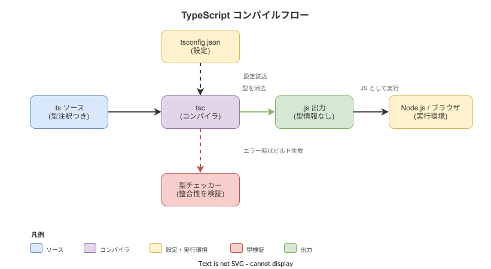
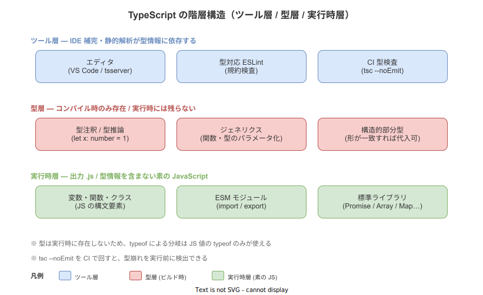

# TypeScript: 概要

- 対象読者: JavaScript の基本（変数・関数・モジュール）を一通り書いたことがある開発者
- 学習目標: TypeScript の型システムが何を解決するかを説明でき、`tsc` で `.ts` を `.js` にビルドして実行できる。型注釈・型推論・ジェネリクスを含む簡単なコードを読み書きできる
- 所要時間: 約 40 分
- 対象バージョン: TypeScript 5.4 系（Node.js 20 LTS 以降）
- 最終更新日: 2026-04-28

## 1. このドキュメントで学べること

- TypeScript が解決する課題と、JavaScript との関係を説明できる
- 型注釈・型推論・構造的部分型・ジェネリクスの基本を理解できる
- `tsc` を使って `.ts` を `.js` にコンパイルし、Node.js で実行できる
- `tsconfig.json` の主要オプション（`strict` / `target` / `module`）の役割を把握できる

## 2. 前提知識

- JavaScript の構文（変数宣言・関数・条件分岐・ループ・配列・オブジェクト）
- ESM（`import` / `export`）と Node.js の基本操作
- npm（`npm init` / `npm install`）の基本

## 3. 概要

TypeScript は Microsoft が 2012 年に発表した、JavaScript に静的型付けを加えた言語である。設計上の中心命題は「JavaScript はそのまま TypeScript として有効」というスーパーセット関係にあり、既存の `.js` コードをそのまま `.ts` に置き換えても動作する。

TypeScript が解決する課題は、規模が大きくなった JavaScript で頻発する「実行時まで気付けないミス」（プロパティ名のタイプミス、引数順の間違い、`undefined` 参照）を、コンパイル時に静的検査で検出することである。型情報は `tsc`（TypeScript コンパイラ）が解析した上でビルド時に消去され、出力される `.js` には型情報は一切含まれない。すなわち**型は実行時の挙動を変えず、開発時の安全網としてだけ機能する**。

この「型はビルド時に消去される（type erasure）」という設計が、TypeScript と Java のような実行時に型情報を保持する言語とを大きく分ける。型に基づく分岐や `instanceof` 同等の処理を書く際は、必ず実行時に存在する JS 値を見て判断する必要がある。

## 4. 用語の整理

| 用語 | 説明 |
|------|------|
| 型注釈（Type Annotation） | `let x: number` のように変数や引数に型を明示する記法 |
| 型推論（Type Inference） | 注釈がなくても代入式や戻り値から自動で型を決定する仕組み |
| 構造的部分型（Structural Subtyping） | 型名ではなく「形（プロパティの集合）」が一致すれば代入可能とする型互換ルール |
| ジェネリクス（Generics） | `Array<T>` のように型をパラメータ化し、同じロジックを複数の型に適用する機能 |
| ユニオン型（Union Type） | `string | number` のように複数の型のいずれかを取り得ることを表す型 |
| 型ガード（Type Guard） | `typeof` や `in` 演算子による分岐で、ユニオン型を絞り込む実行時チェック |
| `tsc` | TypeScript の公式コンパイラ。型検査と `.js` への変換を行う |
| `tsconfig.json` | プロジェクト全体のコンパイル設定を記述するファイル |
| `strict` モード | 型検査を最も厳格に行うオプション集合（`strictNullChecks` 等を一括有効化） |

## 5. 仕組み・アーキテクチャ

`.ts` ソースは `tsc` に渡され、内部で型チェッカーが整合性を検証する。型エラーがあれば標準ではビルドが失敗する。整合性が取れた場合、エミッタが型注釈を取り除いた素の JavaScript を `.js` として出力し、Node.js やブラウザで実行される。



実行に関わるのは出力された `.js` のみであり、型情報は実行時には残らない。一方で型情報は IDE や Linter が補完・規約検査に活用するため、開発体験のかなりの部分は「ビルド前」に集中する。



## 6. 環境構築

### 6.1 必要なもの

- Node.js 20 LTS 以降
- npm（Node.js に同梱）
- VS Code（推奨。組み込みの `tsserver` で型補完が効く）

### 6.2 セットアップ手順

```bash
# プロジェクトディレクトリを作成して移動する
mkdir hello-ts && cd hello-ts

# package.json を生成する
npm init -y

# typescript を開発依存として追加する
npm install -D typescript@5.4

# 既定の tsconfig.json を生成する
npx tsc --init --strict --target ES2022 --module nodenext --moduleResolution nodenext
```

### 6.3 動作確認

```bash
# 動作確認用のソースを作成する（任意のエディタでもよい）
echo 'console.log("Hello, TypeScript!");' > index.ts

# コンパイルして .js を生成する
npx tsc

# 生成された index.js を Node.js で実行する
node index.js
```

`Hello, TypeScript!` と表示されれば構築完了である。

## 7. 基本の使い方

```typescript
// TypeScript の基本構文を示すサンプル

// 数値型として明示的に注釈を付けて変数を宣言する
let count: number = 0;
// 注釈を省略しても初期値から number 型に推論される
let total = 100;

// 文字列とユニオン型を組み合わせた変数を宣言する
let status: "ok" | "ng" = "ok";

// 引数と戻り値の型を明示して関数を定義する
function add(a: number, b: number): number {
  // 最後の return が戻り値となる
  return a + b;
}

// オブジェクトの形を interface で定義する
interface User {
  // 必須プロパティ
  id: number;
  // 必須プロパティ
  name: string;
  // ? を付けると省略可能になる
  email?: string;
}

// User の形に合致するオブジェクトを生成する
const user: User = { id: 1, name: "Alice" };
// 関数を呼び出して結果を表示する
console.log(`${user.name}: ${add(count, total)}`);
```

### 解説

- `let x: number` のように `:` の後に型を書く。多くは初期値から推論されるため省略してよい
- `interface` はオブジェクトの「形」を定義する。実体は実行時に存在しない（型として消える）
- `"ok" | "ng"` のように具体的な値を直接型として書く（リテラル型）と、取りうる値を制約できる
- 関数の戻り値型は推論できるが、公開 API では明示すると変更時の影響が型エラーとして現れて便利である

## 8. ステップアップ

### 8.1 ジェネリクスと型推論

```typescript
// 任意の型 T の配列の最初の要素を返すジェネリクス関数

// T は呼び出し側の引数から自動で決まる
function first<T>(items: T[]): T | undefined {
  // 配列が空のときは undefined が返る
  return items[0];
}

// number[] を渡すと T は number に推論される
const n = first([1, 2, 3]);
// string[] を渡すと T は string に推論される
const s = first(["a", "b"]);
```

`<T>` で型パラメータを宣言し、引数や戻り値に同じ `T` を使うと「呼び出しごとに具体的な型に置き換わる」関数を書ける。`first` は呼び出し側で型を指定しなくても、引数から自動的に型が決まる。

### 8.2 構造的部分型と型ガード

```typescript
// ユニオン型と型ガードを組み合わせた絞り込み

// string か Buffer のいずれかを表す引数を受け取る
function lengthOf(input: string | Buffer): number {
  // typeof による型ガードで分岐する
  if (typeof input === "string") {
    // この分岐内では input は string に絞り込まれる
    return input.length;
  }
  // 残りの分岐は Buffer に絞り込まれる
  return input.byteLength;
}
```

TypeScript の型互換は「名前」ではなく「形」で決まる（構造的部分型）。`User` と同じプロパティを持つ任意のオブジェクトは `User` として扱える。一方で `string | Buffer` のようなユニオン型は、実行時の `typeof` などで絞り込まないとメソッドにアクセスできない。

## 9. よくある落とし穴

- **型は実行時に存在しない**: `if (typeof user === "User")` のような書き方はできない。型ではなく値で判別する（`"id" in user` 等の型ガードを用いる）
- **`any` の安易な使用**: `any` を入れた瞬間、その値に関する型検査がすべて停止する。代わりに `unknown` を使い、明示的に絞り込みを書く
- **`strict` を切らない**: `strictNullChecks` を無効化すると、`undefined` の入り得る値もそのまま使える状態に戻ってしまい、型の利点が大きく損なわれる
- **`Object` と `object`、`{}` の混同**: それぞれ意味が異なる。具体的な構造を `interface` か型エイリアスで定義する方が安全である
- **クラス名の型と値の混同**: `class User {}` は型としても値としても使えるが、`interface User {}` は型としてのみ使える。実行時に判別したい場合はクラスを選ぶ

## 10. ベストプラクティス

- `tsconfig.json` は最初から `"strict": true` で始める。後から有効化すると型エラーが大量に出て修正が困難になる
- 公開 API（ライブラリの export、サーバの Handler）には戻り値型を明示する。利用側に影響する変更を型エラーとして気付ける
- `unknown` を入口に置き、絞り込んでから使う（外部入力・JSON パース結果など、形が信用できないデータに有効）
- CI で `tsc --noEmit` を必ず回す。実行する `.js` を変えずに、型崩れだけを早期検出できる
- ESLint は `@typescript-eslint` で型情報を活用したルール（`no-floating-promises` など）を有効化する

## 11. 演習問題

1. `add(a, b)` を、引数が `number | string` のどちらか同一型である場合のみ受け付ける関数として書き直せ。`number + number` は加算、`string + string` は連結を返すこと
2. `interface Result<T> { ok: true; value: T } | { ok: false; error: string }` を定義し、引数の `Result<number>` を絞り込んで値またはエラーメッセージを返す関数を書け
3. 任意のオブジェクト配列から、指定したキーの値だけを抜き出す `pluck<T, K extends keyof T>(items: T[], key: K): T[K][]` を実装し、コンパイルが通ることを確認せよ

## 12. さらに学ぶには

- TypeScript Handbook（公式ハンドブック）: <https://www.typescriptlang.org/docs/handbook/intro.html>
- TypeScript Playground（ブラウザ上で型検査を試せる）: <https://www.typescriptlang.org/play>
- Type Challenges（型システム単体の演習集）: <https://github.com/type-challenges/type-challenges>
- 関連 Knowledge: [Go: 概要](./go_basics.md) — 同じく静的型付けの簡潔な言語との比較に有用

## 13. 参考資料

- TypeScript 5.4 Release Notes: <https://devblogs.microsoft.com/typescript/announcing-typescript-5-4/>
- TSConfig Reference: <https://www.typescriptlang.org/tsconfig>
- ECMAScript Language Specification: <https://tc39.es/ecma262/>
