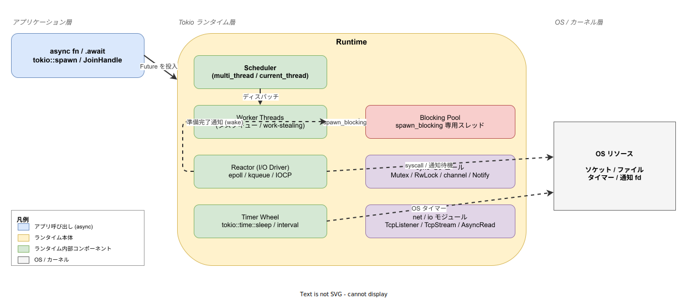
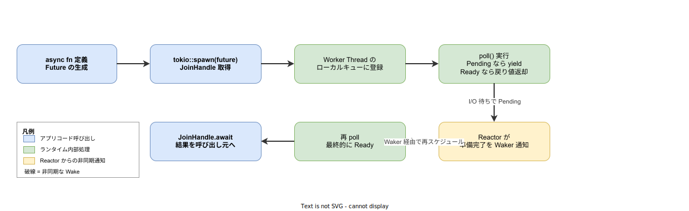

# Tokio: 基本

- 対象読者: Rust の基本文法を理解しており、非同期プログラミング（async/await）に初めて触れる開発者
- 学習目標: Tokio が解決する課題とランタイムの全体像を説明でき、`#[tokio::main]`・`tokio::spawn`・`spawn_blocking` を適切に使い分けて最小の非同期プログラムを書けるようになる
- 所要時間: 約 40 分
- 対象バージョン: tokio 1.52.x（Rust 2024 edition）
- 最終更新日: 2026-04-28

## 1. このドキュメントで学べること

- Tokio が「OS スレッドを増やすだけでは解けない」スケーラビリティ課題をどう解くか説明できる
- ランタイムを構成する Scheduler / Worker / Reactor / Timer / Blocking Pool の役割を区別できる
- `#[tokio::main]` の `flavor` 指定と `tokio::spawn` の組み合わせで非同期タスクを起動できる
- 同期的にブロックする処理を `spawn_blocking` で隔離する判断ができる
- `tokio::sync::Mutex` を使うべき場面と `std::sync::Mutex` で十分な場面を区別できる

## 2. 前提知識

- Rust の所有権・借用の基礎（[Rust: 所有権](../language/rust_ownership.md)）
- `Future` トレイトと `async fn` / `.await` 構文の概観（標準ライブラリのドキュメントレベル）
- スレッドとプロセス、I/O 多重化（`epoll` / `kqueue` / `IOCP`）の概念

## 3. 概要

Tokio は Rust 公式エコシステムで事実上の標準となっている**非同期ランタイム**である。`async fn` が生成する `Future` は**自分では走らない**――`Future` を実際に進めるのは「ランタイム」と呼ばれる外部のスケジューラ・I/O 監視機構であり、Tokio はその実装の一つを提供する。

ネットワークサーバや IoT のようにコネクションが多数同時に存在し、各処理は CPU よりも I/O 待ちが支配的なワークロードでは、コネクション 1 本ごとに OS スレッドを割り当てる素朴なモデルはコンテキストスイッチとメモリ消費で破綻する。Tokio はユーザ空間に軽量タスクを並べ、I/O が準備できた瞬間だけ CPU を割り当てる協調的スケジューリングを提供することで、数万〜数十万の並行タスクを少数の OS スレッドで処理する。

## 4. 用語の整理

| 用語 | 説明 |
|------|------|
| ランタイム (runtime) | `Future` をスケジュールし I/O 通知を受ける実行基盤。Tokio の中核 |
| タスク (task) | ランタイムが管理する軽量な実行単位。`tokio::spawn` で生成される |
| ワーカースレッド | タスクを実際に poll する OS スレッド。multi_thread flavor では複数走る |
| Reactor (I/O Driver) | OS の I/O 多重化機構（`epoll` 等）を抽象化し、準備完了通知を Waker 経由でタスクに伝える層 |
| Waker | 「このタスクを再び poll してよい」と伝えるためのコールバック相当のハンドル |
| JoinHandle | spawn で起動したタスクの完了を待ち、戻り値・パニックを受け取るためのハンドル |
| flavor | `#[tokio::main]` で選ぶランタイム種別。`multi_thread`（既定）と `current_thread` がある |
| spawn_blocking | 同期的にブロックする処理を専用スレッドプールに逃がすための API |
| cancel safety | `.await` 中にタスクが drop されても内部状態が壊れないこと。`select!` で必須の性質 |

## 5. 仕組み・アーキテクチャ

Tokio ランタイムはアプリケーション層から投入された `Future` を内部のキューに置き、Worker Thread が順番に poll する。`Future` が I/O や時間で待つ必要があるときは `Pending` を返して CPU を手放し、対応するイベントが Reactor / Timer Wheel に届いた時点で Waker 経由で再スケジュールされる。



CPU を長く占有する同期的なブロッキング処理（例: 大きなファイルの同期 I/O、外部の同期ライブラリ呼び出し）を Worker 上でそのまま実行すると、その Worker に乗っている他のタスクが全て止まる。Tokio はこのリスクを切り分けるために専用の **Blocking Pool** を別に持ち、`spawn_blocking` で投入された処理だけをそこへ逃がす。

## 6. 環境構築

### 6.1 必要なもの

- Rust ツールチェイン（rustup 経由、Edition 2024 を想定）
- Cargo（rustup に同梱）

### 6.2 セットアップ手順

```bash
# 新規プロジェクトを作成する
cargo new tokio-hello && cd tokio-hello

# tokio をフル機能で依存に加える（学習用途は full で十分）
cargo add tokio --features full
```

`Cargo.toml` には `tokio = { version = "1", features = ["full"] }` が追記される。本番では `rt-multi-thread` / `macros` / `net` / `time` など必要な feature だけを選んで依存量を削減することが推奨される。

### 6.3 動作確認

```rust
// src/main.rs
// Tokio の最小動作確認用エントリポイント
use tokio::time::{sleep, Duration};

// #[tokio::main] が main を非同期コンテキストに変換する
#[tokio::main]
async fn main() {
    // 非同期に 100ms スリープして実行を確認する
    sleep(Duration::from_millis(100)).await;
    // 標準出力に動作確認メッセージを書き出す
    println!("tokio is running");
}
```

`cargo run` で `tokio is running` が表示されれば成功である。

## 7. 基本の使い方

### 7.1 タスクのライフサイクル

`tokio::spawn` が呼ばれた時点でタスクはランタイムのキューに登録され、Worker Thread が poll を開始する。`Pending` を返すたびに別タスクへ実行権が渡り、Reactor からの通知で再 poll される。最終的に `Ready` を返した値が `JoinHandle.await` で呼び出し元に戻る。



### 7.2 並行タスクの起動

```rust
// src/main.rs
// 複数タスクを spawn して並行実行する例
use tokio::task::JoinHandle;
use tokio::time::{sleep, Duration};

// 引数 ms ミリ秒待ってからラベルを返す非同期タスクを定義する
async fn delayed(label: &'static str, ms: u64) -> &'static str {
    // 指定ミリ秒非同期にスリープする
    sleep(Duration::from_millis(ms)).await;
    // ラベルを呼び出し元に返却する
    label
}

#[tokio::main]
async fn main() {
    // 2 つのタスクを spawn しランタイムにディスパッチする
    let h1: JoinHandle<&str> = tokio::spawn(delayed("A", 200));
    let h2: JoinHandle<&str> = tokio::spawn(delayed("B", 100));
    // 両方の完了を待ち結果を受け取る
    let (a, b) = (h1.await.unwrap(), h2.await.unwrap());
    // 完了順ではなく spawn 順に表示することを確認する
    println!("done: {a} {b}");
}
```

合計の経過時間は 300ms ではなく 200ms 強である。`spawn` した瞬間に両タスクは並行に走り始め、`.await` で **個別に** 結果を回収するためである。

### 7.3 同期処理を逃がす

```rust
// src/main.rs
// CPU や同期 I/O を伴う処理を spawn_blocking で隔離する例
use tokio::task;

#[tokio::main]
async fn main() {
    // ブロッキングプールで同期的な重い計算を実行する
    let sum = task::spawn_blocking(|| {
        // 1 から 1_000_000 まで愚直に加算する CPU バウンド処理
        (1u64..=1_000_000).sum::<u64>()
    })
    .await
    .expect("blocking task panicked");
    // 計算結果を出力する
    println!("sum = {sum}");
}
```

`spawn_blocking` はブロッキングプール上で実行される独立スレッドであり、この間に Worker は他のタスクの poll を継続できる。

## 8. ステップアップ

### 8.1 ランタイム flavor の使い分け

`#[tokio::main(flavor = "current_thread")]` を指定するとシングルスレッドランタイムになる。CLI ツールや組込み・WASM で OS スレッドが 1 本しかない/許されない環境、あるいはタスク間の `Send` 制約を避けたい場合に有効である。標準（`multi_thread`）はデフォルト並列度が CPU コア数で、サーバ用途の既定として使う。

### 8.2 sync モジュールと std::sync の境界

`tokio::sync::Mutex` は `lock().await` でロック取得時に他タスクへ譲歩するため、ロック保持中に `.await` を跨ぐ場合に必須である。逆に**ロック保持区間が短く `.await` を跨がない**なら `std::sync::Mutex` の方が高速で第一選択になる。Tokio の Mutex は遅い置換ではなく、用途が異なる API である。

### 8.3 select! とキャンセル安全性

`tokio::select!` は複数の `Future` を競合させて最初に Ready になったものを採用するマクロで、選ばれなかった枝はその場で drop される。drop 時に進行中の操作が中途半端に終わって状態が壊れる API は **cancel safe ではない**ため、`select!` で使えない。`tokio::io::AsyncReadExt::read` のように cancel safe と明記された API を選ぶ必要がある。

## 9. よくある落とし穴

- **`std::thread::sleep` を `async fn` 内で呼ぶ**: Worker をブロックして他の全タスクが止まる。`tokio::time::sleep` を使うこと
- **`async` ブロックで `std::sync::Mutex` のロックを `.await` を跨いで保持する**: 別タスクに Worker を譲った先でデッドロックや `Send` 違反になる。`.await` を跨ぐなら `tokio::sync::Mutex` を使うか、ロック区間を関数で閉じる
- **`spawn` した `JoinHandle` を捨てる**: タスクは生き続けるがパニックを検知できなくなる。少なくとも `JoinSet` などで集約して結果を確認する
- **CPU バウンドな処理をそのまま `spawn` する**: 1 タスクが Worker を独占し他タスクのレイテンシが急増する。`spawn_blocking` か `rayon` に逃がす
- **Tokio v1 と他ランタイム（async-std / smol）のオブジェクトを混在させる**: ランタイム固有の I/O リソースは別ランタイム上で動かない。エントリ層を Tokio に統一する

## 10. ベストプラクティス

- ライブラリクレートでは `#[tokio::main]` を使わず、ランタイム選択の責務をアプリケーション層に残す
- 本番ビルドでは `features = ["full"]` ではなく実際に使う `rt-multi-thread` / `macros` / `net` / `time` 等だけを有効化し、依存とコンパイル時間を抑える
- 「`.await` を跨ぐかどうか」を基準に `tokio::sync::Mutex` と `std::sync::Mutex` を選ぶ
- 受信ループでは `tokio::select!` で**シャットダウン信号**と本処理を競わせ、タスクが永久に残らない構造にする
- パニックや早期 return の影響を受けるリソース（コネクション・ファイル）は `Drop` 実装に寄せ、`spawn` 先タスクでも確実に解放する

## 11. 演習問題

1. `tokio::spawn` を使い、それぞれ 50ms / 150ms / 100ms スリープして自分の名前を返す 3 つのタスクを並行起動し、`JoinHandle::await` で順序を保って結果を集約せよ
2. 1 万件の `(1..=n).sum::<u64>()` 計算をワーカーをブロックせずに処理するよう、`spawn_blocking` でラップしたバッチ処理を実装し、全結果を `tokio::join!` で集約せよ
3. `tokio::select!` で「`tokio::time::sleep(Duration::from_secs(1))`」と「`tokio::signal::ctrl_c()`」を競わせ、Ctrl-C が先に来た場合だけ「graceful shutdown」と表示するプログラムを書け

## 12. さらに学ぶには

- Tokio Tutorial（公式チュートリアル）: <https://tokio.rs/tokio/tutorial>
- Async Book（Rust 公式の非同期解説）: <https://rust-lang.github.io/async-book/>
- 関連 Knowledge: [Rust: 基本](../language/rust_basics.md)
- 関連 Knowledge: [Rust: 所有権](../language/rust_ownership.md)
- 関連 Knowledge: [Go: goroutines](../language/go_goroutines.md)（並行モデルの対比）

## 13. 参考資料

- Tokio 公式サイト: <https://tokio.rs/>
- tokio クレートドキュメント: <https://docs.rs/tokio/latest/tokio/>
- tokio リポジトリ: <https://github.com/tokio-rs/tokio>
- Async/Await 詳細（Rust 公式）: <https://doc.rust-lang.org/std/keyword.async.html>
