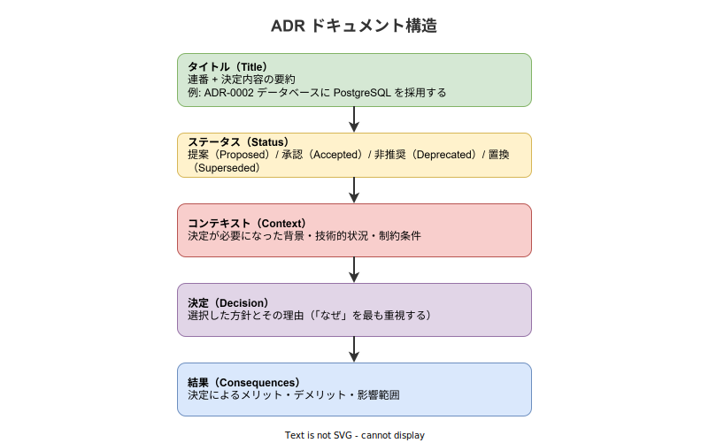

# ADR: 基本

- 対象読者: ソフトウェア開発に携わるエンジニア・アーキテクト
- 学習目標: ADR の概念・構造・運用方法を理解し、プロジェクトで ADR を導入・運用できるようになる
- 所要時間: 約 25 分
- 対象バージョン: —（方法論のため特定バージョンなし）
- 最終更新日: 2026-04-12

## 1. このドキュメントで学べること

- ADR とは何か、なぜ必要かを説明できる
- ADR の構成要素（タイトル・ステータス・コンテキスト・決定・結果）を理解できる
- ADR のライフサイクル（提案→承認→非推奨/置換）を説明できる
- プロジェクトで ADR を作成・管理できる

## 2. 前提知識

- ソフトウェア開発プロセスの基礎知識
- Git によるバージョン管理の基本操作

## 3. 概要

ADR（Architecture Decision Record）は、ソフトウェアアーキテクチャに関する重要な意思決定を記録するドキュメントである。Michael Nygard が 2011 年のブログ記事「Documenting Architecture Decisions」で提唱した。

ソフトウェア開発において「なぜこの技術を選んだのか」「なぜこの設計にしたのか」という疑問は頻繁に発生する。コードやコミットログには「何をしたか」は残るが「なぜそうしたか」は残りにくい。ADR はこの「なぜ」を構造化された形式で記録し、チームの知識として蓄積する仕組みである。

ThoughtWorks は Technology Radar で ADR を「Adopt（採用推奨）」と評価している。

## 4. 用語の整理

| 用語 | 説明 |
|------|------|
| ADR（Architecture Decision Record） | アーキテクチャ上の意思決定とその背景・結果を記録するドキュメント |
| アーキテクチャ決定 | システムの構造・技術選定・設計方針に関する重要な判断 |
| コンテキスト（Context） | 決定が必要になった背景・状況・制約条件 |
| ステータス（Status） | ADR の現在の状態（提案・承認・非推奨・置換など） |
| 置換（Superseded） | 新しい ADR によって以前の ADR が置き換えられた状態 |
| 不変性（Immutability） | 一度記録した ADR の内容を変更せず、新しい ADR で更新する原則 |

## 5. 仕組み・アーキテクチャ

### ADR の構造

ADR は以下の 5 セクションで構成される。各セクションが明確な役割を持ち、意思決定の全体像を伝える。



最も重要なのは「決定」セクションである。「何を選んだか」だけでなく「なぜ選んだか」を記述することで、後からチームに参加したメンバーや将来の自分が決定の妥当性を判断できる。

### ADR のライフサイクル

ADR には状態遷移がある。作成時は「提案」状態で始まり、レビューを経て「承認」または「却下」に遷移する。承認済みの ADR は、技術の陳腐化により「非推奨」になるか、新しい ADR によって「置換」される。


ADR の重要な原則は不変性である。既存の ADR の内容は変更せず、新しい ADR を作成して置換する。これにより意思決定の履歴が保全される。

## 6. 環境構築

ADR はテキストファイルとして管理するため特別なツールは不要である。以下の環境があれば運用を開始できる。

- テキストエディタ
- Git リポジトリ（バージョン管理用）

CLI ツールを使う場合は `adr-tools` が利用できる。

```bash
# adr-tools をインストールする（macOS）
brew install adr-tools

# ADR ディレクトリを初期化する
adr init docs/adr

# 新しい ADR を作成する
adr new データベースに PostgreSQL を採用する
```

## 7. 基本の使い方

### 7.1 ファイル命名規則

ADR ファイルは連番とタイトルで命名する。

```text
docs/adr/
├── 0001-record-architecture-decisions.md
├── 0002-use-postgresql-for-database.md
└── 0003-adopt-rest-api-style.md
```

### 7.2 ADR の記述例

```markdown
# ADR-0002: データベースに PostgreSQL を採用する

## ステータス

承認（2026-04-01）

## コンテキスト

本プロジェクトではリレーショナルデータベースが必要である。
候補として PostgreSQL、MySQL、SQLite を検討した。
要件: JSON 型のサポート、全文検索、高い同時接続性能。

## 決定

PostgreSQL を採用する。

- JSON/JSONB 型をネイティブサポートし、半構造化データの格納に適する
- 全文検索機能を標準で備えている
- MVCC による高い同時接続性能を持つ

## 結果

- チームは PostgreSQL の運用知識を習得する必要がある
- マイグレーションツールとして sqlx を導入する
- バックアップ・リストア手順を運用ドキュメントに追加する
```

### 解説

- **ステータス**: 承認日を併記すると、いつ決定されたかが明確になる
- **コンテキスト**: 候補の列挙と要件を書くことで、比較検討の材料を残す
- **決定**: 「何を選んだか」だけでなく「なぜ選んだか」を具体的に記述する
- **結果**: メリットだけでなく、発生するコストや追加作業も正直に記録する

## 8. ステップアップ

### 8.1 ADR を置換する

既存の ADR を変更する場合、元の ADR は修正せず新しい ADR を作成する。元の ADR のステータスに「置換: ADR-0005 に置き換え」と追記し、新しい ADR のコンテキストに「ADR-0002 の決定を見直す」と記述して相互参照する。

### 8.2 ADR をコードレビューに組み込む

ADR をプルリクエストに含め、コードレビューと同時にアーキテクチャ決定をレビューする。これによりチーム全体が決定の背景を共有でき、暗黙知の蓄積を防げる。

## 9. よくある落とし穴

- **すべての決定を ADR にする**: 些細な決定まで記録すると管理コストが増大する。「アーキテクチャに影響する重要な決定」に限定する
- **結果セクションを省略する**: メリットだけ書きデメリットを省くと、後の見直し時に判断材料が不足する
- **既存の ADR を直接編集する**: 不変性の原則に反する。変更が必要な場合は新しい ADR で置換する
- **コンテキストが曖昧**: 「必要だった」だけでは不十分。検討した選択肢と制約条件を具体的に書く

## 10. ベストプラクティス

- ADR はコードと同じリポジトリで Git 管理する
- 1 つの ADR には 1 つの決定のみ記録する
- 決定の理由（「なぜ」）を最も重要な情報として扱う
- ステータス変更時には日付を併記する
- 最初の ADR は「ADR を導入する」という決定自体を記録する
- 軽量なテンプレートを用意し、記述のハードルを下げる

## 11. 演習問題

1. 自分のプロジェクトで最近行ったアーキテクチャ上の決定を 1 つ選び、ADR 形式で記述せよ
2. その ADR に対して、別の選択肢を取った場合の「結果」セクションを書き、比較せよ
3. チームで ADR を運用する際のレビュープロセスを設計せよ

## 12. さらに学ぶには

- Michael Nygard「Documenting Architecture Decisions」: ADR の原典となるブログ記事
- Joel Parker Henderson の ADR リポジトリ: テンプレート集と実践ガイド
- AWS Prescriptive Guidance「Using architectural decision records」: 企業での運用プロセス

## 13. 参考資料

- Michael Nygard, "Documenting Architecture Decisions", 2011
- Joel Parker Henderson, "Architecture Decision Record", GitHub Repository
- AWS, "Using architectural decision records", AWS Prescriptive Guidance
- ThoughtWorks, "Technology Radar — Lightweight Architecture Decision Records", 2016
