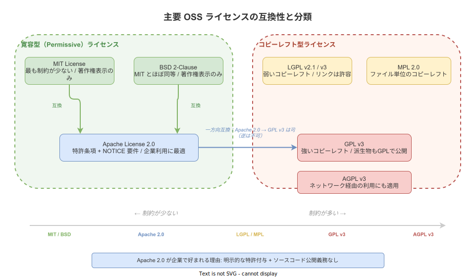

# Apache License 2.0: 基本

- 対象読者: ソフトウェア開発に携わるエンジニア、OSS を利用・公開する開発者
- 学習目標: Apache License 2.0 の権利構造・義務・他ライセンスとの互換性を理解し、適切にライセンスを選択・遵守できるようになる
- 所要時間: 約 30 分
- 対象バージョン: Apache License, Version 2.0（2004 年 1 月公開）
- 最終更新日: 2026-04-12

## 1. このドキュメントで学べること

- Apache License 2.0 とは何か、なぜ広く採用されているかを説明できる
- 許可される行為・必須条件・制限事項の 3 区分を正確に把握できる
- 特許条項と特許報復条項の意味を理解できる
- MIT/BSD/GPL など他の主要ライセンスとの違いと互換性を判断できる
- 自プロジェクトで Apache License 2.0 を適用する手順を実行できる

## 2. 前提知識

- ソフトウェア開発の基礎知識
- 「著作権」「特許」「ライセンス」という言葉の一般的な意味
- OSS（オープンソースソフトウェア）の概念

## 3. 概要

Apache License 2.0 は、Apache Software Foundation（ASF）が策定したオープンソースソフトウェアライセンスである。2004 年 1 月に公開され、OSI（Open Source Initiative）が認定するオープンソースライセンスの一つである。

このライセンスは「寛容型（Permissive）」に分類される。寛容型とは、利用者に対してソースコード公開を義務付けないタイプのライセンスである。商用利用・改変・再配布を広く許可しつつ、最低限の条件（著作権表示とライセンス文の同梱）のみを課す。

Apache License 2.0 が他の寛容型ライセンス（MIT、BSD）と異なる最大の特徴は、**明示的な特許条項**を含む点である。コントリビューターが持つ特許権について、利用者に対する永続的なライセンスを自動で付与する。この特許保護が、企業が OSS を利用・公開する際の法的リスクを軽減するため、Kubernetes、Android、Swift、Kafka など多くの大規模プロジェクトで採用されている。

## 4. 用語の整理

| 用語 | 説明 |
|------|------|
| 寛容型ライセンス（Permissive License） | ソースコード公開義務を課さないライセンス。MIT、BSD、Apache 2.0 が代表例 |
| コピーレフト（Copyleft） | 派生物にも同一ライセンスの適用を要求する性質。GPL が代表例 |
| コントリビューター（Contributor） | ライセンス対象の著作物に変更を加え貢献した個人または法人 |
| NOTICE ファイル | ライセンスが要求する帰属情報（著作権表示・謝辞など）をまとめたファイル |
| 特許報復条項（Patent Retaliation） | ライセンスを受けた者が特許訴訟を起こした場合にライセンスが終了する条項 |
| 派生物（Derivative Work） | 元の著作物を改変して作成された新たな著作物 |
| OSI（Open Source Initiative） | オープンソースの定義を管理し、ライセンスを認定する非営利団体 |

## 5. 仕組み・アーキテクチャ

### 権利構造

Apache License 2.0 は「許可」「条件」「制限」の 3 層で構成される。


許可される範囲が広い一方で、著作権表示の保持とライセンス文の同梱は必須である。特に NOTICE ファイルが存在する場合、派生物にもその内容を含める必要がある。

### 他ライセンスとの関係

Apache License 2.0 は寛容型ライセンスの中でも「中程度の制約」に位置する。



MIT/BSD コードを Apache 2.0 プロジェクトに取り込むことは可能である。Apache 2.0 コードを GPL v3 プロジェクトに含めることも可能だが、逆方向（GPL → Apache 2.0）は GPL のコピーレフト条項により不可である。

## 6. 環境構築

Apache License 2.0 を自プロジェクトに適用するために特別なツールは不要である。

### 6.1 必要なもの

- テキストエディタ
- プロジェクトのルートディレクトリへのアクセス

### 6.2 セットアップ手順

1. Apache License 2.0 の全文を `LICENSE` ファイルとしてプロジェクトルートに配置する
2. 必要に応じて `NOTICE` ファイルを作成し、著作権表示や帰属情報を記載する
3. 各ソースファイルの先頭にライセンスヘッダを付与する

### 6.3 動作確認

`LICENSE` ファイルが存在し、ファイル先頭に「Apache License, Version 2.0」の記載があることを目視確認する。

## 7. 基本の使い方

### 7.1 LICENSE ファイルの配置

ASF 公式サイトからライセンス全文を取得し、プロジェクトルートに `LICENSE` として保存する。

### 7.2 ソースファイルへのヘッダ付与

```rust
// Apache License 2.0 ライセンスヘッダの例（Rust）
// Copyright 2026 Your Name or Organization
//
// Licensed under the Apache License, Version 2.0 (the "License");
// you may not use this file except in compliance with the License.
// You may obtain a copy of the License at
//
//     http://www.apache.org/licenses/LICENSE-2.0
//
// Unless required by applicable law or agreed to in writing, software
// distributed under the License is distributed on an "AS IS" BASIS,
// WITHOUT WARRANTIES OR CONDITIONS OF ANY KIND, either express or implied.
// See the License for the specific language governing permissions and
// limitations under the License.
```

### 解説

- 著作権行には年と権利者名を記載する。年は最初の公開年とする
- ライセンスヘッダは全ソースファイルの先頭に配置することが推奨される
- ヘッダの省略は ASF の公式プロジェクトでは認められていないが、第三者のプロジェクトでは LICENSE ファイルのみで運用する例もある

## 8. ステップアップ

### 8.1 NOTICE ファイルの運用

NOTICE ファイルには、プロジェクト名・著作権表示・サードパーティライブラリの帰属情報を記載する。Apache License 2.0 の Section 4(d) により、NOTICE ファイルが存在する場合、派生物の配布時にもその内容を含める必要がある。ただし NOTICE に記載すべき内容は帰属情報に限られ、追加の制約を課す目的では使用できない。

### 8.2 コントリビューターライセンス契約（CLA）

大規模な OSS プロジェクトでは、コントリビューターに対して CLA（Contributor License Agreement）への署名を求めることがある。CLA はコントリビューターが著作権・特許権のライセンスを明示的に付与する契約であり、Apache License 2.0 の特許条項を補完する役割を持つ。ASF は Individual CLA と Corporate CLA の 2 種類を用意している。

## 9. よくある落とし穴

- **NOTICE ファイルの伝搬忘れ**: Apache 2.0 ライセンスの依存ライブラリに NOTICE がある場合、自プロジェクトの配布物にも含める必要がある。依存関係の確認を怠ると違反になりうる
- **GPL v2 との非互換**: Apache License 2.0 は GPL v2 と互換性がない。GPL v2 only のプロジェクトに Apache 2.0 コードを混在させることはできない（GPL v3 とは互換）
- **商標の誤用**: Apache License 2.0 は商標権を付与しない。「Apache」「Kafka」などの名称を自社製品名として使用することはできない
- **ライセンス文の改変**: Apache License 2.0 の本文自体を改変して使用することは想定されていない。条件を変更したい場合は別のライセンスを選択する

## 10. ベストプラクティス

- 依存ライブラリのライセンスを定期的にスキャンし、互換性を確認する（FOSSA、Licensee 等のツールが有用）
- LICENSE ファイルと NOTICE ファイルをリポジトリルートに配置し、Git で管理する
- CI パイプラインにライセンスヘッダチェックを組み込み、ヘッダ未付与のファイルを検出する
- サードパーティライブラリの NOTICE 情報を一元管理する仕組みを用意する
- デュアルライセンス（Apache 2.0 + MIT など）を検討し、より広い互換性を確保する

## 11. 演習問題

1. MIT License と Apache License 2.0 の違いを 3 点挙げ、それぞれ企業利用の観点で有利・不利を説明せよ
2. GPL v2 only のライブラリと Apache 2.0 のライブラリを同一プロジェクトで使用できるか判断し、理由を述べよ
3. 自分のプロジェクトに Apache License 2.0 を適用し、LICENSE ファイル・NOTICE ファイル・ライセンスヘッダを設定せよ

## 12. さらに学ぶには

- Apache License 2.0 全文: ASF 公式サイトで公開されている原文
- OSI Approved Licenses: OSI が認定するライセンス一覧と各ライセンスの比較
- Choose a License: GitHub が提供するライセンス選択ガイド
- SPDX License List: ライセンス識別子の標準規格

## 13. 参考資料

- Apache Software Foundation, "Apache License, Version 2.0", January 2004
- Open Source Initiative, "The Apache License, Version 2.0", OSI Approved Licenses
- Free Software Foundation, "Various Licenses and Comments about Them", GPL Compatibility List
- GitHub, "Licensing a repository", GitHub Docs
