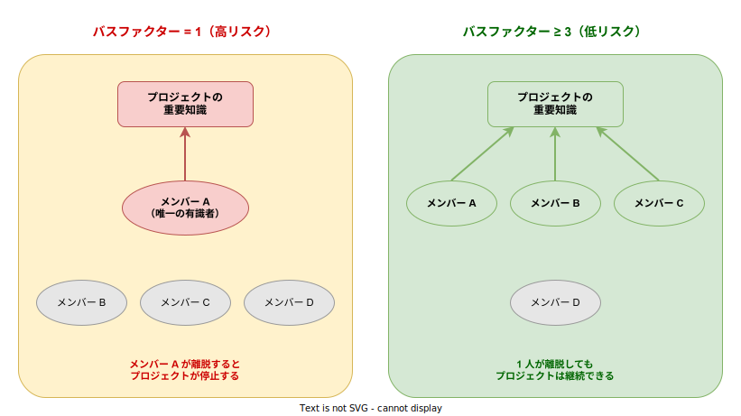

# バスファクター: 基本

- 対象読者: ソフトウェア開発チームのリーダー・エンジニア
- 学習目標: バスファクターの概念を理解し、チームの知識集中リスクを評価・改善できるようになる
- 所要時間: 約 20 分
- 対象バージョン: —（方法論のため特定バージョンなし）
- 最終更新日: 2026-04-13

## 1. このドキュメントで学べること

- バスファクターとは何か、なぜ重要かを説明できる
- 自チームのバスファクターを評価できる
- バスファクターを改善するための具体的な施策を理解し、実践できる

## 2. 前提知識

- ソフトウェア開発チームでの業務経験
- プロジェクト管理の基礎知識

## 3. 概要

バスファクター（Bus Factor）とは、チーム内で何人のメンバーが突然離脱したらプロジェクトが停止するかを示す指標である。「チームメンバーがバスに轢かれたら（= 突然いなくなったら）プロジェクトはどうなるか」という思考実験に由来する。別名「トラックナンバー（Truck Number）」とも呼ばれる。

バスファクターが 1 の場合、特定の 1 人が離脱するだけでプロジェクトが停止する。これは、その人物に知識・スキル・権限が集中していることを意味する。この状態は、退職・異動・病気といった日常的なリスクに対して極めて脆弱である。

バスファクターは数値が大きいほど安全であり、チームの知識分散度を測るリスク指標として広く用いられている。

## 4. 用語の整理

| 用語 | 説明 |
|------|------|
| バスファクター（Bus Factor） | プロジェクト停止に至る最小離脱人数。数値が大きいほど安全 |
| トラックナンバー（Truck Number） | バスファクターの別名。同義で使われる |
| 知識のサイロ化 | 特定の知識が特定の個人にのみ蓄積され、共有されていない状態 |
| 単一障害点（SPOF） | システムやプロセスにおいて、その一点の障害が全体停止を引き起こす箇所 |
| クロストレーニング | チームメンバーが互いの専門領域を学び合うこと |
| 知識マップ | チームメンバーと知識領域の対応関係を可視化した図表 |

## 5. 仕組み・アーキテクチャ

バスファクターの概念を視覚的に示す。左はバスファクター 1（高リスク）、右はバスファクター 3 以上（低リスク）のチーム構成である。



バスファクターが低いチームでは、特定の個人に知識が集中しており、その人物の離脱がプロジェクト全体に影響する。一方、バスファクターが高いチームでは、重要な知識が複数人に分散しており、個人の離脱に対する耐性がある。

## 6. 環境構築

バスファクターは方法論であるため、特定のソフトウェアのインストールは不要である。以下のツールを活用すると評価・改善を効率的に行える。

- **スプレッドシート**: Google Sheets、Excel（知識マップの作成）
- **プロジェクト管理**: Jira、Linear、GitHub Projects（タスクの担当者分布の確認）
- **コード分析**: git log、git blame（コードの変更者分布の確認）

## 7. 基本の使い方

### 7.1 知識マップを作成する

チームメンバーと知識領域の対応表を作成する。各メンバーが各領域をどの程度理解しているかを 3 段階で評価する。

| メンバー | 認証基盤 | API 設計 | DB 運用 | デプロイ | 監視 |
|----------|---------|---------|--------|---------|------|
| 田中 | ◎ | ◎ | ◎ | ◎ | ◎ |
| 鈴木 | △ | — | — | — | — |
| 佐藤 | — | △ | — | — | — |
| 高橋 | — | — | — | — | — |

- ◎: 単独で作業・意思決定ができる
- △: 支援があれば作業できる
- —: 知識なし

この例では、すべての領域で ◎ を持つのは田中のみである。バスファクター = 1 であり、田中が離脱するとプロジェクトが停止する。

### 7.2 バスファクターを算出する

各知識領域について「◎ を持つメンバー数」を数え、その最小値がバスファクターの近似値となる。

| 知識領域 | ◎ の人数 |
|----------|---------|
| 認証基盤 | 1（田中） |
| API 設計 | 1（田中） |
| DB 運用 | 1（田中） |
| デプロイ | 1（田中） |
| 監視 | 1（田中） |

全領域の最小値 = 1 → **バスファクター = 1**

### 7.3 リスクレベルを判定する

| バスファクター | リスクレベル | 状態 |
|---------------|-------------|------|
| 1 | 危険 | 1 人の離脱でプロジェクトが停止する |
| 2 | 警戒 | 冗長性はあるが余裕は少ない |
| 3 以上 | 安全 | 十分な知識分散がある |
| チーム人数の半数以上 | 理想 | 高い耐障害性を持つ |

## 8. ステップアップ

### 8.1 改善施策の実践

バスファクターを改善するための具体的な施策は以下のとおりである。


| 施策 | 説明 | 効果 |
|------|------|------|
| ペアプログラミング | 2 人 1 組で開発し、知識を即時共有する | 高（即効性あり） |
| コードレビュー | 他者のコードを読み、設計意図を理解する | 中（漸進的に効く） |
| ドキュメント整備 | 設計判断・運用手順を文書化する | 中（参照可能にする） |
| クロストレーニング | 担当外の領域を計画的に学習する | 高（計画的に効く） |
| ジョブローテーション | 定期的に担当領域を交代する | 高（長期的に効く） |

### 8.2 git log によるバスファクターの定量分析

コードベースのバスファクターを定量的に把握するには、git log を活用する。

```bash
# ファイルの説明: 各ファイルの変更者数を集計し、単一障害点を特定するスクリプト
# 全ファイルについて、変更したことのある開発者数を集計する
git log --format='%aN' --name-only | \
  # 空行を区切りとしてファイル名と開発者名を対応付ける
  awk '/^$/{author=""; next} !author{author=$0; next} {print $0, author}' | \
  # ファイルごとにユニークな開発者数をカウントする
  sort | uniq | cut -d' ' -f1 | sort | uniq -c | sort -n
```

変更者数が 1 のファイルは、バスファクター 1 の候補である。

## 9. よくある落とし穴

- **ドキュメントさえあれば安全という誤解**: ドキュメントは陳腐化しやすい。実際に手を動かす経験（ペアプロ、ローテーション）と組み合わせる必要がある
- **全員が全領域を知る必要があるという誤解**: 全員が専門家になる必要はない。各領域に ◎ が 2 人以上いることを目標とするだけで十分にリスクは下がる
- **バスファクターの改善を後回しにする**: 「今は忙しいから」と改善を先送りすると、有識者の退職時に手遅れになる
- **属人化を個人の責任にする**: 知識の集中は組織構造やプロセスの問題であり、個人を責めても解決しない
- **コードレビューの形骸化**: 承認ボタンを押すだけのレビューでは知識は移転しない。設計意図や代替案の議論が必要である

## 10. ベストプラクティス

- 四半期ごとに知識マップを更新し、バスファクターの推移を追跡する
- 新規メンバーのオンボーディングにペアプログラミングを組み込む
- 重要な意思決定は ADR（Architecture Decision Record）に記録する
- コードレビューでは「なぜこの設計にしたか」を質問し、設計知識を共有する
- 1 つの知識領域に対して最低 2 人の ◎ メンバーを確保することを目標とする

## 11. 演習問題

1. 自分のチームについて知識マップを作成し、バスファクターを算出せよ
2. バスファクターが最も低い知識領域を 1 つ特定し、改善施策を 2 つ提案せよ
3. git log を用いて、自分のプロジェクトで変更者が 1 人だけのファイルを 5 つ挙げよ

## 12. さらに学ぶには

- 関連 Knowledge: [ADR: 基本](../methodology/adr_basics.md)（意思決定の記録方法）
- Tornhill, A., "Your Code as a Crime Scene", Pragmatic Bookshelf, 2015（コードベースの属人化分析手法）

## 13. 参考資料

- Avelino, G., Passos, L., Hora, A., & Valente, M. T., "A Novel Approach for Estimating Truck Factors", 2016 IEEE 24th International Conference on Program Comprehension (ICPC), 2016
- Rigby, P. C. & Bird, C., "Convergent Software Peer Review Practices", Joint Meeting of the European Software Engineering Conference and ACM SIGSOFT Symposium on the Foundations of Software Engineering, 2013
- Tornhill, A., "Your Code as a Crime Scene", Pragmatic Bookshelf, 2015
