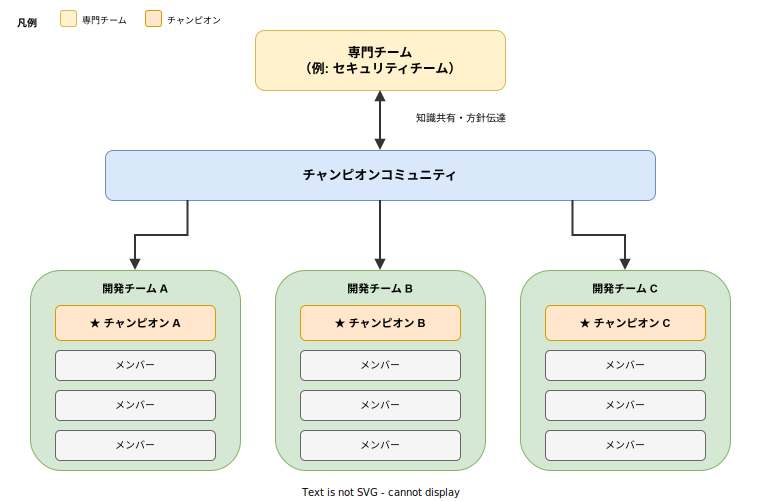
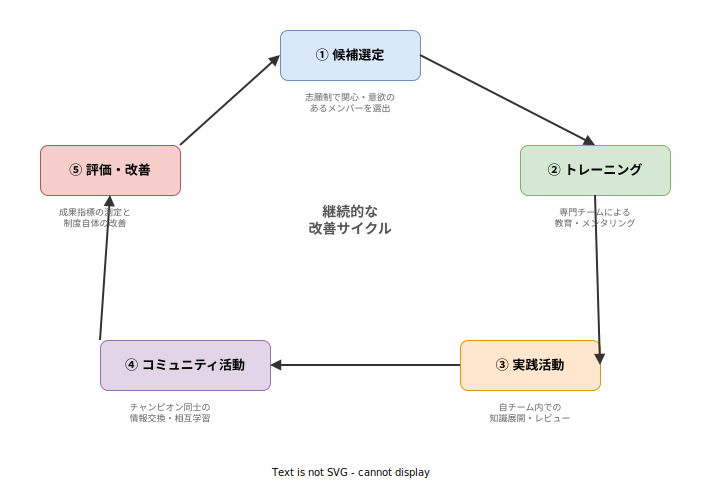

# チャンピオン制度: 基本

- 対象読者: ソフトウェア開発チームのリーダー・マネージャー・エンジニア
- 学習目標: チャンピオン制度の目的・構造・運用方法を理解し、自組織への導入を検討できるようになる
- 所要時間: 約 25 分
- 対象バージョン: —（方法論のため特定バージョンなし）
- 最終更新日: 2026-04-13

## 1. このドキュメントで学べること

- チャンピオン制度とは何か、なぜ必要かを説明できる
- チャンピオンの役割と責務を理解できる
- 制度の導入手順と運用サイクルを把握できる
- 代表的なチャンピオンの種類（セキュリティ、テスト、SRE など）を知る

## 2. 前提知識

- ソフトウェア開発チームでの業務経験
- 組織における横断的な課題（セキュリティ、品質など）の存在に対する認識

## 3. 概要

チャンピオン制度（Champion Program）とは、各開発チームから選出された「チャンピオン」と呼ばれるメンバーが、特定の専門領域（セキュリティ、品質、アクセシビリティなど）の推進役を担う組織的な仕組みである。

多くの組織では、セキュリティチームや品質チームといった専門チームが存在するが、これらのチームだけでは全ての開発チームに十分な支援を行き渡らせることが困難である。チャンピオン制度は、各開発チーム内に専門領域の「橋渡し役」を配置することで、専門知識のスケーラブルな展開を実現する。

チャンピオンは専門家である必要はない。本業の開発業務を続けながら、専門チームから受けたトレーニングや知見を自チームに持ち帰り、日常の開発プロセスに組み込む役割を果たす。

## 4. 用語の整理

| 用語 | 説明 |
|------|------|
| チャンピオン（Champion） | 各チームで特定の専門領域の推進役を担うメンバー |
| チャンピオンコミュニティ | 全チームのチャンピオンが集まり情報共有・学習を行う横断的なグループ |
| 専門チーム（Center of Excellence） | セキュリティ、品質、SRE など特定領域を専門的に担当するチーム |
| スポンサー | チャンピオン制度を組織として承認し、リソースを確保する経営層・マネジメント層 |
| チャンピオンプログラム | チャンピオンの選定・育成・活動・評価の一連の仕組み全体 |

## 5. 仕組み・アーキテクチャ

チャンピオン制度では、専門チームがチャンピオンコミュニティを通じて各開発チームのチャンピオンと連携する。チャンピオンは自チーム内で専門知識を展開し、現場の課題を専門チームにフィードバックする。

制度の導入・運用は以下の継続的なサイクルで行われる。候補選定から始まり、トレーニング、実践、コミュニティ活動、評価・改善を繰り返す。

## 6. 環境構築

チャンピオン制度は方法論であるため、特定のソフトウェアのインストールは不要である。導入に際して以下を準備する。

- **スポンサーの確保**: 経営層・マネジメント層からの承認と時間的リソースの確保
- **専門チームの協力**: トレーニング教材の整備とメンタリング体制の構築
- **コミュニケーション基盤**: Slack チャンネル、定例会議枠、Wiki ページなど

## 7. 基本の使い方

### 7.1 チャンピオンの選定

チャンピオンは以下の基準で選定する。強制的な指名ではなく、自発的な志願を重視する。

| 選定基準 | 説明 |
|----------|------|
| 関心・意欲 | 対象領域に関心があり、学習意欲が高い |
| コミュニケーション力 | チーム内で知識を共有し、議論をリードできる |
| 信頼性 | チーム内で一定の信頼を得ている |
| 継続性 | 長期的に活動できる見込みがある |

### 7.2 チャンピオンの活動内容

チャンピオンの具体的な活動は以下のとおりである。

| 活動 | 頻度 | 内容 |
|------|------|------|
| コミュニティ定例 | 隔週〜月 1 回 | 他チームのチャンピオンと情報交換・学習 |
| チーム内共有 | 毎スプリント | コミュニティで得た知見をチームに展開 |
| レビュー参加 | 随時 | 専門領域の観点でコードレビューやデザインレビューに参加 |
| 課題のエスカレーション | 随時 | チームで解決困難な専門課題を専門チームに連携 |
| トレーニング受講 | 四半期ごと | 専門チームが提供するトレーニングに参加 |

### 7.3 時間配分の目安

チャンピオン活動には、業務時間の 10〜20% を充てることが推奨される。これをマネジメント層と合意し、通常業務の負荷調整を行うことが制度の持続性において重要である。

## 8. ステップアップ

### 8.1 代表的なチャンピオンの種類

| 種類 | 推進領域 | 主な活動例 |
|------|----------|-----------|
| セキュリティチャンピオン | アプリケーションセキュリティ | 脅威モデリング、セキュアコーディングレビュー、脆弱性対応 |
| テストチャンピオン | テスト品質 | テスト戦略の策定、テストカバレッジの改善 |
| アクセシビリティチャンピオン | Web アクセシビリティ | WCAG 準拠のレビュー、支援技術の検証 |
| SRE チャンピオン | 信頼性・運用性 | SLO 設定、インシデント対応、ランブック整備 |
| DevOps チャンピオン | CI/CD・自動化 | パイプライン改善、デプロイメントプラクティスの導入 |

### 8.2 成熟度モデル

チャンピオン制度の成熟度は段階的に発展する。

| レベル | 状態 | 特徴 |
|--------|------|------|
| 1: 初期 | 非公式 | 有志が個人的に活動している |
| 2: 定義 | 公式化 | 役割が定義され、スポンサーがいる |
| 3: 運用 | 体系化 | トレーニング・定例・評価の仕組みがある |
| 4: 最適化 | 自律的 | チャンピオンが自律的に改善を推進し、組織文化として定着 |

## 9. よくある落とし穴

- **時間確保の失敗**: チャンピオン活動の時間がマネジメントと合意されていないと、通常業務に追われて活動が形骸化する。業務時間の一部として公式に認定する必要がある
- **指名制による意欲低下**: 上司から一方的に指名されたチャンピオンは、当事者意識が薄くなりやすい。自発的な志願を基本とし、関心・意欲を重視する
- **専門家の代替という誤解**: チャンピオンは専門チームの代わりではない。判断に迷う場面では専門チームにエスカレーションすることが期待される
- **成果の不可視化**: チャンピオン活動の成果が評価制度に組み込まれていないと、モチベーションが維持できない。定量・定性の成果指標を設定し、人事評価と連動させる
- **コミュニティの孤立化**: チャンピオンコミュニティが内輪の集まりになると、組織全体への影響力が低下する。活動内容や成果を定期的に全社へ発信する

## 10. ベストプラクティス

- チャンピオン活動の時間を業務計画に明示的に組み込む（スプリントプランニング等）
- チャンピオンコミュニティの定例会で事例共有・相互学習を行う
- 四半期ごとに活動の振り返りを実施し、制度自体を改善する
- チャンピオン活動を人事評価のコンピテンシーとして認定する
- 新任チャンピオンにメンター（経験者）を付ける仕組みを整備する
- OWASP Security Champions Guide などの公開フレームワークを参考にする

## 11. 演習問題

1. 自分の組織で最もチャンピオン制度の導入効果が高いと考える専門領域を 1 つ挙げ、その理由を述べよ
2. チャンピオンの選定基準を自組織向けにカスタマイズし、5 つの評価項目を設計せよ
3. チャンピオンの活動成果を測定するための KPI を 3 つ提案せよ

## 12. さらに学ぶには

- 関連 Knowledge: [バスファクター: 基本](../methodology/bus-factor_basics.md)（知識集中リスクの評価・改善）
- OWASP Security Champions Guide（セキュリティチャンピオンの導入フレームワーク）

## 13. 参考資料

- OWASP, "Security Champions", OWASP Security Culture Project
- OWASP, "Security Champions Program", OWASP Developer Guide
- ProjectManager.com, "Change Champion: Key Roles & Responsibilities"
- AppSecEngineer, "The Ultimate Guide to Building Security Champions"
