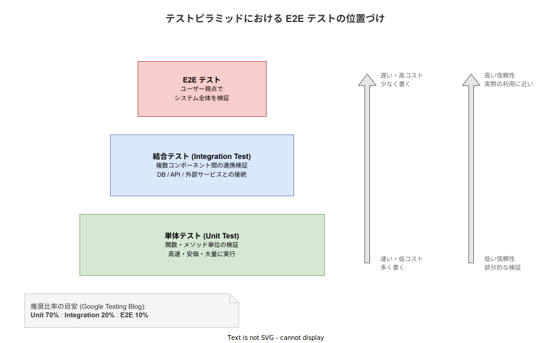
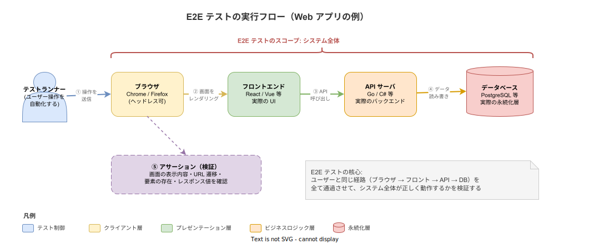

# E2E テスト: 基本

- 対象読者: ソフトウェア開発に携わるエンジニア・QA 担当者
- 学習目標: E2E テストの概念・テストピラミッドにおける位置づけ・代表的なツールと書き方を理解し、E2E テストの導入判断ができるようになる
- 所要時間: 約 30 分
- 対象バージョン: —（方法論のため特定バージョンなし）
- 最終更新日: 2026-04-16

## 1. このドキュメントで学べること

- E2E テストとは何か、単体テスト・結合テストとの違いを説明できる
- テストピラミッドにおける E2E テストの位置づけと推奨比率を理解できる
- E2E テストの実行フロー（ブラウザ → フロント → API → DB）を説明できる
- 代表的な E2E テストツール（Playwright / Cypress / Selenium）の特徴を比較できる
- E2E テストを導入すべき場面と避けるべき場面を判断できる

## 2. 前提知識

- ソフトウェアテストの基礎（テストとは何か、なぜ必要か）
- Web アプリケーションの基本構成（フロントエンド・バックエンド・データベース）
- 関連 Knowledge: [FR の基本](./fr_basics.md)（受け入れ基準と E2E テストの関係）

## 3. 概要

E2E テスト（End-to-End テスト）は、システム全体をユーザーと同じ経路で操作し、期待どおりに動作するかを検証するテスト手法である。

単体テストが関数 1 つを検証し、結合テストがコンポーネント間の連携を検証するのに対し、E2E テストはブラウザを起動し、ボタンをクリックし、画面遷移を確認し、データベースに値が保存されることまでを一気通貫で確認する。ユーザーが実際に体験する操作を自動化するため、「本当に動くのか」に対する信頼性が最も高い。

一方で、E2E テストは実行が遅く、環境構築が複雑で、テストの安定性（フレーキネス）に悩まされやすい。そのため全てのテストを E2E で書くのではなく、テストピラミッドの原則に従い、少数の重要なシナリオに絞って実施するのが定石である。

## 4. 用語の整理

| 用語 | 説明 |
|------|------|
| E2E テスト | ユーザー操作を模倣し、システム全体を通して検証するテスト |
| テストピラミッド | Unit → Integration → E2E の 3 層でテスト量を配分する考え方 |
| ヘッドレスブラウザ | 画面表示なしでバックグラウンド実行するブラウザ。CI 環境で使用 |
| フレーキーテスト | 同じコードで成功と失敗が不安定に切り替わるテスト |
| テストランナー | テストコードを実行し、結果を集計するツール |
| セレクタ | テスト対象の HTML 要素を特定するための識別子（CSS / XPath / data-testid 等） |
| アサーション | テスト実行後の状態が期待値と一致するかを検証する宣言 |
| フィクスチャ | テスト実行前に準備するデータや環境の初期状態 |

## 5. 仕組み・アーキテクチャ

### 5.1 テストピラミッドにおける E2E テストの位置

テストピラミッドは、テストを 3 層に分けてそれぞれの量と役割を整理するモデルである。下層ほど高速・安価で大量に書き、上層ほど低速・高コストだが実際の利用に近い検証ができる。



Google Testing Blog が提唱する推奨比率は Unit 70% : Integration 20% : E2E 10% である。E2E テストは「少なく、しかし最も重要なシナリオを確実に守る」ために存在する。

### 5.2 E2E テストの実行フロー

E2E テストは、ユーザーが行う操作をそのままプログラムで再現する。テストランナーがブラウザを制御し、実際の UI → API → DB の経路を全て通過させてからアサーションで結果を検証する。



この「全経路を通過する」点が単体テストや結合テストとの決定的な違いである。モックやスタブで置き換えないため、コンポーネント間の結合不良やデプロイ設定のミスも検出できる。

## 6. 環境構築

E2E テストを実行するには、テストツールと対象アプリケーションの実行環境が必要である。ここでは最も広く使われている Playwright を例に示す。

```bash
# Node.js プロジェクトに Playwright をインストールする
npm init playwright@latest

# ブラウザバイナリをダウンロードする
npx playwright install
```

セットアップ完了後、`npx playwright test` でテストを実行できる。`npx playwright test --ui` で UI モードが起動し、テストの実行過程を視覚的に確認できる。

## 7. 基本の使い方

以下は「ログインしてダッシュボードが表示される」という E2E テストの最小例である。

```typescript
// E2E テスト: ログインフローの検証
import { test, expect } from '@playwright/test';

test('ログインしてダッシュボードが表示される', async ({ page }) => {
  // ログインページに遷移する
  await page.goto('http://localhost:3000/login');

  // メールアドレスを入力する
  await page.fill('[data-testid="email"]', 'user@example.com');

  // パスワードを入力する
  await page.fill('[data-testid="password"]', 'password123');

  // ログインボタンをクリックする
  await page.click('[data-testid="login-button"]');

  // ダッシュボードに遷移したことを検証する
  await expect(page).toHaveURL('/dashboard');

  // ウェルカムメッセージが表示されることを検証する
  await expect(page.locator('[data-testid="welcome"]')).toBeVisible();
});
```

テストは「操作（Act）」と「検証（Assert）」の繰り返しで構成される。`page.goto` / `page.fill` / `page.click` がユーザー操作に対応し、`expect` がアサーションに対応する。

## 8. ステップアップ

### 8.1 代表的な E2E テストツールの比較

| ツール | 対応ブラウザ | 言語 | 特徴 |
|--------|------------|------|------|
| Playwright | Chromium / Firefox / WebKit | TS / JS / Python / C# / Java | マルチブラウザ対応、自動待機、トレース機能が強力 |
| Cypress | Chromium / Firefox / WebKit | JS / TS | ブラウザ内実行で高速、デバッグ UI が直感的 |
| Selenium | 全主要ブラウザ | Java / Python / C# / Ruby 等 | 最も歴史が長く、エンタープライズでの実績が豊富 |

2024 年以降の新規プロジェクトでは Playwright が第一候補となることが多い。理由は、マルチブラウザ対応・自動待機機構・CI との統合のしやすさのバランスが良いためである。

### 8.2 テストの安定性を高める技法

E2E テストが不安定（フレーキー）になる主な原因と対策を示す。

- **タイミング依存**: 要素の表示を待たずにクリックすると失敗する。`waitForSelector` や Playwright の自動待機に任せる
- **テストデータの汚染**: 前のテストが作ったデータが残ると後続が壊れる。テストごとにデータをリセットするか、テスト専用の一意データを使う
- **セレクタの脆弱性**: CSS クラス名やテキストに依存すると UI 変更で壊れる。`data-testid` 属性を使い、テスト用のセレクタを安定させる
- **外部サービス依存**: メール送信や決済 API など外部サービスは E2E でもモックを検討する

## 9. よくある落とし穴

- **全てを E2E で検証しようとする**: E2E は遅くコストが高い。ビジネス上重要なクリティカルパス（ログイン、決済、主要ワークフロー）に絞り、ロジック検証は単体テストに委ねる
- **テストの独立性を保たない**: テスト A の結果に テスト B が依存する設計は、A の失敗が B 以降を全滅させる。各テストは独立して実行可能にする
- **CI で動かさない**: ローカルでしか動かない E2E テストは次第に放置される。CI パイプラインに組み込み、PR マージの条件にする
- **失敗を放置する**: フレーキーテストを「またか」と無視すると、本物のバグも見逃す。フレーキーテストは即座に修正するか、一時的にスキップして Issue を起票する
- **スクリーンショットを活用しない**: 失敗時のスクリーンショットやトレースを保存しないと、CI 上の失敗原因が分からない

## 10. ベストプラクティス

- E2E テストはテストピラミッドの頂点として、全体の 10% 程度に抑える
- ユーザーの主要ワークフロー（ハッピーパス）を優先的にカバーする
- `data-testid` 属性で安定したセレクタを使う
- テストごとにデータを初期化し、テスト間の依存を排除する
- CI パイプラインに組み込み、全 PR で自動実行する
- 失敗時にスクリーンショット・動画・トレースを自動保存する
- 実行時間が長くなったら並列実行（シャーディング）を導入する
- Page Object Model で画面操作を抽象化し、UI 変更時の修正箇所を局所化する

## 11. 演習問題

1. 単体テスト・結合テスト・E2E テストの違いを、それぞれ「検証範囲」「実行速度」「信頼性」の 3 軸で比較せよ
2. 「ユーザーが商品をカートに追加し、決済を完了する」シナリオの E2E テストを疑似コードで記述せよ
3. あるプロジェクトで E2E テストが頻繁に失敗して信頼を失っている。原因として考えられる要因を 3 つ挙げ、それぞれの対策を述べよ

## 12. さらに学ぶには

- Playwright 公式ドキュメント: https://playwright.dev/docs/intro
- Cypress 公式ドキュメント: https://docs.cypress.io/
- 関連 Knowledge: [FR の基本](./fr_basics.md)（受け入れ基準を E2E テストで検証する考え方）
- Martin Fowler「TestPyramid」: https://martinfowler.com/bliki/TestPyramid.html

## 13. 参考資料

- Google Testing Blog, "Just Say No to More End-to-End Tests", 2015
- Martin Fowler, "TestPyramid", martinfowler.com
- Microsoft, "Playwright documentation", https://playwright.dev/
- Lisa Crispin, Janet Gregory, "Agile Testing", Addison-Wesley, 2009
