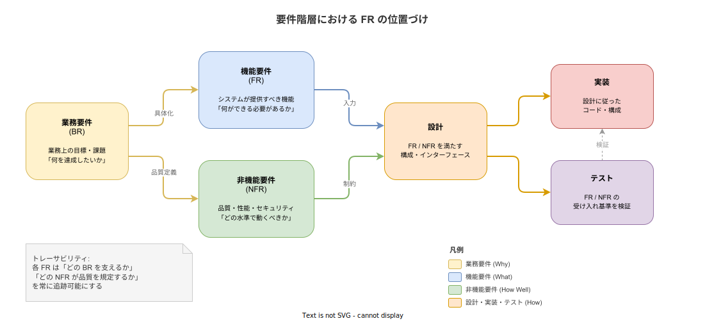
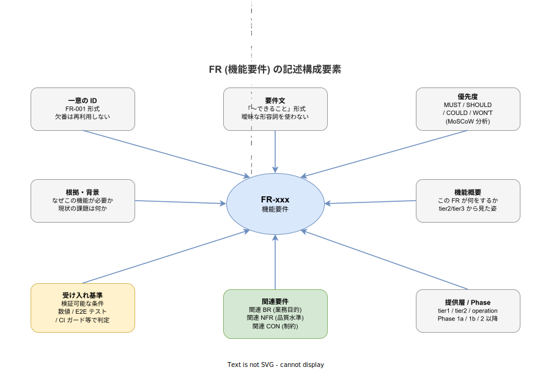

# FR (Functional Requirements): 基本

- 対象読者: ソフトウェア開発に携わるエンジニア・要件定義担当者
- 学習目標: FR の概念・記述方法・品質基準を理解し、検証可能な機能要件を書けるようになる
- 所要時間: 約 30 分
- 対象バージョン: —（方法論のため特定バージョンなし）
- 最終更新日: 2026-04-16

## 1. このドキュメントで学べること

- FR（機能要件）とは何か、他の要件種別（BR / NFR / CON）との違いを説明できる
- 検証可能な FR の書き方を理解し、曖昧な要件と区別できる
- FR に必要な構成要素（ID / 要件文 / 優先度 / 受け入れ基準）を理解できる
- 要件間のトレーサビリティの仕組みと意義を説明できる

## 2. 前提知識

- ソフトウェア開発プロセスの基礎知識（要件定義 → 設計 → 実装 → テストの流れ）
- 要件定義書が「何を作るか」を決める文書であるという認識

## 3. 概要

FR（Functional Requirement / 機能要件）は、システムが **「何をできる必要があるか」** を定義する要件である。

ソフトウェア開発で作るものを決めるとき、要件は複数の階層に分かれる。業務要件（BR）が「業務上の目標」を示し、非機能要件（NFR）が「性能やセキュリティの水準」を示すのに対し、FR はその中間に位置し **「システムが具体的に提供すべき機能」** を記述する。

FR が重要な理由は 3 つある。第一に、設計者が「何を作るか」を判断する直接の入力となる。第二に、テスト担当が「何をテストするか」の基準となる。第三に、ステークホルダー間で「完成とは何か」の合意を形成する。FR が曖昧だと、設計は迷走し、テストは不完全になり、リリース判定で揉める。

IEEE 830（ソフトウェア要求仕様書の推奨実施法）は、FR の品質属性として「正確性・非曖昧性・完全性・一貫性・検証可能性・追跡可能性」の 6 つを定義している。

## 4. 用語の整理

| 用語 | 説明 |
|------|------|
| FR（Functional Requirement） | システムが提供すべき機能を定義する要件。「何ができるか」を記述する |
| BR（Business Requirement） | 業務上の目標・課題を記述する要件。FR の「なぜ」に当たる |
| NFR（Non-Functional Requirement） | 性能・可用性・セキュリティなど、機能の品質水準を数値で規定する要件 |
| 受け入れ基準（Acceptance Criteria） | FR が達成されたか否かを判定するための検証可能な条件 |
| トレーサビリティ（Traceability） | 要件 → 設計 → 実装 → テストの対応関係を追跡可能な状態にすること |
| MoSCoW 分析 | Must / Should / Could / Won't の 4 段階で優先度を付ける手法 |
| RTM（Requirements Traceability Matrix） | 要件 → 設計 → テストの対応関係を表にまとめたもの |

## 5. 仕組み・アーキテクチャ

### 5.1 要件階層における FR の位置づけ

FR は業務要件（BR）と非機能要件（NFR）の中間に位置し、設計・実装・テストの直接の入力となる。



BR が「なぜ作るか（Why）」、FR が「何を作るか（What）」、NFR が「どの水準で動くか（How Well）」、設計が「どう作るか（How）」を担う。FR を起点として上流（BR）への根拠と下流（設計・テスト）への入力が双方向に追跡できる状態が「トレーサビリティが確保されている」状態である。

### 5.2 FR の記述構成要素

1 つの FR は以下の要素で構成される。



「受け入れ基準」と「関連要件」が特に重要である。受け入れ基準がなければ「この FR は達成されたのか」を判定できず、関連要件がなければ「この FR は何のために存在するのか」が不明になる。

## 6. 環境構築

FR の作成に特別なツールは不要である。テキストエディタと要件管理のためのバージョン管理（Git）があれば運用を開始できる。

大規模プロジェクトでは Jira / Azure DevOps / IBM DOORS のような要件管理ツールが使われることもあるが、中小規模では Markdown + Git で十分に管理できる。

## 7. 基本の使い方

### 7.1 FR の記述テンプレート

```markdown
### FR-xxx: (要件名)

| 項目 | 内容 |
|---|---|
| 優先度 | MUST / SHOULD / COULD / WON'T |
| 関連 BR | BR-xxx |
| 提供層 | どの層で提供するか |
| Phase | いつ実装するか |

(機能概要: 現状の課題 → この FR が何をするか → 崩れた場合の影響)

受け入れ基準:
- (検証可能な条件 1)
- (検証可能な条件 2)
```

### 7.2 良い FR と悪い FR の比較

| 悪い FR | 良い FR |
|---|---|
| 「ユーザー認証を行う」 | 「Keycloak OIDC による SSO で、全コンポーネントの認証を統合する」 |
| 「高速に応答する」 | 「`ValidateToken` の p99 レイテンシが 50 ms 以内」 |
| 「ログを出す」 | 「`k1s0.Log.Info` 1 行で構造化ログが Loki に非同期送信され、traceId が自動付与される」 |
| 「セキュアに通信する」 | 「Istio mTLS (TLS 1.3) で全サービス間通信を暗号化する」 |

悪い FR に共通するのは **検証不可能** であることである。「高速に」は人によって 100 ms か 5 秒かが異なる。「セキュアに」も暗号化レベルが不明である。良い FR は第三者がテストケースを書ける粒度まで具体化されている。

## 8. ステップアップ

### 8.1 MoSCoW による優先度付け

MoSCoW 分析は FR の優先度を 4 段階で付ける手法である。

| 優先度 | 意味 | 判定基準 |
|---|---|---|
| **MUST** | 必達 | これがなければシステムとして成立しない |
| **SHOULD** | 強く推奨 | なくても動くが、本番運用には出せない |
| **COULD** | あれば望ましい | なくても本番運用は可能 |
| **WON'T** | 今回は対応しない | 明示的なスコープ外宣言 |

WON'T は「対応しない」の宣言であり、「書かない」こととは異なる。書かなければ「検討されなかった」だが、WON'T と書けば「検討した上で対応しないと決めた」ことが記録に残る。

### 8.2 トレーサビリティマトリクス (RTM)

RTM は BR → FR → 設計 → テストの対応関係を 1 枚の表で管理する。

| BR | FR | 設計書 | テスト |
|---|---|---|---|
| BR-003 横断的関心事統一 | FR-011 k1s0.Auth API | auth-facade-design.md | auth_e2e_test.go |
| BR-003 | FR-020 k1s0.Log API | log-facade-design.md | log_e2e_test.go |
| BR-020 監視一元化 | FR-060 LGTMP 統合 | lgtmp-design.md | dashboard_test.go |

RTM により「テストされていない FR」「どの BR にも紐付かない孤立した FR」「FR のない BR（実装手段が未定）」を検知できる。

## 9. よくある落とし穴

- **「How」を書いてしまう**: FR は「What（何をするか）」を書く。「PostgreSQL にデータを INSERT する」は設計であり、「キー・値でデータを永続化できること」が FR である
- **1 つの FR に複数の機能を詰め込む**: 「認証とログを統一すること」は 2 つの FR に分割すべき。混在するとテスト設計が複雑になる
- **受け入れ基準を後回しにする**: 受け入れ基準のない FR は「完了」を定義できない。FR 記述時に必ず同時に書く
- **NFR との混同**: 「p99 50 ms 以内」は NFR。FR は「トークンを検証できること」。両者を混ぜると品質目標と機能定義が曖昧になる
- **ID の再利用**: 削除された FR の ID を別の FR に使い回すと、設計書やテスト仕様書の参照先が壊れる。欠番にする

## 10. ベストプラクティス

- FR は「〜できること」「〜であること」の形で統一する
- 1 つの FR には 1 つの機能のみを記述する
- 受け入れ基準は FR と同時に書く（後回しにしない）
- 関連する BR を必ず明記し、トレーサビリティを維持する
- 曖昧な形容詞（「適切に」「十分に」「高速に」）は禁止し、数値か具体的な条件に置き換える
- Phase（いつ実装するか）を明記し、スコープの膨張を防ぐ
- FR の追加・変更時は RTM を同時に更新する

## 11. 演習問題

1. 以下の曖昧な要件を、検証可能な FR に書き直せ
   - 「使いやすい管理画面を提供する」
   - 「大量のデータを扱えること」
2. 「退職者の権限を素早く剥奪する」という業務要件 (BR) に対し、FR を 1 つ作成せよ。ID / 要件文 / 優先度 / 受け入れ基準 / 関連 BR を含めること
3. FR-010「SSO 認証統合」と FR-020「構造化ログ API」の 2 つに対して、RTM の 1 行を書け

## 12. さらに学ぶには

- IEEE 830-1998「Recommended Practice for Software Requirements Specifications」: FR 品質属性の原典
- Karl Wiegers「Software Requirements」: 要件定義の実務的な教科書
- BABOK (Business Analysis Body of Knowledge): 要件分析の体系的なフレームワーク
- 関連 Knowledge: [ADR の基本](./adr_basics.md)、[MVP の基本](./mvp_basics.md)

## 13. 参考資料

- IEEE Std 830-1998, "IEEE Recommended Practice for Software Requirements Specifications"
- Karl Wiegers, Joy Beatty, "Software Requirements", 3rd Edition, Microsoft Press, 2013
- IIBA, "A Guide to the Business Analysis Body of Knowledge (BABOK Guide)", Version 3
- Dai Clegg, Richard Barker, "Case Method Fast-Track: A RAD Approach", Addison-Wesley, 1994 (MoSCoW 分析の原典)
