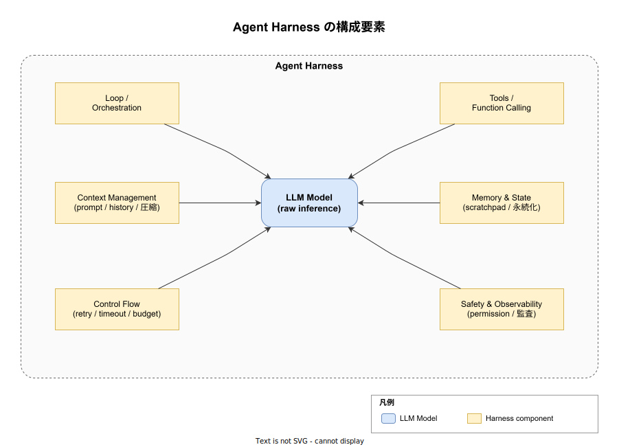
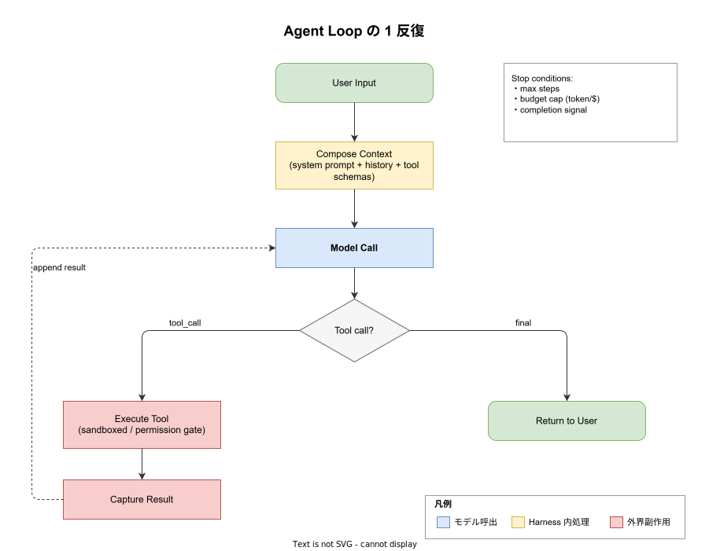

# ハーネスエンジニアリング: 基本

- 対象読者: LLM をアプリやエージェントに組み込むエンジニア / AI プロダクトの設計者
- 学習目標: 「ハーネス」を構成する 6 領域を説明でき、最小エージェントループを自分で組める
- 所要時間: 約 60 分
- 対象バージョン: Anthropic Engineering Blog 2026-04 時点の整理に依拠 / Claude Code を主な実例として参照
- 最終更新日: 2026-04-27

## 1. このドキュメントで学べること

- LLM「モデル」と「ハーネス」の境界を区別できる
- ハーネスを構成する 6 領域（ループ / ツール / コンテキスト / 記憶 / 制御 / 安全）の役割を説明できる
- 最小エージェントループを自分でコードに落とせる
- ハーネス設計のよくある落とし穴と対策を判断できる
- Claude Code 等の既存ハーネスがどの設計選択をしているかを読み解ける

## 2. 前提知識

- 何らかの言語で REST API を叩いた経験があること
- LLM の messages API（`system` / `user` / `assistant` / `tool` ロール）の存在を知っていること
- 「関数呼び出し（function calling / tool use）」の概念に触れた経験があること

未習の場合は先に [gRPC_basics.md](../protocol/gRPC_basics.md) などで RPC の基礎を整理し、Anthropic / OpenAI 公式ドキュメントの Quickstart を一通り写経してから戻ること。

## 3. 概要

ハーネスエンジニアリング (harness engineering) は、**生の LLM** を **動作するエージェント** に変えるための周辺ソフトウェアを設計・実装する規律を指す。「ハーネス」とはモデル本体を取り囲み、外界とのやり取りを成立させる**実行環境一式**を指す。Anthropic は 2026 年に「ハーネスはモデルが単独でできないことの仮定そのものを符号化する (every component encodes an assumption about what the model can't do on its own)」と整理しており、性能フロンティアでの差は **モデル選択ではなくハーネス設計** で生まれると述べている。

例えば Claude Code は LLM そのものではなく、ループ・ツール定義・スラッシュコマンド・hook・権限プロンプトなどを実装した **Claude のハーネス** である。同じ Claude Sonnet 4.6 を裸の API で叩いた場合と、Claude Code 経由で使った場合とで「できること」が大きく異なるのは、後者がハーネスを通じてファイル編集・サブエージェント・コンテキスト圧縮・hook 起動を解禁しているからである。

ハーネスエンジニアリングの目的は次の 3 つに整理できる:

1. **モデルの非決定性を、決定的な行動に変換する** — 確率的な出力を、ツール実行や状態更新といった検証可能な副作用に落とし込む
2. **長時間・多ターン作業を可能にする** — コンテキスト圧縮・記憶・チェックポイントで、ウィンドウや 1 回の応答に収まらない作業を継続させる
3. **安全境界を外側に置く** — 権限・監査・予算上限をハーネス側で強制し、モデルが学習で身に付けた振る舞いに頼らない

## 4. 用語の整理

| 用語 | 説明 |
|------|------|
| モデル (model) | LLM 本体。1 回の `messages.create` 呼び出しで「次の応答」を返すだけの確率的関数 |
| ハーネス (harness) | モデルを取り巻く実行環境一式。本ドキュメントで扱う 6 領域の総称 |
| エージェント (agent) | モデル + ハーネスの組合せで、目的を達成するため自律的にループするシステム |
| スキャフォールド (scaffolding) | エージェント起動前の組立て段階。システムプロンプト合成・ツール登録・サブエージェント定義を含む。実行段階のハーネスとは区別する |
| ツール (tool) | モデルが呼び出せる外部関数。スキーマ（名前・説明・引数型）として宣言する |
| コンテキスト (context) | モデルへの 1 回の入力に含まれる全文字列（system / user / assistant / tool 履歴） |
| サブエージェント (sub-agent) | 親エージェントから委譲される独立したループ。別のシステムプロンプトとツールを持つ |

## 5. 仕組み・アーキテクチャ

ハーネスは「モデル単独では満たせない要件」をモデル外部に押し出した結果として 6 領域に分かれる。図 5-1 はハーネスがモデルを取り囲む静的構造、図 5-2 は 1 反復の動的フローを示す。

**図 5-1**: モデル中央、6 領域がそれを囲む。各領域はモデルが自身では持てない能力（永続化・外部副作用・複数回呼出制御・検証可能な境界）を提供する。



**図 5-2**: 1 ターン内でハーネスが実行する処理フロー。モデル応答が「ツール呼出」か「最終応答」かで分岐し、ツール呼出の場合はサンドボックス内で実行した結果をメッセージ履歴に追記して次反復へ進む。停止条件（最大ステップ・予算上限・完了シグナル）はこの繰返しの外側で判定する。



各領域の役割:

- **Loop / Orchestration**: 何度モデルを呼び出すか、いつ止めるかを決める。停止条件・並行制御・ターン間遷移を司る
- **Tools / Function Calling**: モデルが宣言したスキーマを介して外部関数を呼び出す。引数バリデーション・サンドボックス・結果整形を含む
- **Context Management**: 1 回の呼出に渡す文字列の組立てと、ウィンドウ超過時の圧縮・要約
- **Memory & State**: 1 ターン内のスクラッチパッドに加え、セッション間で持ち越す長期記憶（ファイル・ベクトル DB 等）
- **Control Flow**: 失敗時の retry・ツール実行のタイムアウト・トークンや金額の予算上限
- **Safety & Observability**: 権限ゲート（人間承認）、監査ログ、トレース。モデルの「悪意なき逸脱」を外側で抑える

## 6. 環境構築

### 6.1 必要なもの

- Python 3.11 以上
- `anthropic` SDK 0.40 以降（messages API + `tool_use` 対応）
- API キー（環境変数 `ANTHROPIC_API_KEY` に設定）

### 6.2 セットアップ手順

1. 仮想環境を作る: `python -m venv .venv && source .venv/bin/activate`
2. SDK を入れる: `pip install "anthropic>=0.40"`
3. 環境変数を設定する: `export ANTHROPIC_API_KEY=sk-ant-...`

### 6.3 動作確認

`python -c "import anthropic; print(anthropic.__version__)"` が SDK バージョンを返せば準備完了。

## 7. 基本の使い方

最小ハーネスは「ループ・ツール呼出・結果追記」の 3 要素で動く。下の例は `get_time` ツールを 1 つ持つ最小エージェントで、停止条件は「最終応答が返ったら / 6 反復で打切」。

```python
# minimal_harness.py
# 最小ハーネス: ループ・ツール呼出・結果追記の 3 要素のみで動くエージェント
import anthropic
import datetime

# モデルが呼び出せる関数を Python 側で実装する
def get_time() -> str:
    # 現在の UTC 時刻を ISO 形式で返す
    return datetime.datetime.utcnow().isoformat() + "Z"

# モデルへ渡すツールスキーマ（このリストが「モデルにできること」の宣言）
TOOLS = [{
    "name": "get_time",
    "description": "現在の UTC 時刻を返す",
    "input_schema": {"type": "object", "properties": {}, "required": []},
}]

# モデル呼出を行う Anthropic クライアント
client = anthropic.Anthropic()

# 会話履歴。ハーネスはここに user / assistant / tool_result を順次追記する
messages = [{"role": "user", "content": "今の UTC 時刻を 1 行で答えて。"}]

# ループ本体（停止条件は最終応答 or 6 反復）
for _ in range(6):
    # モデルを呼び出して次の応答を得る
    resp = client.messages.create(
        model="claude-sonnet-4-6",
        max_tokens=512,
        tools=TOOLS,
        messages=messages,
    )
    # 応答全体を assistant ターンとして履歴に追記する
    messages.append({"role": "assistant", "content": resp.content})
    # 終了理由が "end_turn" なら最終応答なのでループを抜ける
    if resp.stop_reason == "end_turn":
        break
    # ツール呼出ブロックを抽出してそれぞれ実行する
    tool_results = []
    for block in resp.content:
        # tool_use 以外（例: text ブロック）は無視する
        if block.type != "tool_use":
            continue
        # 名前で分岐（実プロダクトでは dict ディスパッチ + 引数検証を入れる）
        if block.name == "get_time":
            output = get_time()
        else:
            output = f"unknown tool: {block.name}"
        # tool_result ブロックは tool_use_id でモデル側応答と紐付ける
        tool_results.append({
            "type": "tool_result",
            "tool_use_id": block.id,
            "content": output,
        })
    # ツール結果を user ターンとして履歴に追記し次反復へ
    messages.append({"role": "user", "content": tool_results})

# 最終応答（assistant の最後の text ブロック）を取り出して表示する
print(messages[-1]["content"][0].text)
```

### 解説

- `messages.create` 1 回はあくまで「次の発話を返す」だけ。**反復させているのはハーネス（for ループ）** であり、モデル自身ではない
- `tools` 引数はモデルへの**能力宣言**であり、実装は呼び出し側が責務を持つ
- `stop_reason == "end_turn"` がループ終了のシグナル。`tool_use` で帰ってきた場合はツールを実行し、結果を `user` ロールで追記して次反復へ進む
- `tool_use_id` で対応関係を結ぶ。これを忘れるとモデルは「自分が依頼した処理の結果か」を判定できない

## 8. ステップアップ

### 8.1 コンテキスト圧縮

会話が長くなると入力トークンが線形に膨らみ、コストとレイテンシを押し上げる。本格的なハーネスは閾値（例: 入力 80% 到達）で過去ターンを要約しベクトル DB に退避する。Claude Code の `/compact` がこの実装例。

### 8.2 サブエージェント

ツールの 1 つとして「別のシステムプロンプトを持つループ」を定義すると、専門化と関心分離ができる。Claude Code の `Agent` ツールは独立したコンテキストでサブエージェントを起動し、結果のみを親に返す設計。

### 8.3 永続化と再開

`messages` 配列を JSON にダンプすればセッション間で再開できる。実プロダクトでは `session_id` をキーに DB へ保存し、ターン単位でチェックポイントする。

### 8.4 hook と外部介入

ツール実行前後に決定論的な処理を差し込むのが hook（Claude Code の `PreToolUse` / `PostToolUse` 等）。モデル判断に依らず制約を強制したい時に使う。

## 9. よくある落とし穴

- **「モデルを賢くすれば良い」と考える**: 現実には**ハーネスがその先のフロンティア**。同じモデルでもハーネス設計次第で達成可能な作業範囲が数桁変わる
- **`tool_use_id` の取り違え**: 並列ツール実行時に id を紐付け忘れるとモデルが結果を結び付けられず無限ループに陥る
- **停止条件が `end_turn` のみ**: モデルが自己完結を主張せず延々とツール呼出を続けるケースがある。**最大反復数 / 予算上限を必ず併設する**
- **権限を「プロンプトで指示する」**: 「危険な操作はするな」とシステムプロンプトに書くだけでは抜ける。ハーネス側の許可ゲートで物理的に止める
- **会話履歴に大きな tool_result を貼り続ける**: 数十 KB の生 JSON を毎ターン送り続けるとコンテキストが破綻する。ファイルパス + 必要箇所抜粋に置換する

## 10. ベストプラクティス

- **ツールは少数・直交・命名一意**: 似た用途のツールが並ぶとモデルが選択を誤る。1 ツール 1 責務に絞る
- **権限は宣言ベース**: `settings.json` 等で「許可するコマンド」を明示し、要求の都度プロンプトする方式（Claude Code の permission モード）を採る
- **観測は必須**: ツール呼出ごとに input / output / 所要時間 / トークン量を構造化ログに記録する。失敗解析と eval は観測なしでは成立しない
- **eval をハーネス単位で持つ**: モデル単体の eval ではなく、ハーネスを含めた end-to-end タスクで成功率を測る
- **コンテキストはレイヤ化**: 不変（システム）/ 半永続（プロジェクトメモリ）/ 揮発（直近ターン）に分け、不変ほど cache 可能な構造にする

## 11. 演習問題（任意）

1. 7 章のサンプルに `read_file(path: str)` ツールを追加し、ファイル読込を経由した質問に答えられるエージェントへ拡張せよ。読み込めるパスを `/tmp` 配下に限定するガードもハーネス側で実装すること
2. 6 反復の上限に達した時、最後の `assistant` 応答ではなく「途中で打切られた旨」を返すよう、停止条件と最終応答整形を分離せよ
3. `client.messages.create` の前後でリクエスト ID・所要時間・入力トークン数を `logging` で記録する観測 hook を入れよ。トレース可能性が無いハーネスがなぜ運用に耐えないかを 3 行で説明せよ

## 12. さらに学ぶには

- 関連 Knowledge: [adr_basics.md](adr_basics.md) — ハーネス設計判断を残す形式
- Anthropic Engineering Blog の `Managed Agents` / `harness-design-long-running-apps` を一次資料として通読する

## 13. 参考資料

- Anthropic Engineering — `Managed Agents` (2026): <https://www.anthropic.com/engineering/managed-agents>
- Anthropic Engineering — `Harness design for long-running application development` (2026): <https://www.anthropic.com/engineering/harness-design-long-running-apps>
- Avi Chawla — `The Anatomy of an Agent Harness` (2026): <https://blog.dailydoseofds.com/p/the-anatomy-of-an-agent-harness>
- Addy Osmani — `Agent Harness Engineering` (2026): <https://addyosmani.com/blog/agent-harness-engineering/>
- Adnan Masood — `Agent Harness Engineering — The Rise of the AI Control Plane` (2026): <https://medium.com/@adnanmasood/agent-harness-engineering-the-rise-of-the-ai-control-plane-938ead884b1d>
- Anthropic Messages API リファレンス: <https://docs.anthropic.com/en/api/messages>
