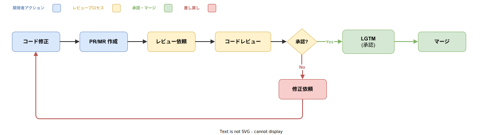
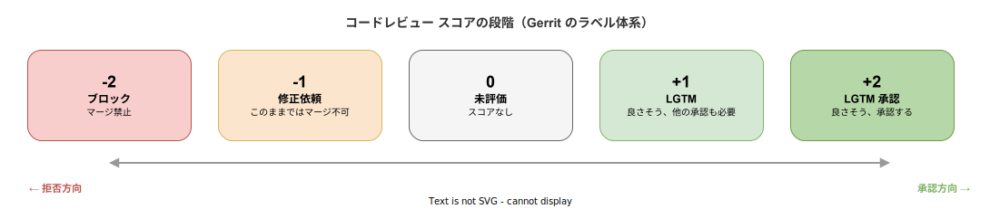

# LGTM: 基本

- 対象読者: ソフトウェア開発に携わるエンジニア（コードレビュー初心者を含む）
- 学習目標: LGTM の意味・起源・使い方を理解し、コードレビューで適切に使えるようになる
- 所要時間: 約 15 分
- 対象バージョン: —（開発文化・慣習のため特定バージョンなし）
- 最終更新日: 2026-04-13

## 1. このドキュメントで学べること

- LGTM が何の略で、どのような場面で使われるかを説明できる
- コードレビューの基本的なフローを理解できる
- 各プラットフォームでの LGTM の表現方法を把握できる
- LGTM を適切に出すための判断基準を理解できる

## 2. 前提知識

- Git によるバージョン管理の基本操作
- プルリクエスト（Pull Request）またはマージリクエスト（Merge Request）の概念

## 3. 概要

LGTM は「Looks Good To Me（私には良さそうに見える）」の略語である。ソフトウェア開発におけるコードレビューで、レビュアーがコードの変更内容を確認し、問題がないと判断した際に使う承認の意思表示である。

コードレビューとは、開発者が書いたコードを別の開発者が確認するプロセスである。バグの早期発見、コード品質の向上、知識の共有を目的とする。LGTM はこのプロセスにおける「承認」を簡潔に伝えるための略語として、オープンソースコミュニティから広まった。

Google 社内の開発文化では、コードレビューはすべての変更に必須であり、LGTM は正式な承認シグナルとして使われている。この文化はオープンソースプロジェクトを通じて業界全体に広がり、現在では GitHub、GitLab、Gerrit など主要なコードレビューツールで標準的に使われている。

## 4. 用語の整理

| 用語 | 説明 |
|------|------|
| LGTM（Looks Good To Me） | コードレビューにおける承認の意思表示。「問題なし」を意味する |
| コードレビュー（Code Review） | 他の開発者が書いたコードを確認・評価するプロセス |
| PR（Pull Request） | GitHub におけるコード変更の提案。レビューとマージの単位 |
| MR（Merge Request） | GitLab における PR と同等の概念 |
| レビュアー（Reviewer） | コードレビューを行う人 |
| Approve（承認） | レビューツール上の正式な承認操作 |
| Request Changes（修正依頼） | レビュー後に修正を求める操作 |
| nit（nitpick） | 細かい指摘。マージをブロックしない軽微なコメント |

## 5. 仕組み・アーキテクチャ

### コードレビューのフロー

以下の図は、コードレビューの典型的なフローを示す。開発者がコードを修正し PR/MR を作成した後、レビュアーが確認する。問題がなければ LGTM（承認）を出しマージされる。問題があれば修正依頼が出され、開発者がコードを修正して再度レビューを受ける。

### レビュースコアの段階

コードレビューツール Gerrit では、レビュー結果をスコアで表現する。この段階は多くのコードレビューツールの概念的な基盤となっている。

LGTM は +1（承認だが他のレビュアーの確認も必要）または +2（完全な承認）に対応する。多くのプロジェクトでは、マージに必要な承認数を設定できる。

## 6. 環境構築

LGTM はツールではなくコードレビューの慣習であるため、特別な環境構築は不要である。以下のいずれかのプラットフォームでコードレビュー機能を利用できる。

- **GitHub**: Pull Request の「Review changes」→「Approve」
- **GitLab**: Merge Request の「Approve」ボタン
- **Gerrit**: Code-Review ラベルに +2 を投票

## 7. 基本の使い方

### 7.1 各プラットフォームでの LGTM の表現

| プラットフォーム | LGTM の操作 | 効果 |
|-----------------|-------------|------|
| GitHub | Review → Approve | 緑のチェックマークが付き、マージ可能になる |
| GitLab | Approve ボタン | 承認数がカウントされ、必要数に達するとマージ可能 |
| Gerrit | Code-Review +2 | 「Looks good to me, approved」ラベルが付与される |
| コメント | 「LGTM」とテキスト記述 | 非公式な承認（ツール上の Approve とは別） |

### 7.2 LGTM を出す前のチェックリスト

LGTM を出す際は、以下の観点を確認する。

1. **動作の正しさ**: コードが意図した通りに動作するか
2. **テスト**: 適切なテストが追加・更新されているか
3. **可読性**: コードが読みやすく、意図が明確か
4. **設計**: 既存のアーキテクチャと整合しているか
5. **セキュリティ**: 脆弱性が混入していないか
6. **パフォーマンス**: 著しい性能劣化がないか

### 解説

LGTM はコメントとして「LGTM」と書くだけでなく、ツール上の正式な Approve 操作と組み合わせるのが一般的である。コメントだけの LGTM はツール上では承認として扱われないため、CI/CD パイプラインのマージ条件を満たさない場合がある。

## 8. ステップアップ

### 8.1 LGTM の粒度と条件付き承認

レビュアーは完全な LGTM だけでなく、条件付きの承認を出すことがある。

- **LGTM**: 変更に問題なし。そのままマージしてよい
- **LGTM with nits**: 軽微な指摘はあるが、修正後の再レビューは不要
- **条件付き LGTM**: 特定の修正を条件に承認。修正後の確認が必要な場合もある

### 8.2 マージポリシーの設定

GitHub では Branch Protection Rules で、マージに必要な条件を設定できる。

- **Required approvals**: マージに必要な承認（LGTM）の数（例: 2 名以上）
- **Dismiss stale reviews**: 新しいコミットが追加された場合、既存の承認を取り消す
- **Require review from Code Owners**: 指定されたコードオーナーの承認を必須にする

### 8.3 コードレビューでよく使われる略語

| 略語 | 正式名称 | 意味 |
|------|---------|------|
| LGTM | Looks Good To Me | 承認 |
| PTAL | Please Take A Look | レビュー依頼 |
| SGTM | Sounds Good To Me | 提案への同意 |
| NACK | Negative Acknowledgement | 反対・拒否 |
| ACK | Acknowledgement | 同意・確認 |
| nit | Nitpick | 些細な指摘 |
| WIP | Work In Progress | 作業中 |
| IMO | In My Opinion | 私の意見では |

## 9. よくある落とし穴

- **形式的な LGTM**: コードを十分に読まずに承認すること。バグの見逃しや品質低下に直結する
- **コメントと Approve の混同**: 「LGTM」コメントだけではツール上の Approve にならず、マージ条件を満たさない場合がある
- **承認の取り消し忘れ**: 承認後に大きな変更が追加された場合、前の LGTM は無効化すべきである。GitHub の「Dismiss stale reviews」設定で自動化できる
- **一人レビューへの過信**: 重要な変更は複数人のレビューを受けるべきである

## 10. ベストプラクティス

- LGTM を出す前に、変更差分を全行確認し、可能であればローカルで動作確認する
- 不明点があれば LGTM を保留し、質問やコメントで確認する
- nit レベルの指摘のみであれば「LGTM with nits」として承認し、フローを止めない
- プロジェクトごとに必要な承認数とレビュー基準を明文化する
- 自動化可能なチェック（lint、テスト、型検査）は CI に任せ、人間は設計とロジックに集中する

## 11. 演習問題

1. 自分のプロジェクトの PR で LGTM を出す際のチェックリストを 5 項目以上作成せよ
2. GitHub の Branch Protection Rules を設定し、マージに 2 名以上の Approve を必須にしてみよ
3. LGTM、nit、Request Changes をそれぞれどのような場合に使い分けるか、具体例を挙げて説明せよ

## 12. さらに学ぶには

- Google Engineering Practices: Code Review Developer Guide — Google のコードレビュー文化の詳細
- GitHub Docs: About pull request reviews — GitHub でのレビュー機能の公式ドキュメント
- Gerrit Documentation: Review Labels — Gerrit のラベルシステムの公式ドキュメント

## 13. 参考資料

- Google, "Code Review Developer Guide", Google Engineering Practices Documentation
- GitHub, "About pull request reviews", GitHub Docs
- Gerrit Code Review, "Review Labels", Gerrit Documentation
- Gerrit Code Review, "Config Submit Requirements", Gerrit Documentation
