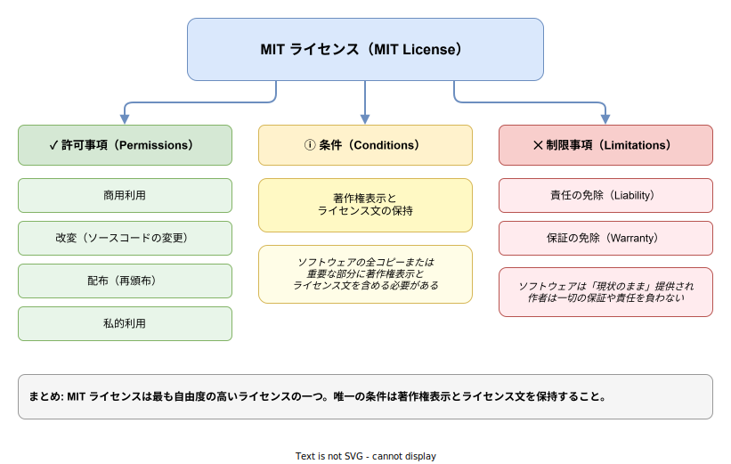
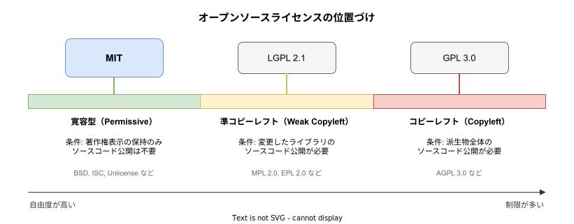

# MIT ライセンス: 基本

- 対象読者: ソフトウェアライセンスについて基礎知識がない開発者
- 学習目標: MIT ライセンスの内容を理解し、自分のプロジェクトに適切に適用できるようになる
- 所要時間: 約 20 分
- 対象バージョン: SPDX ID: MIT（バージョン管理なし）
- 最終更新日: 2026-04-12

## 1. このドキュメントで学べること

- MIT ライセンスが「何を許可し」「何を条件とし」「何を免除するか」を説明できる
- MIT ライセンスの全文を読み、各条項の意味を理解できる
- 自分のプロジェクトに MIT ライセンスを正しく適用できる
- 他の主要なオープンソースライセンスとの違いを説明できる

## 2. 前提知識

- ソフトウェア開発の基本的な経験
- 著作権の基本概念（ソースコードは作成者に著作権が帰属する）

## 3. 概要

MIT ライセンスは、1988 年にマサチューセッツ工科大学（MIT）で作成されたオープンソースソフトウェアライセンスである。最も広く使用されている寛容型（Permissive）ライセンスの一つであり、GitHub 上のオープンソースプロジェクトで最も採用率が高い。

このライセンスの特徴は極めてシンプルなことにある。利用者に対して商用利用・改変・配布・私的利用を含むほぼすべての行為を許可し、課す条件はたった一つ——著作権表示とライセンス文を保持することだけである。

Babel、.NET Runtime、Ruby on Rails といった著名プロジェクトが MIT ライセンスを採用している。

### ライセンス全文

```text
MIT License

Copyright (c) [year] [fullname]

Permission is hereby granted, free of charge, to any person obtaining a copy
of this software and associated documentation files (the "Software"), to deal
in the Software without restriction, including without limitation the rights
to use, copy, modify, merge, publish, distribute, sublicense, and/or sell
copies of the Software, and to permit persons to whom the Software is
furnished to do so, subject to the following conditions:

The above copyright notice and this permission notice shall be included in all
copies or substantial portions of the Software.

THE SOFTWARE IS PROVIDED "AS IS", WITHOUT WARRANTY OF ANY KIND, EXPRESS OR
IMPLIED, INCLUDING BUT NOT LIMITED TO THE WARRANTIES OF MERCHANTABILITY,
FITNESS FOR A PARTICULAR PURPOSE AND NONINFRINGEMENT. IN NO EVENT SHALL THE
AUTHORS OR COPYRIGHT HOLDERS BE LIABLE FOR ANY CLAIM, DAMAGES OR OTHER
LIABILITY, WHETHER IN AN ACTION OF CONTRACT, TORT OR OTHERWISE, ARISING FROM,
OUT OF OR IN CONNECTION WITH THE SOFTWARE OR THE USE OR OTHER DEALINGS IN THE
SOFTWARE.
```

## 4. 用語の整理

| 用語 | 説明 |
|------|------|
| 寛容型ライセンス（Permissive License） | 利用者に広い自由を与え、派生物に異なるライセンスを適用できるライセンス |
| コピーレフト（Copyleft） | 派生物にも同じライセンスの適用を義務付ける性質。MIT にはこの性質がない |
| SPDX 識別子 | ライセンスを一意に識別する標準的な短縮名。MIT の SPDX ID は `MIT` |
| 著作権表示（Copyright Notice） | ソフトウェアの著作権者と著作年を示す表記 |
| サブライセンス（Sublicense） | ライセンスで得た権利を第三者に付与すること |

## 5. 仕組み・アーキテクチャ

MIT ライセンスは 3 つの要素で構成される。許可事項（Permissions）、条件（Conditions）、制限事項（Limitations）である。



他の主要なオープンソースライセンスと比較すると、MIT ライセンスは最も制限が少ないカテゴリに属する。



## 6. 適用手順

### 6.1 必要なもの

- テキストエディタ
- プロジェクトのルートディレクトリへの書き込み権限

### 6.2 手順

1. プロジェクトのルートディレクトリに `LICENSE` ファイル（拡張子なし、または `.txt`）を作成する
2. MIT ライセンスの全文をコピーする
3. `[year]` を現在の年に、`[fullname]` を著作権者の名前に置き換える

### 6.3 確認

`LICENSE` ファイルの先頭が以下の形式になっていることを確認する。

```text
MIT License

Copyright (c) 2026 Your Name
```

## 7. 基本の使い方

### パッケージマネージャーでの宣言

```toml
# Cargo.toml でのライセンス宣言（Rust プロジェクト）

# パッケージ情報を定義するセクション
[package]
# パッケージ名を指定する
name = "my-project"
# バージョンを指定する
version = "0.1.0"
# SPDX 識別子でライセンスを宣言する
license = "MIT"
```

```json
// package.json でのライセンス宣言（Node.js プロジェクト）
{
  // パッケージ名を指定する
  "name": "my-project",
  // バージョンを指定する
  "version": "0.1.0",
  // SPDX 識別子でライセンスを宣言する
  "license": "MIT"
}
```

### 解説

- `LICENSE` ファイルはプロジェクトのルートに配置するのが慣例である
- パッケージマネージャーの設定ファイルでは SPDX 識別子（`MIT`）を使用して宣言する
- SPDX 識別子を使うことで、ツールによる自動的なライセンス検出が可能になる

## 8. ステップアップ

### 8.1 デュアルライセンス

一つのプロジェクトに複数のライセンスを適用することをデュアルライセンスと呼ぶ。Rust エコシステムでは `MIT OR Apache-2.0` の組み合わせが標準的である。Apache License 2.0 を併用する理由は、MIT ライセンスにない特許に関する明示的な許諾を補完するためである。

```toml
# Cargo.toml でのデュアルライセンス宣言

# パッケージ情報を定義するセクション
[package]
# MIT と Apache-2.0 のデュアルライセンスを SPDX 表現で宣言する
license = "MIT OR Apache-2.0"
```

### 8.2 第三者コードの取り込み

MIT ライセンスのコードを自分のプロジェクトに取り込む場合、著作権表示とライセンス文を保持する必要がある。一般的な方法は以下のとおりである。

- `THIRD_PARTY_LICENSES` ファイルに取り込んだコードの著作権表示とライセンス文を集約する
- ソースファイルのヘッダーに元の著作権表示を残す

## 9. よくある落とし穴

- **著作権表示の省略**: MIT ライセンスのコードを使用する際に LICENSE ファイルのコピーを忘れるとライセンス違反となる
- **プレースホルダーの未置換**: `[year]` や `[fullname]` をそのまま残すと著作権者が不明確になる
- **「何でもできる」という誤解**: 商用利用や改変は自由だが、著作権表示の保持は必須である
- **特許権の不在**: MIT ライセンスは特許に関する明示的な許諾を含まない。特許保護が必要な場合は Apache License 2.0 を検討する

## 10. ベストプラクティス

- `LICENSE` ファイルはプロジェクトのルートディレクトリに配置する
- パッケージマネージャーの設定ファイルでも SPDX 識別子でライセンスを宣言する
- 第三者のコードを取り込む場合は `THIRD_PARTY_LICENSES` に著作権表示を集約する
- 特許保護が必要な場合は `MIT OR Apache-2.0` のデュアルライセンスを検討する
- 著作権の年は最初のリリース年を記載し、毎年の更新は不要である

## 11. 演習問題

1. MIT ライセンスの全文を読み、「許可していること」「条件」「免除していること」をそれぞれ列挙せよ
2. 新規の Rust プロジェクトに MIT ライセンスを適用し、`LICENSE` ファイルと `Cargo.toml` を作成せよ
3. MIT ライセンスと GPL 3.0 の主な違いを 3 点挙げよ

## 12. さらに学ぶには

- Choose a License: https://choosealicense.com/
- SPDX License List: https://spdx.org/licenses/
- Open Source Initiative — MIT License: https://opensource.org/licenses/MIT

## 13. 参考資料

- Choose a License — MIT License: https://choosealicense.com/licenses/mit/
- GitHub choosealicense.com: https://github.com/github/choosealicense.com
- SPDX Specification: https://spdx.dev/specifications/
