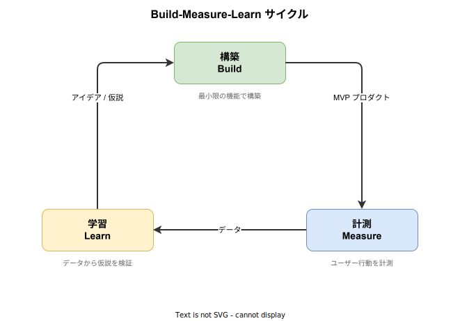
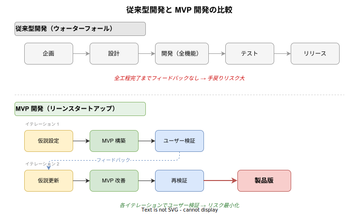

# MVP: 基本

- 対象読者: ソフトウェア開発に携わるエンジニア・プロダクトマネージャー
- 学習目標: MVP の概念と実践方法を理解し、プロダクト開発に適用できるようになる
- 所要時間: 約 25 分
- 対象バージョン: —（方法論のため特定バージョンなし）
- 最終更新日: 2026-04-12

## 1. このドキュメントで学べること

- MVP とは何か、なぜ必要かを説明できる
- Build-Measure-Learn サイクルの仕組みを理解できる
- 従来型開発と MVP 開発の違いを説明できる
- MVP を設計する際の判断基準を持てる

## 2. 前提知識

- ソフトウェア開発プロセスの基礎知識（要件定義・設計・実装・テスト）
- プロダクトやサービスの企画に関する基本的な理解

## 3. 概要

MVP（Minimum Viable Product、実用最小限の製品）は、最小限の機能でプロダクトをリリースし、ユーザーからのフィードバックをもとに改善を繰り返す開発手法である。Frank Robinson が 2001 年に提唱し、Eric Ries が著書「The Lean Startup」（2011 年）で体系化した。

従来の開発では、すべての機能を完成させてからリリースする。この方法では、市場やユーザーのニーズと合致しない製品を長期間かけて作ってしまうリスクがある。MVP はこのリスクを最小化するために、仮説を素早く検証する仕組みを提供する。

## 4. 用語の整理

| 用語 | 説明 |
|------|------|
| MVP（Minimum Viable Product） | ユーザーに価値を提供できる最小限の機能を持つ製品 |
| リーンスタートアップ（Lean Startup） | MVP を中心とした仮説検証型の起業・開発手法 |
| Build-Measure-Learn | 構築→計測→学習を繰り返す MVP の中核サイクル |
| ピボット（Pivot） | 検証結果をもとに、戦略や方向性を大きく転換すること |
| プロダクトマーケットフィット（PMF） | 製品が市場のニーズに適合し、持続的に成長できる状態 |
| 検証済み学習（Validated Learning） | 実際のユーザー行動データに基づいて得られた学び |
| 仮説（Hypothesis） | 検証すべき前提。「この機能があれば利用される」など |

## 5. 仕組み・アーキテクチャ

MVP 開発の中核は Build-Measure-Learn サイクルである。このサイクルを素早く回すことで、少ない投資で多くの学びを得る。

サイクルの各段階で行うことは以下のとおりである。

1. **構築（Build）**: 仮説を検証するための最小限のプロダクトを作る
2. **計測（Measure）**: ユーザーの行動データを収集する
3. **学習（Learn）**: データを分析し、仮説が正しかったかを判断する

このサイクルの所要時間が短いほど、リスクを抑えながら正しい方向へ進められる。

従来型の開発と比較すると、MVP 開発はフィードバックを得るタイミングが根本的に異なる。

従来型はリリースまでフィードバックを得られないが、MVP 開発では各イテレーションでユーザーの声を反映する。

## 6. 環境構築

MVP は方法論であるため、特定のソフトウェアのインストールは不要である。以下のツール群を活用すると効率的に MVP を構築・検証できる。

- **プロトタイピング**: Figma、Adobe XD（UI プロトタイプの作成）
- **計測・分析**: Google Analytics、Mixpanel（ユーザー行動の計測）
- **フィードバック収集**: ユーザーインタビュー、Google Forms（アンケート）

## 7. 基本の使い方

### 7.1 仮説を立てる

MVP の出発点は「検証可能な仮説」である。以下の形式で記述する。

> **[ターゲット]** は **[課題]** を抱えており、**[解決策]** を提供すれば **[期待する行動]** をとるだろう。

例: 「忙しい社会人は昼食選びに時間をかけたくないと思っており、近隣店舗からワンタップ注文できるアプリを提供すれば、週 3 回以上利用するだろう。」

### 7.2 MVP の範囲を決める

仮説の検証に必要な最小限の機能だけを含める。

| 判断基準 | 含める | 含めない |
|----------|--------|----------|
| 仮説の検証に必須か | 対象 | — |
| なくても価値を体験できるか | — | 対象 |
| 後から追加可能か | — | 対象 |

### 7.3 MVP の形態を選ぶ

| 形態 | 説明 | 適する場面 |
|------|------|------------|
| ランディングページ | 説明ページを公開し登録数で需要を測る | 市場ニーズの検証 |
| プロトタイプ | 動作するデモで操作感を確認する | UX の検証 |
| コンシェルジュ MVP | 人力でサービスを提供し価値を検証する | サービス価値の検証 |
| オズの魔法使い MVP | 裏側を人力運用し自動化されたように見せる | 技術実現前の価値検証 |
| 単機能アプリ | 核となる 1 機能だけを実装する | 技術的な仮説の検証 |

### 7.4 計測する

仮説に対応する指標を事前に定義し、データを収集する。意思決定に直結する指標を選ぶ。

| 指標の種類 | 例 | 特徴 |
|------------|-----|------|
| 行動指標（Actionable） | 継続率、コンバージョン率 | 意思決定に使える |
| 虚栄指標（Vanity） | 総ダウンロード数、PV 数 | 因果関係が不明確 |

### 7.5 次のアクションを決める

計測結果をもとに、以下のいずれかを判断する。

- **続行（Persevere）**: 仮説が支持された。同じ方向で機能を拡充する
- **ピボット（Pivot）**: 仮説が否定された。戦略や方向性を変更する
- **中止（Stop）**: 市場に見込みがないと判断し、撤退する

## 8. ステップアップ

### 8.1 MVP キャンバス

仮説・ターゲット・指標・MVP の形態を 1 枚にまとめるフレームワークである。チームで認識を揃える際に有効である。主な記入項目は、仮説、ターゲットユーザー、課題、MVP の形態、成功指標、学習目標である。

### 8.2 ピボットの類型

| 種類 | 説明 |
|------|------|
| ズームイン | 一機能を製品全体として独立させる |
| ズームアウト | 製品全体を、より大きな製品の一機能にする |
| 顧客セグメント | ターゲットの顧客層を変更する |
| 顧客ニーズ | 同じ顧客の別の課題に焦点を移す |
| チャネル | 製品の提供方法・販売チャネルを変更する |

## 9. よくある落とし穴

- **機能を詰め込みすぎる**: 「最小限」の定義が曖昧で結局フル機能を作ってしまう。仮説検証に不要な機能は排除する
- **計測指標を決めずに構築する**: 何を検証するか不明確だと、データが集まっても判断できない
- **ユーザーの声を聞かない**: 思い込みでサイクルを回しても検証済み学習にならない
- **ピボットを恐れる**: サンクコスト（埋没費用）に引きずられ、検証結果を無視して当初計画に固執する
- **品質を無視する**: 「最小限」は「低品質」ではない。価値を判断できる品質は確保する

## 10. ベストプラクティス

- 仮説は具体的・検証可能な形で記述する（「便利」ではなく「週 3 回以上利用する」）
- 1 つの MVP で検証する仮説は 1 つに絞る
- サイクル期間を事前に決め、期限内に必ず検証結果を出す（2〜4 週間が目安）
- 定量データ（行動ログ）と定性データ（インタビュー）を組み合わせる
- 「完璧な製品」ではなく「学びの最大化」を目的にする

## 11. 演習問題

1. 日常で感じている不便を 1 つ選び、MVP 仮説を「[ターゲット] は [課題] を抱えており…」の形式で記述せよ
2. その仮説に最適な MVP の形態を選び、理由を説明せよ
3. その MVP で計測すべき行動指標を 2 つ挙げ、選定理由を述べよ

## 12. さらに学ぶには

- Eric Ries「The Lean Startup」（2011）: MVP とリーンスタートアップの原典
- Ash Maurya「Running Lean」（2012）: MVP キャンバスの実践ガイド
- Steve Blank「The Four Steps to the Epiphany」（2005）: 顧客開発モデルの原典

## 13. 参考資料

- Eric Ries, "The Lean Startup", Crown Business, 2011
- Frank Robinson, "MVP and Five More Useful Startup Terms", SyncDev, 2001
- Steve Blank, "The Four Steps to the Epiphany", K&S Ranch, 2005
- Ash Maurya, "Running Lean", O'Reilly Media, 2012
