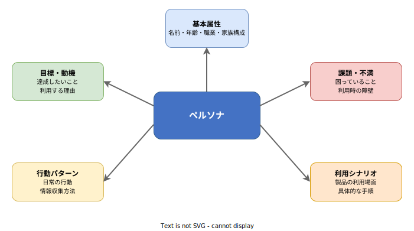

# ペルソナ: 基本

- 対象読者: ソフトウェア開発に携わるエンジニア・プロダクトマネージャー・デザイナー
- 学習目標: ペルソナの概念と作成方法を理解し、プロダクト開発に適用できるようになる
- 所要時間: 約 25 分
- 対象バージョン: —（方法論のため特定バージョンなし）
- 最終更新日: 2026-04-12

## 1. このドキュメントで学べること

- ペルソナとは何か、なぜ必要かを説明できる
- ペルソナの構成要素を理解できる
- ペルソナの作成手順を実践できる
- ペルソナを設計・開発に活用する方法を理解できる

## 2. 前提知識

- ソフトウェア開発プロセスの基礎知識（要件定義・設計・実装・テスト）
- ユーザー向けプロダクトの企画・設計に関する基本的な理解

## 3. 概要

ペルソナとは、実際のユーザー調査データに基づいて作成する架空のユーザー像である。Alan Cooper が 1999 年の著書「The Inmates Are Running the Asylum」で提唱した。

プロダクト開発では「ユーザーのためにつくる」と言いつつ、チーム内で想定するユーザー像がバラバラになりやすい。ペルソナはこの問題を解決する。具体的な名前・年齢・職業・目標・課題を持つ人物像を定義することで、チーム全員が同じユーザーを思い浮かべながら意思決定できるようになる。

ペルソナは「想像上のユーザー」ではない。インタビューやアンケートなどの実データに基づいて構築する点が、単なるターゲットユーザー記述との決定的な違いである。

## 4. 用語の整理

| 用語 | 説明 |
|------|------|
| ペルソナ（Persona） | ユーザー調査に基づく架空の代表的ユーザー像 |
| プライマリペルソナ | 設計上最も重要な対象ユーザー。製品の主要な意思決定基準となる |
| セカンダリペルソナ | プライマリの設計で概ね満足するが、追加要件を持つユーザー像 |
| アンチペルソナ | 明確に対象外とするユーザー像。設計の範囲を絞る目的で定義する |
| ユーザーセグメント | 共通属性でグループ化したユーザー群。ペルソナの素材となる |
| ユーザージャーニーマップ | ペルソナが製品を利用する一連の体験を時系列で可視化した図 |
| 共感マップ（Empathy Map） | ユーザーの思考・感情・行動を整理するフレームワーク |

## 5. 仕組み・アーキテクチャ

ペルソナ作成は調査から活用まで 4 つのフェーズで進行する。

調査で得たデータを分析し、共通パターンを抽出してペルソナを構成する。プロダクトの成長やユーザー層の変化に合わせて定期的に見直す。

ペルソナは以下の 5 つの要素で構成される。

各要素はユーザー調査から導き出す。推測や希望ではなく、データに裏付けられた内容を記載する。

## 6. 環境構築

ペルソナは方法論であるため、特定のソフトウェアのインストールは不要である。以下のツール群を活用すると効率的にペルソナを作成・管理できる。

- **調査**: Google Forms、Typeform（アンケート）、Zoom（リモートインタビュー）
- **分析**: Miro、FigJam（親和図法によるパターン抽出）
- **作成・共有**: Figma、Notion、Google Slides（ペルソナシートの作成と共有）

## 7. 基本の使い方

### 7.1 ペルソナシートのテンプレート

ペルソナは以下の形式で 1 人分を 1 シートにまとめる。

> **名前**: 田中 太郎（35 歳・男性）
> **職業**: IT 企業のプロジェクトマネージャー
> **家族構成**: 妻と 5 歳の子ども 1 人
>
> **目標**: チームの生産性を上げながら残業を減らしたい
> **課題**: タスク管理ツールが多すぎて情報が分散している
> **行動パターン**: 朝の通勤電車で Slack を確認、日中は会議が多く集中作業は夕方以降
> **利用シナリオ**: 朝の通勤中にスマートフォンでチーム全体の進捗を一覧確認し、問題があるタスクにコメントを残す

### 7.2 作成手順

1. **調査を実施する**: 5〜10 名のユーザーにインタビューし、行動・目標・課題を聞き取る
2. **パターンを抽出する**: 回答を分類し、共通する行動パターンや目標を見つける
3. **セグメントを定義する**: パターンに基づきユーザーを 2〜4 グループに分類する
4. **ペルソナを記述する**: 各セグメントの代表像を具体的な人物として記述する
5. **優先順位をつける**: プライマリペルソナ（最重要）を 1 人選定する

### 解説

ペルソナの数は 2〜4 人が目安である。多すぎると焦点がぼやけ、少なすぎるとユーザーの多様性を捉えられない。プライマリペルソナは必ず 1 人に絞る。設計上の判断が競合した場合、プライマリペルソナの体験を優先する。

## 8. ステップアップ

### 8.1 ペルソナの種類と使い分け

| 種類 | 目的 | 作成コスト |
|------|------|------------|
| プロトペルソナ | 調査前に仮説として素早く作る。後で検証・修正する | 低 |
| 定性ペルソナ | インタビュー中心の調査から作成。深い理解が得られる | 中 |
| 定量ペルソナ | 大規模アンケートや行動ログから統計的に作成する | 高 |

### 8.2 アンチペルソナの活用

アンチペルソナは「この製品の対象ではない」と明示するユーザー像である。例えば、プロ向けツールにおける「IT リテラシーが低い一般消費者」を定義することで、過度な初心者向け機能の追加を防げる。スコープの肥大化を防ぐ手段として有効である。

## 9. よくある落とし穴

- **データなしで作る**: 想像だけで作ったペルソナは実態と乖離し、誤った意思決定を招く
- **属性だけ並べる**: 年齢・職業のリストだけでは設計の判断基準にならない。目標と課題が核である
- **全員を満足させようとする**: ペルソナが 6 人以上になると優先順位がつかなくなる
- **作って放置する**: 市場やユーザー層の変化に合わせて更新しなければ古い前提で設計を続けることになる
- **チームに共有しない**: 作成者だけが知っていても意味がない。関係者全員で共有する

## 10. ベストプラクティス

- ペルソナは実際のユーザー調査データに必ず基づかせる
- プライマリペルソナは 1 人に絞り、設計判断の最優先基準とする
- ペルソナシートはチームの目につく場所（Notion、壁面、Figma）に常時掲示する
- 四半期に 1 回はペルソナの妥当性を検証し、必要に応じて更新する
- ユーザーストーリーやユーザージャーニーマップとセットで活用する

## 11. 演習問題

1. 自分が普段使っているアプリを 1 つ選び、その主要ユーザーのペルソナを 7.1 のテンプレート形式で記述せよ
2. 作成したペルソナに対するアンチペルソナを 1 人定義し、なぜ対象外とするか理由を述べよ
3. プライマリペルソナとセカンダリペルソナの設計要求が競合する具体例を 1 つ挙げ、どう判断すべきか説明せよ

## 12. さらに学ぶには

- Alan Cooper「About Face: The Essentials of Interaction Design」（2014、第 4 版）: ペルソナ手法の原典の発展版
- Kim Goodwin「Designing for the Digital Age」（2009）: ペルソナを含む包括的なデザインプロセス
- Jeff Gothelf, Josh Seiden「Lean UX」（2013）: リーン開発におけるプロトペルソナの活用

## 13. 参考資料

- Alan Cooper, "The Inmates Are Running the Asylum", Sams Publishing, 1999
- Alan Cooper, Robert Reimann, David Cronin, Christopher Noessel, "About Face: The Essentials of Interaction Design", 4th Edition, Wiley, 2014
- Kim Goodwin, "Designing for the Digital Age", Wiley, 2009
- Jeff Gothelf, Josh Seiden, "Lean UX", O'Reilly Media, 2013
- John Pruitt, Tamara Adlin, "The Persona Lifecycle", Morgan Kaufmann, 2006
