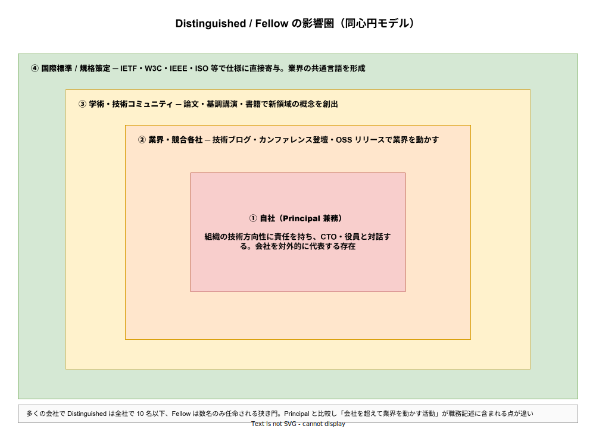

# エンジニアキャリアレベル: Distinguished / Fellow の詳説

- 対象読者: Distinguished / Fellow という職位が実際に何をしているのか知りたい読者、Principal から更にその先を目指す本人、Distinguished を評価・任命する立場の CTO・役員。
- 学習目標: Distinguished / Fellow が Principal とどう違うのかを説明できる。「業界レベルの技術的影響」という職務記述の具体内容を理解する。多くの会社で 10 名以下、Fellow は数名のみ任命される理由を把握する。Distinguished 特有の働き方（外部発信・標準化・学術接続）を認識できるようになる。
- 所要時間: 約 25 分
- 対象版/原著: 各社の最上位 IC 職位（Google Fellow L10、Amazon Distinguished Engineer L10、IBM Fellow、Microsoft Technical Fellow など）
- 最終更新日: 2026-04-19
- 関連: [エンジニアキャリアレベル: ジュニア・シニア・プリンシパル](./career-levels_junior-senior-principal.md)

## 1. このドキュメントで学べること

- Distinguished と Fellow の違い、および両者と Principal の違いを説明できる
- Distinguished が担う「業界レベルの影響」が具体的にどのような活動か列挙できる
- 多くの会社で Distinguished が全社で 10 名以下、Fellow は数名のみに限定される理由を理解できる
- Principal から Distinguished への質的な違い（自社 → 業界）を言語化できる
- Distinguished / Fellow に共通する「少数精鋭ゆえの属人性」を認識できる

## 2. 前提知識

- [Principal の詳説](./career-levels_principal.md) を読み、Principal の 4 チャネル（戦略・役員・文化・採用）を把握していること
- マスター版セクション 6.6 を押さえていること

## 3. 概要

Distinguished Engineer および Fellow は、IC ラダーの最終地点に位置する、業界レベルで技術的影響を及ぼす少数の IC である。Google Fellow、Amazon Distinguished Engineer、IBM Fellow、Microsoft Technical Fellow など、呼称は会社によって異なるが、共通するのは「会社を代表して業界・学術・標準化と対話する」という職務記述である。多くの会社で Distinguished は全社で 10 名以下、Fellow は数名のみに任命される極めて狭い層となる。

Distinguished と Fellow の区別は会社により異なる。一般的な傾向として、Distinguished は会社内で最上位の IC、Fellow はその中でも特に長期的・象徴的な貢献をした者に付与される「終身的」な最高位とされる。IBM Fellow は 1962 年に制度化されて以降、国際的な「IC の名誉称号」として扱われており、米国計算機学会（ACM）のフェローと並んで業界が最も高く評価する肩書の一つである。

この層の特徴は「職務記述が個別化している」点である。Junior から Principal まではラダーで標準化できるが、Distinguished / Fellow は「その人にしかできない貢献」を前提に任命されるため、二人の Distinguished が全く違う仕事をしていることも珍しくない。

## 4. 用語の整理

| 用語 | 説明 |
|------|------|
| Distinguished Engineer | 会社内で最上位の IC 職位の一つ。業界影響レベルで技術貢献する少数精鋭 |
| Fellow | Distinguished の中でも特に象徴的・長期的な貢献をした者に付与される最高位。終身的に扱われることが多い |
| ACM Fellow / IEEE Fellow | 学術・業界コミュニティが付与する名誉称号。Distinguished Engineer の多くがこれを兼ねる |
| 標準化団体 | IETF・W3C・IEEE・ISO・CNCF など、技術仕様を策定する国際組織。Distinguished が関与する場 |
| 基調講演 | 主要カンファレンスの大規模発表。Distinguished の代表的な対外発信手段 |
| 技術書籍 | 権威ある O'Reilly・Addison-Wesley 等の専門書籍。Distinguished が著者となることが多い |
| 終身的地位 | 業績によって一度任命されたら通常は降格されない性質。Fellow に顕著 |

## 5. 全体構造・関係図

Distinguished / Fellow の影響は、同心円状に広がる 4 つの圏で捉えられる。内側の「自社」は Principal と重複するが、その外側に「業界・競合各社」「学術・技術コミュニティ」「国際標準・規格策定」という 3 つの圏が Distinguished 固有の活動領域として広がる。Principal との決定的な違いはこの外側 3 圏の存在であり、Distinguished は「会社を超える」責任を持つ点で質的に異なる。

## 6. 主要な論点・構造

### 6.1 自社（Principal との兼務的機能）

Distinguished も自社の技術方向性には関与する。ただし Principal の「全社の判断責任を負う」立ち位置と異なり、Distinguished は「自社を超えた視点から自社に助言する」側面が強い。業界標準の動向を自社に持ち込み、自社の技術選定を業界観点で助言する立場となる。

### 6.2 業界・競合各社への影響

Distinguished は技術ブログ・カンファレンス登壇・OSS リリースを通じて業界全体に技術を広げる。例として、Google の SRE 本（Google 内部実践を業界標準化した書籍群）、Netflix の Chaos Engineering 手法、Facebook の Memcached 運用知見などがある。こうした発信は「会社の技術ブランド」と同時に「業界の共通語彙」を作り上げる。

### 6.3 学術・技術コミュニティへの寄与

Distinguished は学術論文の執筆、国際カンファレンスでの基調講演、専門書籍の著作を通じて新しい概念を業界に導入する。例として、Leslie Lamport の分散システム論文群、Jeff Dean の大規模システム論文群、Martin Fowler のアーキテクチャパターン書籍群がある。学術との接続は、Distinguished が博士号を持つケースが多い背景にもなっている。

### 6.4 国際標準・規格策定

最上位の Distinguished・Fellow は、IETF・W3C・IEEE・ISO・CNCF などの標準化団体に直接関与し、仕様策定に寄与する。Tim Berners-Lee（W3C の創設・HTML 標準化）や Vint Cerf（IETF・TCP/IP 標準化）のような事例は特別だが、各社の Distinguished 級の何割かは何らかの標準化活動に参加している。

## 7. 読解のポイント

- **任命の基準は職務ではなく業績** — Distinguished / Fellow は「こういう仕事をする職位」ではなく「こういう業績を残した人への称号」としての性質が強い。先に業績があり、後から任命される順序である
- **Principal は目指せるが Distinguished は目指せない** — Principal は計画的なキャリア設計で到達可能だが、Distinguished は本質的に偶発的である。業界レベルの影響を与える機会は計画できない
- **終身的に扱われる** — 一度 Distinguished / Fellow に任命されると通常は降格されない。長期貢献への報酬という性質が強い
- **属人的ゆえに転職が難しい** — Distinguished の仕事はその会社固有の文脈（歴史・制度・ネットワーク）に依存する。転職すると同等ポジションが空いていないケースが多く、流動性が低い

## 8. 発展的トピック

### 8.1 Distinguished と学術キャリアの類似性

Distinguished の働き方は、大学の教授職（特に上位の Distinguished Professor）と構造的に似ている。長期テーマへの自由度・外部発信・後進育成・標準化への関与という点で、企業 IC と学術 IC のあいだに構造的対応が見られる。実際、Distinguished から大学教授に転じる、あるいは教授から企業 Fellow に転じるケースは珍しくない。

### 8.2 Distinguished 候補の育成

Distinguished は「育成する」というより「育つのを助ける」性質が強い。会社としては、Principal クラスに対して外部発信の時間・予算・ネットワークを提供することで、業界影響力の発揮を助ける。OSS 活動・書籍執筆・カンファレンス登壇への社内支援が、Distinguished 候補の育成に相当する。

## 9. よくある誤解

- **誤解 1: Distinguished は Principal の上位互換** — 半分正しく、半分違う。自社内での権限は Principal と同等以下のこともある。Distinguished の独自性は「会社を超える影響力」にある
- **誤解 2: Distinguished になれば年収が青天井** — 給与はある程度頭打ちする（多くは Principal と同水準か、やや上）。ただし株式・ボーナス・外部活動の収益（書籍印税・講演料）で実質収入が大きく広がる
- **誤解 3: 技術極めれば Distinguished になれる** — 技術深度だけでは到達しない。外部発信・コミュニティ接続・業界貢献が条件となる
- **誤解 4: Distinguished / Fellow は全社共通の職位** — 違う。採用しない会社も多く、特に中小企業では Principal が最上位である

## 10. 現代的な位置づけ・影響

2020 年代の Distinguished は、AI・量子計算・分散システムなどの破壊的技術領域で、業界標準の形成に直接影響する立場となっている。Anthropic・OpenAI・Google DeepMind の上級研究者や、クラウドベンダの最上位 IC は、論文発表と製品実装を並行させることで、学術と産業の境界を事実上なくしている。この流れは Distinguished の役割を「産学接続のハブ」として位置付け直しつつある。

一方、Distinguished 層の属人性の高さは組織運営上のリスクでもある。Distinguished が退職すると業界ネットワーク・標準化関与・技術ブランドが同時に失われるため、多くの会社が Distinguished の後継育成を明示的な経営課題として扱うようになった。

## 11. 演習問題

1. 自社が所属する業界で Distinguished / Fellow 相当の人物を 3 名挙げよ。その人たちの代表的な業績（書籍・論文・標準化・OSS）を具体的に書き出せ。挙がらない場合、業界ネットワーク観察が不足している
2. 自分のキャリアを Distinguished まで伸ばすと仮定し、10 年後にどの領域で業界影響を持ちたいかを 300 字程度で書き出せ。実現可能性より、その方向性に心から興奮するかを重視せよ
3. 自社で直近 5 年に外部発信（カンファレンス登壇・書籍・OSS）した Principal 級エンジニアを列挙し、会社として Distinguished 候補の育成を意識的に行えているかを評価せよ

## 12. さらに学ぶには

- マスター版: [エンジニアキャリアレベル: ジュニア・シニア・プリンシパル](./career-levels_junior-senior-principal.md)
- Will Larson『Staff Engineer』の Distinguished 事例章
- ACM Fellows・IEEE Fellows のプロフィール
- IBM Fellows・Google Fellows の公式発表

## 13. 参考資料

- Will Larson. *Staff Engineer: Leadership beyond the management track*. 2021
- IBM Fellows Program 公式資料
- ACM Fellows Directory
- Amazon Distinguished Engineers — 公開情報
- Martin Fowler, Leslie Lamport 等の個人公開資料
