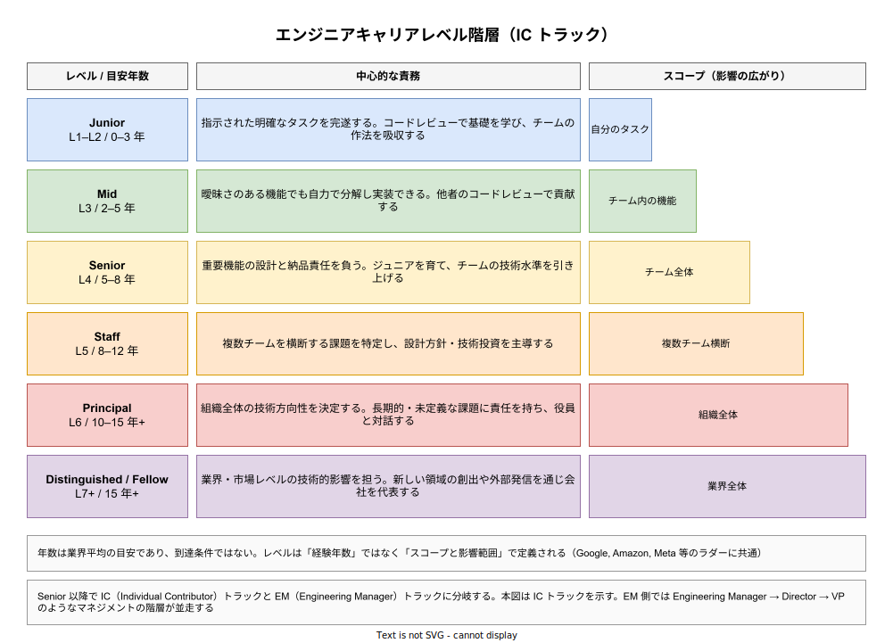
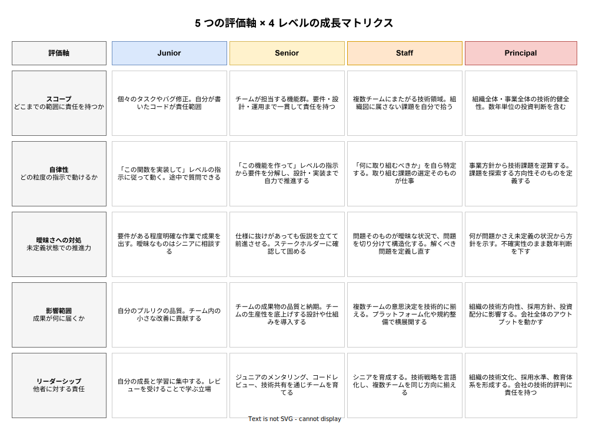

# エンジニアキャリアレベル: ジュニア・シニア・プリンシパル

- 対象読者: ソフトウェアエンジニアとして 1 年以上の業務経験を持つが、職位体系や昇進の基準を体系的に知らない読者。非技術系マネージャで採用要件や評価に関わる読者。
- 学習目標: ジュニア／シニア／プリンシパルを含むエンジニア職位階層の共通モデルを説明でき、「何年」ではなく「どんなスコープと影響範囲」でレベルが定まるかを理解し、自分または部下の次のレベルへのギャップを評価軸で特定できるようになる。
- 所要時間: 約 40 分
- 対象版/原著: 業界標準化された共通モデル（Google, Amazon, Meta, Microsoft 等の公開・漏洩された Career Ladder および Will Larson『Staff Engineer: Leadership beyond the management track』2021 年刊に依拠）
- 最終更新日: 2026-04-19

## 1. このドキュメントで学べること

- 「Junior／Mid／Senior／Staff／Principal／Distinguished」という 6 段階モデルの各段階が、何を期待される役割かを説明できる
- レベルを分ける本質が「経験年数」ではなく「スコープ」と「影響範囲」であることを理解できる
- 同じ「シニアエンジニア」という肩書でも、会社規模や業界によって期待水準が大きく異なる理由を説明できる
- IC（Individual Contributor）トラックと EM（Engineering Manager）トラックの分岐点を把握できる
- Will Larson が提唱する Staff エンジニアの 4 アーキタイプ（Tech Lead／Architect／Solver／Right Hand）を理解できる

## 2. 前提知識

- ソフトウェア開発の基本的な業務サイクル（設計・実装・レビュー・デプロイ・運用）が何であるかが分かっていること
- 「コードレビュー」「オンコール」「設計ドキュメント」といった開発現場の基本用語が分かっていること
- 本ドキュメントは日本企業・欧米企業の両方で流通している共通語彙を扱うため、英語の職位名（Junior, Senior 等）に抵抗がないこと

## 3. 概要

エンジニアキャリアレベルとは、ソフトウェアエンジニアという職種のなかに設けられた職位の段階である。ジュニア・シニア・プリンシパルといった呼称は、単に「勤続年数が多い／少ない」を示すラベルではなく、「どの範囲の意思決定と成果に責任を負うか」を規定する設計図である。給与・評価・昇進・採用要件・社内発言力のすべてがこのレベルに紐づくため、キャリア設計と組織設計の両面で中核を成す概念となっている。

このレベルモデルは一社が発明したものではない。Google が L3（Software Engineer）から L10（Senior Fellow）までの IC ラダーを社内で運用し、Amazon が SDE I（L4）から Distinguished Engineer（L10）までを定めるなかで、業界標準として「Junior／Mid／Senior／Staff／Principal／Distinguished」という 6 段階の共通語彙が形成された。本ドキュメントはこの共通モデルを扱う。ただし各社のレベル番号（L3, L4…）や年収テーブルは会社ごとに大きく異なり、同じ「シニア」でもスタートアップと FAANG では要求水準が 1 段階以上ずれることがある点に注意する必要がある。

共通モデルが合意しているのは次の一点である。レベルは「何年やったか」ではなく「どれだけ広く、どれだけ曖昧な、どれだけ長期的な問題に責任を持てるか」で決まる。これを **スコープ** と **影響範囲** と呼ぶ。年数は目安にすぎず、同じ 5 年目でも Mid に留まる者と Senior に到達する者が共存する。

## 4. 用語の整理

| 用語 | 説明 |
|------|------|
| IC（Individual Contributor） | 直接的な部下を持たず、自分自身の技術的アウトプットで価値を出す立場。Senior 以降もコードを書き続ける道 |
| EM（Engineering Manager） | 人・組織に責任を持つマネジメント職。評価・採用・1on1 が主業務となる |
| スコープ（Scope） | その人の判断が及ぶ範囲。個人タスク → チーム → 複数チーム → 組織 → 業界 の順に広がる |
| 影響範囲（Impact） | 成果が誰に何の形で届くか。自分のコード → チームの生産性 → 組織の方向性 の順に広がる |
| 曖昧性（Ambiguity） | 課題定義がどれだけ未定義のまま着手を求められるか。上位レベルほど曖昧さが大きい |
| Staff+ | Staff 以上の IC 全般（Staff／Senior Staff／Principal／Distinguished／Fellow）を指す業界用語 |
| Career Ladder（キャリアラダー） | 各レベルの期待役割を文書化した社内基準。Rent the Runway, CircleCI 等が公開している |
| レベル番号（L3, L4…） | 各社が付与する数値。Google L5 ≈ Senior、L6 ≈ Staff が相場だが会社ごとに異なる |
| タイトルインフレ | 採用競争で肩書を前倒しに付ける現象。スタートアップの「シニア」が大企業の Mid に相当する等のずれを生む |

## 5. 全体構造・関係図

6 段階のレベルは縦に並ぶ階層であり、同時に「スコープの拡大」という横方向の帯でもある。次の図は 6 レベルを縦に積み上げ、右側にスコープの広がりを可変幅の帯で示した。帯が広がるほど、その人の意思決定が届く範囲が広いことを意味する。年数は業界平均の目安であり、昇進条件そのものではないことに注意する。

## 6. 主要な論点・構造

レベル間の違いは複数の評価軸の組み合わせで生じる。軸ごとにレベルを横並びで見ると、各レベルで何が質的に変わるかが見えやすくなる。次の図は 5 つの評価軸（スコープ／自律性／曖昧さへの対処／影響範囲／リーダーシップ）と 4 つの代表レベル（Junior／Senior／Staff／Principal）のマトリクスである。Mid と Distinguished を省いたのは、Mid は Junior から Senior への過渡段階であり、Distinguished は Principal の延長線上で質的に大きな跳躍がないためである。

### 6.1 Junior（L1–L2 / 0–3 年）

ジュニアエンジニアは、与えられた明確なタスクを完遂することで価値を出す段階である。仕様が固まった関数の実装、既存テストケースの追加、軽度のバグ修正などが主な仕事となる。コードレビューは受ける立場であり、そのフィードバックを通じてコードベースの作法・命名規則・テストのかけ方を学ぶ。この段階で重要なのは「わからないことを質問できる」態度であって、自力で全てを解決することではない。

### 6.2 Mid（L3 / 2–5 年）

ミッドレベルは、Junior と Senior のあいだの実働部隊である。仕様に多少の曖昧さがあっても、仮説を立てて実装を進められる。他者のコードレビューに実質的なフィードバックを返せるようになる。小さな機能なら設計から着手できるが、組織横断の判断やアーキテクチャレベルの設計はまだシニアに委ねる。日本企業では Mid を明示的に設けず、Junior の次を Senior と呼ぶケースも多い。

### 6.3 Senior（L4 / 5–8 年）

シニアは、チーム全体の成果物に対して技術的責任を負う段階である。大きな機能の設計と納品をリードし、他のエンジニアに対するメンタリング・コードレビューを通じてチーム全体の技術水準を引き上げる。要件がある程度曖昧でも、プロダクトマネージャと合意しながら前進させられる。業界的には「シニアが一人いれば機能の設計と実装が回る」ことが到達の目安とされる。

Will Larson は、**Senior から Staff への跳躍は IC トラックで最も難しい一段** だと指摘している。理由は、チーム内で最強のエンジニアになる（Senior）ことと、チーム外に影響を及ぼす（Staff）ことは質的に異なる能力だからである。統計的には Staff まで到達する IC は全エンジニアの約 1 割とされる。

### 6.4 Staff（L5 / 8–12 年）

スタッフエンジニアは、単一チームの枠を超えて働く IC である。組織図のどのチームにも属さない「隙間の課題」を自分で拾い、複数チームの設計判断を揃え、技術投資の方向性を決める。「何に取り組むべきか」を自ら特定するところから仕事が始まる点が Senior との最大の違いである。スタッフは直接の部下を持たないが、自分より若いシニアを育成し、文書化とレビューで組織に影響を及ぼす。

### 6.5 Principal（L6 / 10–15 年+）

プリンシパルエンジニアは、組織全体の技術方向性に責任を持つ。数年単位の投資判断、採用基準の策定、競合分析、CTO や VPE（VP of Engineering）との対話が主業務となる。何が問題かすら未定義の状態から方針を示すことが期待される。プリンシパルのアウトプットはもはやコードではなく、設計ドキュメント・技術戦略ペーパー・組織体制の提案が中心となる。なお Principal は会社によっては Staff と Distinguished の中間に置かれ、Senior Staff → Principal → Distinguished という 3 段構成を採る場合もある。

### 6.6 Distinguished / Fellow（L7+ / 15 年+）

この層は業界レベルで技術的影響を及ぼすごく少数の IC である。新しい技術領域の創出、国際標準化活動、学術論文・書籍の執筆、外部カンファレンスでの基調講演などを通じて会社を外部に代表する。Amazon の Distinguished Engineer や IBM の Fellow が代表例である。多くの会社では Distinguished は全社で 10 名以下、Fellow は数名しか任命されない狭き門である。

## 7. 読解のポイント

- **年数ではなくスコープで読む**: 「5 年やったからシニア」ではない。5 年間ジュニア相当のタスクだけをこなしてきた人は Mid 止まりであり、逆に 3 年で Senior に到達する人もいる。昇進はレベルに対応するスコープで成果を出し続けることで初めて承認される
- **会社規模で基準がずれる**: スタートアップ 30 人規模の「シニア」は大企業の Mid〜Senior 境界に相当することが多い。逆に FAANG の Senior は他社の Staff 相当の責任を負う。採用・転職の際はレベル名だけでなく「具体的に何をしてきたか」で判断する必要がある
- **IC トラックと EM トラックは同格**: Senior 以降、多くの会社で IC（技術専門家）と EM（マネジメント）の 2 トラックが並走する。Staff ≒ Engineering Manager、Principal ≒ Director、Distinguished ≒ VP がおおむね等価とされ、報酬も同水準に設計される。どちらが上というものではない
- **Staff 以降の評価は数値化しにくい**: ジュニアはチケット消化数やコード行数で見える成果が出るが、Staff 以降は「何をやらないかを決めた」「停滞していた意思決定を前に進めた」などの成果が中心となる。そのため **ナラティブ（物語）による自己評価** が重要になる

## 8. 発展的トピック

### 8.1 Staff+ のアーキタイプ（Will Larson）

Will Larson は『Staff Engineer』のなかで、Staff 以上の役割を 4 つのアーキタイプに分類した。同じ「スタッフエンジニア」という肩書でも、実際にやっていることがまったく異なるため、単一イメージで捉えると認識を誤る。

| アーキタイプ | 中心的な役割 | 典型的な場面 |
|---|---|---|
| Tech Lead | 単一チームあるいは複数チーム群を率い、設計の複雑性を引き受けて前に進める | プロダクトの新機能群を責任持って出す |
| Architect | 特定の技術領域（例: データ基盤, 認証）の品質と方向性に責任を持つ | 認証基盤の刷新を数年スパンで主導 |
| Solver | 既存チームで解けない困難課題に投入される遊軍的存在 | 経営課題化した大規模障害の根本対応 |
| Right Hand | 組織リーダー（VPE・CTO）の分身として意思決定と実行を補佐する | 役員の参謀として複数組織を束ねる |

### 8.2 IC トラックと EM トラックの分岐

Senior 前後でキャリアは IC と EM に分岐する。この分岐は「技術が好きか／人が好きか」の個人的選好だけでなく、会社の事業特性にも依存する。研究開発型・プラットフォーム型の会社では IC の層が厚く、受託開発型・大規模運用型の会社では EM の層が厚くなる傾向がある。一度 EM に移った後で IC に戻る「行ったり来たり」も一般化しており、一方通行の道ではない。

## 9. よくある誤解

- **誤解 1: 年数で自動的に上がる** — 実際には各レベルの期待役割を満たす成果を継続的に出し、昇進ルーブリック（評価基準）を上長と合意したうえで昇進する。在籍年数はむしろ「停滞」のシグナルとして扱われる場合がある
- **誤解 2: シニアはどの会社でも同じ水準** — シニアの水準は会社の規模・成熟度・採用難易度で 1〜2 段階ずれる。肩書だけで転職先を選ぶと期待値のズレが深刻な失敗につながる
- **誤解 3: Principal ≒ CTO** — Principal は IC トラックの上位であり、直接の部下を持たない。CTO は役員ポジションでありマネジメント責任を負う。両者は隣接するが別物である
- **誤解 4: IC は EM より下** — 多くの大企業では Staff = EM、Principal = Director の等価関係が明示されている。給与も同水準に設計され、IC のほうが報酬で上回るケースも珍しくない
- **誤解 5: コードを書くのはジュニアだけ** — Staff まではコードに触れるのが通常。Principal でも技術判断の根拠としてプロトタイプを書くことは残る。「偉くなるほどコードを書かない」は正確ではない

## 10. 現代的な位置づけ・影響

2020 年代に入り、Will Larson『Staff Engineer』（2021）と Tanya Reilly『The Staff Engineer's Path』（2022）の刊行を境に、「マネージャにならずに技術で上り詰める道」が明示的に言語化された。それ以前は Staff+ の仕事は暗黙知として個人の中に閉じていたが、アーキタイプ化・文書化が進んだことで、中堅エンジニアが自らのキャリア設計を描きやすくなった。

一方で、「シニアエンジニアの定義が会社ごとにバラバラである」という構造問題は解消されていない。これは levels.fyi のようなレベル対応表サイトが存在理由を持つ背景でもある。採用・評価・転職の場面では、肩書を固定値として扱わず、担当してきたスコープと影響範囲で人を評価する姿勢が一般化しつつある。

## 11. 演習問題

1. 自分または自社の代表的なエンジニア 3 名を選び、セクション 6 の図のどのレベルに当てはまるかを評価軸別（スコープ／自律性／曖昧性／影響範囲／リーダーシップ）に採点してみよ。軸ごとにレベルがずれる場合、それは何を意味するか考えよ
2. 「在籍 8 年の Mid」と「在籍 3 年の Senior」が社内にいたとき、何がこの差を生んだか仮説を 3 つ挙げよ
3. Staff から Principal に昇進しようとしている知人がいると仮定し、どの評価軸で成長が必要かを、このドキュメントの軸に基づいて助言文として 300 字程度にまとめよ
4. 自社のキャリアラダーが未整備だと仮定し、Junior／Senior／Staff の 3 レベルを区別する最小のルーブリック（各 100 字程度）を書き出してみよ

## 12. さらに学ぶには

- Will Larson, Tanya Reilly 他『Staff Engineer: Leadership beyond the management track』— Staff+ 層の役割定義の基本書
- Tanya Reilly『The Staff Engineer's Path』— Staff エンジニアの日々の仕事の実像を解説
- StaffEng.com — Will Larson らによる Staff+ インタビュー集と無償ガイド
- levels.fyi — 各社のレベル対応表と報酬データベース
- 社内キャリアラダー公開例: Rent the Runway, CircleCI, Monzo, Square 等の GitHub / ブログ

## 13. 参考資料

- Will Larson. *Staff Engineer: Leadership beyond the management track*. 2021. <https://staffeng.com/book/>
- StaffEng — About. <https://staffeng.com/about/>
- Staff archetypes — <https://staffeng.com/guides/staff-archetypes/>
- Indeed Career Advice. Understanding the 10 Career Levels for Software Engineers. <https://www.indeed.com/career-advice/finding-a-job/engineer-level>
- Terminal.io. Leveling Up: Defining the Ladder of Software Engineer Levels. <https://www.terminal.io/engineers/blog/defining-the-ladder-of-software-engineer-levels>
- ShiftMag. Staff, Principal, Distinguished Engineer Roles. <https://shiftmag.dev/staff-principal-distinguished-engineering-career-levels-explained-3565/>
