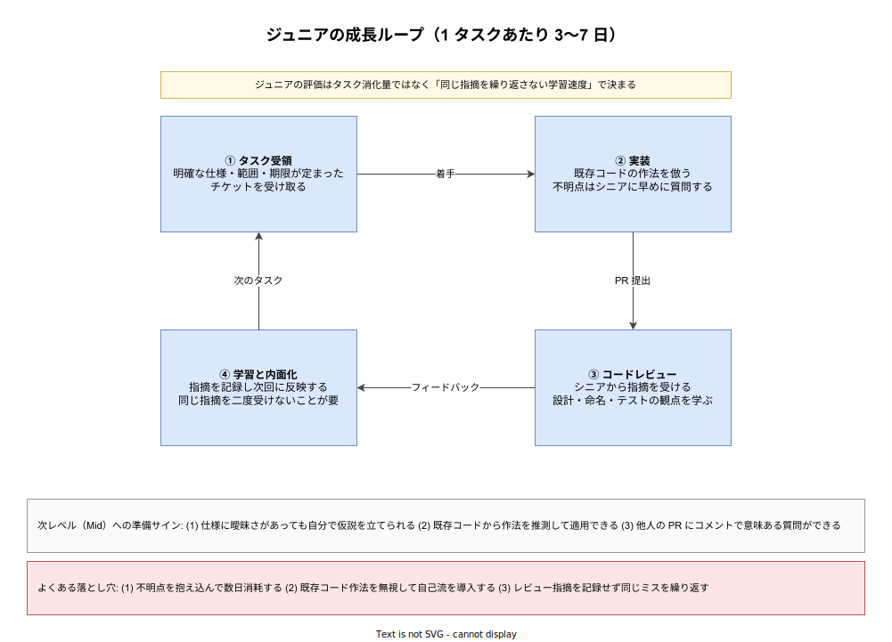

# エンジニアキャリアレベル: Junior の詳説

- 対象読者: ソフトウェアエンジニアとして採用された直後〜3 年程度の本人、および Junior を採用・育成する立場の読者。
- 学習目標: Junior 等級の日々の仕事の実像を理解し、評価される観点・陥りがちな落とし穴・Mid への移行サインを具体的に説明できるようになる。
- 所要時間: 約 25 分
- 対象版/原著: 業界共通キャリアラダー（Google L3, Amazon SDE I, Meta E3 相当）および Rent the Runway・CircleCI 等の公開ラダー
- 最終更新日: 2026-04-19
- 関連: [エンジニアキャリアレベル: ジュニア・シニア・プリンシパル](./career-levels_junior-senior-principal.md)

## 1. このドキュメントで学べること

- Junior の 1 日・1 週間の時間配分がどのようなものかを説明できる
- Junior の評価が「コード行数」や「タスク消化数」ではなく「学習速度」で決まる理由を理解できる
- Junior がやりがちな 3 大失敗（抱え込み／自己流／指摘の使い捨て）を回避できる
- Mid への移行準備が整ったサインを 3 つ以上挙げられる

## 2. 前提知識

- ソフトウェアエンジニアとしての実務（PR の作成、コードレビュー、チケット管理）に触れたことがあること
- マスター版の [ジュニア・シニア・プリンシパルとは](./career-levels_junior-senior-principal.md) のセクション 6.1 を読んでおくと、本ドキュメントの位置付けが明確になる

## 3. 概要

Junior は「業務としてソフトウェアを書く」ことを始めた段階である。学生時代の個人開発と最大に違うのは、自分のコードが他人に読まれ、使われ、運用されるという事実である。このため Junior のコアタスクは「動くコードを書く」ことではなく「既存システムとチームの作法の中で動くコードを書けるようになる」ことである。

多くの企業で Junior は Google L3 / Amazon SDE I / Meta E3 相当に位置付けられる。期間としては入社〜2 年程度、長くて 3 年が目安となる。3 年経っても Junior に留まっている場合、評価側は「成長が停滞している」というシグナルとして扱うことが多い。これは冷たい判定ではなく、Junior の期間は「まだ保護されている」期間であり、その保護を長く必要とする状態は本人にとっても不利という背景がある。

## 4. 用語の整理

| 用語 | 説明 |
|------|------|
| PR（Pull Request） | 変更をマージする前にレビューを受けるための提案単位 |
| オンコール（On-call） | 障害発生時に対応する当番制の運用業務。Junior は通常シャドウから参加する |
| ペアプロ／モブプロ | 複数人で 1 画面を見ながらコードを書く学習効率の高い開発手法 |
| シャドウ | 先輩の業務に付き添って観察・補助で学ぶ OJT 形式 |
| ブロッカー | 自分の作業が進まなくなっている原因。Junior は早期にエスカレーションすることが期待される |
| タスクチケット | 作業単位の管理票。Junior のタスクは範囲と期限が明確なものが選ばれる |

## 5. 全体構造・関係図

Junior の日々は「タスクを受け取り → 実装し → レビューを受け → 学ぶ」という 4 段のループで構成される。このループを高速かつ質の高い形で回し続けることが、Junior 期間における唯一で最大の仕事である。次の図は 4 段ループと、各段で注意すべきポイント、よくある落とし穴を合わせて示したものである。

## 6. 主要な論点・構造

### 6.1 日々の時間配分

Junior の 1 週間は、典型的には実装 50%・学習 20%・コードレビュー対応 15%・ミーティング 10%・その他 5% 程度に配分される。注目すべきは「学習」が業務時間として 20% 前後も確保される点である。これは会社が Junior に投資している時間であり、勉強会参加・ドキュメント通読・OJT のシャドウなど、短期的な成果が出ない活動が明示的に認められている。

### 6.2 評価される観点

Junior の評価は「タスクをいくつ完了したか」ではなく「同じ指摘を繰り返さない学習速度」である。例えば命名規則の指摘を受けたら、次回以降のコードでその指摘を自動的に適用できるようになる、というのが一段の成長である。これを測るため、レビュアは「過去に指摘した内容が新しい PR に現れていないか」を暗黙にチェックしている。

コード行数・PR 数は補助指標であり、主指標ではない。コード行数が多くても同じバグを繰り返すエンジニアは評価されず、コード行数が少なくても指摘がどんどん減っていくエンジニアは高評価を得る。

### 6.3 質問の作法

Junior に期待される最大の行動は「早く質問する」ことである。目安として、30 分調べて手がかりがつかめない場合は先輩に質問する、というルールを持つチームが多い。質問の作法として以下が重要となる。

- 既に試したことを書く（「こう試したがうまくいかない」）
- エラーメッセージや再現手順を具体的に添える
- 期待している動作と実際の動作の差を明示する
- 推測している原因があれば添える

この作法を身につけた Junior は、半年もしないうちに Mid レベルの質問力に到達する。

## 7. 読解のポイント

- **「Junior だから許される」期間は短い** — 会社側の保護期間は 1〜2 年と短い。期間内に学習ループを回しきることが最優先で、期間外では保護が外れて Mid の基準で評価される
- **学習は業務時間内に行う** — Junior が自宅学習で差をつけようとするのはアンチパターンに近い。業務時間内にシャドウ・ペアプロ・勉強会を組み込むほうが学習効率が高く、評価にも直結する
- **「完璧な PR」より「早い PR」** — Junior の PR は指摘前提である。完璧を目指して 1 週間抱え込むより、7 割で早く出してレビューから学ぶ方が成長が速い

## 8. 発展的トピック

### 8.1 インターンから Junior への移行

インターン経験者は学生時代にすでにチーム開発の作法を学んでおり、Junior としての立ち上がりが 3〜6 か月早いケースが多い。インターン期間は「業務学習の前倒し」として機能する。

### 8.2 未経験採用と Junior 期間の延長

非情報系学部出身・スクール卒の採用枠では、Junior 期間が 2 年から 3 年に延長されることがある。これは学習の絶対量が不足している状態からスタートするためで、減点ではなく現実的な投資設計である。

## 9. よくある誤解

- **誤解 1: タスクを早く終えるほど高評価** — 速度より質、質より学習定着度が優先される。バグを量産しながらタスクを消化する Junior は評価されない
- **誤解 2: 質問すると評価が下がる** — 逆である。質問しない Junior は「ブロックされているのを隠すリスク」として評価を下げる
- **誤解 3: Junior は意見を持つべきでない** — 意見は持ってよい。ただし意見の根拠を「既存コードベースの実態」と「公式ドキュメント」の両方で裏付けることが求められる

## 10. 現代的な位置づけ・影響

2020 年代以降、生成 AI の登場により Junior の仕事の性質は変化しつつある。定型的な実装タスクは AI 補助で加速できるようになったため、Junior に期待される価値が「手を動かす速度」から「AI 出力のレビュー能力と学習能力」にシフトしている。このため Junior 期間においても、コード生成ツールが出したコードを読んで妥当性を判断する力を早期に身につけることが有利に働く。

## 11. 演習問題

1. 直近 1 か月の自分の PR を 5 つ選び、受けた指摘を分類せよ。同じ分類の指摘が 3 回以上出ている場合、それは未内面化のサインである。具体的な対策を 2 つ書き出せ
2. 自分のチームの Senior が書いた PR を 3 つ読み、自分の PR と何が違うかを 5 点以上挙げよ。違いは設計・命名・テスト・コメント・コミット粒度のいずれかに大別できるはずである
3. 次の 1 週間で新しく質問する回数を数えよ。ゼロに近い週は赤信号である。目安としてインターン〜入社 1 年目なら週 10 回以上は妥当範囲とされる

## 12. さらに学ぶには

- マスター版: [エンジニアキャリアレベル: ジュニア・シニア・プリンシパル](./career-levels_junior-senior-principal.md)
- Mid への移行: [エンジニアキャリアレベル: Mid の詳説](./career-levels_mid.md)
- Julia Evans 『How to ask good questions』 — 質問の作法に関する実用的ガイド
- Camille Fournier 『The Manager's Path』 ch.1 — Junior 側から見たマネージャとの関係

## 13. 参考資料

- Rent the Runway Engineering Ladder（公開ラダー）
- CircleCI Engineering Competency Matrix
- Will Larson. *An Elegant Puzzle: Systems of Engineering Management*. 2019
- Indeed Career Advice. Software Engineer Levels. https://www.indeed.com/career-advice/finding-a-job/engineer-level
