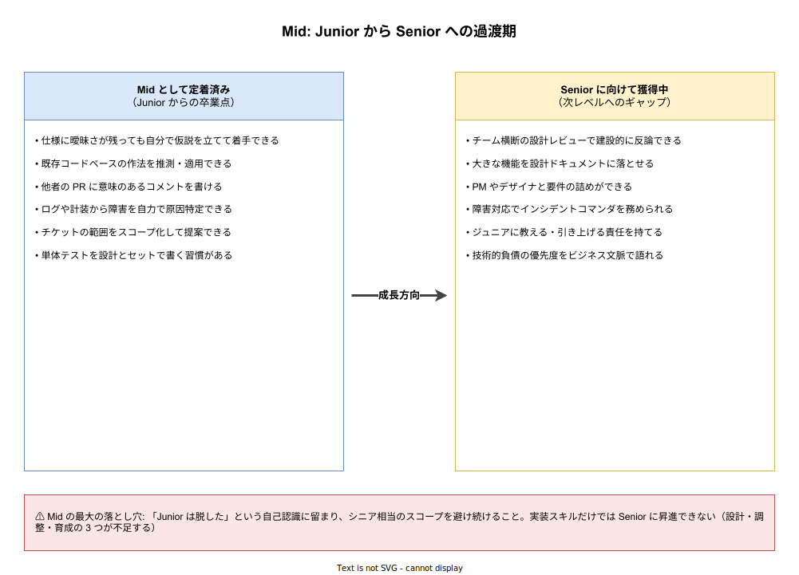

# エンジニアキャリアレベル: Mid の詳説

- 対象読者: Junior を卒業しつつある／卒業した本人、Mid 相当のメンバーを抱えるチームリーダー、採用でレベル判定を行う読者。
- 学習目標: Mid 等級の過渡期としての性質を理解し、Junior からの卒業点と Senior への未達点を具体的に言語化できるようになる。Mid に固有のキャリア停滞リスク（タイトルインフレ・実装マシン化）を認識し対処できる。
- 所要時間: 約 25 分
- 対象版/原著: 業界共通キャリアラダー（Google L3 相当、Amazon SDE II 相当、Meta E4 相当）
- 最終更新日: 2026-04-19
- 関連: [エンジニアキャリアレベル: ジュニア・シニア・プリンシパル](./career-levels_junior-senior-principal.md)

## 1. このドキュメントで学べること

- Mid が「独立した一人前の実装者」である一方「まだチームを率いていない」段階である理由を説明できる
- Junior から卒業した能力と、Senior に向けてまだ獲得していない能力を具体的に区別できる
- Mid に停滞する典型的な 2 パターン（実装マシン化／タイトルインフレ）を識別できる
- Senior への昇進に必要な「3 つの質的跳躍」（設計／調整／育成）を挙げられる

## 2. 前提知識

- Junior のドキュメント [エンジニアキャリアレベル: Junior の詳説](./career-levels_junior.md) を読み、Junior の学習ループの構造を把握していること
- マスター版セクション 6.2 の Mid 概要を押さえていると本ドキュメントの理解が深まる

## 3. 概要

Mid は階層のなかで唯一「過渡期」として定義される層である。企業によっては Junior の次をいきなり Senior と呼ぶため Mid が存在しないラダーもあるが、現実には Junior と Senior のあいだに 2〜3 年の過渡期があり、その期間をどう過ごすかが以後のキャリア形成を大きく左右する。

Mid の本質は「一人で独立して機能を作れるが、チームを動かすには至っていない」ことである。Junior 期間で身につけた実装・レビュー対応・質問の作法が定着し、仕様にある程度の曖昧さがあっても自力で仮説を立てて前進させられる。ただし、他メンバーを率いる、設計判断をリードする、チーム外との調整を主導するといった活動はまだ Senior の領域であり、Mid の仕事とは見なされない。

Mid で停滞するエンジニアは少なくない。「コードを書くのが好きで実装に閉じたい」という好みと、「設計・調整・育成は面倒で避けたい」という回避が重なると、実装マシンとして 5 年以上 Mid に留まるケースが生じる。本人が納得していればよいが、多くの場合は報酬と裁量の停滞に繋がり、結果として転職で Senior タイトルを得ようとしてミスマッチを起こす（後述のタイトルインフレ）。

## 4. 用語の整理

| 用語 | 説明 |
|------|------|
| タイトルインフレ | スタートアップや人手不足の会社が Mid に Senior タイトルを付ける現象。Senior への昇進と区別する必要がある |
| 実装マシン | 設計・調整・育成を避け、与えられた仕様の実装だけに閉じる働き方。Mid 停滞の典型パターン |
| 設計ドキュメント（Design Doc） | 大きめの機能着手前に、目的・設計・代替案・トレードオフを数ページにまとめた文書。Senior 以上の基本スキル |
| スコープ化 | 要件を受け取って「どこからどこまでやるか」を切り出す作業。Mid は小範囲のスコープ化ができる |
| インシデントコマンダ | 障害対応で全体の指揮を執る役割。Senior 以上が担うが、Mid がシャドウして準備する |

## 5. 全体構造・関係図

Mid の位置付けを理解する最もよい方法は「何が定着し、何がまだ未獲得か」を左右に並べて見ることである。左側には Junior 期間を通じて身につけた能力（Mid として定着済み）を、右側には Senior に向けて獲得すべき能力（Mid ではまだ不足）を置いた。両者の差分が Mid の昇進ロードマップである。

## 6. 主要な論点・構造

### 6.1 Junior からの 3 つの卒業点

Mid は Junior と比べて、次の 3 つの質的変化を完了している。第一に、仕様の曖昧さに対する対処能力である。Junior は「この仕様は何を意図しているのか」を質問で解消するが、Mid は「おそらくこういう意図だろう」という仮説を立て、小さく実装して確認しながら進められる。

第二に、既存コードベースに対する読解力である。Mid は明示的な指示がなくても、既存コードのパターンから「このチームの作法」を推測し、新規コードに適用できる。第三に、PR レビューを返す側にも立てる。他メンバーの PR に対して意味のある質問や代替案を提示でき、受ける側から返す側への移行が完了している。

### 6.2 Senior に向けた 3 つの未獲得領域

Mid が Senior に到達するためには、次の 3 つの質的跳躍が必要である。これらは Mid 期間には「まだ触れ始めた段階」「上司が保護してくれている段階」であり、保護が外れた状態で遂行できるようになって初めて Senior が視野に入る。

- **設計**: 数週間単位で動く機能を、設計ドキュメントに落としてレビューを通せる能力。技術選定・代替案・トレードオフを文章で語れる
- **調整**: PM・デザイナ・他チームのエンジニアとの合意形成。要件の詰め、スケジュール調整、優先度交渉を自らリードする能力
- **育成**: 新しく入ったジュニアに対してメンタリングを行い、チーム全体の水準を引き上げる能力。単に教えるだけでなく、育成計画を持って接する

### 6.3 Mid 期間の典型的な長さ

Mid 期間は一般に 2〜4 年が目安とされる。この期間に上記の 3 つの跳躍を完了できるかが Senior 昇進の条件となる。一方で、Mid 期間を短く切り上げようとして Senior タイトルだけ先取りするのは危険である（後述のタイトルインフレ）。

## 7. 読解のポイント

- **実装だけで完結しようとする誘惑が最大の敵** — 実装は Mid の得意分野であり快適領域である。そこに閉じると Senior への跳躍機会を自ら捨てることになる。設計・調整・育成は意識的に時間を割かないと経験が貯まらない
- **Mid と Senior の肩書は会社で流動的** — スタートアップでは Mid が省略されることが多い。Mid 相当の実務をしている人が「Senior」として採用されていることは珍しくない
- **「名ばかり Senior」の転職はリスク** — Mid のまま Senior タイトルで転職すると、次の会社での Senior 評価基準に届かず降格扱いになるケースがある。転職前に自社で Senior 相当の実務（設計・調整・育成）を経験しておくのが安全である

## 8. 発展的トピック

### 8.1 Senior への昇進ロードマップ

Mid から Senior への昇進の実質的な条件は「半年〜1 年間、Senior 相当の案件を Senior の保護下で完遂した実績がある」ことである。評価側は単年度の成果ではなく、複数案件にわたって再現性ある遂行ができたかを見る。このため Mid 後半は、上長と合意したうえで Senior 相当案件を段階的に引き受けることが重要となる。

### 8.2 Mid 期間の長期化を招く環境

Mid が 4 年以上続いてしまう環境的要因として、(1) チームの技術的成長機会が少ない（同じようなタスクの繰り返し）、(2) Senior が多すぎて Mid にリード機会が回ってこない、(3) 会社全体が縮小フェーズで新規設計機会がない、などがある。この場合、個人の努力より環境転換（異動・転職）が効果的な解決策になる。

## 9. よくある誤解

- **誤解 1: Mid は Junior より有能** — 絶対水準としてはそうだが、会社の期待水準に対する「余裕度」は Junior と同じか低い。Junior は保護されているが Mid は保護が薄くなるため、実際のプレッシャーは Junior 期より高い
- **誤解 2: Senior タイトルが付けば Senior** — 肩書と実力は別物である。採用市場ではタイトルより担当してきた実務で評価される
- **誤解 3: Mid で技術を極めれば Senior に上がれる** — 技術のみでは上がれない。調整・育成の実績が問われる。技術極めは Staff 以降の独立した道筋として別に存在する

## 10. 現代的な位置づけ・影響

生成 AI の普及以降、Mid レベルの価値は「実装速度」から「設計判断の妥当性チェック」にシフトしている。AI が出す実装案のどれを採るか、どう修正するかという選択は、コードベース全体の文脈を理解している人間にしかできない。このため Mid 段階で「AI 出力を評価する視点」を身につけることは、Senior への移行を加速する近道となる。

## 11. 演習問題

1. 直近 1 年の自分の成果物を洗い出し、「設計ドキュメントを自分が書いた案件」「チーム外と交渉した案件」「後輩に教えた案件」の数を数えよ。全てがゼロなら Senior 昇進は遠い
2. 自分のチームの Senior 1 名を選び、その人が 1 週間で行った「実装以外の仕事」を観察し 10 件リストアップせよ。そのうち自分ができるのは何件か、練習すればできそうなのは何件かを仕分けよ
3. 次の四半期で Senior 相当の案件を 1 つ受け取る交渉を上長とする前提で、自分が引き受けるべき案件候補を 3 つ書き出し、それぞれで「自分が不足するスキル」と「必要な支援」を書き出せ

## 12. さらに学ぶには

- マスター版: [エンジニアキャリアレベル: ジュニア・シニア・プリンシパル](./career-levels_junior-senior-principal.md)
- 次段階: [エンジニアキャリアレベル: Senior の詳説](./career-levels_senior.md)
- Camille Fournier 『The Manager's Path』 ch.2 — Senior 手前の Tech Lead 入門
- levels.fyi — 各社の Mid/Senior 境界の実例

## 13. 参考資料

- Rent the Runway Engineering Ladder（Junior / Engineer / Senior 区分）
- CircleCI Engineering Competency Matrix — L2/L3 境界
- Will Larson. StaffEng コミュニティの昇進議論（2021–）
