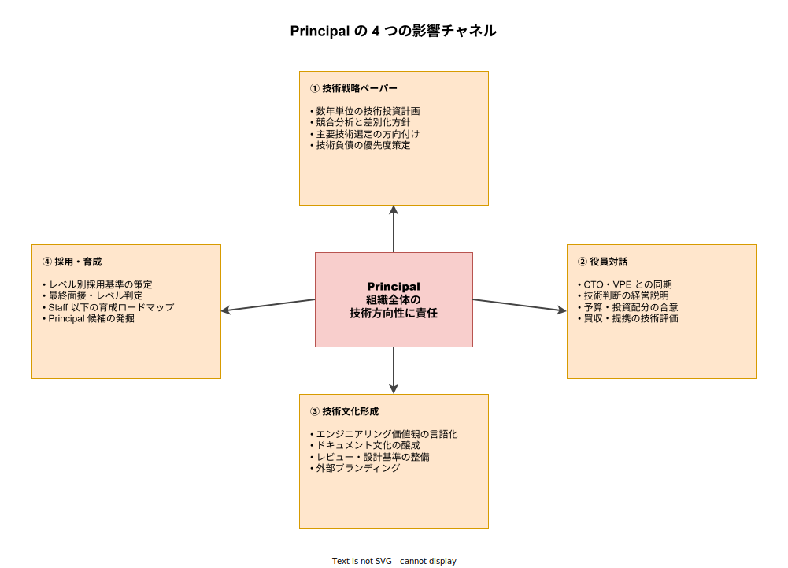

# エンジニアキャリアレベル: Principal の詳説

- 対象読者: Principal に昇進しようとしている Staff/Senior Staff、Principal を初めて迎える組織の CTO・VPE、Principal 相当の採用・評価を行う立場の読者。
- 学習目標: Principal が「組織全体の技術方向性に責任を負う IC」である実像を理解する。Principal の 4 つの影響チャネル（戦略・役員対話・文化・採用）を区別でき、Staff からの質的跳躍（チーム横断 → 組織全体）を言語化できるようになる。Principal 固有の失敗モード（象牙の塔化・役員ブロッカー化）を認識し対処できる。
- 所要時間: 約 30 分
- 対象版/原著: 業界共通キャリアラダー（Google L7 相当、Amazon Principal Engineer L7、Meta E7 相当）および Will Larson『Staff Engineer』の Principal/Distinguished 議論
- 最終更新日: 2026-04-19
- 関連: [エンジニアキャリアレベル: ジュニア・シニア・プリンシパル](./career-levels_junior-senior-principal.md)

## 1. このドキュメントで学べること

- Principal が「Staff の延長」ではなく「組織を動かす参謀」である理由を説明できる
- Principal が価値を生む 4 つの影響チャネル（戦略ペーパ／役員対話／文化形成／採用）を区別できる
- Staff から Principal への跳躍で求められる「時間軸の拡張」（四半期 → 数年）を理解できる
- Principal に固有の失敗モード（象牙の塔／役員ブロッカー／無限会議）を識別できる
- Principal のアウトプットが「コード」ではなく「判断」「文章」「人」である理由を理解できる

## 2. 前提知識

- [Staff の詳説](./career-levels_staff.md) を読み、4 アーキタイプと writing as leverage の概念を把握していること
- マスター版セクション 6.5 を押さえていること

## 3. 概要

Principal エンジニアは、組織全体の技術方向性に責任を負う IC である。Staff がチーム横断の課題を解くのに対し、Principal は組織全体の課題・数年スケールの投資判断・会社としての技術アイデンティティに責任を持つ。直接の部下は持たないが、CTO・VPE と並走する参謀として機能し、組織図では役員の隣のポジションに配置されることが多い。

Principal の特徴は、アウトプットがコードでも設計でもなく「判断」と「文章」と「人」である点にある。どの技術に投資するかを判断し、戦略ペーパーとして文章化し、その判断を実行できる人材を採用・育成する。Principal が書いたコードは、会社の成果として計上されないケースが多い。これは「Principal がコードを書かない」という意味ではなく、Principal の本業評価が別の物差しで行われるという意味である。

Principal は、会社によっては Staff の次ではなく、Senior Staff の次に位置する場合がある。3 段階構成（Senior → Staff → Senior Staff → Principal → Distinguished）を採る企業も多く、その場合は Principal まで到達するのに Staff 到達から更に数年を要する。

## 4. 用語の整理

| 用語 | 説明 |
|------|------|
| 戦略ペーパー | 数年スパンの技術投資計画を記した社内文書。Principal の主要成果物 |
| ADR の上位版 | Principal は個別 ADR より「ADR を束ねた技術方針」を書く。社内 OSS 化／マイクロサービス化／AI 活用方針などの全社方針 |
| 技術的アイデンティティ | 「この会社はこういう技術のやり方をする」という社内共通認識。Principal が形成責任を持つ |
| 参謀（Right Hand 的機能） | CTO・VPE の意思決定の分身として動く機能。Staff の Right Hand アーキタイプの上位版 |
| 象牙の塔化 | 現場から離れた判断を繰り返し、現実感を失うアンチパターン |
| 役員ブロッカー化 | 役員ラインに毎回割り込み、チームの自律的判断を阻害するアンチパターン |
| sponsor | Principal 昇進は CTO・VPE クラスからの強い推挙が実質的に必須 |

## 5. 全体構造・関係図

Principal は組織全体に対して 4 つのチャネルで影響を及ぼす。技術戦略ペーパー（投資判断の文書化）、役員対話（経営層との同期）、技術文化形成（価値観・基準の言語化）、採用・育成（未来の Principal を作る）である。この 4 チャネルを同時に回すことが Principal の本業であり、どれか一つに偏ると機能不全を起こす。次の図は 4 チャネルの内訳を示す。

## 6. 主要な論点・構造

### 6.1 技術戦略ペーパー

Principal の第一の成果物は、数年スパンの技術投資計画を記した戦略ペーパーである。競合分析、差別化方針、主要技術選定の方向付け、技術的負債の優先度、AI・クラウド・セキュリティなど横串テーマへの対処計画を、20〜50 ページ単位の文書にまとめる。この文書は年 1〜2 回更新され、社内の技術判断の基準線となる。「その判断は戦略ペーパーのどこに書いてあるか」で全社が揃う状態を作るのが Principal の役目である。

### 6.2 役員対話

Principal は CTO・VPE・CEO との対話で、経営判断に技術観点を入れる責任を負う。M&A（買収・提携）の技術デューデリジェンス、新領域参入の可否判断、予算配分の技術観点からの助言などが日常となる。ここで重要なのは「技術を経営の言葉に翻訳する能力」であり、単に技術的に正しいだけでは役員には届かない。投資対効果・競合比較・リスクといった経営語彙で語れることが前提となる。

### 6.3 技術文化形成

Principal は会社の技術文化を言語化する責任を負う。エンジニアリング価値観（品質・速度・透明性の優先順位）、ドキュメント文化、コードレビュー基準、インシデント対応の姿勢などを明文化し、採用・評価・研修を通じて組織に浸透させる。技術ブランドの対外発信（カンファレンス登壇・技術ブログ運営・OSS 方針）も Principal が方向付けるチャネルである。

### 6.4 採用・育成

Principal は Staff 以下のレベルの採用基準を策定し、最終面接・レベル判定に関与する。特に Staff/Principal 候補のレベル判定は Principal の専権事項であり、ここで甘い判定をすると組織の Staff+ 層が劣化する。同時に、次世代の Principal 候補を発掘し、Staff Project を提供しながら育成する責任も持つ。

## 7. 読解のポイント

- **Principal のアウトプットは数年後に検証される** — Principal が書いた戦略ペーパーの正しさは、2〜3 年経たないと分からない。このため短期的な成果で Principal を評価しようとすると機能しない。評価は「判断の質」と「判断の一貫性」で行われる
- **「Principal はコードを書かない」は誤解** — Principal もプロトタイプや検証コードは書く。ただしそれは「判断の根拠を得るための調査」として書くのであって、プロダクトコードの納品者としてではない
- **sponsor がいないと昇進できない** — Principal 昇進は自力では困難で、CTO・VPE クラスからの推挙が実質必須となる。sponsor と数年にわたる信頼関係を築くことが昇進の前提条件である
- **象牙の塔化との戦い** — Principal は現場から遠ざかりやすい。意識的に現場（PR レビュー・設計レビュー・インシデント参加）に残らないと判断が現実感を失う

## 8. 発展的トピック

### 8.1 Staff から Principal への質的跳躍

跳躍の中身は 2 つある。(1) 時間軸: 数か月〜1 年 → 数年、(2) ステークホルダ: エンジニアリング組織 → 役員・事業・外部。この 2 つを同時に扱えるようになることが Principal の条件である。Staff までは「エンジニアリングの言語」で完結できるが、Principal は「経営の言語」への翻訳能力が必須となる。

### 8.2 Principal の種類

Principal 内部にも役割の分岐がある。(1) 戦略・投資判断中心の Principal（CTO 参謀型）、(2) 特定領域の深い技術判断を持つ Principal（領域 Architect 拡張型）、(3) 全社技術文化の責任者としての Principal（Distinguished 候補型）。どの型を目指すかで日常の過ごし方が大きく異なる。

## 9. よくある誤解

- **誤解 1: Principal は Staff の上位互換** — 違う。Staff は技術で複数チームを動かすが、Principal は経営と技術の橋渡しをする。求められる能力が質的に異なる
- **誤解 2: Principal は最終決定権を持つ** — 多くの会社で最終決定権は役員（CTO・VPE）にある。Principal は強い影響力を持つ「参謀」であり、決定者ではない
- **誤解 3: Principal は現場を見なくていい** — 現場との接続が切れた Principal は象牙の塔化して機能不全を起こす。週に数時間は PR レビュー・設計レビューに残る Principal が多い
- **誤解 4: Principal は全員を相手にする** — Principal の主要ステークホルダは役員・Staff・採用候補・外部コミュニティであり、Junior/Mid との直接接点はむしろ少ない

## 10. 現代的な位置づけ・影響

AI 時代の Principal は、「AI をどう経営に組み込むか」の判断を役員と並走して行う立場となった。AI の導入範囲・セキュリティ方針・人材戦略への影響・コストモデルの再設計など、従来の Principal の範囲を超えた経営判断が技術側から発信される必要があり、Principal の価値は高まっている。同時に、技術的変化が速すぎて数年スパンの戦略ペーパーが短命化しやすく、Principal の判断の見直しサイクルも短くなっている。

## 11. 演習問題

1. 自社の技術戦略ペーパー（または同等の文書）を読み、そこで採られている 3 つの主要判断を列挙せよ。その判断の根拠・代替案・検証方法を Principal の立場で評価してみよ
2. 自分の会社の CTO・VPE が今月解決したい問題を 3 つ挙げよ。挙がらない場合、Principal を目指すには現状の役員との距離が遠すぎるサインである
3. 自社で「5 年後に消えそうな技術」と「5 年後に中核になりそうな技術」を各 3 つ挙げ、それぞれの根拠と自社への影響を書き出せ。この思考実験が Principal 的判断の初歩である

## 12. さらに学ぶには

- マスター版: [エンジニアキャリアレベル: ジュニア・シニア・プリンシパル](./career-levels_junior-senior-principal.md)
- 次段階: [エンジニアキャリアレベル: Distinguished / Fellow の詳説](./career-levels_distinguished.md)
- Will Larson『Staff Engineer』の Principal / Distinguished 章
- Will Larson『An Elegant Puzzle』— Staff+ の組織運営論

## 13. 参考資料

- Will Larson. *Staff Engineer: Leadership beyond the management track*. 2021
- Will Larson. *An Elegant Puzzle: Systems of Engineering Management*. 2019
- Irrational Exuberance blog（Will Larson 運営）
- StaffEng インタビュー集（Principal 級のケーススタディ）
