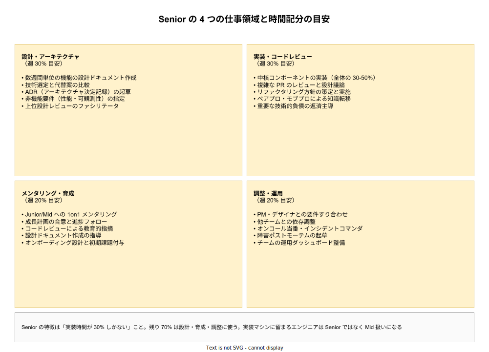

# エンジニアキャリアレベル: Senior の詳説

- 対象読者: Senior に昇進したばかりの本人、Senior 手前の Mid、Senior を評価・採用する立場の読者。
- 学習目標: Senior の 1 週間の時間配分を理解し、「Senior はコードを書く人」という誤解を解消する。Senior の 4 つの仕事領域（設計・実装・育成・調整）を区別できるようになる。Senior として停滞する 3 つの典型失敗を認識し、Staff への跳躍に必要な条件を挙げられる。
- 所要時間: 約 30 分
- 対象版/原著: 業界共通キャリアラダー（Google L5 相当、Amazon SDE III 相当、Meta E5 相当）および Will Larson『Staff Engineer』の Senior 議論
- 最終更新日: 2026-04-19
- 関連: [エンジニアキャリアレベル: ジュニア・シニア・プリンシパル](./career-levels_junior-senior-principal.md)

## 1. このドキュメントで学べること

- Senior が「チームの最強実装者」ではなく「チームをまとめる技術者」である理由を説明できる
- Senior の 4 つの仕事領域（設計／実装／育成／調整）とそれぞれの時間配分の目安を挙げられる
- Senior として停滞する 3 つの典型失敗（one-man army／micromanage／yes-man）を識別できる
- Staff への跳躍で求められる質的な違い（チーム内リーダー → チーム外への影響）を言語化できる

## 2. 前提知識

- [Mid の詳説](./career-levels_mid.md) を読み、Mid から Senior への 3 つの跳躍（設計／調整／育成）を把握していること
- マスター版セクション 6.3 を参照し、Senior 一般論の土台を押さえていること

## 3. 概要

Senior は「チームが担当する機能群の技術的成果に責任を負う」段階である。Junior が「自分のタスク」、Mid が「自分の担当機能」に責任を負うのに対し、Senior は「チーム全体の成果物」に対して技術的品質と納期の両方で責任を持つ。この点で Senior は、純粋な個人成果ではなく、チーム成果を自分のアウトプットとして評価される初めての層である。

多くの会社で Senior は昇進ラダーの中で最長の層となる。5〜10 年、あるいは 20 年以上 Senior であり続けるエンジニアは珍しくない。これは「Senior で居続けることが十分に敬意をもって扱われる」という設計であり、Staff 以上に昇進することだけがキャリアの成功ではないという明示的なメッセージである。Senior レベルで安定して成果を出し続けること自体が、会社から見た「ベストケース」のひとつである。

一方で Senior は、Junior と同じく「卒業・昇進できない場合に保護が外れて難しい」層でもある。チーム成果の責任は重く、技術的視野と対人能力の両方が求められ、どちらかが不足すると消耗する。

## 4. 用語の整理

| 用語 | 説明 |
|------|------|
| Tech Lead（テックリード） | チーム内で技術的な意思決定をリードする役割。Senior が兼任することが多いが、一段上の Staff が担う会社もある |
| 設計ドキュメント（Design Doc） | 数ページで目的・設計・代替案・トレードオフをまとめた文書。Senior の基本成果物 |
| ADR（Architecture Decision Record） | 採用したアーキテクチャ判断とその根拠を残す小さな記録。Senior 以上が起草 |
| ポストモーテム | 障害後の振り返り文書。再発防止策を含む。Senior がインシデントコマンダを務めた場合、起草も担う |
| インシデントコマンダ | 障害対応時の全体指揮者。Senior 以上が担う |
| one-man army | 自分が全て抱え込み、育成と分担を怠るアンチパターン |

## 5. 全体構造・関係図

Senior の 1 週間は「設計・実装・育成・調整」の 4 領域に分割される。注目すべきは、実装に割く時間が 30% 程度にすぎないことである。残り 70% は、コードを直接書かない活動に費やされる。この配分を受け入れられないエンジニアは、たとえ実装が速くても Senior としては機能しない。次の図は 4 領域の内訳と時間配分の目安を示す。

## 6. 主要な論点・構造

### 6.1 設計領域（約 30%）

Senior は数週間〜数か月単位で動く機能の設計責任を負う。設計ドキュメントを書き、技術選定を行い、代替案との比較を文章化する。この段階では「なぜこの設計を選んだのか」を第三者が後から読んで分かる形で残すことが特に重要となる。将来の保守者や次の Senior がその判断を読み返せることが、組織の技術的記憶を構築する。

### 6.2 実装領域（約 30%）

Senior も実装を続ける。ただし実装するのはチームの中核コンポーネント、複雑な箇所、新しい技術要素など、他メンバーに任せにくい部分に絞られる。単純な CRUD や既知パターンの実装はジュニア・ミッドに委譲する。「自分が書いた方が速いから自分で書く」は one-man army の入り口であり、Senior のアンチパターンである。

### 6.3 育成領域（約 20%）

Senior はチームのジュニア・ミッドに対して具体的な育成責任を持つ。1on1 でキャリア相談に乗り、成長計画を合意し、コードレビューで教育的コメントを書く。注目すべきは、育成の時間はチケット消化と別に確保される点であり、評価側もこの時間をチーム成果として計算に入れる。

### 6.4 調整領域（約 20%）

Senior は PM・デザイナ・他チームのエンジニアとの調整を主導する。要件の詰め、スケジュール調整、優先度交渉を自らリードし、技術的に不可能な要求を交渉で変更させる力を持つ。インシデント対応でもコマンダ役を担い、障害後のポストモーテムを起草する。

## 7. 読解のポイント

- **Senior の評価は「チームの成果」で決まる** — 自分の PR 数や実装速度は補助指標にすぎない。チームが期限内に品質の高い成果を出せたか、チームのジュニアが育ったかが主評価軸になる
- **Senior に長く居ることは敗北ではない** — 多くの会社の設計思想として、Senior は終着駅の一つであり、居続けることが正当に評価される。Staff 以上に上がらないことを停滞と見なす必要はない
- **実装比率 30% を受け入れられるか** — 実装が好きで入った人にとって、実装時間が 30% に減るのは想像より辛い。この比率を受け入れられない場合は、Staff-Architect への道（実装比率が再び上がる）や IC として別会社への移籍を検討する

## 8. 発展的トピック

### 8.1 Staff への跳躍の難しさ

Will Larson は Senior から Staff への跳躍を「IC トラックで最も難しい一段」と述べている。理由は、Senior 期間に磨いた能力（チーム内での信頼・チーム成果責任・メンタリング）が、Staff で求められる能力（チーム外への影響・未定義課題の特定・組織を動かす文章力）と質的に別物だからである。「Senior を 10 年やれば Staff」という延長線は存在しない。

### 8.2 Staff Project（昇進の証拠となる案件）

Senior → Staff 昇進の実質的条件は「複数チームに影響する案件を主導完遂し、ドキュメント・設計・調整・結果の全てで目に見える成果を残したこと」である。これは「Staff Project」と呼ばれ、昇進議論の中核証拠となる。Staff Project を獲得するには、上長との合意のもと、意図的に案件を選び取る必要がある。

## 9. よくある誤解

- **誤解 1: Senior はチームの最強実装者** — 実装だけが強い Senior は one-man army に陥りやすく、チーム全体の成果が下がる。Senior の最強さは「チームを強くする力」にある
- **誤解 2: Senior は部下を持つ** — Senior は IC であり公式の部下は持たない。ただし事実上の指導責任（メンタリング）は負う。EM 職は別トラックである
- **誤解 3: Senior の Yes を覚えること** — 会社から来る全ての依頼に Yes と答える Senior は、結果的にチームの優先順位を崩壊させる。Senior には「No と言える力」が求められる
- **誤解 4: Senior の一番の仕事はコードレビュー** — レビューは仕事の一部だが中核ではない。中核は設計と育成である

## 10. 現代的な位置づけ・影響

2020 年代の Senior は、AI 補助ツールを前提とした開発プロセスの設計責任を負うようになった。コード生成ツールの導入判断、生成コードのレビュー基準の策定、AI 補助を前提にした設計レビューの仕方など、チームの開発プロセス設計が Senior の新しい領域になりつつある。同時に、AI が量的なコード生成を担うことで、Senior の価値は「レビューと設計」に一層シフトしている。

## 11. 演習問題

1. 過去 1 か月の自分のカレンダーを振り返り、4 領域（設計／実装／育成／調整）にどれだけ時間を使ったかを計測せよ。実装に 50% 以上使っていた場合、チーム成果を犠牲にしている可能性がある
2. チームのジュニア 1 名を選び、その人の 6 か月後の到達目標を自分の言葉で 300 字程度にまとめよ。目標が書けない場合、メンタリング責任を果たせていないサインである
3. 次の四半期で「Staff Project 候補」になる案件を 2 つ挙げ、それぞれで複数チームへの影響範囲・必要な調整先・想定される困難を整理せよ

## 12. さらに学ぶには

- マスター版: [エンジニアキャリアレベル: ジュニア・シニア・プリンシパル](./career-levels_junior-senior-principal.md)
- 次段階: [エンジニアキャリアレベル: Staff の詳説](./career-levels_staff.md)
- Will Larson『Staff Engineer』の Senior 議論章
- Tanya Reilly『The Staff Engineer's Path』ch.1 — Senior から Staff への入口

## 13. 参考資料

- Rent the Runway Engineering Ladder（Senior Engineer 区分）
- CircleCI Engineering Competency Matrix — L3 境界
- Will Larson. *Staff Engineer: Leadership beyond the management track*. 2021
- Camille Fournier. *The Manager's Path*. 2017
