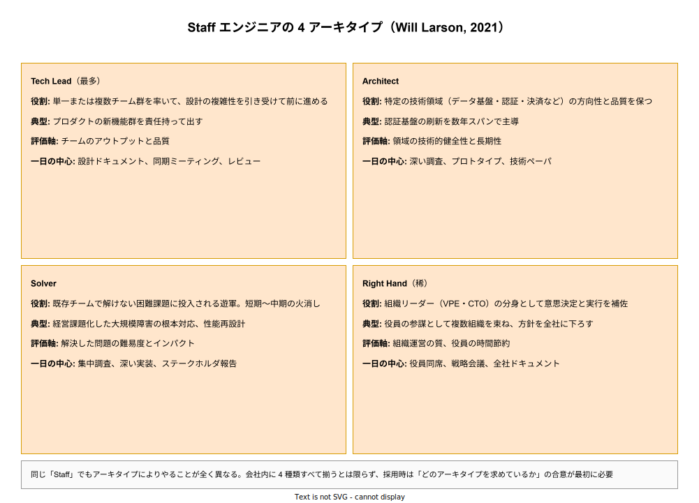

# エンジニアキャリアレベル: Staff の詳説

- 対象読者: Senior から Staff への昇進を視野に入れている本人、Staff 相当の採用・評価を行う立場の読者、Staff+ IC を初めて組織に招く CTO/VPE。
- 学習目標: Staff が「チームを持たない IC でありながら組織全体に影響する」という矛盾した立ち位置をどう成立させているかを理解する。Will Larson の 4 アーキタイプを区別し、Senior から Staff への質的跳躍の中身を言語化できるようになる。
- 所要時間: 約 30 分
- 対象版/原著: Will Larson『Staff Engineer: Leadership beyond the management track』（2021）、Tanya Reilly『The Staff Engineer's Path』（2022）、および Google L6 / Amazon Principal SDE L6 / Meta E6 相当のラダー
- 最終更新日: 2026-04-19
- 関連: [エンジニアキャリアレベル: ジュニア・シニア・プリンシパル](./career-levels_junior-senior-principal.md)

## 1. このドキュメントで学べること

- Staff エンジニアが「権威なきリーダー」としてどう機能するかを説明できる
- Will Larson の 4 アーキタイプ（Tech Lead / Architect / Solver / Right Hand）を区別できる
- Senior → Staff 跳躍の「Staff Project」という昇進条件の実態を理解できる
- Staff に固有の失敗モード（empty-suit／会議漬け／文章軽視）を識別できる
- Staff として「何に取り組むか」を自分で決める活動の中心にある「writing as leverage」を理解できる

## 2. 前提知識

- [Senior の詳説](./career-levels_senior.md) を読み、Senior のチーム内責任と 4 領域を把握していること
- マスター版セクション 6.4 および 8.1 で Staff+ の輪郭を押さえていること

## 3. 概要

Staff エンジニアは、IC トラックにおいて「単一チームの枠を超える」最初のレベルである。直接の部下を持たず、公式の組織図上の権威もないにもかかわらず、複数チームを束ねる技術的意思決定や戦略的投資に責任を負う。この「権威なきリーダーシップ」が Staff の本質であり、Senior との最大の違いである。

Staff は全エンジニアの約 1 割しか到達しないとされる。Senior→Staff の跳躍は Will Larson によって「IC トラックで最難関の一段」と位置付けられており、Senior として優秀でも Staff に上がれないケースは珍しくない。これは個人の能力不足を意味せず、Senior と Staff で要求される能力が質的に別物であるためである。

Staff の仕事の多くはコードではなく文章として残る。設計ドキュメント、技術戦略ペーパー、RFC、ADR、ポストモーテム、採用基準、スキルマトリクスなどがアウトプットとなり、こうした文章を通じて複数チームを同じ方向に揃えることが主業務となる。Will Larson はこれを「writing as leverage」と呼ぶ。

## 4. 用語の整理

| 用語 | 説明 |
|------|------|
| Staff+ | Staff / Senior Staff / Principal / Distinguished / Fellow をまとめた業界用語 |
| アーキタイプ | Will Larson による Staff 役割の 4 分類（Tech Lead / Architect / Solver / Right Hand） |
| writing as leverage | 文章で複数チームを動かす Staff の中心活動 |
| Staff Project | 昇進議論の中核証拠となる大型の組織横断案件 |
| empty-suit | 権威はあるが実質的な技術価値を出さず会議に出るだけになる失敗パターン |
| sponsor | 昇進を後押しする上位の役員・EM・Principal。Staff+ では sponsor の存在が昇進に直結する |
| staff-shaped work | Staff が取り組むべき組織横断・長期・曖昧な課題の総称 |

## 5. 全体構造・関係図

Staff エンジニアという単一呼称の下に、実際は 4 つのまったく異なる役割が同居している。Will Larson はこれを 4 アーキタイプとして整理し、Tech Lead・Architect・Solver・Right Hand の 4 種に分類した。この分類を知らないまま「Staff になりたい」と言うことは、どの方向に進みたいのかを曖昧にしたままの昇進交渉につながり、昇進後にミスマッチを起こす。次の図は 4 アーキタイプの役割・評価軸・一日の中心活動を対比する。

## 6. 主要な論点・構造

### 6.1 Tech Lead（最多アーキタイプ）

Tech Lead は Staff+ の中で最も一般的で、単一または複数チーム群を率いて設計の複雑性を引き受けて前進させる。Senior Tech Lead との違いは、担当するチーム数（複数チーム）と設計スコープの大きさ（プロダクト全体・数四半期の計画）である。日常の中心は設計ドキュメント・同期ミーティング・レビューで、評価軸はチーム群のアウトプットと品質となる。

### 6.2 Architect

Architect は特定の技術領域（データ基盤・認証・決済・検索など）の方向性と品質に責任を持つ。Tech Lead と違い直属のチームを率いず、複数の実装チームを横断して技術基準を定め、長期的な健全性を維持する。日常の中心は深い調査・プロトタイプ作成・技術ペーパーの執筆である。特定領域への集中度が高く、実装時間が他のアーキタイプより多めに残ることが特徴である。

### 6.3 Solver

Solver は既存チームで解けない困難課題に投入される遊軍的存在である。経営課題化した大規模障害の根本対応、性能再設計、セキュリティインシデントの全面対応などを担う。日常の中心は集中調査・深い実装・ステークホルダ報告である。評価軸は「解決した問題の難易度とインパクト」であり、Tech Lead や Architect のような継続的リーダーシップは問われない。

### 6.4 Right Hand（稀なアーキタイプ）

Right Hand は組織リーダー（VPE・CTO）の分身として意思決定と実行を補佐する。役員同席・戦略会議・全社ドキュメント執筆が中心で、技術実装から離れた「参謀」的な役割となる。評価軸は組織運営の質と役員の時間節約効果である。会社規模が大きく、CTO が複数組織を束ねる必要がある企業にのみ存在する。

## 7. 読解のポイント

- **権威なきリーダーシップは文章で成立する** — Staff は公式権限を持たない分、文章による説得で動かす。「書けない Staff」は存在しえない。逆に「よく書ける Senior」は Staff への近道にある
- **「何をやるか」を自分で決めることが本業** — Senior は降りてきた課題を遂行する。Staff はそもそも「何が重要課題か」を特定するところから始める。これが Senior 延長線上にない質的跳躍の中身である
- **アーキタイプを明示せず昇進を目指すと危険** — 自分がどのアーキタイプを目指すかを sponsor と合意しないまま昇進すると、ミスマッチな配置になる。Tech Lead を目指していたのに Right Hand 業務が降ってくる等のずれが実際に起きる
- **Staff に sponsor は必須** — Staff+ は自力昇進が困難で、上位（Principal／VPE／CTO）からの推挙が実質的に不可欠である。sponsor 不在では昇進議論に載らない

## 8. 発展的トピック

### 8.1 Staff Project の獲得

Staff 昇進の中核証拠となる Staff Project は、複数チームに跨り・数四半期の計画を必要とし・結果がビジネス指標に直結する案件である。具体例としては、プラットフォーム化・大規模リプラットフォーム・新領域参入の技術判断・セキュリティコンプライアンス対応などがある。Staff Project は「与えられる」ものではなく「獲得する」ものであり、sponsor と相談しながら自ら提案する必要がある。

### 8.2 Senior から Staff への質的跳躍

跳躍の中身は 3 つある。(1) スコープ: チーム内 → チーム外、(2) 課題発見: 降ってきた課題 → 自ら定義した課題、(3) レバレッジ: 自分の手で書く → 文章で他者を動かす。この 3 つを同時に備えない状態で Staff タイトルが付くと、empty-suit と呼ばれる失敗モードに陥る。

## 9. よくある誤解

- **誤解 1: Staff は Senior の「上位互換」** — 能力が別物である。Senior がチーム内で最強である必要があるのに対し、Staff は各チームに各専門の Senior がいる前提で、それらを束ねる役割を果たす
- **誤解 2: Staff は技術力で決まる** — 技術力は前提条件にすぎない。組織を動かす力（文章・調整・方向付け）が欠けると Staff は機能しない
- **誤解 3: Staff は EM より下** — 大企業の多くで Staff ≒ Engineering Manager として等価扱いされ、給与も同水準に設計される
- **誤解 4: Staff は会議に出ていればよい** — 会議漬けで文章を残さない Staff は empty-suit の典型である。会議は手段であって成果ではない

## 10. 現代的な位置づけ・影響

2020 年代に入り、Will Larson と Tanya Reilly の書籍により「マネージャにならずに技術で上り詰める道」が明示的に言語化された。それ以前は暗黙知として個人の中に閉じていた Staff+ の仕事が、アーキタイプ化・文書化されたことで、中堅エンジニアが自らのキャリアを設計しやすくなった。同時に、企業側も Staff+ ラダーを公開する動きが加速し、採用市場で Staff タイトルの標準化が進みつつある。

生成 AI の普及は Staff の価値にプラスに働いている。個別タスクの実装は AI 補助で加速できる一方、複数チームを束ねる意思決定・文章化・アーキタイプ選定は人間にしかできない領域として残り続けるためである。

## 11. 演習問題

1. 自分のキャリア希望を 4 アーキタイプに照らして分類せよ。直感で「Staff になりたい」と思っても、どのアーキタイプを望むかで日常が全く異なる
2. 過去 1 年で自分が書いた設計ドキュメント・技術ペーパー・ポストモーテムの総量を数えよ。30 ページ未満なら Staff としての文章量が不足している
3. 現在の会社で Staff Project 候補を 3 つ書き出し、それぞれで必要なチーム数・期間・sponsor 候補・想定困難を一覧化せよ

## 12. さらに学ぶには

- マスター版: [エンジニアキャリアレベル: ジュニア・シニア・プリンシパル](./career-levels_junior-senior-principal.md)
- 次段階: [エンジニアキャリアレベル: Principal の詳説](./career-levels_principal.md)
- Will Larson『Staff Engineer: Leadership beyond the management track』— 本層の基本書
- Tanya Reilly『The Staff Engineer's Path』— 日常実践の詳細
- StaffEng.com — Staff+ インタビュー集

## 13. 参考資料

- Will Larson. *Staff Engineer: Leadership beyond the management track*. 2021. https://staffeng.com/book/
- Tanya Reilly. *The Staff Engineer's Path*. O'Reilly. 2022
- StaffEng — Staff archetypes. https://staffeng.com/guides/staff-archetypes/
- Irrational Exuberance blog（Will Larson 運営）
