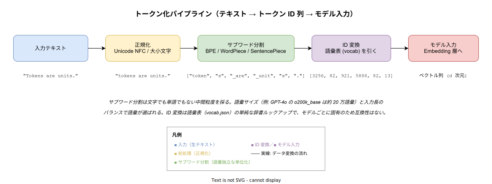
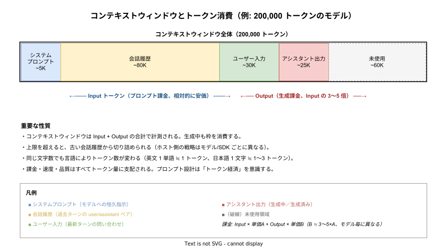

# 生成 AI: トークン（token）の基礎

- 対象読者: 生成 AI（LLM）の API を使い始めた、または使う予定のソフトウェア開発者。NLP の専門知識は前提としない。
- 学習目標: トークンとは何か、なぜ単語でも文字でもない単位が採用されているか、どのように課金・コンテキスト管理に影響するかを説明できる。
- 所要時間: 約 30 分
- 対象版/原著: Sennrich et al. (2016) "Neural Machine Translation of Rare Words with Subword Units" (arXiv:1508.07909) ／ Kudo & Richardson (2018) "SentencePiece" (arXiv:1808.06226) ／ OpenAI tiktoken (2024) ／ Anthropic Claude documentation (2026 時点)
- 最終更新日: 2026-04-28

## 1. このドキュメントで学べること

- トークン（token）が「文字」でも「単語」でもない中間粒度（サブワード）であることを説明できる
- BPE / WordPiece / SentencePiece など主要なトークン化手法の関係を区別できる
- 入力テキストがどう ID 列に変換され、モデルに渡されるかを 5 段階で追える
- コンテキストウィンドウが Input + Output の合計トークン数で計測されることを理解できる
- 同じ文字数でも言語によってトークン消費量が大きく異なる理由を説明できる
- API 課金・遅延・コンテキスト枯渇のすべてが「トークン経済」に集約されることを把握できる

## 2. 前提知識

- 「文字列」「整数」「辞書（key-value 対応表）」の基本概念
- 生成 AI（ChatGPT / Claude など）を一度でも触ったことがあると具体例が掴みやすい
- 機械学習の知識は不要（embedding 層以降には踏み込まない）

## 3. 概要

トークン（token）は、生成 AI のモデルがテキストを処理する **最小単位** である。LLM はテキストをそのまま受け取らず、いったん「トークン」と呼ばれる部分文字列の列に分割し、各トークンを語彙表（vocabulary）の整数 ID に変換してから内部で扱う。モデルから見るとテキストは常に「整数 ID の系列」であり、人間が読む文字列ではない。

トークンは単純に「単語ごとの分割」でも「文字ごとの分割」でもない。両極端の欠点を回避するために、**サブワード**（subword: 単語より細かく文字より粗い単位）が採用されている。例えば英文 `"Tokens are units."` は `["token", "s", " are", " unit", "s", "."]` のような 6 個前後のトークンに分割される（実際の分割はモデルによって異なる）。

この分割の単位設計が、API 課金・コンテキストウィンドウ消費・推論速度・多言語対応のすべてを支配する。トークンは LLM 時代における「テキストの計量単位」であり、ファイルサイズにおけるバイト、通信における bps と同等の基礎概念に位置する。

## 4. 用語の整理

| 用語 | 説明 |
|------|------|
| トークン (token) | テキストを分割した最小単位。モデル内では整数 ID として扱われる |
| トークン化 (tokenization) | 生テキストをトークン列へ変換する処理。逆向きの復元を detokenization と呼ぶ |
| 語彙表 (vocabulary, vocab) | サブワード文字列と整数 ID の対応辞書。モデル毎に固有で互換性はない |
| 語彙サイズ (vocab size) | 語彙表に登録された ID 総数。GPT-4o は約 20 万（o200k_base）、Llama 3 は約 12.8 万 |
| サブワード (subword) | 単語より細かく文字より粗い単位。未知語を文字列の組み合わせで表現可能 |
| BPE (Byte Pair Encoding) | 高頻度のバイトペアを繰り返し合成して語彙を作る手法。GPT 系・Llama 系で広く使われる |
| WordPiece | BPE の派生。確率最大化でサブワードを選ぶ。BERT が採用 |
| SentencePiece | 空白を特殊記号として扱い、言語非依存にトークン化するツールキット |
| コンテキストウィンドウ (context window) | モデルが一度に扱えるトークン数の上限。Input と Output の合計で消費される |
| Input トークン | プロンプト側（システム指示・会話履歴・ユーザー入力）として送るトークン |
| Output トークン | モデルが生成して返すトークン。Input より単価が 3〜5 倍高いのが業界慣例 |

## 5. 全体構造・関係図

トークン化はテキストを 5 段階で変換する直線的なパイプラインである。各段階は独立した変換であり、最終的にモデルへ渡るのは「整数 ID の固定長配列」である。

実運用では、トークンの予算管理が API 利用設計の中心になる。コンテキストウィンドウの内訳は「システムプロンプト・会話履歴・ユーザー入力・アシスタント出力・未使用」の 5 区分で考えると整理しやすい。下図は 200,000 トークンのコンテキストウィンドウを持つモデルでの典型的な配分例を示す。

## 6. 主要な論点・構造

### 6.1 なぜ「文字」でも「単語」でもないのか

文字単位の分割は語彙サイズが小さく済む（英文なら 256 バイト程度）が、入力長がそのまま文字数になり、長い系列を扱う計算量が爆発する。一方、単語単位の分割は系列が短くなるが、語彙が無限に近く膨張し、未知語（OOV: out-of-vocabulary）に弱い。新造語や固有名詞は表現できなくなる。

サブワードはこの両極端の中間を採る。`"unbelievable"` を `["un", "believ", "able"]` のように構成要素へ分解することで、(a) 語彙サイズを数万〜数十万に抑え、(b) 未知語も既存サブワードの組み合わせで必ず表現できる、という二つの要件を同時に満たす。

### 6.2 主要なトークン化手法

| 手法 | 代表モデル | 仕組みの要点 |
|------|------------|--------------|
| BPE (Byte Pair Encoding) | GPT-3/4/4o, Llama, Mistral | 訓練コーパス内で最も高頻度のバイトペアを繰り返し合成し、語彙を構築する。Sennrich+ 2016 が NMT に持ち込んだ |
| Byte-level BPE | GPT-2 以降 | バイト列に直接 BPE を適用。Unicode 全文字をカバーでき、未知文字なし |
| WordPiece | BERT, DistilBERT | BPE と似るが、ペア合成の基準を「コーパス対数尤度の最大化」とする |
| Unigram | T5, ALBERT | 大きな初期語彙から確率モデルで不要な要素を削減して最終語彙を得る |
| SentencePiece | Llama, T5 系の実装基盤 | 空白を `▁` 記号として可視化し、言語に依存しない統一処理を提供するツール |

実装としては OpenAI の `tiktoken`、Hugging Face の `tokenizers`、Google の `sentencepiece` が広く使われる。同じ "BPE" でもモデルが違えば語彙表が完全に異なる点に注意する。

### 6.3 モデル毎の語彙差と互換性

語彙表はモデルの訓練時に固定される。`tiktoken` における `cl100k_base`（GPT-3.5/4）と `o200k_base`（GPT-4o）は別の語彙であり、同じ文字列でもトークン数が変わる。Anthropic の Claude、Google の Gemini、Meta の Llama も独自の語彙を持つ。したがって「トークン数」を語る時は **どのモデルの語彙で数えたか** を必ず明示する必要がある。クライアント側でトークン数を見積もる場合は、対象モデルの公式トークナイザーを使う以外の方法では正確値は得られない。

### 6.4 コンテキストウィンドウとトークン経済

コンテキストウィンドウは Input トークンと Output トークンの **合計** で消費される。Input は単価が安く、Output は単価が高い（モデル毎に違うが、Output は Input の 3〜5 倍が業界慣例）。プロンプトキャッシュ（同じ Input プレフィックスを再利用すると Input 単価がさらに割引される機構）が普及して以降、システムプロンプトを長く固定して会話履歴を可変部分に置く設計が経済的に有利になった。

ウィンドウを超えた場合、ホスト側 SDK（OpenAI / Anthropic / LangChain など）が会話履歴を古い順に切り詰めるか、要約して圧縮するかの戦略を採る。実装によって挙動が異なるため、長期会話を扱うアプリは戦略を明示的に選択すべきである。

## 7. 読解のポイント

- **文字数 ≠ トークン数**: 経験則として英語は「1 トークン ≒ 4 文字 ≒ 0.75 単語」、日本語は「1 文字 ≒ 1〜3 トークン」とされる。だが個別の文字列では大きくぶれるため、課金見積もりはトークナイザーで実測する
- **「空白」もトークンの一部**: BPE 系は単語の先頭空白を `_word` のように 1 文字として取り込む。前後の空白を変えるとトークン分割が変わる
- **改行・絵文字・記号は重い**: ASCII 外文字や絵文字は 1 文字で 3〜10 トークン消費することがある。JSON 構造化出力では `{`、`"`、改行など制御文字の累積に注意する
- **トークン数と「賢さ」は無関係**: 長く書けば良い結果が得られるわけではない。情報密度の高い短いプロンプトの方が安定することも多い
- **モデルが「トークン単位で考えている」現実**: LLM は文字を見ていない。`"strawberry" の 'r' の数を数えよ` 系の質問が苦手なのは、モデルの知覚単位がトークンであり文字ではないことに起因する

## 8. 発展的トピック

- **tokenizer-free / byte-level モデル**: ByT5・MEGABYTE のように、サブワードを使わず生バイト列を直接モデリングする系統。語彙設計を排除する代わりに計算量が増える
- **多言語の不公平性 (Tokenizer fairness)**: 同じ意味の文章でも、英語・日本語・タイ語・スワヒリ語で必要トークン数が大きく異なる。低資源言語ほどトークンが多くなり、API 利用料が割高になる構造的不公平が指摘されている（Petrov et al. 2023）
- **動的トークン化 / Learned tokenization**: 訓練と同時にトークン化を最適化する研究。BLT (Byte Latent Transformer, Meta 2024) など
- **プロンプトキャッシュとトークン経済**: 共通プレフィックス部分の attention 計算結果を再利用する仕組み。Input トークンの単価を 1/10 程度まで割引するモデルが主流
- **トークン視覚化ツール**: OpenAI Tokenizer Playground、Tiktokenizer、Hugging Face の Tokenizer Visualizer。設計時の体感を養うのに有用

## 9. よくある誤解

- **「1 トークン = 1 単語」**: 短い英単語は 1 トークンになるが、長い単語は複数のサブワードに分割される。`tokenization` は `["token", "ization"]` のように 2 トークンになることがある
- **「全モデルでトークン数は共通」**: 同じ文字列でもモデル毎に違う。GPT-4o と GPT-3.5 ですら違う語彙を使う
- **「コンテキストウィンドウいっぱい使えば賢い」**: 入力が長すぎると、注意が散漫になり中盤の情報を見落とす（"lost in the middle" 現象）。長ければ良いわけではない
- **「Output は Input より安い」**: 逆である。Output は計算ステップが多く、業界共通で Input の数倍高い
- **「トークン削減のために改行を消せばいい」**: 改行を消すと可読性が落ち、構造化出力の品質が下がる場合がある。可読性とのバランスで判断する
- **「日本語が不利なのは仕方ない」**: モデル世代が進むごとに日本語のトークン効率は改善されている。GPT-4o の o200k_base は日本語を約 1.4× 効率化した

## 10. 現代的な位置づけ・影響

トークンは LLM 経済における **基礎単位** として、ファイルサイズにおけるバイトと同等の地位にある。OpenAI・Anthropic・Google の API 課金、コンテキストウィンドウのスペック表記、推論レイテンシのベンチマーク（tokens/sec）はすべてトークン基準で表現される。

エンタープライズ用途では、トークン消費の予算管理（FinOps for AI）が新たな運用領域として確立しつつある。社内 LLM プラットフォームはトークン使用量を部門別に計測し、プロンプトキャッシュ率・Input/Output 比率・モデル選択を最適化することで、月次コストを 30〜70% 削減する事例が報告されている。

LLM を組み込んだアプリ設計の観点では、コンテキスト圧縮（要約・RAG での選別検索・Tool Use への切り出し）の質がそのままトークン経済とユーザー体験を左右する。トークンを意識せずプロンプトを書くのは、メモリサイズを意識せずプログラムを書くのと同じレベルの設計欠陥になる。

## 11. 演習問題

1. OpenAI の Tokenizer Playground（<https://platform.openai.com/tokenizer>）で、同じ意味の文を英語・日本語・絵文字混じりで入力し、トークン数の差を比較せよ
2. `"Hello, world!"` と `" Hello, world!"`（先頭空白あり）でトークン分割がどう変わるか、cl100k_base と o200k_base の両方で確認せよ
3. 200,000 トークンのコンテキストウィンドウを持つモデルで、システムプロンプト 5,000 / 会話履歴 80,000 / ユーザー入力 30,000 / 出力上限 8,000 を設定した場合、残り何トークンの余裕があるか計算せよ
4. Input 単価 $3/M、Output 単価 $15/M のモデルで、Input 12,000 ・Output 2,000 トークンの 1 リクエストはいくらか
5. `"strawberry"` の中の `'r'` の数を LLM に尋ねると誤答することがある理由を、本ドキュメントの「読解のポイント」を踏まえて説明せよ

## 12. さらに学ぶには

- OpenAI Tokenizer Playground: <https://platform.openai.com/tokenizer>
- tiktoken（OpenAI 公式トークナイザー、Python/Rust）: <https://github.com/openai/tiktoken>
- Hugging Face Tokenizers ドキュメント: <https://huggingface.co/docs/tokenizers/>
- SentencePiece リポジトリ: <https://github.com/google/sentencepiece>
- 関連 Knowledge: [tractatus_generative-ai-relation.md](tractatus_generative-ai-relation.md)（言語と意味の哲学的基盤）

## 13. 参考資料

- Sennrich, R., Haddow, B., & Birch, A. (2016). *Neural Machine Translation of Rare Words with Subword Units*. ACL 2016. arXiv:1508.07909
- Kudo, T., & Richardson, J. (2018). *SentencePiece: A simple and language independent subword tokenizer*. EMNLP 2018. arXiv:1808.06226
- Petrov, A., La Malfa, E., Torr, P., & Bibi, A. (2023). *Language Model Tokenizers Introduce Unfairness Between Languages*. NeurIPS 2023. arXiv:2305.15425
- Liu, N. F., et al. (2024). *Lost in the Middle: How Language Models Use Long Contexts*. TACL 12. arXiv:2307.03172
- OpenAI. *Tokenizer documentation* (2024). <https://platform.openai.com/docs/guides/text-generation>
- Anthropic. *Claude API: Counting tokens* (2026 時点). <https://docs.anthropic.com/en/api/messages-count-tokens>
