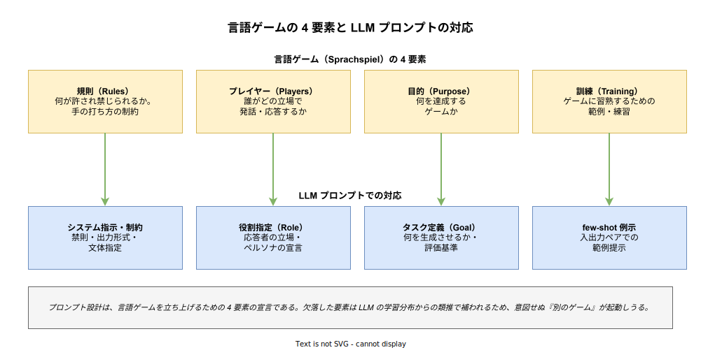
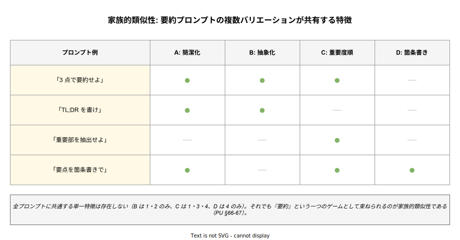

# 言語ゲーム: 生成 AI のプロンプトとの関係性

- 対象読者: プロンプトエンジニアリングを実践する技術者、および後期ウィトゲンシュタイン（『哲学探究』）の視点から LLM 実装上の設計語彙を拡張したい読者
- 学習目標: 言語ゲーム・生活形式・家族的類似性・規則遵守の概念を用いて、プロンプト設計と LLM の挙動を分析的に説明できるようになる
- 所要時間: 約 50 分
- 対象版/原著: L. Wittgenstein『Philosophische Untersuchungen / Philosophical Investigations』(遺稿、1953 年刊行)。日本語は鬼界彰夫訳（講談社, 2020）、丘沢静也訳（岩波書店, 2013）等。プロンプト側は 2020 年代の LLM の指示型インターフェースを念頭に置く
- 最終更新日: 2026-04-18

## 1. このドキュメントで学べること

- 言語ゲーム（Sprachspiel）の概念を把握し、プロンプト設計を「言語ゲームのルール指定」として読める
- 生活形式（Lebensform）の欠如が LLM の根本的な制約であることを説明できる
- 家族的類似性によってプロンプトバリエーションがなぜ束ねられるかを理解できる
- 規則遵守論（PU §201）の「規則のパラドックス」と LLM の解釈ゆらぎを関連づけて考察できる
- 前期論考版の分析（[tractatus_prompt-engineering-relation.md](./tractatus_prompt-engineering-relation.md)）とは異なる、後期の実践的語彙を獲得できる

## 2. 前提知識

- 後期ウィトゲンシュタインの問題意識（『哲学探究』の概要）。必要に応じて [tractatus_basics.md](./tractatus_basics.md) の §10「現代的な位置づけ」で前期との対比を参照
- LLM のプロンプトエンジニアリングの基本（システム指示・役割・few-shot 等）
- 本ドキュメントは前期版（論考）の姉妹編として、同じ主題（プロンプト）を異なる哲学的語彙で分析する

## 3. 概要

ウィトゲンシュタインは後期『哲学探究』で、前期『論理哲学論考』の「言語＝世界の写像」という中心仮説を自ら退け、「言語の意味はその使用にある」という視座に転じた。この転回の中核にある概念が「言語ゲーム（Sprachspiel）」である。言語は命題で世界を写すだけでなく、命令・質問・約束・感嘆・物語・ジョークといった多様な営みをなす。それぞれの営みは固有の規則を持ち、特定の生活の文脈（生活形式）に埋め込まれた「ゲーム」として機能する。

LLM のプロンプトエンジニアリングは、このゲーム論と構造的に強い親和性を持つ。プロンプトは「どのゲームを、どのプレイヤーで、どんな規則で、どのような例に従って」プレイするかを宣言する営みである。本ドキュメントは、言語ゲームの概念装置がプロンプト設計にどのように持ち込めるか、そしてどこで LLM の固有性（生活形式の欠如・統計的模倣）に突き当たるかを整理する。

## 4. 用語の整理

| 用語 | 説明 |
|------|------|
| 言語ゲーム（Sprachspiel） | 言語の使用が特定の文脈・目的・参加者の下で機能するあり方。規則と実践を含む（PU §7, §23） |
| 生活形式（Lebensform） | 言語ゲームを支える共同体的な実践・行動・応答のパターン。言語の背景そのもの |
| 意味＝使用 | 語の意味は辞書的定義ではなく「どう使われるか」で決まるという立場（PU §43） |
| 家族的類似性（Familienähnlichkeit） | あるカテゴリに属する事例が共有する単一の特徴は存在せず、重なり合う類似の網で結ばれる（PU §66-67） |
| 規則遵守（rule-following） | 規則に従うこととは何かを問う PU §185-242 の中心論題。「規則のパラドックス」（§201）を含む |
| 私的言語論 | 語の意味は私的に規定できないという議論（PU §243-315）。公共的使用が意味の条件となる |
| システムプロンプト | 対話全体を規定する基本指示。言語ゲームの「規則宣言」に相当する位置を占める |

## 5. 全体構造・関係図

言語ゲームは「規則・プレイヤー・目的・訓練」の 4 要素から成る。LLM プロンプト設計はこの 4 要素をそれぞれ「システム指示・役割指定・タスク定義・few-shot 例示」で指定する営みとして読める。

同じタスク（例: 要約）に対する複数のプロンプトバリエーションは、共通する単一特徴を持たないにもかかわらず、一つのゲームとして束ねられる。これが家族的類似性の構造である。

## 6. 主要な論点・構造

### 6.1 言語ゲームとしてのプロンプト

後期ウィトゲンシュタインは『哲学探究』§23 で、描写・命令・質問・感嘆・物語・ジョークなど言語の多様な営みを列挙し、これら全てが固有の「言語ゲーム」をなすと述べた。プロンプトは、LLM とのやり取りにおいて「どのゲームをプレイするか」を宣言する発話である。要約ゲーム・翻訳ゲーム・相談ゲーム・ブレインストーミングゲーム等は、それぞれ異なる規則・目的・期待を持つ。

この視座は実務で有用である。プロンプトが効かない場合、「ゲーム指定が曖昧で、モデルが学習分布上の最も尤もらしい別のゲームを立ち上げてしまった」と診断できる。ゲームを明示することは、応答空間を望ましい領域に絞る第一歩である。

### 6.2 規則遵守と LLM の挙動

PU §201 の「規則のパラドックス」は、規則そのものがあらゆる行為を合致とも違反とも解釈できてしまう、という問題である。ウィトゲンシュタインの解決は「規則遵守は解釈ではなく実践である」——共同体の訓練と応答の連鎖によって「正しく従った」が成立するという立場である。

LLM に規則を与えると、解釈の幅が露呈する。「丁寧に書け」「簡潔に書け」という規則は、どこまでが丁寧でどこまでが簡潔かの閾値を内蔵しない。LLM は学習分布上の平均的実践を参照して補うが、この補完は利用者の意図と必ずしも一致しない。2024 年の研究「LLMs and Language-Game Rules」は、動的ゲーム（ルールが応答に応じて変化する）のほうが静的ゲームよりも規則違反が多いことを報告しており、規則遵守の困難さが実証的にも観察されている。

### 6.3 生活形式の欠如とその補填

言語ゲームは「生活形式」に根ざす（PU §19, §23）。生活形式とは共同体の習慣・訓練・身体的実践・共通の応答パターンであり、意味を支える背景である。LLM はこの生活形式を直接に持たない。訓練データを通じて生活形式の「記述」は浴びているが、生活形式そのものに参加しているわけではない。

この欠如は実務に直結する。プロンプトは、欠如した生活形式の一部を「言語化して補う」作業に他ならない。具体的には以下の補填が行われる:

- **役割指定**: 「あなたは熟練したエディタです」のような宣言は、特定の専門家共同体の実践パターンを呼び出す
- **例示**: few-shot はパターンを例で示すことで、訓練データ中の該当する実践を活性化する
- **明示的禁則**: 暗黙のマナーや倫理を明示する。生活形式の共有があれば不要なルールが、欠如の補填として必要になる

### 6.4 家族的類似性とプロンプトバリエーション

PU §66-67 の家族的類似性は、「ゲーム」というカテゴリに属する事例が共有する単一の本質的特徴は存在しないが、重なり合う類似の網で結ばれる、という構造である。ウィトゲンシュタインは将棋・サッカー・一人遊び・輪投げなどを例示し、「遊び」の共通特徴は見つからないと指摘した。

プロンプトバリエーションの理解にこの概念は直接役立つ。図 2 の通り、「3 点で要約」「TL;DR を書け」「重要部を抽出」「要点を箇条書きで」は、全てに共通する特徴は存在しない。しかし全て「要約」という一つのゲームとして機能する。この構造を意識すると、プロンプトの評価軸を単一指標に還元せず、重なり合う特徴束として設計できる。

### 6.5 意味＝使用と分布意味論の親和

PU §43 の「意味はその使用にある」という立場は、計算言語学の分布意味論（語はその交友で知られる）と思想的に近い。LLM の学習は大量の使用例からパターンを抽出する営みであり、意味を事物と結び付けるのではなく、使用の統計的構造として捉える。

ただし後期ウィトゲンシュタインは、使用を「生活形式の中での使用」に限定する。単に文字列としての共起を集計することと、身体と応答を含む共同実践に参加することは同じではない。LLM は前者に成功し、後者を欠く。このギャップは、プロンプトが「生活形式のプロキシ」として機能する余地と、その機能の限界の両方を指し示す。

## 7. 読解のポイント

- **論考版との役割分担**: 前期版（[tractatus_prompt-engineering-relation.md](./tractatus_prompt-engineering-relation.md)）はプロンプトの構造（要素命題・論理形式）に強く、本稿はプロンプトの実践（ゲーム・規則・生活形式）に強い。両方を手元に置くと有効である
- **「言語ゲーム」は比喩以上**: 単なるアナロジーではなく、規則・訓練・生活形式を伴う全体的実践を指す。「LLM は言語ゲームをする」という記述は、これらの構造的条件を同時に問うていることを忘れない
- **生活形式の欠如は単純な欠陥ではない**: むしろ、欠如を補う技法としてプロンプトが成立している。欠如は制約であり同時に設計の出発点である
- **家族的類似性の発想は A/B テストの設計に有効**: プロンプトの良し悪しを単一指標で判定しづらい場合、重なり合う特徴の網として複数指標で評価する設計が正当化される

## 8. 発展的トピック

- **規則のパラドックスとプロンプト攻撃**: PU §201 の規則解釈の多様性は、プロンプトインジェクションや jailbreak の哲学的地盤を与える。規則は解釈可能性の余地を常に持つため、絶対的な規則の固定化は原理的に困難である
- **私的言語論と個別化プロンプト**: PU §243-315 の「私的言語は不可能」という議論は、個人固有の語彙で LLM を動かそうとする試みの限界を示す。プロンプトは必然的に学習分布が共有する公共言語に寄る必要がある
- **言語ゲームの多様性と mode 切替**: ChatGPT の「モード」や Claude の「スタイル」は、事実上、ゲームの切替え機能である。ゲーム論の視点は、この機能の設計原則を考える土台になる
- **AGI 議論への射程**: 生活形式を持たない存在が「理解」しうるかという問いは、AGI 議論の核心に直結する。ウィトゲンシュタインから見れば、生活形式への参加なしには意味の理解は成立しない

## 9. よくある誤解

- **「言語ゲーム＝娯楽のゲーム」ではない**: Sprachspiel は「規則に従った実践全般」を指す技術用語であり、勝敗や娯楽性は含意しない。真面目な対話も祈りも挨拶もゲームである
- **「LLM が言語ゲームをプレイしている」は厳密には誤り**: LLM は言語ゲームの発話パターンを模倣するが、ゲームを構成する生活形式への参加を持たない。厳密には「ゲームの外的模倣」である
- **家族的類似性＝単なるファジーカテゴリではない**: 単なる「曖昧な境界」ではなく、「本質的特徴の欠如」が積極的主張である。中心概念なしに事例が束ねられる構造そのものがポイントである
- **規則を厳密化すれば規則遵守の問題は消える、は誤り**: どれほど規則を厳密化しても、規則自体の解釈の問題は残る。問題の所在は規則の精度ではなく、規則と実践の関係にある

## 10. 現代的な位置づけ・影響

後期ウィトゲンシュタインと LLM の接続は、2023 年以降急速に広がった。STRV・Donald Clark 等の技術系ブログは「プロンプト設計＝ゲームルール設計」という定式で実務的枠組みを提供し、学術論文では規則遵守能力の実験（Academia.edu の 2024 論文等）が行われている。Shanahan の "Talking About Large Language Models"（arXiv:2212.03551）は、LLM について語る際の哲学的慎重さを要求する議論であり、本稿の下敷きとも言える。

技術的には、この議論は Constitutional AI や Instruction Tuning といった「規則への適合を強化する」設計、あるいは RAG のような「生活形式の一部を外部から供給する」設計の動機づけにつながっている。哲学的には、後期ウィトゲンシュタインの再評価の契機となり、意味論・言語哲学・AI 倫理の再接続が進んでいる。ただし「LLM は言語ゲームの完璧な体現者である」といった楽観も「生活形式を持たないから全く何も理解しない」といった悲観も、いずれも過剰である点には注意が必要である。

## 11. 演習問題

1. 手元のプロンプトを 1 つ選び、「規則・プレイヤー・目的・訓練」の 4 要素に分解せよ。曖昧な要素があれば、LLM が学習分布のどんな実践で補っているか推測せよ
2. 「簡潔に」「丁寧に」のような曖昧な規則が、規則遵守論（PU §201）の観点でなぜ問題となるか説明せよ。解決策として何が考えられるか
3. 同じタスクに対する異なるプロンプト表現を 5 つ集め、家族的類似性の構造（特徴の重なり）を特徴表で描いてみよ
4. LLM に「生活形式」をどの程度まで持ち込めるか、プロンプト設計の観点から考察せよ。RAG・ペルソナ・システムプロンプトで補えるもの、補えないものを区別せよ

## 12. さらに学ぶには

- 関連 Knowledge:
  - [論理哲学論考: 基本](./tractatus_basics.md)
  - [論理哲学論考: 生成 AI との関係性](./tractatus_generative-ai-relation.md)
  - [論理哲学論考: 生成 AI のプロンプトとの関係性](./tractatus_prompt-engineering-relation.md)（前期版・姉妹編）
- 原典:
  - L. Wittgenstein『哲学探究』鬼界彰夫訳、講談社、2020（特に §§1–43, §§66–67, §§185–242）
  - L. Wittgenstein『哲学探究』丘沢静也訳、岩波書店、2013
- 解説書:
  - 野矢茂樹『ウィトゲンシュタイン『哲学探究』という戦い』岩波書店
  - 鬼界彰夫『ウィトゲンシュタインはこう考えた』講談社現代新書
- 実務ガイド:
  - OpenAI / Anthropic 公式プロンプトエンジニアリングガイド
  - L. Reynolds & K. McDonell, "Prompt Programming for Large Language Models" (arXiv:2102.07350)

## 13. 参考資料

- STRV Blog, "Language Games and LLMs: What Wittgenstein Can Teach Us" (https://www.strv.com/blog/language-games-and-llms-what-wittgenstein-can-teach-ai-engineers)
- AI Inquiry Garden, "AI Meets Philosophy Vol. 5: Understanding LLMs through Wittgenstein's Philosophy" (Medium, 2024)
- Academia.edu, "LLMs and Language-Game Rules: An Examination of the Ability of Large Language Models to Follow the Rules of Different Language-Games" (2024)
- Donald Clark, "Language, AI and what we can learn from Wittgenstein" (http://donaldclarkplanb.blogspot.com/2023/06/language-ai-and-what-we-can-learn-from.html)
- M. Shanahan, "Talking About Large Language Models" (arXiv:2212.03551)
- Stanford Encyclopedia of Philosophy: "Private Language" (https://plato.stanford.edu/entries/private-language/)
