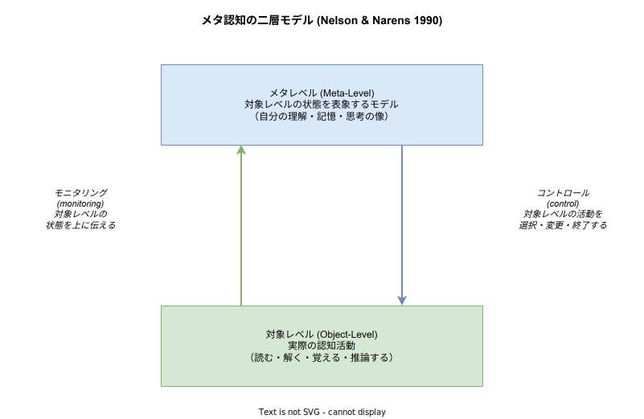
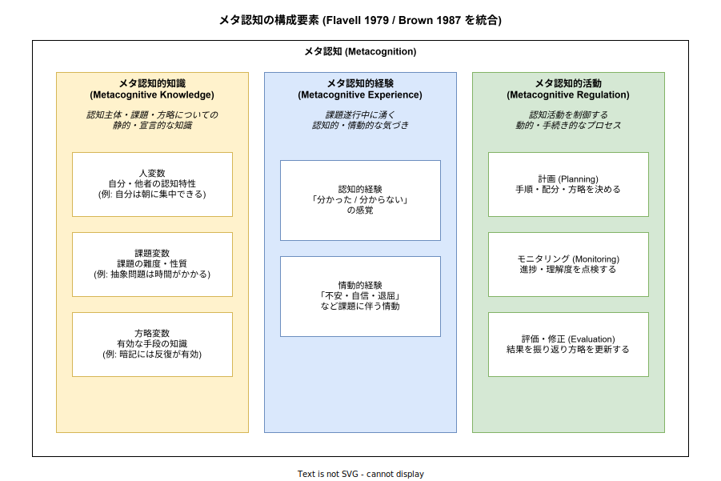

# メタ認知: 概要

- 対象読者: 学習科学・認知心理学・教育工学に初めて触れる開発者・教育設計者・研究者。AI エージェント設計や自己学習の文脈で「メタ認知」という語に遭遇した読者を想定する。
- 学習目標: メタ認知の定義（「認知についての認知」）を平易に説明でき、Flavell の 3 要素モデルと Nelson & Narens の二層モデルを区別して図示でき、学習・AI システム設計における応用上の含意を述べられるようになる。
- 所要時間: 約 30 分
- 対象版/原著: Flavell, J. H. (1979) "Metacognition and cognitive monitoring", *American Psychologist* 34(10); Brown, A. L. (1987) "Metacognition, executive control, self-regulation, and other more mysterious mechanisms"; Nelson, T. O., & Narens, L. (1990) "Metamemory: A theoretical framework and new findings"; Schraw, G., & Moshman, D. (1995) "Metacognitive theories", *Educational Psychology Review* 7(4).
- 最終更新日: 2026-04-28

## 1. このドキュメントで学べること

- メタ認知の語源（meta- + cognition）と「認知についての認知」という再帰的定義を説明できる
- Flavell が示した 3 要素（メタ認知的知識・メタ認知的経験・メタ認知的活動）を区別できる
- Nelson & Narens の二層モデル（対象レベル / メタレベル / モニタリング / コントロール）を図で説明できる
- 「分かったつもり」「学習感」と実際の理解度のずれが、なぜ起きるかを論じられる
- 学習設計・AI エージェントの自己評価ループに、メタ認知概念をどう持ち込めるかを判断できる

## 2. 前提知識

- 「認知」「記憶」「思考」といった日常的な心の働きの語彙
- 学習中に「これで合っているのだろうか」「なぜ分からないのだろう」と考えた経験
- 本ドキュメントは特定の理論的バックグラウンドを要求しない。心理学・教育学の用語は初出時に平易な説明を併記する

## 3. 概要

メタ認知（metacognition）はギリシャ語接頭辞 meta-（「〜について」「〜を超えた」）と cognition（認知）の合成語で、**「認知についての認知」**、すなわち自分自身の認知活動を対象化して捉える働きを指す。1970 年代後半に発達心理学者 John H. Flavell が「子どもがなぜ覚えにくい課題を覚えにくいと判断できるか」を研究する中で提唱し、教育心理学・学習科学・認知科学の中核概念となった。

具体例で見ると分かりやすい。教科書を読んでいて「ここ、分かったつもりだったけど自分で説明しようとすると詰まる」と気づき、もう一度読み直す——この一連の働きがメタ認知である。読むこと自体は通常の認知活動だが、「自分はいま分かっているか」と問い、答えに応じて行動を変える層は、その上に乗った別レベルの認知である。

ここで重要なのは、メタ認知が単なる「内省」ではなく、**評価（monitoring）と制御（control）のループ**であるという点である。「分かっていない」と気づくだけでは行動は変わらない。気づいた結果として「読み直す」「方略を変える」「助けを求める」という制御が起きて初めて、メタ認知は学習成果に結びつく。後述する Nelson & Narens の二層モデルは、この評価と制御の双方向性を最も簡潔に定式化したものである。

## 4. 用語の整理

| 用語 | 説明 |
|------|------|
| メタ認知 (metacognition) | 自分の認知活動を対象化して捉え、評価・制御する働き |
| 対象レベル (object-level) | 実際の認知活動そのもの（読む・解く・覚える・推論する） |
| メタレベル (meta-level) | 対象レベルの状態を表象するモデル（「自分はいま理解している」という像） |
| モニタリング (monitoring) | 対象レベルの状態をメタレベルに伝える情報の流れ。例: 学習感、確信度判断 |
| コントロール (control) | メタレベルから対象レベルへの介入。例: 読み直し、方略変更、学習中止 |
| メタ認知的知識 | 自分・他者・課題・方略についての宣言的知識（例: 「自分は朝に集中できる」） |
| メタ認知的経験 | 課題遂行中に湧く「分かった / 分からない」「不安 / 自信」といった気づきや情動 |
| メタ認知的活動 (regulation) | 計画・モニタリング・評価・修正といった調整プロセス |
| メタ理解の錯誤 (illusion of understanding) | 実際には理解していないのに「分かった」と感じる現象。学習感と理解度の乖離 |

## 5. 全体構造・関係図

メタ認知の理論的枠組みは、研究者によって切り口が異なる。Nelson & Narens (1990) は「対象レベルとメタレベルの 2 層」と「モニタリング・コントロールの双方向の流れ」によって最も簡潔な形式モデルを提示した。下図はその基本構造である。

一方 Flavell (1979) と Brown (1987) は、メタ認知を構成する内容物に着目し、知識・経験・活動の 3 要素に分解した。下図は Flavell と Brown の枠組みを統合した整理である。Schraw & Moshman (1995) 以降の教育心理学の標準的な区分とも整合する。

両モデルは対立しないため、設計時には併用できる。「何を扱うか」を 3 要素モデルで分類し、「どう動くか」を二層モデルで描く、という使い分けが実務的である。

## 6. 主要な論点・構造

### 6.1 Flavell の 3 要素モデル

Flavell (1979) はメタ認知を **メタ認知的知識** と **メタ認知的経験**、そしてそれらを使った **目標** と **方略** に分けた。後続研究（特に Brown 1987）はこのうち「方略」を **メタ認知的活動 (metacognitive regulation)** として独立させ、現在は 3 要素モデルとして広く参照される。

メタ認知的知識はさらに **人変数**（自分・他者の認知特性に関する知識）、**課題変数**（課題の難度・性質に関する知識）、**方略変数**（どの方略がどの状況で有効かの知識）に細分される。「自分は文字より図の方が覚えやすい（人変数）」「抽象的な問題は具体例を作ると解きやすい（方略変数）」といった日常的な学習知が該当する。

メタ認知的経験は、課題遂行の最中に湧き上がる「分かった感じ」「もう少しで思い出せそうな感じ」（feeling of knowing）、課題に伴う不安や自信といった情動的な気づきを指す。これらは即時的・主観的で、メタ認知的知識（事前に持っている命題的知識）とは性質が異なる。

メタ認知的活動は計画・モニタリング・評価・修正からなる動的プロセスで、節 6.3 で詳述する。

### 6.2 Nelson & Narens の二層モデル

Nelson & Narens (1990) はメタ記憶研究の文脈で、認知系を **対象レベル (object-level)** と **メタレベル (meta-level)** の 2 層に分け、両者を結ぶ情報の流れを **モニタリング**（下→上）と **コントロール**（上→下）として形式化した。メタレベルは対象レベルの状態を表象する **モデル** を持ち、そのモデルを通じて対象レベルを観察し、介入する。

このモデルが強力なのは、メタ認知を「内省」のような曖昧な現象ではなく、**情報の流れの方向性** で定義した点にある。モニタリングが正確でなければメタレベルのモデルが歪み、歪んだモデルに基づくコントロールは適切な介入にならない。学習で言えば、「分かったつもり」（モニタリング不正確）→「もう復習しなくてよい」（誤ったコントロール）→「テストで失点」という連鎖を、モデル上で明確に説明できる。

### 6.3 メタ認知的調整 (planning / monitoring / evaluation)

メタ認知的活動は典型的に 3 段階のサイクルで動く。**計画 (planning)** は課題着手前に手順・時間配分・方略を決める段階、**モニタリング (monitoring)** は遂行中に進捗と理解度を点検する段階、**評価 (evaluation)** は遂行後に結果と方略を振り返り次回に向けて知識を更新する段階である。Schraw & Moshman (1995) はこの 3 段階を「調整スキル (regulatory skills)」と総称し、教育介入で訓練可能な対象として位置づけた。

このサイクルは、PDCA や OODA ループといった一般的な制御サイクルと構造的に類似する。違いは、メタ認知の場合 **対象がもう一つの認知活動である** という点にあり、入力（モニタリング情報）と出力（コントロール介入）がいずれも内的・主観的な性質を強く持つ。

### 6.4 ホットメタ認知とコールドメタ認知

近年（2000 年代以降）の研究では、メタ認知に **冷たい (cold)** 側面と **熱い (hot)** 側面があると区別される。コールドメタ認知は「自分はこの問題を 80% の確信で解けると思う」のような **確信度判断 (confidence judgment)** を中心とする評価的・計算的な層を指す。ホットメタ認知は不安・自己効力感・動機づけといった **情動・動機側面** を含むメタ認知で、Efklides (2011) のメタ認知・情動・動機統合モデル（MASRL）が代表例である。

学習場面では両側面が密に絡み合う。「分からない」という冷たい判断はしばしば不安や自己評価の低下を引き起こし、それが学習継続を妨げる。教育介入を設計する際にコールド側のみを扱うと、学習者の情動的撤退を見逃すリスクがある。

## 7. 読解のポイント

- **「メタ認知 = 自分を客観視する力」では狭い**: 客観視（モニタリング）だけでなく、その結果に基づく介入（コントロール）まで含めて初めてメタ認知である。気づいて何もしないのはメタ認知ではなく単なる内省
- **モニタリングは正確とは限らない**: 「分かった感じ」は理解度の代理指標にすぎず、しばしば実際の理解とずれる（メタ理解の錯誤）。モニタリングの **較正 (calibration)** を訓練することがメタ認知教育の中心課題のひとつ
- **3 要素モデルと二層モデルは対立しない**: 何を扱うか（3 要素）と、どう動くか（二層）を別の切り口として併用できる
- **メタ認知は発達する**: 5〜7 歳ごろから観察可能になり、青年期以降も訓練で伸ばせる。「持って生まれた能力」ではない

## 8. 発展的トピック

- **メタ記憶 (metamemory)**: 自分の記憶状態についてのメタ認知。Nelson & Narens の枠組みはもともとこの領域から発展した。Judgment of Learning (JOL)・Feeling of Knowing (FOK)・Tip of the Tongue (TOT) などの実験パラダイムがある
- **自己調整学習 (Self-Regulated Learning, SRL)**: Zimmerman (2000) のモデルなど、メタ認知を学習プロセス全体の制御として位置づける教育心理学の枠組み
- **較正研究 (calibration research)**: 確信度判断と実成績の一致度を測り、過信 (overconfidence) や過小評価 (underconfidence) のパターンを分析する分野
- **AI エージェントとメタ認知**: 大規模言語モデルの「自己評価 (self-evaluation)」「自己一貫性 (self-consistency)」「セルフリフレクション」といった手法は、メタ認知的モニタリングの計算的アナロジーとして議論されることが増えている。較正の悪さ（モデルの過信）は人間と同様の問題として研究対象になっている

## 9. よくある誤解

- **「メタ認知 = 内省」ではない**: 内省は対象を客観視する一般的な働きで、メタ認知は **認知** に対象を限定し、かつ制御まで含む
- **「メタ認知が高い人は常に正確に自己評価できる」は誤り**: メタ認知の機能は持っていても、モニタリングが較正されていない場合は誤った自己評価が起きる。Dunning–Kruger 効果（不熟達者ほど過信しやすい）はこの典型
- **「メタ認知は意識的活動に限られる」は誤り**: 暗黙的・自動的なモニタリング（不安の高まり、違和感）も含まれる
- **「メタ認知さえ鍛えれば学力が上がる」は単純化**: メタ認知は領域固有の知識（domain knowledge）と相互作用する。基礎知識がなければ何をモニタリングすればよいかも分からない
- **「LLM のチェイン・オブ・ソートはメタ認知である」は短絡**: 連鎖的推論は対象レベルの拡張であり、自身の推論を評価して介入する層がなければメタ認知とは呼びにくい

## 10. 現代的な位置づけ・影響

教育分野では、PISA 等の国際学力調査が「学習方略の使用」「自己評価の正確さ」をメタ認知指標として測定対象に組み込み、各国のカリキュラム設計に影響している。日本の学習指導要領が掲げる「主体的・対話的で深い学び」のうち「主体的」の部分は、自己調整学習およびメタ認知的調整と密接に対応する。

人工知能分野では、LLM の自己評価・自己整合性検証・推論ステップの分割と確認といった手法が、メタ認知的モニタリングの工学的実装として議論されている。較正済み確信度（calibrated confidence）を出力できるモデルは、人間とのエージェント協調において信頼性の前提となる。逆に、モデルが自身の知識限界を正確に認識できないハルシネーション問題は、メタ認知不全の典型例として位置づけられる。

ソフトウェアエンジニアリングの実務では、コードレビューやペアプログラミングが「他者の目を借りた外的なメタ認知」として機能していると解釈できる。自己内のモニタリングが較正されにくい領域（自分のコードのバグ）に対し、他者によるモニタリングを補助線として取り込む構造である。

## 11. 演習問題

1. 直近 1 週間で「分かったつもりだったが分かっていなかった」場面を 1 つ挙げ、二層モデル（モニタリング / コントロール）の言葉で何が起きたかを説明せよ
2. Flavell の 3 要素（知識・経験・活動）のそれぞれについて、自分の学習における具体例を 2 つずつ挙げよ
3. 「自分はこの問題を 80% の確信で解ける」と判断したが実際は誤答だった場合、これは過信か過小評価か。較正という概念を用いて説明せよ
4. LLM が「I am not sure, but ...」という前置きを出力する挙動は、メタ認知のどの要素に対応すると言えるか。逆に対応しないと言える点はどこか

## 12. さらに学ぶには

- 三宮真智子『メタ認知 学習力を支える高次認知機能』（北大路書房, 2008）— 日本語で最も体系的な入門書
- Flavell の原著論文（1979）— 短く読みやすく、概念の発生現場を確認できる
- Nelson & Narens (1990) — 二層モデルの形式定義は本論文の Figure 1 が原典
- Dunlosky & Metcalfe, *Metacognition* (Sage, 2009) — 英語の標準教科書

## 13. 参考資料

- Flavell, J. H. (1979). Metacognition and cognitive monitoring: A new area of cognitive-developmental inquiry. *American Psychologist*, 34(10), 906–911.
- Brown, A. L. (1987). Metacognition, executive control, self-regulation, and other more mysterious mechanisms. In F. E. Weinert & R. H. Kluwe (Eds.), *Metacognition, motivation, and understanding* (pp. 65–116). Erlbaum.
- Nelson, T. O., & Narens, L. (1990). Metamemory: A theoretical framework and new findings. In G. H. Bower (Ed.), *The Psychology of Learning and Motivation*, 26, 125–173.
- Schraw, G., & Moshman, D. (1995). Metacognitive theories. *Educational Psychology Review*, 7(4), 351–371.
- Efklides, A. (2011). Interactions of metacognition with motivation and affect in self-regulated learning: The MASRL model. *Educational Psychologist*, 46(1), 6–25.
- Zimmerman, B. J. (2000). Attaining self-regulation: A social cognitive perspective. In M. Boekaerts, P. R. Pintrich, & M. Zeidner (Eds.), *Handbook of Self-Regulation* (pp. 13–39). Academic Press.
