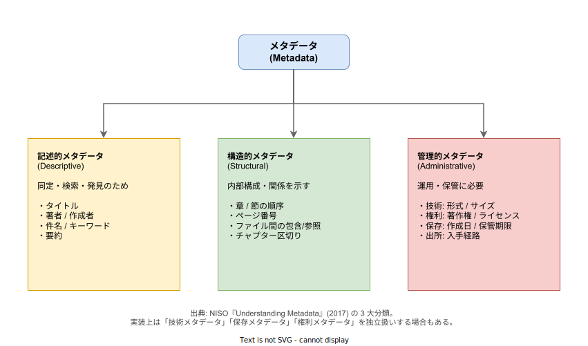
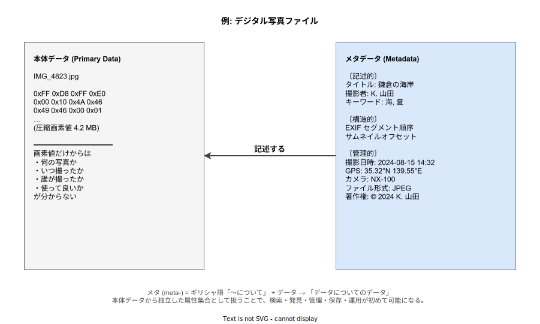

# メタデータ: 概要

- 対象読者: ソフトウェア・データに関わる初学者〜中級。検索・データ管理・運用設計に関心がある読者。
- 学習目標: メタデータの定義・主要分類・主な標準仕様を説明でき、設計時に「メタデータ要件」を本体データから独立した属性集合として切り出せるようになる。
- 所要時間: 約 30 分
- 対象版/原著: NISO『Understanding Metadata: What is Metadata, and What is it For?』(2017, J. Riley); ISO 15836-1:2017 (Dublin Core Metadata Element Set v1.1); ISO 23081-1:2017 (記録管理メタデータ); W3C Resource Description Framework 1.1 (2014).
- 最終更新日: 2026-04-28

## 1. このドキュメントで学べること

- メタデータの語源（meta- + data）と「データについてのデータ」という再帰的定義を説明できる
- 記述的・構造的・管理的の 3 大分類を区別し、具体属性を分類できる
- 写真ファイル・Web ページ・データベーステーブルでメタデータ属性を識別できる
- 主要なメタデータ標準（Dublin Core, EXIF, HTTP ヘッダ, Schema.org, OpenTelemetry semantic conventions）の位置づけを把握できる
- 設計時に「本体データ」と「メタデータ」を切り分け、それぞれに必要な格納・更新・公開ポリシーを設計できる

## 2. 前提知識

- 「データ」「ファイル」「属性」の基本概念
- 検索・データベースのインデックス概念が分かるとスムーズだが、必須ではない
- 本ドキュメントは特定の言語・フレームワークに依存しない。実装例として HTTP ヘッダや SQL を引くが、構文知識がなくても文脈で読める

## 3. 概要

メタデータ（metadata）はギリシャ語接頭辞 meta-（「〜について」「〜を超えた」）と data の合成語で、「データについてのデータ」を意味する。本体データそのものではなく、本体データの内容・構造・出所・所有関係・使用条件などを記述する属性集合を指す。

具体例として写真ファイルを考える。ファイルの本体は画素値の集合（圧縮されたバイト列）であり、計算機にとってはただの数値の並びである。画素値だけからは「いつ・誰が・どこで撮ったか」「使ってよいか」が分からない。撮影日時・撮影者・GPS 座標・著作権表示といった情報は、画素値とは別の属性として保存され、画像データを意味のある資産として扱うために必要となる。これらが当該写真のメタデータである。

「データについてのデータ」という再帰構造は、メタデータ自体もデータであるためメタメタデータ（schema for metadata）が論理的に成立することを含意する。Dublin Core や Schema.org といった「メタデータの語彙そのもの」を規定する標準仕様は、メタメタデータと位置づけられる。

## 4. 用語の整理

| 用語 | 説明 |
|------|------|
| メタデータ (metadata) | データについてのデータ。本体データを記述・識別・管理するための属性集合 |
| 本体データ (primary data, payload) | 直接的に意味を持つコンテンツそのもの。画像なら画素値の集合、文書なら本文 |
| スキーマ (schema) | メタデータの語彙・型・構造を規定する仕様 |
| メタメタデータ | メタデータを記述するためのメタデータ。スキーマと同義に使われることが多い |
| 埋め込みメタデータ | 本体データの内部に格納される（JPEG 内 EXIF、PDF 内 XMP、MP3 内 ID3 など） |
| 外付けメタデータ | 本体データとは別ファイル / 別レコードとして保管される（DB のメタテーブル、図書館の目録など） |
| 標準語彙 | 業界横断で共有されるメタデータ要素の集合（Dublin Core, Schema.org, OpenTelemetry semantic conventions など） |
| クロスウォーク (crosswalk) | 異なるメタデータ規格の間で要素を相互変換するためのマッピング |

## 5. 全体構造・関係図

メタデータは目的別に 3 つに大別される。NISO Primer で示された区分が標準的で、図書館情報学から Web セマンティクスまで広く参照される。各分類は「何のためにメタデータを残すか」という目的（同定 / 構造化 / 運用）に対応しており、同じ属性が文脈によって複数分類にまたがる場合もある。

本体データとメタデータの関係を写真ファイルの例で具体化したのが下図である。本体（画素値）だけでは検索・管理・運用が成立しないこと、メタデータが「本体を意味のある資産にする属性集合」として独立に存在することを示す。

## 6. 主要な論点・構造

### 6.1 記述的メタデータ

リソースを **同定・検索・発見** するための属性で、人間が「これは何か」を理解する手がかりとなる。タイトル・著者・件名・キーワード・要約などが該当する。図書館の OPAC、検索エンジンのインデックス、写真管理ソフトのタグ機能はすべて記述的メタデータを基盤とする。

Dublin Core Metadata Element Set v1.1 (ISO 15836-1) はこの層の語彙を定義する代表的な標準で、Title・Creator・Subject・Description・Identifier など 15 要素を中核に持つ。

### 6.2 構造的メタデータ

リソース **内部の構成や関係** を示す属性で、本体を「正しい順序・構造で読む」ための情報を担う。書籍の章節順序、PDF のしおり、デジタルアーカイブの「図書 - 章 - ページ - 段落」の包含関係、HTML 文書のセクション階層などが該当する。METS（図書館のデジタルオブジェクト構造化規格）はこの層を扱う代表例である。

### 6.3 管理的メタデータ

リソースの **管理・運用・保管** に必要な属性で、人間ではなくシステムや管理者が利用する。NISO は管理的メタデータをさらに 3 つに細分する。

- **技術メタデータ**: フォーマット・サイズ・圧縮方式・ハッシュ値など、機械処理に必要な情報
- **権利メタデータ**: 著作権者・ライセンス・利用範囲・期限など、法的取り扱いに関わる情報
- **保存メタデータ**: 作成日時・修正履歴・保管期限・出所証跡（PREMIS 規格）など、長期保存に関わる情報

実装上はこれらを独立したテーブル / セクションとして扱う設計も多い。

### 6.4 メタデータ標準の階層

メタデータ標準は対象とする粒度・領域で層を成しており、設計時はそのまま組み合わせる。下層から順に:

1. **ファイルフォーマット内蔵系**: EXIF (画像)・XMP (Adobe 系)・ID3 (MP3)・MP4 メタデータボックス。本体ファイルに埋め込まれる
2. **リソース記述系**: Dublin Core・MODS・Schema.org。Web リソース全般を記述する汎用語彙
3. **業界特化系**: METS（図書館）・DICOM（医用画像）・FHIR（医療記録）・OpenTelemetry semantic conventions（観測可能性）
4. **オントロジ / セマンティック Web 系**: RDF・OWL・SKOS。メタデータの語彙そのものを機械可読に定義する層

## 7. 読解のポイント

- **「データ vs メタデータ」は文脈相対**: ある層のメタデータは別の層から見ると本体データになりうる。メール本文を扱うアプリにとって「件名・送信者」はメタデータだが、メール監査ログを扱うシステムから見ると「件名・送信者」自体が本体データであり、誰がいつ参照したかが新たなメタデータになる
- **埋め込み vs 外付けはトレードオフ**: 埋め込みは本体と一緒に運べる利点があるが、フォーマット仕様に縛られ後方互換が取りにくい。外付けは柔軟だが本体との同期管理が必要
- **スキーマと値を混同しない**: 「Dublin Core を採用する」は語彙（スキーマ）の選択であり、各リソースに付与する具体値（Title="…"）はその語彙のインスタンスである
- **タグはメタデータの一形式に過ぎない**: フリータグ・階層分類・統制語彙・関係グラフは表現力が異なる。要件に応じて選ぶ

## 8. 発展的トピック

- **セマンティック Web と Linked Data**: RDF トリプル (subject, predicate, object) はメタデータをグラフとして相互接続する形式。FOAF・SKOS・schema.org はその上の語彙
- **観測可能性（observability）における metadata**: OpenTelemetry の Resource attributes・Span attributes・Log labels はテレメトリ本体（メトリクス値・スパン区間・ログ行）を解釈するためのメタデータである
- **データカタログ**: DataHub・Apache Atlas・OpenMetadata はデータ資産横断のメタデータ管理基盤で、データリネージ（来歴）・所有者・スキーマ進化を集約する
- **AI/ML の Data Card / Model Card**: Google・Hugging Face が標準化を進める「学習データ・モデルのメタデータ規格」で、訓練データの偏り・ライセンス・評価指標を機械可読に開示する

## 9. よくある誤解

- **「メタデータ=タグ」ではない**: タグは記述的メタデータの一形式にすぎず、構造的・管理的メタデータはタグでは表現しきれない
- **「メタデータは本体に比べて軽い / 重要度が低い」は誤り**: 通信メタデータ（誰がいつ誰に通話したか）はしばしば本体内容より機密度が高く、各国の通信傍受法はこの非対称性を前提にする
- **「ファイル名で十分」は不十分**: ファイル名は単一の文字列であり、複数次元の属性を表現できない。検索・並べ替え・権限制御には独立した属性集合が必要
- **「メタデータは静的」ではない**: 修正履歴・閲覧回数・最終アクセス日時など、本体は不変でもメタデータは更新される属性が多い

## 10. 現代的な位置づけ・影響

検索エンジンが Web 全体を索引化する技術基盤は、HTML の `<meta>` タグや Schema.org といったメタデータ標準に支えられている。EU GDPR や日本の個人情報保護法は「メタデータからの個人特定可能性」を含めて規制対象とし、通信内容を見ずともメタデータだけでプロファイリングが成立することを前提にする。

クラウドネイティブ環境では、Kubernetes の `metadata.labels` / `metadata.annotations` がリソース選択・運用情報の基盤となり、OpenTelemetry の semantic conventions はテレメトリ横断の正規化語彙として機能する。AI 領域では学習データの透明性確保のため、Data Card / Model Card によるメタデータ開示が業界標準化の途上にある。

これらに共通するのは、メタデータが **本体データと同等以上に「設計対象」として扱われている** という点である。本体スキーマだけ設計してメタデータを後付けで継ぎ足すと、検索・権限・監査・互換性の要件を満たせなくなる。

## 11. 演習問題

1. 自分の PC 内の任意の写真ファイルについて、記述的・構造的・管理的の 3 種に分けて 5 個ずつメタデータ属性を列挙せよ
2. HTTP レスポンスヘッダ `Content-Type` / `ETag` / `Last-Modified` / `Cache-Control` を 3 大分類のどれに属するか分類し、根拠を述べよ
3. SQL データベースのテーブルに対して、スキーマ定義（CREATE TABLE 文）はメタデータかメタメタデータか。`information_schema` ビューの位置づけと併せて説明せよ
4. メール本文 `body` を扱うサービスから見ると `from` / `to` / `subject` はメタデータである。同じ `from` / `to` / `subject` がメール監査ログサービスでは本体データになる理由を、本ドキュメントの「文脈相対性」に基づいて説明せよ

## 12. さらに学ぶには

- NISO『Understanding Metadata』Primer（無償公開、本ドキュメントの基底文献）
- Dublin Core Metadata Initiative 公式: <https://www.dublincore.org/>
- Schema.org 公式: <https://schema.org/>
- W3C RDF Primer: <https://www.w3.org/TR/rdf11-primer/>
- OpenTelemetry Semantic Conventions: <https://opentelemetry.io/docs/specs/semconv/>

## 13. 参考資料

- Riley, Jenn. (2017). *Understanding Metadata: What is Metadata, and What is it For?* NISO Primer Series. National Information Standards Organization. <https://www.niso.org/publications/understanding-metadata-2017>
- ISO 15836-1:2017, *Information and documentation — The Dublin Core metadata element set — Part 1: Core elements*
- ISO 23081-1:2017, *Information and documentation — Records management processes — Metadata for records — Part 1: Principles*
- W3C. (2014). *RDF 1.1 Concepts and Abstract Syntax*. <https://www.w3.org/TR/rdf11-concepts/>
- Library of Congress. *METS (Metadata Encoding and Transmission Standard)*. <https://www.loc.gov/standards/mets/>
- PREMIS Editorial Committee. (2015). *PREMIS Data Dictionary for Preservation Metadata, Version 3.0*
