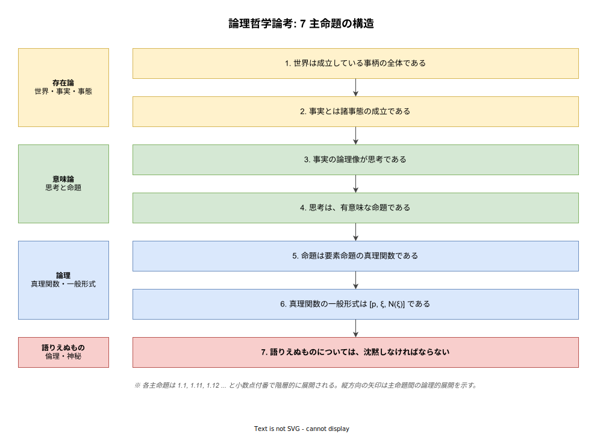
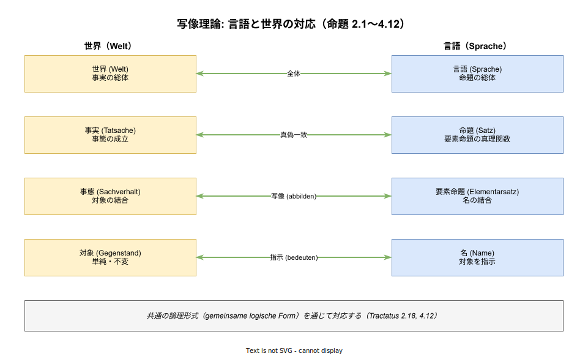

# 論理哲学論考: 基本

- 対象読者: 哲学初学者〜中級。分析哲学・論理学の基礎に関心がある読者。専門家向けではない。
- 学習目標: 『論理哲学論考』の全体構造・主要概念・写像理論・核心的主張を説明でき、原典読解の手がかりを得る。
- 所要時間: 約 60 分
- 対象版/原著: L. Wittgenstein『Logisch-Philosophische Abhandlung』（独語版 1921）／英独対訳版『Tractatus Logico-Philosophicus』Ogden & Ramsey 訳（1922）。日本語は野矢茂樹訳（岩波文庫, 2003）、丘沢静也訳（光文社古典新訳文庫, 2014）等。
- 最終更新日: 2026-04-18

## 1. このドキュメントで学べること

- 『論理哲学論考』（以下「論考」）の成立背景と前期ウィトゲンシュタインの問題意識を説明できる
- 7 つの主命題とその階層構造を把握できる
- 写像理論（Picture Theory）の骨格を理解し、「言語と世界の対応」という中心問題を説明できる
- 「語りうるもの／語りえぬもの」「語り／示し」という論考固有の区別を理解できる
- 論考の現代的影響（論理実証主義・分析哲学）と、後期ウィトゲンシュタインによる自己批判の方向を把握できる

## 2. 前提知識

- 命題論理の初歩（論理積・論理和・否定・含意・真理値表）が分かるとスムーズ。不明な場合は並行して学ぶと理解が深まる
- 20 世紀初頭の哲学史の概略（フレーゲの論理主義、ラッセルの記述理論）を知っていると位置づけが明確になるが、必須ではない
- 本ドキュメント単体でも論考の地図として機能するよう配慮しているが、深い理解には原典の通読が必要である

## 3. 概要

『論理哲学論考』は、ウィーン出身の哲学者ルートヴィヒ・ウィトゲンシュタイン（Ludwig Wittgenstein, 1889–1951）が第一次世界大戦期の従軍中に執筆し、1921 年にドイツ語版、1922 年に英独対訳版として刊行した哲学書である。題名のラテン語は G.E. Moore の提案による。本書はウィトゲンシュタイン生前に刊行された唯一の哲学書であり、後期の『哲学探究』（遺稿、1953 年刊）と対になる「前期哲学」の結晶である。

論考が解こうとするのは「言語はいかにして世界を語り得るのか」という問いである。フレーゲとラッセルが切り拓いた数理論理学を出発点に、ウィトゲンシュタインは「意味ある命題の可能性の条件」を極限まで突き詰めた。結論として本書は、哲学の伝統的問題の多くは「言語の論理を誤解したことによる疑似問題である」と診断する。本書全体は 7 つの主命題と、それらに対する階層的な注釈（1.1, 1.11, 1.12, ...）の合計 526 命題で構成される。最終命題「語りえぬものについては、沈黙しなければならない」は哲学史上もっとも有名な一文のひとつである。

## 4. 用語の整理

| 用語 | 説明 |
|------|------|
| 世界（Welt） | 「成立している事柄」の全体。モノの集合ではなく事実の集合である |
| 事実（Tatsache） | 事態が成立していること。「A が B である」という事態の現実化 |
| 事態（Sachverhalt） | 対象が特定の仕方で結びついた最小の状況。成立しているかは別問題 |
| 対象（Gegenstand） | 分解できない世界の基礎単位。単純かつ不変 |
| 論理空間（logischer Raum） | 可能な事態の全体。「ありうる世界」の全領域 |
| 像（Bild） | 事実を写し取ったもの。命題も一種の像である |
| 写像理論（Bildtheorie） | 命題が世界の事実を写像することで意味を持つ、という本書の中心仮説 |
| 要素命題（Elementarsatz） | それ以上分解できない最小の命題。名の結合として構成される |
| 真理関数（Wahrheitsfunktion） | 要素命題の真偽の組合せから決まる複合命題の真偽 |
| 語り（sagen）と示し（zeigen） | 命題は事態を「語る」が、論理形式は「示される」のみで語れない |
| トートロジー／矛盾 | いかなる事態でも真／偽になる命題。世界について何も語らない |

## 5. 全体構造・関係図

論考は縦に 7 主命題、横に階層的注釈という二次元構造を持つ。各主命題の色分け（存在論／意味論／論理／語りえぬもの）は本ドキュメントによる整理であり、原典に記号化された区分はない。

写像理論の要点を示したのが次の図である。世界側の 4 階層（対象→事態→事実→世界）と言語側の 4 階層（名→要素命題→命題→言語）が、共通の論理形式を介して対応する。この対応関係は単なる記号規則ではなく、言語が世界を語り得る条件そのものを成す。

## 6. 主要な論点・構造

### 6.1 存在論（命題 1–2）

論考は「世界はモノの総和ではなく事実の総和である」から始まる（1, 1.1）。ここでの「事実」は「A が B である」という状況が成立していること、「対象」はその成立に関与する分解不能な基礎要素である。対象は「単純」であり、世界の変化とは独立に存在する（2.021–2.0271）。ウィトゲンシュタインは何が対象に該当するかを具体的に列挙せず、論理が要請する「単純なもの」としてのみ規定する。

### 6.2 像と思考（命題 2.1–3）

事実を写し取ったものが「像」であり、思考は事実の「論理像」である（2.1, 3）。像が事実を写像できるのは、像と写像対象が同じ「論理形式」を共有するからである。この「論理形式の共有」は語ることができず、像のあり方として「示される」のみである（4.12, 4.121）。

### 6.3 有意味な命題（命題 4）

思考は有意味な命題として表現される。有意味性の条件は「事態を写像していること」であり、事態でないもの（例: 神・倫理・美）については有意味な命題を構成できない（4.11, 6.42, 6.421）。自然科学の命題は事態を写像するため有意味だが、伝統的形而上学の命題の多くは論理形式の誤用による無意味（unsinnig）と診断される（4.003）。

### 6.4 真理関数と一般形式（命題 5–6）

全ての命題は要素命題の真理関数として表現できる（5）。真理関数の一般形式 [p, ξ, N(ξ)] は、全ての命題が N（共同否定、NAND 的な演算）の反復適用で構成できることを示す（6）。これは論理記号の「余剰性」の主張であり、「論理的真理」は世界について何も語らないトートロジーとして特徴づけられる（6.1, 6.11）。

### 6.5 倫理と沈黙（命題 6.4–7）

倫理・美・神・人生の意味など価値に関わる事柄は世界内の事態ではなく、有意味な命題で語れない（6.42–6.522）。しかしそれらは「語りえぬもの」として確かに存在し、人生の問題は問題の消滅において解決されるという特異な立場を取る（6.521）。論考は「私の命題を理解した者は、梯子として捨て去るべきである」という自己解体（6.54）を経て、「語りえぬものには沈黙せよ」（7）で閉じる。

## 7. 読解のポイント

- **付番を軸に読む**: 1, 1.1, 1.11 という付番は単なる節番号ではなく、前の命題に対する注釈・敷衍の関係を示す。主命題だけを縦に読み、次に小数展開を読む「二段読み」が効果的である
- **翻訳による差**: 野矢茂樹訳は原文の硬質さを保ち、丘沢静也訳は現代語で可読性が高い等、訳ごとに印象が異なる。複数訳の突き合わせを推奨する
- **ラッセル序文は後回しでよい**: 初版英独対訳版に付された B. Russell 序文はウィトゲンシュタイン自身が不満を表明した解釈であり、まず本文を読んでから参照する方が誤導を受けにくい
- **「無意味」と「ナンセンス」の区別**: 論考は Sinn（意味）を持たないことを「sinnlos」（無意味＝トートロジー等、論理的に真偽が自明なもの）と「unsinnig」（ナンセンス＝論理形式違反）に区別する。訳語のゆらぎに注意する

## 8. 発展的トピック

- **論理空間と可能世界**: Carnap・Kripke 以降の可能世界意味論は、論考の論理空間概念と思想的系譜を共有する
- **真理表の独立発明**: ウィトゲンシュタインは命題 4.31 で真理表を導入し、論理学教育で広く使われる現代的道具の原型を与えた
- **倫理の沈黙論**: 倫理が語りえぬという主張は「道徳的相対主義」ではなく、倫理の超越性の肯定として読まれるのが有力な解釈である（P. Engelmann 宛書簡参照）
- **後期への転回**: 後期『哲学探究』は「意味は写像ではなく使用である」（言語ゲーム論）として論考の中心仮説を自己批判する。対比して読むと両著の位置が明確になる

## 9. よくある誤解

- **「語りえぬもの＝存在しないもの」ではない**: 倫理・美・神は「世界内の事態として語れない」だけで、存在を否定されているのではない
- **論考は実証主義的ではない**: 論理実証主義（ウィーン学団）は論考の一部を自説の根拠としたが、ウィトゲンシュタイン自身は「彼らは倫理の重要性を見逃した」と距離を置いた
- **沈黙せよ＝何も言うなではない**: 命題 7 は「哲学的には語りえぬ」という限定である。日常の発話や示しによる伝達は否定されていない
- **論考は「完成した体系」ではない**: 命題 6.54 の「梯子」比喩は、自著自体を登り終えたら捨てるべきものとして位置づける自己解体的な構造を明示している

## 10. 現代的な位置づけ・影響

論考は 20 世紀の分析哲学・言語哲学・論理学教育に広範な影響を与えた。ウィーン学団（Carnap・Schlick ら）は論考の「有意味性の基準」を出発点に論理実証主義を形成した。しかし、倫理を語りえぬ領域に置く論考の構えは、実証主義の反形而上学的志向と必ずしも一致しない点に留意が必要である。

後期ウィトゲンシュタインは『哲学探究』で「意味の写像理論」を自ら退け、意味を「使用」として捉え直した。論考と探究の対比は、20 世紀哲学における言語論的転回の内部構造を映し出す重要な座標軸となっている。

計算機科学・形式意味論の観点では、論考の「要素命題と真理関数」の構想は命題論理の教材として、また論理空間の概念は Kripke 意味論や型理論への遠い先駆として参照されることがある。ただし直接の技術的寄与ではなく、思想的源流として位置づけられる。

## 11. 演習問題

1. 命題 1「世界は成立している事柄の全体である」と、伝統的な「世界はモノの集合である」という見方の違いを 100 字以内で説明せよ
2. 「雨が降っている」という命題が写像理論においてどのように有意味とされるか、対象・事態・論理形式の三語を用いて説明せよ
3. 倫理命題「殺してはならない」を論考はなぜ有意味な命題でないと診断するか、命題 6.4〜6.42 を参照して答えよ
4. 命題 6.54 の「梯子」比喩は、論考自身の命題群の地位にどのような含意を持つか考察せよ

## 12. さらに学ぶには

- 原典・邦訳:
  - ウィトゲンシュタイン『論理哲学論考』野矢茂樹訳、岩波文庫、2003
  - ウィトゲンシュタイン『論理哲学論考』丘沢静也訳、光文社古典新訳文庫、2014
  - L. Wittgenstein, *Tractatus Logico-Philosophicus*, trans. C.K. Ogden & F.P. Ramsey, Routledge, 1922（英独対訳、Project Gutenberg で原文参照可）
- 解説書:
  - 野矢茂樹『ウィトゲンシュタイン『論理哲学論考』を読む』ちくま学芸文庫
  - 古田徹也『ウィトゲンシュタイン 論理哲学論考』角川選書
- 関連文献:
  - ウィトゲンシュタイン『哲学探究』鬼界彰夫訳、講談社（後期との対比）
  - B. Russell, *Introduction to Mathematical Philosophy*（論理主義の前史）

## 13. 参考資料

- Stanford Encyclopedia of Philosophy: "Ludwig Wittgenstein" (https://plato.stanford.edu/entries/wittgenstein/)
- Stanford Encyclopedia of Philosophy: "Wittgenstein's Logical Atomism" (https://plato.stanford.edu/entries/wittgenstein-atomism/)
- Internet Encyclopedia of Philosophy: "Ludwig Wittgenstein: Early Philosophy" (https://iep.utm.edu/wittgens/)
- L. Wittgenstein, *Tractatus Logico-Philosophicus* (Ogden translation), Project Gutenberg EBook #5740
