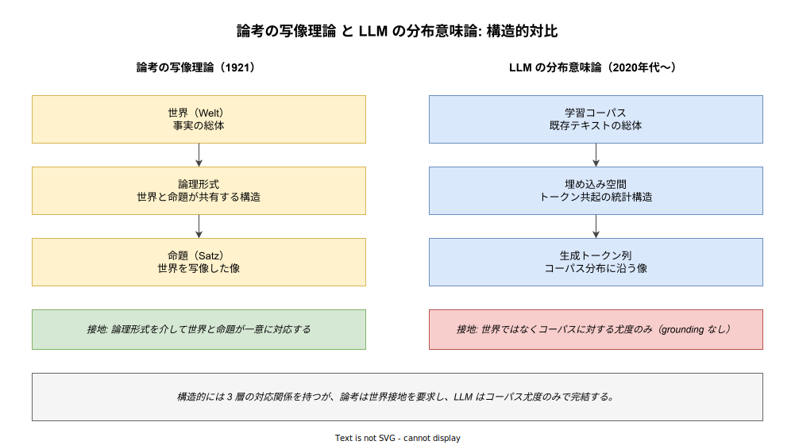
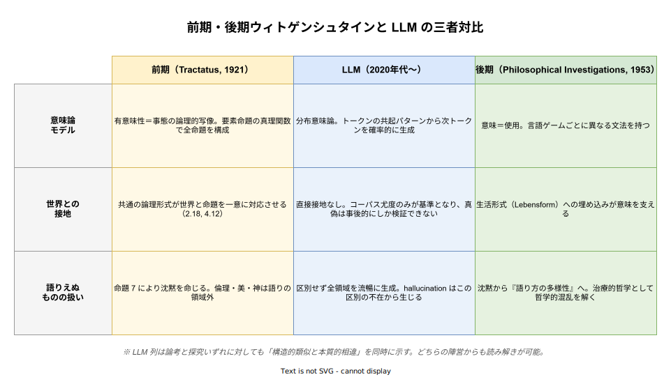

# 論理哲学論考: 生成 AI との関係性

- 対象読者: 論考の基本を押さえた読者、または LLM の仕組みを把握している技術者。哲学と AI の接点に関心のある実務者・研究者
- 学習目標: 論考の中核概念（写像理論・有意味性・語りえぬもの）を LLM の仕組みと対照し、両者の構造的類似と本質的相違を言語化できるようになる
- 所要時間: 約 50 分
- 対象版/原著: L. Wittgenstein『Tractatus Logico-Philosophicus』(1921/1922)。LLM 側は 2020 年代の Transformer 系大規模言語モデル（GPT, Claude, Gemini 等）を念頭に置く
- 最終更新日: 2026-04-18

## 1. このドキュメントで学べること

- 論考の写像理論と LLM の分布意味論の構造的対応を説明できる
- LLM の hallucination を論考の「sinnlos」「unsinnig」枠組みで位置づけられる
- 語りえぬものに関する沈黙命法（命題 7）と LLM の饒舌の対照を理解できる
- 後期ウィトゲンシュタイン（『哲学探究』）の言語ゲーム論が LLM 理解においてより親和的である理由を把握する
- プロンプトエンジニアリングや grounding 議論に対して哲学的語彙で説明できるようになる

## 2. 前提知識

- 『論理哲学論考』の 7 主命題・写像理論・語りえぬものの概要（別ドキュメント [tractatus_basics.md](./tractatus_basics.md) 参照）
- LLM の基本原理（トークン化・埋め込み・自己回帰的生成）の概略
- 本ドキュメントは哲学・AI 両側の入門部分は省略し、接合面に集中する

## 3. 概要

生成 AI、特に Transformer ベースの大規模言語モデル（LLM）の登場は、「機械が言語を扱える条件とは何か」という問いを再燃させた。この問いはウィトゲンシュタインの中心課題そのものである。前期（『論理哲学論考』、以下「論考」）は「命題が世界を写像するとはいかなることか」を問い、後期（『哲学探究』）は「意味とは生活形式に根ざした使用である」と答え直した。

LLM は表面的には「言語を扱う」ように振る舞うが、この「扱う」が論考の言う写像か、探究の言う使用か、あるいはそのどちらでもない第三の事態なのかは、まだ定まっていない。本ドキュメントは、論考の概念枠組みを手がかりに LLM を読み解き、同時に LLM を観察することで論考の射程を検証する、双方向の比較を行う。

## 4. 用語の整理

| 用語 | 説明 |
|------|------|
| 写像理論（Bildtheorie） | 命題は世界の事実を写像することで意味を持つという論考の中心仮説 |
| 分布意味論（Distributional Semantics） | 語の意味を共起文脈で定義する計算言語学の基本原理。Firth の「語はその交友で知られる」に由来 |
| grounding（接地） | 記号と世界の指示対象を結びつけること。シンボルグラウンディング問題として古くから議論されている |
| hallucination | LLM が事実に反するが流暢な内容を生成する現象 |
| sinnlos | 論考における「無意味」。トートロジー等、論理的に真偽が自明で世界について何も語らないもの |
| unsinnig | 論考における「ナンセンス」。論理形式を逸脱し、そもそも命題としての構造を成さないもの |
| 言語ゲーム（Sprachspiel） | 後期ウィトゲンシュタインの概念。言語使用が特定の生活の文脈で機能するあり方 |
| 生活形式（Lebensform） | 言語使用を支える共同体的な実践と行動のパターン |

## 5. 全体構造・関係図

論考の写像理論と LLM の分布意味論は、三層の対応関係（出発点→媒介空間→生成像）を持つ点で構造的に似る。一方、世界との接地（grounding）の有無で根本的に分岐する。

LLM の位置を、論考と後期ウィトゲンシュタインの二つの座標系に重ねて示したのが次の図である。LLM は前期の写像理論を「弱化した形で再演」しつつ、後期の言語ゲーム論を「生活形式を欠いた統計的近似」として実装している、という二重性を持つ。

## 6. 主要な論点・構造

### 6.1 写像理論と LLM の構造的類比

論考において命題が意味を持つのは、命題と事実が共通の論理形式を共有し、命題が事実を写像するからである（2.18, 4.12）。LLM においてトークン列が流暢に見えるのは、学習コーパスの分布と生成分布が共通の埋め込み空間を共有するからである。両者は「媒介となる構造を介した対応」という骨組みにおいて同型である。

この類比は技術者が NLP の基礎を説明する際にも引用される。前処理で語をベクトル化する営みは「事実を論理形式に載せる」操作として読み替え可能である。ただしこの類比は骨組みの類似にとどまり、「何が何を写像するのか」という核心で決定的に異なる。

### 6.2 世界接地（grounding）の欠如

論考の写像は「世界」を相手取る。事実は世界内に存立しており、命題の真偽はその事実との一致で決定される（2.21, 4.25）。LLM の写像は「コーパス」を相手取る。コーパスは世界の記述ではあるが世界そのものではない。LLM にとって真らしさは「コーパス分布上の尤度」であり、世界との一致は尤度から独立には保証されない。

この乖離が、LLM による hallucination の構造的な根拠である。世界への接地を持たない写像は、どれほど精緻でも「世界に関する命題」にはならない。論考の立場から見れば、LLM の出力は「世界を写像していないにもかかわらず写像した形式を取る」という奇妙な地位を占める。

### 6.3 hallucination の論考的読解

LLM の hallucination は、論考の語彙では「sinnlos」ではなく「unsinnig」に近い。sinnlos はトートロジー等、構造は有意味だが情報量ゼロな命題を指す。これに対し unsinnig は、論理形式の誤用により命題として成立しないものを指す。

LLM が「存在しない論文を引用する」ような事例は、文法的には整っており論考の有意味性テストを表面的にすり抜けるように見えるが、事実との対応を欠く点で命題としての機能を果たしていない。論考が想定したのは人間の哲学者の誤用であったが、LLM はその誤用を自動化し、工業的規模で生産するという解釈の余地がある。

### 6.4 語りえぬものと LLM の饒舌

論考は倫理・美・神・人生の意味を「語りえぬもの」として沈黙の対象とし、命題 7 で「沈黙せよ」と命じる。LLM は、この区別を持たない。倫理相談にも美的判断にも宗教的実存にも、同じ流暢さで応答する。

この饒舌は単なる技術的特徴ではなく、論考の倫理観からすると深刻な問題である。「語りえぬもの」は本来「示される」べきであり、言語化の試みそのものがその価値を損なうと論考は主張する。LLM の設計は、論考の禁欲的な言語観とは対極の、「全てが言語化可能である」という暗黙の前提に立つ。

### 6.5 後期ウィトゲンシュタインとの対比

後期『哲学探究』は、意味を「使用」と捉え直した。語の意味は辞書にではなく、特定の言語ゲームでの振る舞いにある。LLM の学習は、使用パターンを大量に観察することに相当する。この点では論考よりも探究に親和的である。

しかし後期ウィトゲンシュタインは、言語ゲームが「生活形式（Lebensform）」に根ざすことを強調した。言語ゲームは共同体の行為・訓練・応答の実践と切り離せない。LLM はこの生活形式を持たない。プロンプトはゲームのルール指定として機能するが、ルールを実行する主体の生活はそこにない。

したがって LLM は「前期の写像の弱形」かつ「後期の使用論の生活形式なき近似」として、両者のいずれにも完全には属さない第三の位置を占めると読める。

## 7. 読解のポイント

- **論考と探究の両方を参照すべき**: LLM は「前期の枠組みで読むと欠如が浮き彫り、後期の枠組みで読むと親和的だが別の欠如がある」という二重性を持つ。片方だけでは理解を誤る
- **「LLM はウィトゲンシュタインを実装した」は誇張**: 分布意味論は Firth・Harris らの言語学的伝統に直接由来し、ウィトゲンシュタイン経由ではない。思想的親和性と実装の系譜は区別して扱う
- **hallucination は技術的問題であると同時に哲学的問題**: 「事実と命題の対応」という古典的問題が、技術的に可視化された現象として再浮上している
- **プロンプトエンジニアリング＝言語ゲーム設計**: ロール・ゴール・制約の明示はゲームルールの指定に相当する。この読み替えは工学実践にも有用である

## 8. 発展的トピック

- **シンボルグラウンディング問題**: Harnad (1990) の古典的問題は、LLM 時代に具体的に再定式化されている。マルチモーダルモデル（視覚・音声の接地）はこの問題への部分的応答と見なせる
- **中国語の部屋と言語ゲーム**: Searle の中国語の部屋論証は、ウィトゲンシュタイン的視点からは「生活形式なき規則運用」として読み替え可能である
- **治療的哲学としての LLM 批判**: 後期ウィトゲンシュタインは哲学を「言語の誤用による混乱の治療」とした。LLM が提示する疑似命題に対して、この治療的態度を適用する試みがある
- **AI 倫理と語りえぬもの**: 倫理判断の自動化は、論考の「倫理は語りえぬ」という立場から深い緊張関係を生む

## 9. よくある誤解

- **「LLM は意味を理解している／していない」の二分法は粗すぎる**: 論考・探究のどちらの意味論を採るかで「理解」の定義が変わる。二分法ではなく「どの意味論において何を欠くか」を問うべきである
- **分布意味論＝言語ゲーム論ではない**: 両者は「文脈依存の意味」という点で似るが、言語ゲーム論は行為と生活を本質的に含む。分布意味論は共起の統計に還元する点で範囲が狭い
- **hallucination は単なるバグではない**: 世界接地を欠く写像の構造的帰結であり、規模拡大や微調整で消えるとは限らないという読解がある。論考的に言えばアーキテクチャ由来の問題である
- **「ウィトゲンシュタインが LLM を予言した」は過剰解釈**: 類推は啓発的だが歴史的根拠はない。学習上の補助線として扱うべきである

## 10. 現代的な位置づけ・影響

ウィトゲンシュタインと LLM を論じる試みは、2023 年以降に急速に増加した。技術者向け媒体から文化批評誌、学術論文まで広く扱われている。論点の多くは次の三つに集約される。第一は、分布意味論と言語ゲーム論の親和性である。第二は、grounding の欠如を論考の写像理論で浮き彫りにする批判である。第三は、LLM の出力を「治療的に読む」という実践論的応答である。

技術的には、この議論は Retrieval-Augmented Generation（RAG）や Constitutional AI のような「外部からの接地付与」の設計動機と結びつく。哲学的には、論考・探究両方の現代的再読のきっかけとなっている。ただし、LLM を「ウィトゲンシュタインの実装」とするような安易な図式化は、両者の厳密さを損なうため注意が必要である。

## 11. 演習問題

1. LLM が「夏目漱石が書いた『吾輩はサイボーグである』」という存在しない書籍を生成した場合、この出力を論考の「sinnlos」「unsinnig」「有意味」のいずれに分類するか。理由とともに答えよ
2. 「LLM は意味を理解していない」という主張を、論考の有意味性基準と探究の使用論の双方から検討し、それぞれどう再定式化できるか論じよ
3. RAG（検索強化生成）が grounding 問題にどう応答しているか、写像理論の用語で説明せよ
4. 命題 7「語りえぬものには沈黙せよ」を LLM 設計原則として実装するなら、どのような具体的制約になるか考察せよ

## 12. さらに学ぶには

- 関連 Knowledge: [論理哲学論考: 基本](./tractatus_basics.md)
- 原典:
  - L. Wittgenstein『論理哲学論考』野矢茂樹訳、岩波文庫（特に 2.1〜4.12, 6.4〜7）
  - L. Wittgenstein『哲学探究』鬼界彰夫訳、講談社（特に §§1–43, §§241–242）
- 関連論考（一次文献以外）:
  - S. Harnad, "The Symbol Grounding Problem", Physica D 42 (1990)
  - E. Bender et al., "On the Dangers of Stochastic Parrots", FAccT 2021
  - R. Millière and C. Buckner, "A Philosophical Introduction to Language Models" (2024)

## 13. 参考資料

- STRV Blog, "Language Games and LLMs: What Wittgenstein Can Teach Us" (https://www.strv.com/blog/language-games-and-llms-what-wittgenstein-can-teach-ai-engineers)
- Christian Perone, "NLP word representations and the Wittgenstein philosophy of language" (https://blog.christianperone.com/2018/05/nlp-word-representations-and-the-wittgenstein-philosophy-of-language/)
- Commonweal Magazine, "Wittgenstein's Apocalypse" (https://www.commonwealmagazine.org/wittgenstein-apocalypse-ludwig-stern-ai-artificial-intelligence-technology)
- Stanford Encyclopedia of Philosophy: "Ludwig Wittgenstein" (https://plato.stanford.edu/entries/wittgenstein/)
- AI Inquiry Garden, "AI Meets Philosophy Vol. 5: LLMs as Language Games" (Medium, 2024)
