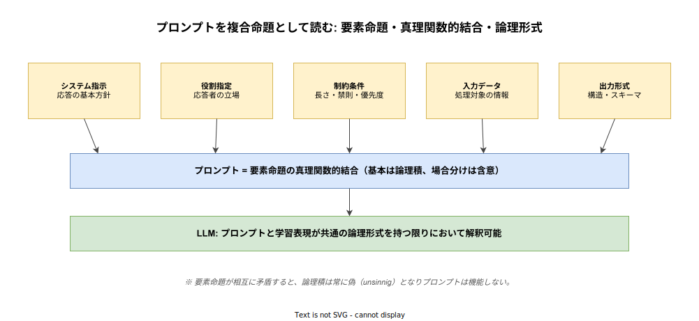
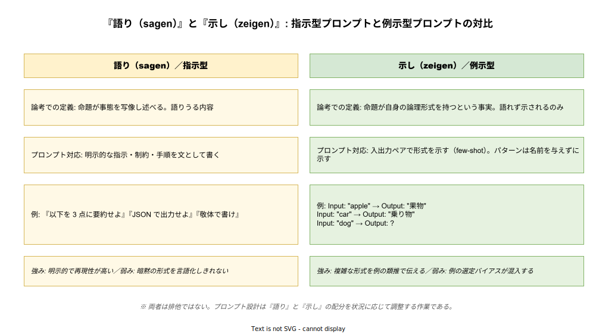

# 論理哲学論考: 生成 AI のプロンプトとの関係性

- 対象読者: プロンプトエンジニアリングを実践する技術者、または論考の基本を押さえた上で AI 実装上の設計語彙を広げたい読者
- 学習目標: プロンプトを論考の概念枠組み（複合命題・論理形式・語り／示し）で読み解き、設計原則を哲学的語彙で説明できるようになる
- 所要時間: 約 45 分
- 対象版/原著: L. Wittgenstein『Tractatus Logico-Philosophicus』(1921/1922)。プロンプト側は 2020 年代の LLM（GPT, Claude, Gemini 等）の指示型インターフェースを念頭に置く
- 最終更新日: 2026-04-18

## 1. このドキュメントで学べること

- プロンプトを「要素命題の真理関数的結合（複合命題）」として読む視座を獲得できる
- 論考の「語り（sagen）」と「示し（zeigen）」の対比を、指示型プロンプトと few-shot 例示型プロンプトに対応づけられる
- プロンプトの成立条件を「論理形式の共有」の観点から説明できる
- プロンプトによる「論理空間の切り出し」という捉え方で出力の多様性と制御を理解できる
- 論考の枠組みが届かない領域（命令文・語用論）を自覚し、後期ウィトゲンシュタインとの継ぎ目を見つけられる

## 2. 前提知識

- 『論理哲学論考』の 7 主命題と写像理論の概要（[tractatus_basics.md](./tractatus_basics.md) 参照）
- 生成 AI 一般と論考の関係性（[tractatus_generative-ai-relation.md](./tractatus_generative-ai-relation.md) 参照）
- プロンプトエンジニアリングの基礎（システム指示・役割指定・few-shot・chain-of-thought 等の基本用語）

## 3. 概要

プロンプトは LLM を動かす「文」である。しかしこの文は日常言語の発話とも、プログラムのソースコードとも、数学の証明文とも異なる。プロンプトは「モデルが特定の応答を生成する条件」を指定する独特の言語であり、この独特さを分析するための語彙が実務の中でまだ定まっていない。

論考は「言語はいかにして意味を持つか」という問いに対し、命題・要素命題・真理関数・論理形式という整理された語彙を与えた。本ドキュメントは、この語彙をプロンプト分析に適用することで、プロンプト設計を感覚的技芸から論理的構築へ押し上げる地図を提供する。ただし論考は記述命題を中心に据えるため、命令・指示を含むプロンプトには射程が及ばない部分がある。その境界線も併せて明示する。

## 4. 用語の整理

| 用語 | 説明 |
|------|------|
| 要素命題（Elementarsatz） | それ以上分解できない最小の命題。論考では名の結合として構成される |
| 真理関数（Wahrheitsfunktion） | 要素命題の真偽の組合せから複合命題の真偽が決まる関数 |
| 複合命題 | 要素命題を論理演算子（∧, ∨, ¬, →）で結合した命題 |
| 論理形式（logische Form） | 像と世界が対応するための共通構造。像に「示される」もの |
| 語り（sagen） | 命題が事態を写像して明示的に述べること |
| 示し（zeigen） | 論理形式など、命題が内的に持つが明示できないものが現れること |
| システムプロンプト | 対話全体を規定する基本方針の指示。公理系に相当する位置を占める |
| few-shot 例示 | 入出力ペアを並べてパターンを示すプロンプト技法 |
| chain-of-thought | 思考過程を中間出力として展開させるプロンプト技法 |
| 論理空間（logischer Raum） | 論考で可能な事態の全体を指す概念。本稿ではプロンプトが切り出す応答可能領域の喩えとして転用する |

## 5. 全体構造・関係図

プロンプトを論考的に読むと、まず要素命題の集合が真理関数的に結合されて 1 つの複合命題を成し、その複合命題を LLM が解釈するという三層構造が見える。

プロンプト内の手段は、明示的に指示を語るものと、例で暗黙に示すものに二分できる。論考の「語り」と「示し」の対比は、指示型プロンプトと few-shot 例示型プロンプトの役割分担をきれいに切り出す。

## 6. 主要な論点・構造

### 6.1 プロンプトを複合命題として読む

実務で書かれるプロンプトは、目的からすると単一の文に見える。しかし分解すると、「システム指示」「役割指定」「制約条件」「入力データ」「出力形式」といった独立の主張の束であり、これらが論理積（AND）で結合されている。論考の語彙で言えば、プロンプトは要素命題の真理関数的結合である（論考 5）。

この見立ては実務的な帰結を持つ。第一に、要素命題の一つが他の要素命題と矛盾する場合、論理積は恒偽となり、プロンプトは機能しない。「簡潔に」と「詳細に」を同じレベルで指示することは典型的な矛盾である。第二に、プロンプト改善は「新たな要素命題を追加する」または「既存の要素命題を洗練する」の二通りに整理できる。どちらに手を入れるべきかが判断基準として明確になる。

### 6.2 論理形式の共有とプロンプトの成立条件

論考において像が事実を写像できるのは、像と事実が「共通の論理形式」を共有するからである（2.18）。この条件をプロンプトに持ち込むと、プロンプトが機能する前提は「プロンプトが持つ論理形式と、LLM が学習した表現空間の論理形式が共通している」ことになる。

このため、学習コーパスの分布から離れすぎた語彙や構文を用いたプロンプトは機能しにくい。プロンプトを書くとは、モデル側の論理形式に合わせて要素命題を構成する作業である。この洞察は「なぜ明快な日本語よりも技術文書スタイルのプロンプトの方が効くことがあるのか」等、経験的に知られた事実に説明を与える。

### 6.3 「語り」と「示し」: 指示型と例示型

論考は「語れるもの」と「示されるのみのもの」を峻別する（4.12, 4.121）。前者は事態の写像として命題に現れ、後者は命題の形式として現れる。プロンプト設計において、指示型プロンプト（「敬体で書け」「3 点に要約せよ」）は「語り」に対応し、few-shot 例示は「示し」に対応する。

few-shot の入出力ペアは、形式を名指しせずに示す。モデルは例の共通パターンを「示されたもの」として内化し、新しい入力に適用する。これは論考が「論理形式は語れず示される」と述べた構造と同型である。指示型は明示性と再現性に優れ、例示型は言語化困難な暗黙の形式を伝えるのに優れる。両者は排他でなく、プロンプト設計は両者の配分を状況に応じて決める作業である。

### 6.4 論理空間の切り出しとしてのプロンプト

論考は「論理空間」を可能な事態の全体として導入する（1.13, 2.013）。本稿はこの概念を比喩的に拡張し、LLM が生成しうる応答の全体を「応答空間」と呼ぶと、プロンプトは応答空間の部分領域を指定する作業として記述できる。システム指示・制約条件はそれぞれ応答空間の境界を動かし、候補の集合を絞り込む。

この視点に立つと、プロンプトの温度（temperature）等のサンプリングパラメータは「切り出した領域内での探索幅」を調整する役割を持つ。プロンプトで領域を絞った後、サンプリングでその領域内のどこを引くかが決まる、という二段階の制御構造が浮かぶ。

### 6.5 論考の限界: 命題 vs 命令

ここまで論考の語彙でプロンプトを読み解いたが、論考には重要な限界がある。論考は「記述命題」を中心に据えており、命令文や指示文を正面から扱わない。ウィトゲンシュタイン自身、後年「言語は描写だけでなく、命令・約束・感嘆など多様な営みをなす」と気付き、前期の立場を自己批判した（『哲学探究』§23）。

プロンプトは本質的に「命令の束」であり、この自己批判が直撃する領域である。したがって論考的分析は有効だが万能ではない。論考で読めるのは主に「構造」（要素命題の結合、論理形式の共有）であり、「語用論的効果」（なぜこの命令が効くか、モデルが何を期待するか）は後期ウィトゲンシュタインの言語ゲーム論にバトンタッチする必要がある。

## 7. 読解のポイント

- **プロンプト分析の出発点としての論考**: 論考の構造的分析は、プロンプトの「骨格」を明示するのに有効である。ただし骨格が分かるだけでプロンプトが書けるわけではない点に注意する
- **真理関数の比喩は論理積に限らない**: 条件分岐を含むプロンプト（「もし X なら Y せよ」）は含意（→）として読める。複雑なプロンプトは命題論理の複合結合に対応づけて読むと整理しやすい
- **「示し」は技術的に見えづらい**: few-shot 例示の効果を定量化することは難しいが、「言語化できない形式を示す」という論考的役割を自覚するだけでも、例の選定基準が変わる
- **モデルごとに論理形式が異なる**: GPT 系と Claude 系など、学習された論理形式には差異がある。プロンプトが他モデルで機能しない場合、「論理形式の不一致」として分析できる

## 8. 発展的トピック

- **システムプロンプトと公理系の類比**: システムプロンプトを要素命題の集合（公理系）、ユーザープロンプトをそこから導出される定理、モデル出力を証明と見る構図は、形式主義的プロンプト分析の出発点になる
- **chain-of-thought と梯子の比喩**: 論考 6.54 の「梯子を登り終えたら捨てよ」は、思考の手順を残さず結論だけを採る chain-of-thought の実装哲学と響き合う
- **暗黙のコンテキストと示し**: プロンプトに書かれない文化的前提・常識・言外のニュアンスは「示される」領域に属する。LLM がこれをどこまで共有しているかは、モデルの学習分布に依存する
- **プロンプトインジェクションと矛盾の論理的帰結**: 悪意ある入力が要素命題に混入すると、プロンプト全体の真理関数が崩壊する。論考的には unsinnig な合成命題を生む攻撃として定式化できる

## 9. よくある誤解

- **「プロンプト＝命題」ではない**: プロンプトには命令・例示・入力が混在する。論考的な命題分析は構造的側面に限定される
- **真理関数的結合＝単純な論理積ではない**: 実際のプロンプトは自然言語の含意・選言・否定を柔らかく含んでおり、厳密な論理式への還元は近似に過ぎない
- **「示し」は単なる例示テクニックではない**: 論考における「示し」は「本質的に語れないもの」を含意する。few-shot で伝わる形式は本質的に言語化できないのではなく、言語化よりも例示が効率的である場合が多い。両者は分けて扱うべきである
- **論考でプロンプトをすべて説明できるわけではない**: 命令・語用論・文脈的含意などは後期の枠組みが必要である。論考は地図の一部を与えるに過ぎない

## 10. 現代的な位置づけ・影響

プロンプトエンジニアリングの議論は、2022 年末以降の LLM 普及と共に急速に整理が進んだ。初期は経験則の集積が中心だったが、OpenAI・Anthropic 等のベンダー公式ガイドは次第に「構造化された構成要素の結合」として体系化を進めている。論考的分析は、この体系化に対して哲学的裏付けを提供しうる。

特に「構造化出力」や「関数呼び出し」のような、プロンプトを命題化してスキーマに乗せる方向性は、論考の「命題の一般形式」の発想と親和的である。逆に、暗黙のコンテキストや語用論的効果を重視する方向性は、後期ウィトゲンシュタインの言語ゲーム論の方が見通しが良い。実務では両方の語彙を状況に応じて使い分けることが有効である。

## 11. 演習問題

1. 手元で実際に使っているプロンプトを 1 つ選び、システム指示・役割・制約・入力・出力形式の 5 要素に分解せよ。分解できない部分があれば、それが何に相当するか考察せよ
2. 「簡潔に」「詳細に」のような矛盾する指示が同時に含まれるプロンプトを意図的に作り、論理積の真理値がどうなるかを論考の枠組みで説明せよ
3. few-shot 例示で伝わっている「形式」を明示的な指示に書き換えてみよ。書き換えが困難な部分が、論考の言う「示し」の領域である。具体的に何が書き換え不能かを特定せよ
4. プロンプトインジェクション攻撃を、論考の「unsinnig」概念を用いて定式化せよ。攻撃成立の条件を論理的に記述できるか

## 12. さらに学ぶには

- 関連 Knowledge:
  - [論理哲学論考: 基本](./tractatus_basics.md)
  - [論理哲学論考: 生成 AI との関係性](./tractatus_generative-ai-relation.md)
- 原典:
  - L. Wittgenstein『論理哲学論考』野矢茂樹訳、岩波文庫（特に 4.12–4.121, 5, 5.1–5.101, 6, 6.54）
  - L. Wittgenstein『哲学探究』鬼界彰夫訳、講談社（特に §23 — 言語の用途の多様性）
- 実務ガイド:
  - OpenAI, "Prompt engineering guide"（公式ドキュメント）
  - Anthropic, "Prompt engineering overview"（公式ドキュメント）
  - L. Reynolds & K. McDonell, "Prompt Programming for Large Language Models" (arXiv:2102.07350)

## 13. 参考資料

- Ministry of Testing, "Testing Language Models With The Philosophy of Wittgenstein" (https://www.ministryoftesting.com/articles/ca67a167)
- STRV Blog, "Language Games and LLMs: What Wittgenstein Can Teach Us" (https://www.strv.com/blog/language-games-and-llms-what-wittgenstein-can-teach-ai-engineers)
- M. Shanahan, "Talking About Large Language Models" (arXiv:2212.03551)
- Donald Clark, "Language, AI and what we can learn from Wittgenstein" (http://donaldclarkplanb.blogspot.com/2023/06/language-ai-and-what-we-can-learn-from.html)
- Stanford Encyclopedia of Philosophy: "Ludwig Wittgenstein" (https://plato.stanford.edu/entries/wittgenstein/)
