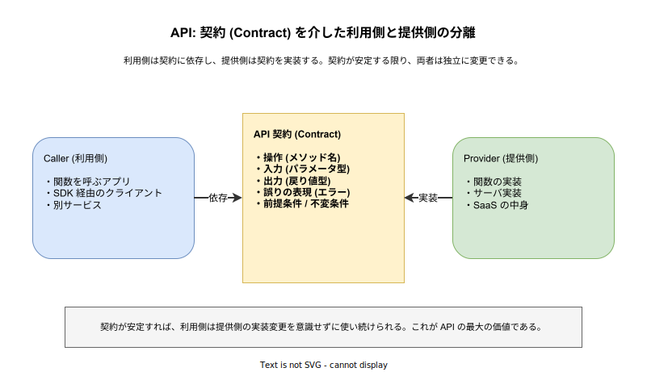
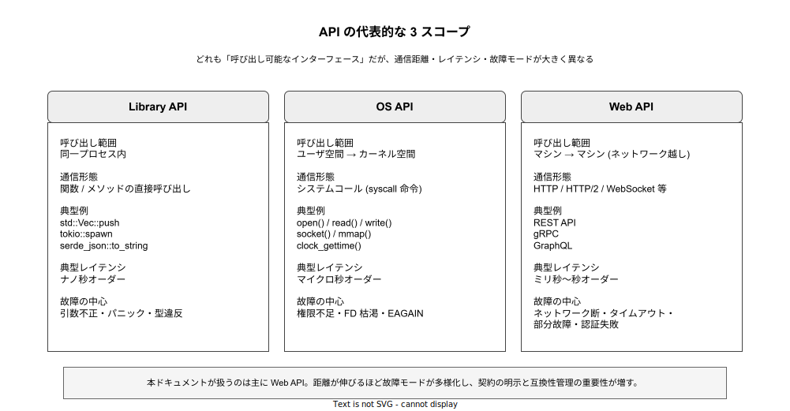

# API: 基本

- 対象読者: ソフトウェア開発の経験はあるが、「API」という用語を体系的に整理したことがない開発者
- 学習目標: API が「何のために存在するか」「どんな種類があるか」「どう設計・利用すれば破綻しないか」を説明できるようになる
- 所要時間: 約 30 分
- 対象バージョン: 概念学習のため特定バージョン非依存（例示は HTTP/1.1・POSIX システムコール・gRPC 1.x を前提とする）
- 最終更新日: 2026-04-28

## 1. このドキュメントで学べること

- API という言葉が指す「契約 (Contract) としての側面」を説明できる
- Library API / OS API / Web API のスコープごとの違いを区別できる
- API を設計・利用する際の基本的な構成要素（操作・入力・出力・エラー・前提条件）を列挙できる
- 互換性・バージョニング・冪等性といった API 運用の中核論点を語れる
- REST・gRPC・GraphQL など個別の Web API 技術を学ぶ前の共通基盤を持てる

## 2. 前提知識

- 関数呼び出し・引数・戻り値の基本理解
- HTTP のリクエスト/レスポンスモデルの初歩（Web API 例で利用）
- 関連 Knowledge: [REST API の基本](./rest-api_basics.md) / [gRPC の基本](./gRPC_basics.md)

## 3. 概要

API（Application Programming Interface）は、あるソフトウェアの機能を内部実装に立ち入らずに別のソフトウェアから呼び出すための「契約」である。「契約」とは、呼び出し側 (Caller) が守るべき呼び出し方と、提供側 (Provider) が守るべき返し方を両者が合意した形で文書化・型化したものを指す。

API が本質的に解いている問題は「結合の問題」である。あるコードが別のコードの内部実装を直接知ってしまうと、片方を変えるだけで両方が壊れる。API はこの直接結合を「契約」という間接物で置き換えることで、利用側と提供側を独立に変更できるようにする。たとえば PostgreSQL のサーバ実装を 16 から 17 に上げても SQL 文を書いたアプリは原則変えなくてよい。これは SQL（およびワイヤープロトコル）が「API 契約」として安定しているためである。

歴史的に API は、まず関数呼び出しの単位で生まれた（Library API）。OS が共通機能をシステムコールとして提供する形（OS API）に拡張され、ネットワーク越しに RPC として呼び出す形（Web API）へと外挿されてきた。現代の Web API はその延長上にあり、距離が伸びるほど故障モードが多様化するため、契約の明示性と互換性管理がより重要になる。

## 4. 用語の整理

| 用語 | 説明 |
|------|------|
| 契約 (Contract) | 呼び出し方と返し方の取り決め。シグネチャ・型・エラー・前提条件を含む |
| エンドポイント (Endpoint) | API を呼び出す具体的な窓口。Library API なら関数名、Web API なら URL |
| シグネチャ (Signature) | 操作名・パラメータ型・戻り値型の組。契約の最小単位 |
| 冪等性 (Idempotent) | 同じ呼び出しを複数回行っても結果が同じになる性質 |
| 副作用 (Side Effect) | 呼び出しが内部状態や外界を変えること（書き込み・送信など） |
| 後方互換性 | 旧バージョンの利用側が新バージョンの提供側を、変更なしに使い続けられる性質 |
| バージョニング | 契約の変更を識別子（v1・v2 等）で区別し、利用側を破壊せず進化させる手法 |
| RPC | Remote Procedure Call。ネットワーク越しの呼び出しを「関数呼び出しのように」見せる仕組み |

## 5. 仕組み・アーキテクチャ

API の核心は「契約を介した結合」である。利用側は契約だけに依存し、提供側は契約を実装する。両者は契約以外の知識を共有しないため、片方を変えても契約が変わらない限り、もう片方は影響を受けない。



API という言葉は、呼び出し距離が異なる複数のスコープに同じ名称で使われる。Library API・OS API・Web API は、いずれも「呼び出し可能なインターフェース」という性質は共通だが、レイテンシも故障モードも大きく異なる。



距離が伸びるほど「ネットワーク断」「タイムアウト」「部分故障」といった故障モードが増え、利用側は契約を信じるだけでは不十分になる。これが Web API でリトライ・タイムアウト・サーキットブレーカ・冪等性などの議論が中心となる理由である。

## 6. 環境構築

API という概念自体に専用の環境構築は不要である。後段の例を実行するために以下があれば十分である。

### 6.1 必要なもの

- bash（多くの OS に標準搭載）
- curl（コマンドラインの HTTP クライアント）
- インターネット接続（Web API 例の動作確認用）

### 6.2 動作確認

```bash
# bash と curl が使えることを確認する
bash --version | head -1
curl --version | head -1
```

両者のバージョン文字列が表示されれば準備完了である。

## 7. 基本の使い方

API の 3 スコープを、最小のシェルコマンドで対比する。同じ「呼び出し可能なインターフェース」でも、距離と故障モードがどれほど異なるかを体感することが目的である。

```bash
# API の 3 スコープを最小コマンドで比較する例
# 同一プロセス → カーネル → ネットワーク越し、と距離が伸びていく

# Library API 相当: 同一プロセス内のシェル関数呼び出し
greet() { printf "hello %s\n" "$1"; }
# ナノ秒で完了し、失敗を表す概念をほぼ持たない
greet "world"

# OS API 相当: cat は内部で open() / read() システムコールを呼ぶ
# 失敗の中心はファイル不存在・権限不足・FD 枯渇など環境依存
cat /etc/hostname

# Web API 相当: HTTP 経由で公開エンドポイントを呼ぶ
# 故障の中心はネットワーク断・タイムアウト・5xx・認証失敗など多様
curl -s -o /dev/null -w "status=%{http_code}\n" https://httpbin.org/get
```

### 解説

- Library API は失敗の種類が極めて少なく、戻り値の型も小さい。`greet` は失敗を表す型を持たない
- OS API は失敗が「環境次第」で、戻り値や errno で失敗の種類を表現する設計が普通になる
- Web API は失敗の種類が爆発的に増え、ステータスコード・タイムアウト・接続失敗・認証失敗が混在する。型化されていてもそれは「故障の存在」を覆い隠さない

## 8. ステップアップ

### 8.1 API 契約の構成要素

契約は最低限、次の 5 つを取り決めている。

| 要素 | 内容 | 例 |
|------|------|----|
| 操作名 | 何を呼ぶか | `Vec::push` / `POST /orders` / `OrderService.Create` |
| 入力 | パラメータの型・必須/任意・取り得る値の範囲 | `name: string (1..=64)` |
| 出力 | 戻り値の型・成功時のスキーマ | `Order { id: uuid, status: string }` |
| エラー | 失敗の種類・エラーコード・再試行可否 | `409 Conflict` / `INVALID_ARGUMENT` |
| 前提条件 | 呼び出し順序・認証要件・冪等性 | 認証必須・同一 idempotency-key で冪等 |

これらを暗黙に頭の中だけで合意した API は破綻しやすい。OpenAPI・Protobuf・gRPC IDL のように「機械可読な契約定義」を持つことが、実務では事実上の必須条件である。

### 8.2 互換性とバージョニング

契約は時間とともに進化する。利用側を壊さない進化を「後方互換」と呼ぶ。

| 変更 | 後方互換か | 理由 |
|------|------------|------|
| 任意フィールドの追加 | 互換 | 旧利用側は新フィールドを単に無視できる |
| 列挙値の追加 | 互換（条件付き） | 旧利用側が未知値を許容する設計が前提 |
| エラーコードの追加 | 互換 | 旧利用側はデフォルトのエラーパスにフォールバック |
| 必須フィールドの追加 | 破壊的 | 旧利用側のリクエストが拒否される |
| フィールド型・名前の変更 | 破壊的 | 旧利用側のシリアライズが失敗する |

破壊的変更を出す場合は、URL パスやヘッダで `v1`・`v2` のように世代を分け、旧版を一定期間並走させて段階的に移行させる。

### 8.3 冪等性とリトライ

Web API では「呼び出しが届いたか」「処理されたか」「応答が届いたか」をそれぞれ独立に失敗しうる。利用側がリトライしても問題が起きない設計を「冪等性のある API」と呼び、課金や注文のように副作用を伴う操作で特に重要になる。冪等キー（`Idempotency-Key` ヘッダ等）を入力に含め、同じキーでの再呼び出しは前回と同じ結果を返すように実装する。

## 9. よくある落とし穴

- **「API がある」と「契約が明示されている」を混同する**: 関数や URL が公開されているだけでは契約ではない。型・エラー・前提を取り決めて初めて契約として機能する
- **エラーをすべて 200 OK で返す**: ステータスコードや戻り値型でエラーを表現せず、本文の `success` フラグだけに頼ると、利用側のエラーハンドリングが破綻する
- **暗黙の順序依存**: 「先に init を呼んでから start」のような前提を契約に書かないと、利用側が誤った順序で呼び出して未定義動作になる
- **Library API の感覚で Web API を呼ぶ**: ネットワーク呼び出しを「ただの関数呼び出し」として扱い、タイムアウト・リトライ・サーキットブレーカを実装し忘れると、上流の障害がそのまま自分のサービスを巻き込む
- **破壊的変更をサイレントに行う**: 既存利用者がいる API のフィールド型を変えるだけで、本番障害になる。バージョニングと並走期間を必ず設ける

## 10. ベストプラクティス

- 契約を機械可読な形式（OpenAPI・Protobuf）で記述し、ドキュメントとコードを契約から生成する
- 操作名・入力型・出力型・エラー・前提条件の 5 点セットを設計の初手で固める
- 後方互換性のルール（追加は OK・変更/削除は新バージョン）を最初から決めて運用する
- 副作用を伴う操作には冪等キーを導入する
- タイムアウト・リトライ・サーキットブレーカは利用側の責務として明示的に設計する
- HTTP / gRPC のステータスコードを正しく使い、機械的判別を可能にする
- 公開 API には SLA/SLO・レートリミット・廃止ポリシーを文書化する

## 11. 演習問題

1. 自分が直近で使ったライブラリ関数を 1 つ選び、その「契約」（操作名・入力・出力・エラー・前提条件）を書き出してみよ
2. ある REST API が `POST /orders` を提供している。利用側がリトライしても二重発注しないようにするには、提供側と利用側それぞれに何が必要か説明せよ
3. ある API のレスポンス JSON に新しいフィールドを追加する変更は後方互換か。逆に既存フィールドの型を `string` から `int` に変える変更はどうか。それぞれ理由とともに述べよ

## 12. さらに学ぶには

- 関連 Knowledge: [REST API の基本](./rest-api_basics.md)
- 関連 Knowledge: [gRPC の基本](./gRPC_basics.md)
- 関連 Knowledge: [Protocol Buffers の基本](./protobuf_basics.md)
- 関連 Knowledge: [HOL ブロッキング](./hol-blocking_basics.md)（Web API の故障モード理解）
- API 設計の古典: Joshua Bloch "How to Design a Good API and Why It Matters"

## 13. 参考資料

- Fielding, R. T. (2000). *Architectural Styles and the Design of Network-based Software Architectures.* PhD dissertation, UC Irvine.
- Bloch, J. (2006). *How to Design a Good API and Why It Matters.* Google Tech Talk.
- IETF RFC 9110 - HTTP Semantics: <https://datatracker.ietf.org/doc/html/rfc9110>
- gRPC Documentation: <https://grpc.io/docs/>
- OpenAPI Specification: <https://spec.openapis.org/oas/latest.html>
