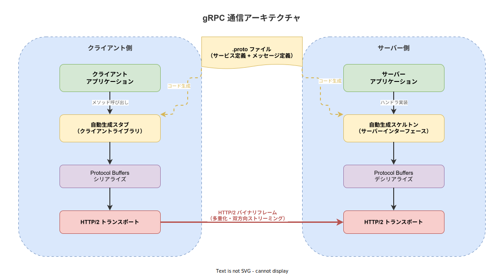
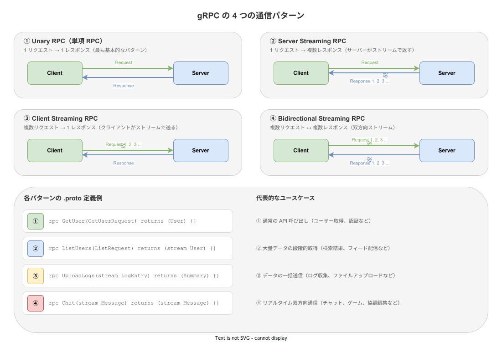

# gRPC: 概要

- 対象読者: REST API の基本を理解している開発者
- 学習目標: gRPC の設計思想・通信モデル・基本的なサービス定義を理解し、REST との違いを説明できるようになる
- 所要時間: 約 35 分
- 対象バージョン: gRPC 1.60+（Protocol Buffers proto3）
- 最終更新日: 2026-04-12

## 1. このドキュメントで学べること

- gRPC がどのような課題を解決するために設計されたかを説明できる
- Protocol Buffers によるサービス定義とメッセージ定義を読み書きできる
- 4 つの RPC 通信パターン（Unary / Server Streaming / Client Streaming / Bidirectional Streaming）を区別できる
- gRPC と REST の違いを技術的根拠をもって説明できる

## 2. 前提知識

- HTTP の基本（リクエスト・レスポンスモデル）
- REST API の基本概念（エンドポイント、JSON）
- クライアント・サーバーアーキテクチャの理解

## 3. 概要

gRPC は Google が開発した高性能なリモートプロシージャコール（RPC）フレームワークである。2015 年にオープンソースとして公開された。

従来の REST API では、テキストベースの JSON をやり取りするため、シリアライズ・デシリアライズのオーバーヘッドが発生する。また、API の型定義がサーバーとクライアントで乖離しやすい問題があった。gRPC はこれらの課題を以下の技術で解決する。

- **Protocol Buffers**: バイナリシリアライゼーション形式。JSON より高速かつ軽量にデータを転送する
- **HTTP/2**: 多重化・ヘッダー圧縮・双方向ストリーミングを提供するトランスポートプロトコル
- **コード自動生成**: `.proto` ファイルから Go、Rust、Java、Python 等のクライアント・サーバーコードを自動生成する

## 4. 用語の整理

| 用語 | 説明 |
|------|------|
| RPC（Remote Procedure Call） | リモートのサーバー上の関数を、ローカルの関数と同じように呼び出す仕組み |
| Protocol Buffers（protobuf） | Google が開発したバイナリシリアライゼーション形式。データ構造を `.proto` ファイルで定義する |
| `.proto` ファイル | サービスのメソッド定義とメッセージ（データ構造）定義を記述するファイル |
| スタブ（Stub） | `.proto` から自動生成されるクライアント側のコード。サーバーのメソッドを呼び出すためのインターフェース |
| スケルトン（Skeleton） | `.proto` から自動生成されるサーバー側のコード。開発者がビジネスロジックを実装するためのインターフェース |
| メタデータ（Metadata） | RPC 呼び出しに付随するキー・バリュー形式の付加情報。HTTP ヘッダーに相当する |
| ステータスコード | RPC の結果を示すコード。`OK`、`NOT_FOUND`、`INTERNAL` など 17 種類が定義されている |
| チャネル（Channel） | クライアントとサーバー間の接続を抽象化したオブジェクト |

## 5. 仕組み・アーキテクチャ

gRPC では、`.proto` ファイルに定義したサービスとメッセージから、クライアント用のスタブとサーバー用のスケルトンが自動生成される。通信は HTTP/2 上でバイナリフレームとして行われる。



gRPC は 4 つの通信パターンを提供する。用途に応じて適切なパターンを選択する。



## 6. 環境構築

### 6.1 必要なもの

- Protocol Buffers コンパイラ（`protoc`）
- 対象言語用の gRPC プラグイン（例: Go の場合 `protoc-gen-go-grpc`）

### 6.2 セットアップ手順

```bash
# protoc をインストールする（macOS の場合）
brew install protobuf

# Go 用の gRPC プラグインをインストールする
go install google.golang.org/protobuf/cmd/protoc-gen-go@latest
go install google.golang.org/grpc/cmd/protoc-gen-go-grpc@latest

# バージョンを確認する
protoc --version
```

### 6.3 動作確認

```bash
# .proto ファイルから Go コードを生成する
protoc --go_out=. --go-grpc_out=. hello.proto
```

生成されたファイル（`hello.pb.go` と `hello_grpc.pb.go`）が出力されれば成功である。

## 7. 基本の使い方

以下は最も基本的な Unary RPC のサービス定義である。

```protobuf
// gRPC サービスとメッセージを定義するファイル

// Protocol Buffers のバージョンを指定する
syntax = "proto3";

// パッケージ名を宣言する
package greeter;

// Go のパッケージパスを指定する
option go_package = "example.com/greeter";

// 挨拶サービスを定義する
service Greeter {
  // 名前を受け取り挨拶を返す単項 RPC
  rpc SayHello (HelloRequest) returns (HelloReply) {}
}

// リクエストメッセージを定義する
message HelloRequest {
  // ユーザー名フィールド（フィールド番号 1）
  string name = 1;
}

// レスポンスメッセージを定義する
message HelloReply {
  // 挨拶メッセージフィールド（フィールド番号 1）
  string message = 1;
}
```

### 解説

- `syntax = "proto3"` で Protocol Buffers v3 を使用することを宣言する
- `service` ブロックで RPC メソッドを定義する。メソッド名・リクエスト型・レスポンス型を指定する
- `message` ブロックでデータ構造を定義する。各フィールドには型・名前・一意の番号を付与する
- フィールド番号はバイナリエンコーディングに使われるため、一度割り当てたら変更してはならない

## 8. ステップアップ

### 8.1 ストリーミング RPC の定義

```protobuf
// ストリーミング RPC を含むサービス定義ファイル

// Protocol Buffers v3 を使用する
syntax = "proto3";
// パッケージを宣言する
package monitoring;

// 監視サービスを定義する
service Monitor {
  // サーバーストリーミング: メトリクスを継続的に受信する
  rpc WatchMetrics (WatchRequest) returns (stream Metric) {}
  // クライアントストリーミング: ログを一括送信する
  rpc UploadLogs (stream LogEntry) returns (UploadSummary) {}
  // 双方向ストリーミング: リアルタイムにアラートを交換する
  rpc AlertStream (stream Alert) returns (stream Alert) {}
}
```

`stream` キーワードを付けた側がストリームとしてデータを送受信する。

### 8.2 gRPC と REST の比較

| 観点 | gRPC | REST |
|------|------|------|
| プロトコル | HTTP/2 | HTTP/1.1 または HTTP/2 |
| データ形式 | Protocol Buffers（バイナリ） | JSON（テキスト） |
| 型安全性 | `.proto` による厳密な型定義 | OpenAPI 等で別途定義が必要 |
| ストリーミング | 双方向ストリーミングをネイティブサポート | SSE・WebSocket で別途実装が必要 |
| ブラウザ対応 | gRPC-Web が必要 | ネイティブ対応 |
| 可読性 | バイナリのため人間には読みにくい | JSON のため読みやすい |

gRPC はマイクロサービス間通信に適し、REST は外部公開 API やブラウザ向け API に適する。

## 9. よくある落とし穴

- **ブラウザからの直接呼び出し**: gRPC は HTTP/2 のフル機能を必要とするため、ブラウザから直接呼び出せない。gRPC-Web またはリバースプロキシ（Envoy 等）を経由する必要がある
- **フィールド番号の変更**: `.proto` のフィールド番号を変更すると後方互換性が壊れる。削除したフィールド番号は `reserved` で予約し再利用を防ぐ
- **デフォルト値の扱い**: proto3 ではすべてのフィールドにデフォルト値がある（文字列は空文字、数値は 0）。「値が設定されていない」と「デフォルト値が設定された」を区別するには `optional` キーワードまたは `google.protobuf.wrappers` を使用する
- **エラーハンドリングの欠落**: gRPC には 17 種類のステータスコードがある。適切なコード（`NOT_FOUND`、`INVALID_ARGUMENT` 等）を返さないと、クライアント側で原因の特定が困難になる

## 10. ベストプラクティス

- サービス定義（`.proto`）は専用リポジトリで管理し、サーバーとクライアントの両方から参照する
- フィールド番号は一度割り当てたら変更しない。削除時は `reserved` で予約する
- デッドライン（タイムアウト）を必ず設定する。未設定の場合、障害時にリクエストが無期限に待機する
- インターセプターでログ出力・認証・メトリクス収集などの横断的関心事を実装する
- ステータスコードとエラーメッセージを適切に使い分け、クライアントが障害原因を特定できるようにする

## 11. 演習問題

1. 書籍管理サービスの `.proto` ファイルを作成せよ。`GetBook`（Unary）と `ListBooks`（Server Streaming）の 2 メソッドを定義すること
2. 上記で定義した `.proto` ファイルに、`CreateBook` メソッドを追加せよ。リクエストメッセージに `title`（文字列）、`author`（文字列）、`price`（整数）を含めること
3. gRPC のステータスコード一覧を確認し、「書籍が見つからない場合」「リクエストのバリデーションに失敗した場合」「サーバー内部エラーの場合」にそれぞれどのコードを返すべきかを答えよ

## 12. さらに学ぶには

- 公式ドキュメント: https://grpc.io/docs/
- Protocol Buffers 公式ガイド: https://protobuf.dev/programming-guides/proto3/
- gRPC ステータスコード一覧: https://grpc.io/docs/guides/status-codes/

## 13. 参考資料

- gRPC Core Concepts: https://grpc.io/docs/what-is-grpc/core-concepts/
- Protocol Buffers Language Guide (proto3): https://protobuf.dev/programming-guides/proto3/
- gRPC over HTTP2: https://github.com/grpc/grpc/blob/master/doc/PROTOCOL-HTTP2.md
