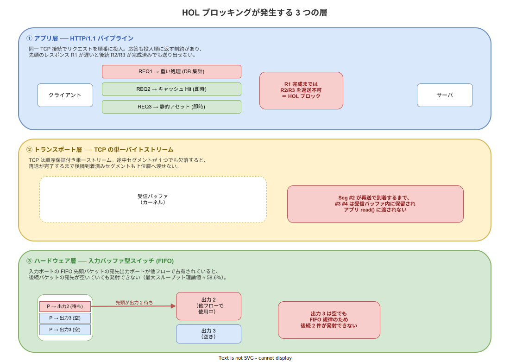
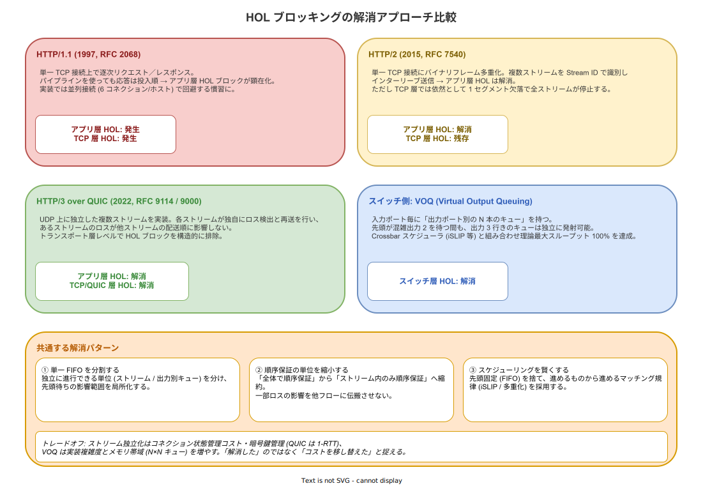

# HOL ブロッキング: 概要

- 対象読者: TCP/IP と HTTP の基本（リクエスト／レスポンス、コネクション）を知っているが、HOL ブロッキングという用語を体系的に学んだことがない開発者
- 学習目標: HOL ブロッキングの定義・発生する 3 つの層（アプリ／トランスポート／ハードウェア）・解消アプローチ（HTTP/2 多重化・QUIC・VOQ）を区別して説明でき、自分のシステムで HOL ブロッキングが起きうる箇所を特定できるようになる
- 所要時間: 約 30 分
- 対象バージョン: HTTP/1.1（RFC 9112）、HTTP/2（RFC 9113）、HTTP/3（RFC 9114）、QUIC（RFC 9000）
- 最終更新日: 2026-04-28

## 1. このドキュメントで学べること

- HOL（Head-of-Line）ブロッキングの定義と「先頭が詰まると後続も止まる」現象の本質を説明できる
- アプリ層（HTTP/1.1）／トランスポート層（TCP）／ハードウェア層（入力バッファ型スイッチ）の 3 種類を区別できる
- HTTP/2 多重化が解消する範囲と、TCP 層で残る HOL ブロッキングの限界を理解できる
- HTTP/3（QUIC）が UDP を採用した動機を HOL ブロッキングと結びつけて説明できる
- スイッチファブリックにおける VOQ（Virtual Output Queuing）の必要性を理解できる
- 自分のシステム（gRPC / WebSocket / DB プール等）で HOL ブロッキングが発生する箇所を見抜ける

## 2. 前提知識

- TCP の順序保証・再送（再送タイマー、ACK）
- HTTP/1.1 の永続接続（Keep-Alive）と HTTP/2 のフレーム多重化
- 関連: [RTT の概要](./rtt_basics.md)、[gRPC の概要](./gRPC_basics.md)（gRPC は HTTP/2 上で動くため HOL の影響を直接受ける）

## 3. 概要

HOL ブロッキング（Head-of-Line Blocking、行頭ブロッキング）とは、**順序保証付きの単一キューで「先頭の処理が詰まると、それ以降の処理可能なリクエストまで停止してしまう」性能劣化現象**を指す。レジ列で先頭の客が手間取ると、後ろのカード支払い済の客まで足止めされる状況に相当する。

この現象は単一のプロトコル固有の話ではなく、「順序保証」と「単一キュー」が組み合わさるあらゆる層で発生する一般的な構造的問題である。歴史的には次の 3 つの文脈で繰り返し発見され、それぞれ異なる解決策が考案されてきた。

- **アプリ層**: HTTP/1.1 のパイプラインで、応答が投入順制約により詰まる
- **トランスポート層**: TCP の単一バイトストリームで、1 セグメントのロスが後続到着済みデータを保留させる
- **ハードウェア層**: 入力バッファ型スイッチの FIFO キューで、先頭パケットの宛先混雑が他宛先の発射を阻害する

HOL ブロッキングは「遅い」現象ではなく「**待たなくてよいものを待たせる**」現象である点が重要で、リソース利用率の天井を構造的に押し下げる。

## 4. 用語の整理

| 用語 | 説明 |
|------|------|
| HOL（Head of Line） | 単一キューの先頭。HOL ブロッキングはこの先頭詰まりが波及する現象 |
| パイプライン | HTTP/1.1 で複数リクエストを応答待ちせず連投する手法 |
| 多重化（Multiplexing） | HTTP/2 で複数論理ストリームを単一接続に並走させる仕組み |
| ストリーム | HTTP/2 / QUIC でリクエスト／レスポンスを識別する論理単位 |
| QUIC | UDP 上に独立ストリームと TLS 1.3 を再実装した新トランスポート（RFC 9000） |
| VOQ | 入力ポート毎に出力ポート別の N 本キューを持つスイッチ実装手法 |
| iSLIP | VOQ Crossbar スイッチで使われるラウンドロビン型マッチングスケジューラ |
| 入力バッファ型スイッチ | 入力ポート側にキューを置く方式。FIFO 規律では HOL の影響で理論最大スループット約 58.6%（Karol 1987）に制限される |

## 5. 仕組み・アーキテクチャ

### 5.1 3 つの層で発生する HOL ブロッキング

HOL ブロッキングはレイヤごとに「キューの単位」と「順序保証の単位」が異なるため、現象は同じでも観測される症状と影響範囲が異なる。



アプリ層では応答 1 件あたりの遅延の重い／軽いが混在する状況で顕在化する。TCP 層は経路の損失率と RTT に比例して影響が増大する。ハードウェア層は内部スイッチ設計の問題で、運用者が直接観測することは少ないがデータセンタ機器の選定基準として現役の論点である。

### 5.2 解消アプローチの比較

各層で異なる解決策が考案されてきたが、根底のパターンは「単一 FIFO の分割」と「順序保証の局所化」で共通している。



注目すべきは **HTTP/2 がアプリ層 HOL は解消したが、TCP 層 HOL は解消できなかった** ことである。HTTP/2 で複数ストリームをインターリーブして送っても、それらは結局単一 TCP セッションのバイトストリームに連結されて運ばれる。経路上で 1 つのセグメントがロスすると、ロスとは無関係なストリームに属する後続セグメントもアプリへ渡らず保留される。これが HTTP/3 が UDP ベースの QUIC に移行した最大の動機である。

## 6. 環境構築

### 6.1 必要なもの

- `curl` 8.0 以上（HTTP/2 / HTTP/3 サポート、`--http3` 利用には HTTP/3 ビルドが必要）
- `nginx` 1.25 以上または `caddy` v2 以上（HTTP/2 サーバとして動作確認用）
- 任意: Linux `tc` で人工的にパケットロスを注入する権限（`sudo`）

### 6.2 同一サーバへの並列リクエストで HTTP/1.1 と HTTP/2 を比較

1. HTTP/2 対応サーバへ複数リクエストを並列投入する

   ```bash
   # 1.1 接続あたり 1 リクエストの直列計測
   curl -w '%{time_total}\n' --http1.1 -o /dev/null -s https://example.com/{a,b,c,d}
   ```

2. 同じ URL リストを HTTP/2 で並列多重化する

   ```bash
   curl -w '%{time_total}\n' --http2 -Z -o /dev/null -s https://example.com/{a,b,c,d}
   ```

3. HTTP/2 では `time_total` の最大値が HTTP/1.1 直列の合計時間より大幅に小さくなる（ストリーム多重化によりアプリ層 HOL が解消されている証拠）

### 6.3 TCP 層 HOL ブロッキングの観察

```bash
# ロスバック 5% を loopback に注入し HTTP/2 のスループット低下を観察
sudo tc qdisc add dev lo root netem loss 5%
curl -w '%{time_total}\n' --http2 -Z -o /dev/null -s https://localhost/{a,b,c,d}
sudo tc qdisc del dev lo root
```

ロスがあると HTTP/2 でも複数ストリーム全体のスループットが落ちる。HTTP/3（`--http3`）に切り替えるとロス耐性が改善することを確認できる。

## 7. 基本の使い方

HOL ブロッキングが起きる典型コード（HTTP/1.1 直列クライアント）と、起きない実装（HTTP/2 並列）を Rust で対照する。

```rust
// HTTP/1.1 vs HTTP/2 で HOL ブロッキングの有無を比較する最小サンプル。
// reqwest 0.12 系を使用。Cargo.toml に reqwest = { version = "0.12", features = ["http2"] } と tokio = { version = "1", features = ["full"] } を追加。
use std::time::Instant;

// 計測対象 URL を 4 件並べる。1 件目だけわざと遅いエンドポイントにする想定。
const URLS: [&str; 4] = [
    "https://example.com/slow",
    "https://example.com/fast1",
    "https://example.com/fast2",
    "https://example.com/fast3",
];

// Tokio 上で HTTP/2 並列 GET を発行し総所要時間を返す。
async fn run_http2() -> reqwest::Result<f64> {
    // HTTP/2 を強制し ALPN ネゴ失敗時はエラーにする。
    let client = reqwest::Client::builder().http2_prior_knowledge().build()?;
    // 4 リクエストを Future の Vec として保持する。
    let t0 = Instant::now();
    // join_all で全 GET を同時起動する（同一接続上の独立ストリームになる）。
    let futs: Vec<_> = URLS.iter().map(|u| client.get(*u).send()).collect();
    // 全完了を待ち、ステータスのみ確認する。
    let _ = futures::future::try_join_all(futs).await?;
    Ok(t0.elapsed().as_secs_f64())
}

// エントリポイント。HTTP/1.1 直列と HTTP/2 並列の総所要時間を比較する。
#[tokio::main]
async fn main() -> reqwest::Result<()> {
    // HTTP/1.1 で 1 件ずつ直列に取る（パイプライン未使用：HOL の影響を最大化する単純実装）。
    let t0 = Instant::now();
    let cli11 = reqwest::Client::builder().http1_only().build()?;
    for u in URLS.iter() {
        let _ = cli11.get(*u).send().await?;
    }
    let t11 = t0.elapsed().as_secs_f64();
    // HTTP/2 並列の所要時間を取得する。
    let t2 = run_http2().await?;
    println!("HTTP/1.1 serial = {:.2}s, HTTP/2 multiplex = {:.2}s", t11, t2);
    Ok(())
}
```

### 解説

- `http1_only()` の直列発行は「先頭リクエストが完了するまで次へ進めない」素朴な実装。これは HTTP/1.1 パイプライン未使用相当だが、現実のブラウザは並列接続 6 本でこれを緩和している。
- `http2_prior_knowledge()` で HTTP/2 を強制すると、4 件のリクエストは同一 TCP 接続上の独立ストリームとして並走する。`/slow` の遅延は他 3 件に波及しない。
- ロス率の高い経路で同じコードを HTTP/3 に切り替えると、TCP 層 HOL の影響まで除去できる。`reqwest` は機能フラグ `http3` を有効化すれば対応する。

## 8. ステップアップ

### 8.1 gRPC と HOL ブロッキング

gRPC は HTTP/2 をトランスポートとして採用しているため、アプリ層 HOL は構造的に発生しない。一方で TCP 層 HOL の影響は受け、長距離・高損失パスでは Server Streaming RPC のスループット低下要因になる。Cloudflare 等が gRPC over HTTP/3 を提供する動機はここにある。

### 8.2 DB コネクションプールと HOL

論点はネットワークに限らない。単一 DB 接続を複数のクエリで奪い合う設計（コネクションプール 1 本で同期発行）は、重いクエリが軽いクエリを足止めする HOL ブロッキングそのものである。プール拡張・キャンセル可能化・読み取りレプリカ分離は VOQ と同じ「キュー分割」パターンに該当する。

### 8.3 メッセージキューでの優先度逆転

Kafka の単一パーティションは順序保証付き FIFO のため、重いコンシューマ処理が後続イベントを足止めする。パーティション分割（パーティションキー設計）は HOL の局所化、優先度別トピックは VOQ 的なキュー分離と捉えると設計指針が立てやすい。

### 8.4 QUIC のストリームレベル輻輳制御

QUIC ではストリーム単位ではなく接続単位で輻輳制御を行うが、ロス検出は **パケット番号空間** ごとに独立している点が肝心である。これにより、ロスを検出してもロスしたストリームのデータだけ再送待ちにし、他ストリームのデータは即座にアプリへ渡せる。HTTP/2 over TCP との根本的な違いはこの構造にある。

## 9. よくある落とし穴

- **「HTTP/2 にすれば全 HOL が消える」と誤解する**: 解消されるのはアプリ層のみ。TCP 層 HOL は残る
- **HTTP/3 を入れたが効果が見えない**: 損失率が低い社内 LAN では TCP 層 HOL の発生頻度が低く、効果はパケットロス率に比例して現れる
- **並列接続でアプリ層 HOL を回避できる**と過信する: ブラウザの 6 並列接続はサーバ側のリソース消費・TLS ハンドシェイクコストを倍化する。スケールしない
- **gRPC ストリーミングで遅いメッセージが他 RPC を止める**と誤解: HTTP/2 多重化で他 RPC は独立に進む。詰まるのは同一ストリーム内
- **VOQ と出力バッファ型スイッチを混同する**: 出力バッファ型は HOL を構造的に持たないが、入出力速度差を吸収するメモリ帯域要件が厳しく大規模化が困難
- **キューを増やせば解決する**と単純化する: キュー分割はスケジューラ設計と組み合わせないと意味がない（iSLIP のような公平化が前提）

## 10. ベストプラクティス

- 公開 API は HTTP/2 を最低ラインとし、損失率の高い経路（モバイル・国際線）を含む場合は HTTP/3 への移行を検討する
- gRPC では遅延差の大きい操作を別 RPC・別ストリームに分離し、アプリ層で論理的にキューを分ける
- DB アクセスでは「重い OLAP クエリ」と「軽い OLTP クエリ」のプールを物理的に分ける（VOQ 的設計）
- メッセージキューは順序保証の単位を最小化（パーティションキー設計）し、優先度別トピックで HOL の影響範囲を局所化する
- 観測では P99 レイテンシだけでなく、**バックエンド処理時間と総所要時間の差分** を見ると HOL の兆候が掴める
- HTTP/3 移行時は中間プロキシ（CDN / ALB）の対応状況を必ず確認する。途中で HTTP/2 に降格すると TCP 層 HOL が復活する

## 11. 演習問題

1. `tc qdisc` でロス率 1% / 5% / 10% を切り替えながら、HTTP/1.1 並列接続・HTTP/2 多重化・HTTP/3 多重化の総所要時間を計測し、TCP 層 HOL の影響が顕在化する閾値を観察せよ
2. 単一 DB 接続を共有する 10 並列クライアントで、1 件だけ 5 秒スリープするクエリを混ぜた場合の他 9 件の P99 を計測し、コネクションプール拡張前後で比較せよ
3. Kafka の単一パーティションに重い処理イベントと軽い処理イベントを混在投入したコンシューマで、軽いイベントの End-to-End レイテンシ分布を観測し、パーティション分割の効果を検証せよ
4. HTTP/2 サーバのストリーム並列度上限（`SETTINGS_MAX_CONCURRENT_STREAMS`）を 1 に絞ると、HTTP/1.1 直列と同じ挙動になることを `curl --http2-prior-knowledge -Z` で確認せよ

## 12. さらに学ぶには

- 公式: RFC 9113 HTTP/2: <https://www.rfc-editor.org/rfc/rfc9113>
- 公式: RFC 9000 QUIC: <https://www.rfc-editor.org/rfc/rfc9000>
- 公式: RFC 9114 HTTP/3: <https://www.rfc-editor.org/rfc/rfc9114>
- High Performance Browser Networking（Ilya Grigorik 著、O'Reilly、無料公開）: <https://hpbn.co/>
- 関連 Knowledge: [RTT の概要](./rtt_basics.md)、[gRPC の概要](./gRPC_basics.md)、[WebSocket の概要](./websocket_basics.md)

## 13. 参考資料

- Karol, M., Hluchyj, M., Morgan, S. "Input Versus Output Queueing on a Space-Division Packet Switch," IEEE Trans. Comm., 1987（入力バッファ型スイッチの 58.6% スループット限界の原典）
- McKeown, N. "The iSLIP Scheduling Algorithm for Input-Queued Switches," IEEE/ACM Trans. Networking, 1999
- RFC 9112 HTTP/1.1（2022 年改訂版）
- RFC 9113 HTTP/2（2022 年改訂版）
- RFC 9000 QUIC: A UDP-Based Multiplexed and Secure Transport（2021）
- RFC 9114 HTTP/3（2022）
- Langley, A. et al. "The QUIC Transport Protocol: Design and Internet-Scale Deployment," SIGCOMM 2017
