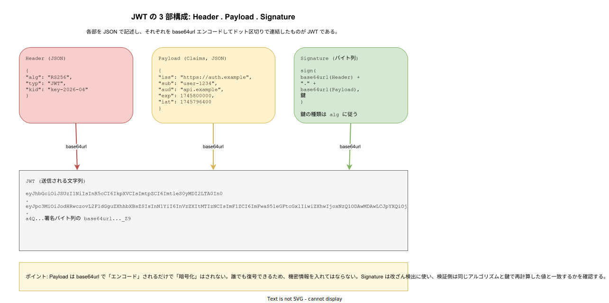
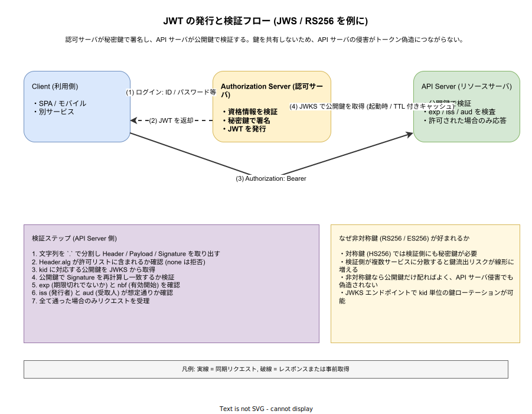

# JWT: 基本

- 対象読者: HTTP / API の基礎は分かるが、認証トークンとして JWT を扱うのが初めての開発者
- 学習目標: JWT が「何のための形式か」「どう構成されているか」「検証側で必ず確認すべき項目は何か」を説明できるようになる
- 所要時間: 約 35 分
- 対象バージョン: RFC 7519 (JWT) / RFC 7515 (JWS) / RFC 7517 (JWK) / RFC 7518 (JWA)
- 最終更新日: 2026-04-28

## 1. このドキュメントで学べること

- JWT が「Claim を運ぶ自己完結型トークン」であることを説明できる
- Header / Payload / Signature の 3 部構成と、それぞれが base64url で連結される仕組みを理解できる
- HS256・RS256・ES256 など主要なアルゴリズムの違いと、対称鍵か非対称鍵かを区別できる
- `iss` / `sub` / `aud` / `exp` / `nbf` / `iat` / `jti` といった登録済みクレームの意味を語れる
- 検証側 (リソースサーバ) が必ず行うべきチェック項目を列挙できる
- `alg=none` 攻撃やアルゴリズム混同攻撃などの典型的な脆弱性を回避できる

## 2. 前提知識

- HTTP のリクエスト/レスポンスモデルと `Authorization` ヘッダの初歩
- ハッシュ関数・電子署名・公開鍵暗号の概念（HMAC・RSA・ECDSA の名称程度）
- 関連 Knowledge: [API の基本](./api_basics.md) / [REST API の基本](./rest-api_basics.md)

## 3. 概要

JWT (JSON Web Token, RFC 7519) は、当事者間で「主張 (Claim)」を JSON で運ぶための、URL でも安全に扱える小さな文字列形式である。「主張」とは「この利用者は誰で、いつまで有効で、どのサービス向けに発行されたか」といった、認証・認可の判断材料となる事実の宣言を指す。

JWT 単体は「形式」に過ぎず、署名 (JWS, RFC 7515) または暗号化 (JWE, RFC 7516) で包んで初めて改ざん検出や秘匿が成り立つ。実務で「JWT」と呼ばれる場合、ほぼ常に JWS 形式（署名のみ）を指す。本ドキュメントもこの慣習に従い、特記しない限り JWS としての JWT を扱う。

JWT が解いている本質的な問題は「ステートフルなセッションの分散コスト」である。従来のセッション ID 方式では、API サーバが毎回セッションストアに問い合わせる必要があった。JWT は必要な情報を署名付きで自己完結させることで、検証側がストアを引かずに認証判断を下せるようにする。代わりに「失効を即時に反映できない」「ペイロードが大きくなりがち」というトレードオフを抱える。

## 4. 用語の整理

| 用語 | 説明 |
|------|------|
| Claim | JSON のキー/値で表される 1 件の主張。`"sub": "user-1234"` の組のような単位を指す |
| Registered Claim | RFC 7519 で予約された名前のクレーム (`iss` / `sub` / `aud` / `exp` / `nbf` / `iat` / `jti`) |
| JWS | JSON Web Signature。Payload に署名を付けて改ざんを検出可能にした形式 |
| JWE | JSON Web Encryption。Payload を暗号化して秘匿する形式（JWS とは別レイヤ） |
| JWA | JSON Web Algorithms。`alg` の取り得る値（`HS256` / `RS256` 等）を定義する |
| JWK | JSON Web Key。鍵を JSON で表現する形式 |
| JWKS | JWK Set。複数の公開鍵を `kid` 付きで配布するための JSON エンドポイント |
| base64url | RFC 4648 の URL-safe な base64。`+` `/` を `-` `_` に置換しパディングを省略する |
| Bearer Token | 「持っている者が権限を持つ」型のトークン (RFC 6750)。JWT は典型的な Bearer Token として用いられる |

## 5. 仕組み・アーキテクチャ

JWT は「3 つの JSON / バイト列を base64url エンコードし、ドット 1 文字で連結した文字列」である。Header はメタ情報、Payload は実際の Claim、Signature は前 2 者の連結に対する署名である。



ここで重要なのは、Payload が「エンコードされているだけで暗号化されていない」点である。base64url は誰でも復号できるため、機密情報（パスワード・PII の生データ）を入れてはならない。Signature の役割はあくまで「改ざん検出」であって「秘匿」ではない。秘匿が必要なら JWE（暗号化形式）を併用するか、そもそもクレームに含めない。

実運用では、認可サーバが秘密鍵で署名し、リソースサーバが公開鍵で検証する非対称鍵方式が主流である。鍵の配布は JWKS エンドポイントで行い、`kid` (Key ID) でローテーション中の複数鍵を区別する。



検証側がやるべきことは「署名検証」だけではない。`exp` / `nbf` / `iss` / `aud` の検査を怠ると、別サービス向けに発行された有効な JWT を流用される、期限切れトークンを受理する、といった事故が起きる。ライブラリのデフォルトでこれらが有効になっているかは必ず確認する必要がある。

## 6. 環境構築

JWT は仕様であり、専用ランタイムは不要である。学習用の最小確認には以下があれば足りる。

### 6.1 必要なもの

- Python 3.11 以上（標準ライブラリで base64url が扱える）
- bash と `python3` コマンド

### 6.2 動作確認

```bash
# Python が利用可能かを確認する
python3 --version
```

`Python 3.11` 以上が表示されれば準備完了である。

## 7. 基本の使い方

JWT が「ただの base64url 連結」であることを、外部ライブラリなしで体感する。実運用では必ず検証済みライブラリ（後述）を使うが、構造を理解するために一度は手で展開しておくとよい。

```python
# JWT の Header / Payload を base64url で展開して中身を確認する最小例
# 実運用ではこのような自前デコードはせず、必ず検証込みのライブラリを使う
import base64
import json

# 例として手元で組み立てた JWT 文字列 (3 セグメントをドットで連結)
token = (
    "eyJhbGciOiJSUzI1NiIsInR5cCI6IkpXVCJ9"
    "."
    "eyJpc3MiOiJodHRwczovL2F1dGguZXhhbXBsZSIsInN1YiI6InVzZXItMTIzNCIsImV4cCI6MTc0NTgwMDAwMH0"
    "."
    "ZmFrZS1zaWduYXR1cmU"
)


# base64url はパディング省略可なので、デコード時は 4 の倍数になるよう "=" を補う
def b64url_decode(segment: str) -> bytes:
    # パディングを補完してから urlsafe_b64decode に渡す
    pad = "=" * (-len(segment) % 4)
    return base64.urlsafe_b64decode(segment + pad)


# トークンを `.` で分割し、Header と Payload を JSON として読み出す
header_b64, payload_b64, _signature_b64 = token.split(".")
# Header を辞書化する
header = json.loads(b64url_decode(header_b64))
# Payload を辞書化する
payload = json.loads(b64url_decode(payload_b64))

# 中身を表示する
print("alg =", header["alg"])
print("iss =", payload["iss"])
print("sub =", payload["sub"])
print("exp =", payload["exp"])
```

### 解説

- `split(".")` で 3 セグメントを取り出すだけで Header と Payload は読める。秘密ではないことを示す端的な証拠である
- `b64url_decode` でパディングを補っているのは、JWT が「base64url のパディング省略形」を使うためである
- このコードは **検証をしていない**。署名検証・`exp` 検査・`iss`/`aud` 検査をすべてスキップしているため、攻撃者が改ざんしたトークンも素通りする。実運用で同じことをしてはならない

## 8. ステップアップ

### 8.1 登録済みクレームと検証ロジック

RFC 7519 が予約しているクレームは少数で、検証側のロジックもパターン化されている。

| クレーム | 意味 | 検証側がやること |
|----------|------|-------------------|
| `iss` | 発行者の識別子 (URL/文字列) | 想定する認可サーバと一致するかを照合 |
| `sub` | トークンの主体 (利用者 ID 等) | アプリ側のユーザ ID として利用 |
| `aud` | 受取人の識別子 | 自サービスの識別子が含まれるかを照合 |
| `exp` | 期限切れ時刻 (Unix epoch 秒) | 現在時刻が `exp` 未満であること |
| `nbf` | 有効開始時刻 | 現在時刻が `nbf` 以上であること（任意） |
| `iat` | 発行時刻 | 監査・古すぎるトークンの拒否に利用 |
| `jti` | JWT 固有 ID | リプレイ防止・失効リストとの突き合わせ |

`exp` / `nbf` の比較で時刻ずれを許容するための `leeway`（数十秒程度）を必ず設定する。これがないと、サーバ間の時刻同期ずれだけで検証失敗が頻発する。

### 8.2 アルゴリズム選択

`alg` は Header に記載され、検証側が「どう署名を検証するか」を決める。代表的な選択肢を比較する。

| alg | 種別 | 鍵の種類 | 適する状況 | 注意点 |
|-----|------|----------|------------|--------|
| HS256 | HMAC-SHA256 | 対称鍵 | 発行と検証が同一サービス | 検証側にも秘密鍵が必要。複数サービスに配ると流出リスクが線形に増える |
| RS256 | RSA-SHA256 | 非対称鍵 | 認可サーバと API サーバが分離 | 鍵長 2048 bit 以上推奨。署名/検証コストが ECDSA より重い |
| ES256 | ECDSA P-256 SHA-256 | 非対称鍵 | RS256 と同じ用途で軽量化したい時 | 実装の質に署名安全性が依存する |
| EdDSA | Ed25519 | 非対称鍵 | 新規設計 | 対応ライブラリが揃っているか確認 |
| none | 署名なし | — | （実運用では使用禁止） | `alg=none` 攻撃の温床。検証側の許可リストから必ず除外する |

設計の初手では「分散検証なら RS256 か ES256、自己発行・自己消費なら HS256」と覚えておくと判断を誤りにくい。

### 8.3 鍵ローテーションと JWKS

鍵は漏洩リスクや暗号アルゴリズム更新のため、定期的に交換する必要がある。JWKS エンドポイントは複数の鍵を `kid` 付きで同時公開でき、検証側は Header の `kid` を見て対応する公開鍵を選べる。

ローテーション手順の典型は次の通りである。新鍵 N を JWKS に追加（旧鍵 O も残す）→ 認可サーバが新鍵 N で署名開始 → 検証側がしばらく両方を受理 → 旧鍵 O で署名された JWT が全て期限切れになった後、JWKS から O を削除する。各段階で「いつでも検証可能」な状態が維持される。

## 9. よくある落とし穴

- **`alg=none` を素通りさせる**: ライブラリが「Header の `alg` をそのまま信じて検証アルゴリズムを切り替える」実装だと、攻撃者が `alg: none` と書き換えるだけで署名検証をスキップさせられる。検証側で許可リストを固定する
- **アルゴリズム混同攻撃 (Algorithm Confusion)**: RS256 を期待するサーバに、攻撃者が公開鍵を秘密鍵として HS256 で署名した JWT を送る古典的攻撃。検証時は「期待する alg」を引数で固定し、Header の値に従わない
- **`exp` を検査しない**: ライブラリのデフォルトで `exp` 検証が有効か必ず確認する。一部実装は明示的にオプションを渡さないと検証しない
- **`aud` を検査しない**: 別サービス向けの有効な JWT を自サービスで受理してしまう。マイクロサービス環境で重大な認可バイパスになる
- **Payload に機密を入れる**: Payload は base64url であって暗号化ではない。パスワード・クレジットカード番号・PII の生データを入れてはならない
- **失効を考慮しない長期トークン**: JWT は自己完結ゆえに「即時失効」が苦手。長い `exp` を採用するなら、失効リスト (`jti` の denylist) や短命のアクセストークン + リフレッシュトークン構成を併用する
- **localStorage に保存して XSS で全部抜かれる**: ブラウザクライアントでは XSS リスクと CSRF リスクのトレードオフを設計判断として明示する。HttpOnly Cookie + 適切な SameSite 設定が一般的に堅い

## 10. ベストプラクティス

- 検証時は「許可する `alg` のリスト」を**呼び出し側で固定**し、Header の値を信用しない
- 認可サーバとリソースサーバが分離する構成では非対称鍵 (RS256 / ES256) を選ぶ
- 公開鍵は JWKS エンドポイントで配布し、`kid` 付きでローテーションする
- アクセストークンの `exp` は短め (数分〜十数分) にし、長寿命のリフレッシュトークンと組み合わせる
- `iss` / `aud` / `exp` / `nbf` の検査は必ず有効化し、`leeway` を数十秒に設定する
- Payload には「公開しても問題ない識別子と短命な権限情報」のみを入れる
- 失効が必要な要件があれば、`jti` をキーにした失効リストを Redis 等で並行運用する
- 自前で署名/検証ロジックを書かず、監査済みライブラリ（`jose`、`jsonwebtoken`、`jjwt` 等）を使う

## 11. 演習問題

1. 手元で `header = {"alg": "HS256", "typ": "JWT"}` と任意の Payload を base64url エンコードし、ドットで連結して JWT 風の文字列を組み立ててみよ。署名部分は仮の文字列で構わない。出来上がった文字列を Section 7 のコードに通し、Header と Payload が読み出せることを確認せよ。
2. ある API が JWT の `alg` を Header の値に従って動的に切り替えていた。攻撃者が Header を `{"alg": "none"}` に書き換えた JWT を送ったとき、何が起きるか説明せよ。また、この実装をどう修正すべきか述べよ。
3. マイクロサービス A と B が同じ認可サーバから JWT を受け取っている。A 向けに発行された JWT が B でも有効になってしまう事故を防ぐには、JWT のどのクレームをどう設定し、各サービスでどう検証すべきか述べよ。

## 12. さらに学ぶには

- 関連 Knowledge: [API の基本](./api_basics.md)
- 関連 Knowledge: [REST API の基本](./rest-api_basics.md)
- 関連 Knowledge: [Keycloak の基本](../infra/keycloak_basics.md)（OIDC ID Token としての JWT）
- IETF OAuth WG の JWT BCP: RFC 8725 *JSON Web Token Best Current Practices*
- 攻撃手法のまとめ: PortSwigger Web Security Academy "JWT attacks"

## 13. 参考資料

- IETF RFC 7519 - JSON Web Token (JWT): <https://datatracker.ietf.org/doc/html/rfc7519>
- IETF RFC 7515 - JSON Web Signature (JWS): <https://datatracker.ietf.org/doc/html/rfc7515>
- IETF RFC 7517 - JSON Web Key (JWK): <https://datatracker.ietf.org/doc/html/rfc7517>
- IETF RFC 7518 - JSON Web Algorithms (JWA): <https://datatracker.ietf.org/doc/html/rfc7518>
- IETF RFC 8725 - JSON Web Token Best Current Practices: <https://datatracker.ietf.org/doc/html/rfc8725>
- IETF RFC 6750 - The OAuth 2.0 Authorization Framework: Bearer Token Usage: <https://datatracker.ietf.org/doc/html/rfc6750>
- IANA JSON Web Token Claims Registry: <https://www.iana.org/assignments/jwt/jwt.xhtml>
