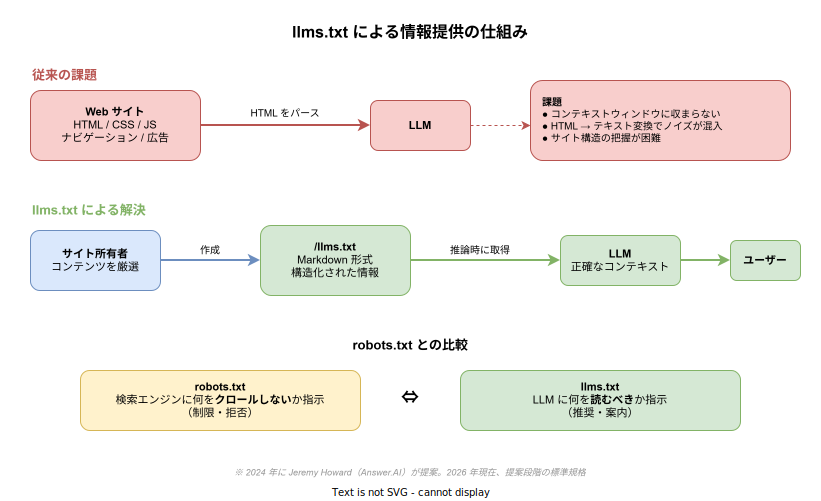
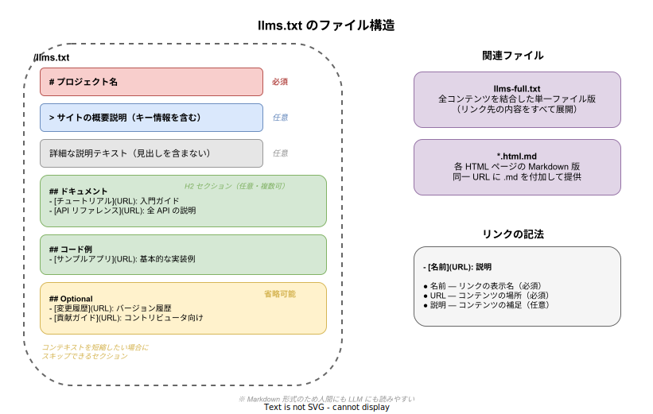

# llms.txt: 基本

- 対象読者: Web サイトの構築・運用経験があり、LLM（大規模言語モデル）の基本概念を理解している開発者
- 学習目標: llms.txt の目的・ファイル形式・構成要素を理解し、自身の Web サイトに llms.txt を作成・配置できるようになる
- 所要時間: 約 20 分
- 対象バージョン: llms.txt 提案仕様（2024 年 9 月公開）
- 最終更新日: 2026-04-13

## 1. このドキュメントで学べること

- llms.txt が「なぜ」提案されたかを説明できる
- llms.txt の Markdown 形式のファイル構造を理解できる
- robots.txt との役割の違いを区別できる
- 自分の Web サイト用に llms.txt を作成できる
- llms-full.txt や .md 版などの関連ファイルの役割を理解できる

## 2. 前提知識

- Markdown 記法の基本（見出し・リンク・ブロック引用）
- Web サイトのディレクトリ構造の基本理解
- LLM（大規模言語モデル）が Web 上の情報を利用するという概念の理解

## 3. 概要

llms.txt は、2024 年 9 月に Jeremy Howard（Answer.AI）が提案した、Web サイトから LLM に対して情報を提供するための標準規格の提案である。Web サイトのルートパスに `/llms.txt` として配置する Markdown ファイルであり、サイトの構造や重要なコンテンツへのリンクを LLM が理解しやすい形式で提供する。

LLM は Web サイトの情報を推論時に利用する機会が増えているが、通常の HTML ページにはナビゲーション、広告、JavaScript など LLM にとって不要な要素が多く含まれる。さらに、サイト全体の HTML をコンテキストウィンドウに収めることは現実的ではない。llms.txt はこの問題に対し、サイト所有者が LLM に読ませたいコンテンツを厳選して提示する仕組みを提供する。

## 4. 用語の整理

| 用語 | 説明 |
|------|------|
| llms.txt | Web サイトのルートに配置する Markdown 形式のファイル。LLM 向けにサイト情報を構造化して提供する |
| llms-full.txt | llms.txt に記載されたリンク先のコンテンツをすべて展開・結合した単一ファイル版 |
| コンテキストウィンドウ | LLM が一度に処理できるテキストの最大量。この制約が llms.txt の設計動機の一つである |
| 推論時（inference time） | LLM がユーザーの質問に回答を生成するタイミング。llms.txt はこの時点で参照される |
| robots.txt | 検索エンジンのクローラーに対してアクセスを制限するファイル。llms.txt とは目的が異なる |

## 5. 仕組み・アーキテクチャ

llms.txt は、従来の HTML クローリングの課題を解決するために設計された。サイト所有者がコンテンツを厳選し、LLM が推論時に効率的に情報を取得できるようにする。



robots.txt が「クロールしてほしくないもの」を伝えるのに対し、llms.txt は「読んでほしいもの」を伝える。両者は補完的な関係にある。

llms.txt のファイル構造は、Markdown の見出し・ブロック引用・リンクリストで構成される。



## 6. 環境構築

llms.txt の作成に特別なツールは不要である。テキストエディタと Web サーバーがあれば配置できる。

### 6.1 必要なもの

- テキストエディタ（Markdown を記述できるもの）
- Web サーバー（ルートパスにファイルを配置できること）

### 6.2 動作確認

```bash
# llms.txt の動作確認

# llms.txt がルートパスで取得できることを確認する
curl -s https://your-site.example.com/llms.txt

# Content-Type が text/plain または text/markdown であることを確認する
curl -sI https://your-site.example.com/llms.txt | grep -i content-type
```

## 7. 基本の使い方

以下は llms.txt の最小構成例である。

```markdown
# My Project

> My Project は REST API を提供するオープンソースのフレームワークである。

## ドキュメント

- [はじめに](https://example.com/docs/getting-started.html.md): 導入ガイド
- [API リファレンス](https://example.com/docs/api.html.md): 全エンドポイントの説明

## コード例

- [サンプルアプリ](https://example.com/docs/examples.html.md): 基本的な実装パターン

## Optional

- [変更履歴](https://example.com/docs/changelog.html.md): バージョンごとの変更点
- [貢献ガイド](https://example.com/docs/contributing.html.md): コントリビュータ向け情報
```

### 解説

- **H1**（`# My Project`）はサイト名またはプロジェクト名を記載する。唯一の必須セクションである
- **ブロック引用**（`> ...`）はプロジェクトの概要を簡潔に記載する。LLM がファイル全体を理解するための前提情報となる
- **H2 セクション**（`## ドキュメント`）はカテゴリごとにリンクをグループ化する
- **リンクの書式**は `- [名前](URL): 説明` の形式である。説明部分は任意だが推奨される
- **`## Optional`** セクションに置いたリンクは、LLM がコンテキストを短縮したい場合にスキップできる
- リンク先の URL は `.html.md` のように Markdown 版を指定することが推奨される

## 8. ステップアップ

### 8.1 llms-full.txt の提供

llms-full.txt は、llms.txt に記載された全リンク先のコンテンツを 1 ファイルに結合したものである。LLM がリンクを個別に取得する手間を省き、サイト全体の情報を一度にコンテキストへ投入できる。

提供方法は、llms.txt と同様に Web サイトのルートパス（`/llms-full.txt`）に配置する。

### 8.2 Markdown 版ページの提供

llms.txt 仕様では、HTML ページの Markdown 版を同一 URL に `.md` を付加して提供することが推奨される。たとえば `https://example.com/docs/api.html` に対して `https://example.com/docs/api.html.md` を用意する。

Markdown 版には HTML のナビゲーションや装飾を含めず、本文の内容のみを Markdown で記載する。

### 8.3 実際の採用例

2026 年現在、多くの技術ドキュメントサイトが llms.txt を採用している。Anthropic、Cloudflare、Mintlify、GitBook などが自社サイトに llms.txt を配置している。

## 9. よくある落とし穴

- **robots.txt との混同**: robots.txt はクローラーのアクセス制限、llms.txt は LLM への情報提供であり、目的が異なる。両者を同列に扱わない
- **HTML をそのまま記載**: llms.txt は Markdown 形式で記述する。HTML タグを含めると LLM の解析効率が下がる
- **リンク切れの放置**: llms.txt 内のリンク先が存在しない場合、LLM は必要な情報を取得できない。定期的にリンクの有効性を確認する
- **情報の詰め込みすぎ**: llms.txt は全ページの一覧ではなく、LLM にとって最も重要なコンテンツを厳選して掲載する。サイトマップの代替ではない
- **主要 LLM が自動的に参照すると思い込む**: 2026 年現在、主要な LLM プロバイダ（OpenAI、Google、Anthropic）のクローラーが llms.txt を自動的に参照するとは公式に表明されていない

## 10. ベストプラクティス

- H1 にはプロジェクトの正式名称を記載し、ブロック引用で読み手が全体像を掴める概要を書く
- リンク先は Markdown 版（`.html.md`）を用意し、HTML のノイズを排除する
- `## Optional` セクションを活用し、コンテキスト長に制約がある LLM にも対応する
- llms-full.txt を併せて提供し、LLM がリンクを個別取得する必要をなくす
- リンクの説明文を付加し、LLM がリンク先を取得する前に内容を判断できるようにする
- 定期的にリンク切れを確認し、内容の正確性を維持する

## 11. 演習問題

1. 自分が管理する Web サイト（または架空のサイト）の llms.txt を作成せよ。H1・ブロック引用・2 つ以上の H2 セクション・Optional セクションを含めること
2. robots.txt と llms.txt の役割の違いを 3 つの観点から説明せよ
3. llms.txt と llms-full.txt の使い分けについて、LLM のコンテキストウィンドウサイズの観点から説明せよ

## 12. さらに学ぶには

- llms.txt 公式サイト: https://llmstxt.org/
- Answer.AI による提案記事: https://www.answer.ai/posts/2024-09-03-llmstxt.html
- 関連 Knowledge: [REST API の基本](./rest-api_basics.md)（Web API 設計の基礎）

## 13. 参考資料

- Howard, J. (2024). /llms.txt — a proposal to provide information to help LLMs use websites. Answer.AI.
- llms.txt 仕様: https://llmstxt.org/
