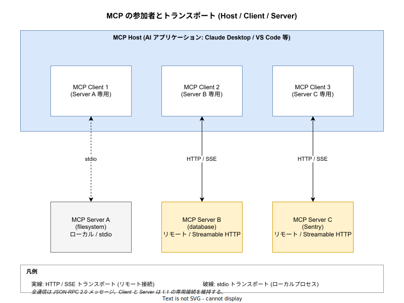
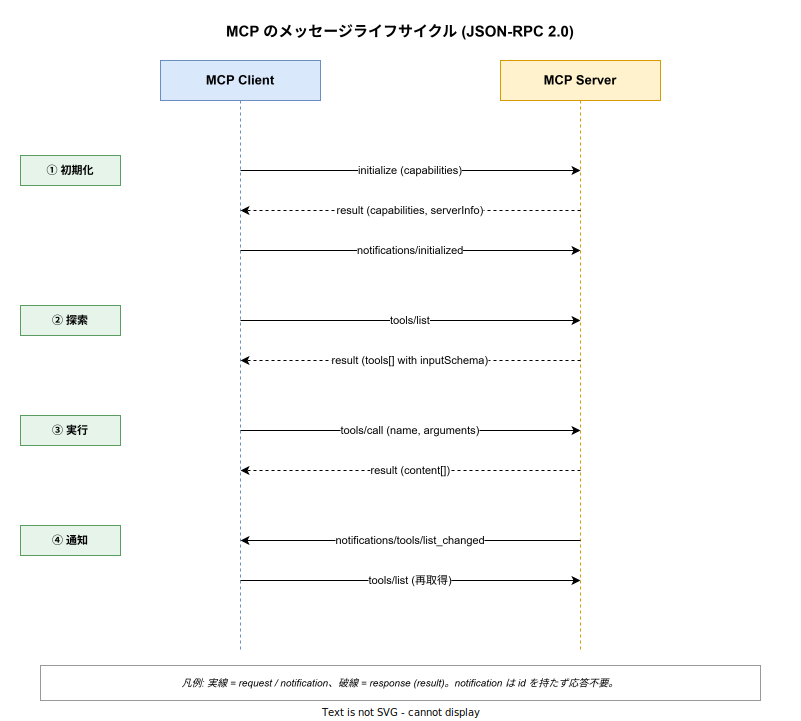

# MCP: 概要

- 対象読者: Claude / GPT 等の LLM をアプリケーションに組み込んだ経験がある開発者
- 学習目標: MCP のアーキテクチャ・JSON-RPC ベースの通信モデル・Tools/Resources/Prompts プリミティブを理解し、最小の MCP Server を実装できるようになる
- 所要時間: 約 40 分
- 対象バージョン: MCP Specification 2025-06-18（Streamable HTTP / Tasks 含む最新仕様）
- 最終更新日: 2026-04-28

## 1. このドキュメントで学べること

- MCP がどのような問題を解決するために設計されたかを説明できる
- Host / Client / Server の責務分担を区別できる
- JSON-RPC 2.0 ベースの初期化〜ツール実行のメッセージシーケンスを読み解ける
- 3 つのサーバプリミティブ（Tools / Resources / Prompts）と 3 つのクライアントプリミティブ（Sampling / Roots / Elicitation）の使い分けを判断できる
- stdio と Streamable HTTP の選択基準を説明できる

## 2. 前提知識

- LLM ベースのアプリケーション（チャットボット・コーディングアシスタント等）の基本構造
- JSON-RPC 2.0 の基本（id / method / params / result / notification の概念）
- HTTP の基本と SSE（Server-Sent Events）の概要

## 3. 概要

MCP（Model Context Protocol）は、Anthropic が 2024 年 11 月に公開し、その後オープンソースの仕様として標準化が進められている **LLM アプリケーションと外部のデータソース・ツールを接続するための通信プロトコル** である。

LLM アプリケーション（Claude Desktop / VS Code / 自作エージェント等）が外部のファイルシステム・データベース・SaaS API・社内ナレッジベース等のコンテキストにアクセスする際、従来は **アプリごとに固有の統合コードを書く必要があった**。10 アプリ × 10 データソースで 100 通りの結合が必要となり、いわゆる `N×M` 問題を抱える。MCP は Client / Server インターフェースを標準化することで、これを `N+M` に抑える。設計思想は LSP（Language Server Protocol）に明示的に倣っており、エディタ × 言語の組合せ問題を LSP が解決したのと同じ構造で AI アプリ × コンテキスト源の組合せ問題を解く。

MCP は **JSON-RPC 2.0** をワイヤフォーマットに採用した実装しやすいプロトコルである。データ層（メッセージのスキーマ・ライフサイクル・プリミティブ）とトランスポート層（stdio / Streamable HTTP）の 2 層に明確に分離されており、JSON-RPC メッセージ形式は両トランスポート間で完全に共通である。

## 4. 用語の整理

| 用語 | 説明 |
|------|------|
| Host | LLM を組み込んだ AI アプリケーション本体（例: Claude Desktop, VS Code）。1 つ以上の Client を生成して Server と接続する |
| Client | Host 内に存在し、ある Server との 1:1 接続を維持する接続管理コンポーネント |
| Server | コンテキスト（データ）やツール（実行可能関数）を Host に提供するプログラム。ローカル / リモートの両方で稼働できる |
| Primitive | Server / Client が相手に公開する機能の単位。Tools・Resources・Prompts（Server 側）と Sampling・Roots・Elicitation（Client 側）の 6 種が中核 |
| Tool | Server が公開する実行可能関数。LLM が呼び出して副作用のある操作（API 呼び出し・DB 書き込み等）を行う |
| Resource | Server が公開する読み取り専用のデータソース（ファイル内容・DB レコード・API 応答等） |
| Prompt | Server が提供する再利用可能なプロンプトテンプレート（system prompt / few-shot 例 等） |
| Sampling | Server が Host 側の LLM に推論を依頼する仕組み。Server が独自の LLM SDK を持たずに済む |
| Capability | `initialize` ハンドシェイクで Client / Server がそれぞれ宣言する「対応機能」のセット |
| Transport | メッセージの搬送経路。`stdio`（ローカル）と `Streamable HTTP`（リモート）の 2 つが標準 |

## 5. 仕組み・アーキテクチャ

MCP は **Host が複数の Client を内包し、各 Client が 1 つの Server と専用接続を持つ** スター構造を取る。Server がローカルプロセスとして起動される場合は stdio で、リモートサービスとして稼働している場合は Streamable HTTP でメッセージを交換する。



通信は JSON-RPC 2.0 の **request / response / notification** の 3 種類で行われる。MCP はステートフルなプロトコルで、まず `initialize` で互いの capability を交渉し、その後にプリミティブの探索（`tools/list` 等）と実行（`tools/call` 等）を行う。Server 側で公開ツールが追加・変更された場合は `notifications/tools/list_changed` で Client に通知され、Client は `tools/list` を再発行して LLM に渡すツール一覧を更新する。



## 6. 環境構築

### 6.1 必要なもの

- Python 3.10 以上
- MCP Python SDK（`mcp[cli]` パッケージ、本ドキュメント執筆時点の安定版 1.x 系）
- 動作確認用に MCP Inspector（任意）

### 6.2 セットアップ手順

```bash
# Python の仮想環境を作る
python -m venv .venv
# 仮想環境を有効化する
source .venv/bin/activate
# MCP SDK と CLI ツールをインストールする
pip install "mcp[cli]"
```

### 6.3 動作確認

```bash
# Inspector を起動して stdio で対話的に Server を検査できる
mcp dev server.py
```

## 7. 基本の使い方

最小の MCP Server は「ツールを 1 つ公開する stdio サーバ」として書ける。FastMCP（公式 SDK のヘルパー）を使うと数行で記述できる。

```python
# 最小の MCP サーバ。1 つのツール say_hello を stdio で公開する。

# FastMCP ヘルパーをインポートする
from mcp.server.fastmcp import FastMCP

# サーバインスタンスを生成する。第 1 引数は initialize 応答の serverInfo.name に載る
mcp = FastMCP("greeter")

# tools/list で公開する 1 つのツールをデコレータで登録する
@mcp.tool()
# 名前を受け取り挨拶文を返す関数として実装する
def say_hello(name: str) -> str:
    # フォーマット文字列で挨拶文を組み立てて返す
    return f"Hello, {name}!"

# このスクリプトが直接実行された場合にのみ次のブロックを動かす
if __name__ == "__main__":
    # stdio トランスポートでイベントループを開始する
    mcp.run()
```

### 解説

- `FastMCP("greeter")` がサーバを生成する。`initialize` 応答の `serverInfo.name` にこの値が入る。
- `@mcp.tool()` デコレータが関数を Tool として登録する。型ヒントから JSON Schema が自動生成され、`tools/list` 応答の `inputSchema` として返る。
- `mcp.run()` のデフォルトは stdio で、標準入出力で JSON-RPC メッセージを受け渡す。
- このサーバを Claude Desktop の MCP 設定に登録すると、ユーザが「say hello to Claude」と頼んだ時に LLM が `tools/call` で `say_hello` を呼び出す。

## 8. ステップアップ

### 8.1 Resource と Prompt の併用

Tool は副作用を伴う操作、Resource は副作用のない読み取り専用データ、Prompt は再利用可能な指示テンプレート、と用途を分ける。3 つを組み合わせると「DB スキーマを Resource で公開し、その DB を叩く Tool を提供し、典型的なクエリパターンを Prompt で例示する」といった設計が可能になる。Tool が「動詞」、Resource が「名詞」、Prompt が「定型文」と覚えると役割を取り違えにくい。

### 8.2 Streamable HTTP とリモート Server

stdio はローカルプロセスとの 1:1 通信に最適だが、Web サービスとして MCP Server を提供したい場合は Streamable HTTP を使う。Client → Server は HTTP POST、Server → Client のストリームは Server-Sent Events（SSE）で実装される。Streamable HTTP は標準 HTTP 認証（Bearer Token / API Key / カスタムヘッダ）に対応し、仕様としては **OAuth 2.1 によるトークン取得が推奨**されている。同一 Server に多数の Client が同時接続できる点が stdio との大きな違いである。

### 8.3 クライアントプリミティブ（Sampling / Roots / Elicitation）

MCP は Server → Client 方向のリクエストもサポートする。

- **Sampling**: Server が `sampling/createMessage` で Host の LLM に推論を依頼する。Server 自身が LLM SDK を持たずに済むため、ベンダ非依存な拡張が書ける。
- **Roots**: Server が「どの URI / ディレクトリを操作対象としてよいか」を Client に問い合わせる。
- **Elicitation**: Server が `elicitation/create` でユーザに追加情報や承認を求める。

これらは `initialize` 時に Client が capability で宣言した場合のみ Server から呼び出せる。

## 9. よくある落とし穴

- **`initialize` 前にメソッドを呼ぶ**: ライフサイクル管理が必須のステートフルプロトコルのため、`initialize` 完了前の `tools/list` 等は仕様違反となる。SDK が抽象化することが多いが、生で実装する場合は順序を守ること。
- **Capability を宣言せずに通知を送る**: 例えば Server が `tools.listChanged: true` を宣言していないのに `notifications/tools/list_changed` を送っても、Client は無視する権利がある。capability ネゴシエーションの結果を必ず尊重する。
- **Tool description の信頼**: 仕様上「Tool description やアノテーションは untrusted として扱う」べきである。悪意ある Server が説明文に Prompt Injection を仕込めるため、Host 側で内容を検証せずに LLM へそのまま渡すと誘導攻撃を受ける。
- **stdio Server で標準出力にログを出す**: stdio Server では標準出力が JSON-RPC メッセージ専用チャネルになる。`print()` で人間向けログを出すとプロトコルが壊れる。ログは標準エラー出力か MCP の logging プリミティブを使う。
- **長時間実行の Tool**: 同期的に応答を待つと UI が固まる。長時間処理は実験的な Tasks プリミティブか、進捗通知（`notifications/progress`）を使って分割する。

## 10. ベストプラクティス

- Tool の `name` はサーバ名前空間を意識した識別子（例: `weather_current`）にし、単一動詞名（`calculate`）は避ける。LLM のツール選択精度が上がる。
- `inputSchema` には `description` と `enum`・`default` を漏れなく書く。LLM はこれを読んで引数を組み立てるため、説明の質がそのままツール呼び出し精度になる。
- ユーザ同意フローを Host 側に組み込む。Tool 実行・LLM サンプリング・データ公開は仕様上「明示的な承認」が要求されており、prompt injection 対策と PII 保護の両面で必要となる。
- Server を公開する場合は OAuth 2.1 を使い、API Key の長期共有は避ける。Streamable HTTP のトランスポート仕様で OAuth が推奨されている。
- `tools/list_changed` 等の通知を活用し、Server の状態変化を Client にプッシュする。Client にポーリングさせる設計は MCP の利点を活かせない。

## 11. 演習問題

1. `weather_current` という名前で「都市名と単位を受け取り現在の天気を返す」Tool を持つ最小の MCP Server を Python で書け。`inputSchema` に `units` の enum（`metric` / `imperial`）と default を含めること。
2. 同じ Server に Resource として「サーバが対応している都市一覧（JSON）」を追加せよ。`resources/list` と `resources/read` で取得できることを Inspector で確認すること。
3. Server 側で扱える都市が動的に増えた場面を想定し、capability で `listChanged: true` を宣言した上で `notifications/resources/list_changed` を送る実装を書け。

## 12. さらに学ぶには

- 公式仕様: <https://modelcontextprotocol.io/specification/latest>
- 公式コンセプト解説: <https://modelcontextprotocol.io/docs/concepts/architecture>
- リファレンス Server 実装集: <https://github.com/modelcontextprotocol/servers>
- 関連 Knowledge: [gRPC_basics.md](./gRPC_basics.md) / [llms-txt_basics.md](./llms-txt_basics.md)

## 13. 参考資料

- Model Context Protocol Specification 2025-06-18: <https://modelcontextprotocol.io/specification/2025-06-18>
- JSON-RPC 2.0 仕様: <https://www.jsonrpc.org/specification>
- Anthropic 発表ブログ「Introducing the Model Context Protocol」: <https://www.anthropic.com/news/model-context-protocol>
- Language Server Protocol Specification: <https://microsoft.github.io/language-server-protocol/>
