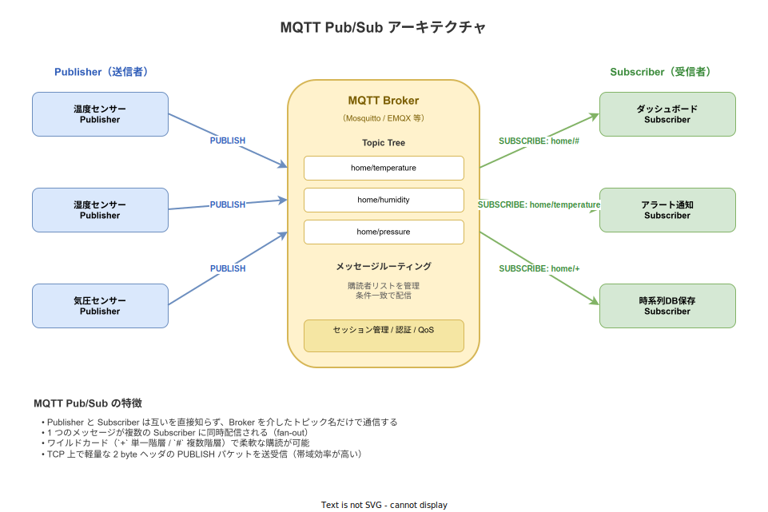
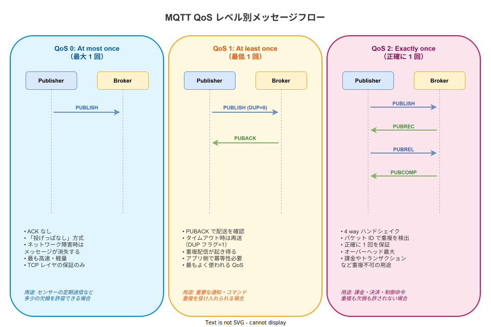

# MQTT: 概要

- 対象読者: TCP/IP と HTTP の基本を理解しており、IoT や軽量メッセージング技術を学びたい開発者
- 学習目標: MQTT の Pub/Sub モデル・QoS・トピック設計・セッションの概念を説明でき、最小のクライアント実装を読めるようになる
- 所要時間: 約 40 分
- 対象バージョン: MQTT v5.0（OASIS Standard, 2019 年）。v3.1.1 との差分も随時補足する
- 最終更新日: 2026-04-15

## 1. このドキュメントで学べること

- MQTT がどのような課題を解決するために設計されたかを説明できる
- Publisher / Broker / Subscriber の役割と、トピックを介した疎結合な通信モデルを理解できる
- QoS 0 / 1 / 2 の違いと使い分けを説明できる
- Retained Message / Last Will / Clean Start / Keep Alive の基本を理解できる
- ワイルドカード（`+`, `#`）を使ったトピック購読を設計できる

## 2. 前提知識

- TCP/IP の基礎（ポート・コネクション指向通信の概念）
- クライアント／サーバーモデルの基本
- バイナリプロトコルとテキストプロトコルの違い
- 関連: [WebSocket の概要](./websocket_basics.md)（MQTT over WebSocket を理解する際の前提）

## 3. 概要

MQTT（Message Queuing Telemetry Transport）は、帯域が狭くレイテンシが大きい不安定なネットワーク上でも動作するよう設計された軽量な Pub/Sub プロトコルである。1999 年に IBM と Arcom によってパイプライン監視のために開発され、2014 年に OASIS 標準、2016 年に ISO/IEC 20922 として国際標準化された。

HTTP が「クライアントがサーバーに問い合わせる」リクエスト／レスポンス型であるのに対し、MQTT は Broker を中心とした **Pub/Sub（出版／購読）型** である。送信者（Publisher）は宛先を指定せず「トピック」に対してメッセージを出版し、受信者（Subscriber）は関心のあるトピックを購読する。両者は互いを直接知らないため疎結合が実現し、数千〜数百万のデバイスを接続する IoT シナリオで広く採用されている。

TCP 上で動作し、固定ヘッダはわずか 2 バイトに収まるため、制約の厳しいマイコンや 2G/3G のセルラー回線でも実用的に使える。

## 4. 用語の整理

| 用語 | 説明 |
|------|------|
| Broker | メッセージの中継を担うサーバー。購読関係を管理し配信する（例: Mosquitto, EMQX, HiveMQ） |
| Publisher | メッセージを送信するクライアント |
| Subscriber | メッセージを受信するクライアント。1 つのクライアントが Publisher と Subscriber を兼ねられる |
| Topic | メッセージの宛先となる階層化された文字列。`/` 区切り（例: `home/room1/temperature`） |
| QoS | Quality of Service。メッセージ配送の保証レベル（0/1/2） |
| Retained Message | Broker がトピックごとに最後の 1 件を保持し、新規購読者に即座に配信するフラグ付きメッセージ |
| Last Will and Testament (LWT) | クライアントが異常切断した際に Broker が代わりに発行するメッセージ |
| Keep Alive | クライアントが Broker へ定期的に送る PINGREQ による生存確認の間隔 |
| Clean Start | 接続時に過去のセッション状態を破棄するかを指定するフラグ（v5.0。v3.1.1 では Clean Session） |
| Session | クライアント ID ごとに Broker が保持する購読情報とキューイングされた未配信メッセージ |

## 5. 仕組み・アーキテクチャ

### 5.1 Pub/Sub モデル

MQTT では、すべてのメッセージが Broker を経由する。Publisher はトピック名を指定してメッセージを投稿し、Broker がそのトピックを購読しているすべての Subscriber にメッセージを配送する。Publisher と Subscriber の双方が Broker にしか接続しないため、デバイス側にファイアウォール越えやアドレス管理の負担がかからない。



トピックは `/` で区切られた階層構造を取り、購読時にワイルドカードを使える。`+` は単一階層、`#` は末尾の任意階層数にマッチする。たとえば `home/+/temperature` は `home/room1/temperature` と `home/room2/temperature` の両方に、`home/#` は `home` 以下のすべてのトピックにマッチする。

### 5.2 QoS（Quality of Service）

MQTT は配送保証レベルを 3 段階で選択できる。同じトピックでも Publisher と Subscriber が異なる QoS を指定でき、実効 QoS は両者のうち低い方になる。



| QoS | 意味 | ハンドシェイク | 配送保証 |
|-----|------|----------------|----------|
| 0 | At most once | PUBLISH のみ | 消失の可能性あり、重複なし |
| 1 | At least once | PUBLISH → PUBACK | 消失なし、重複の可能性あり |
| 2 | Exactly once | PUBLISH → PUBREC → PUBREL → PUBCOMP | 消失なし、重複なし |

QoS を上げるほど送受信の往復数とメモリ使用量が増えるため、ユースケースに応じて適切に選択する。迷ったら QoS 1 を出発点にするのが実用的である。

### 5.3 セッションと Keep Alive

クライアントは接続時に **Client ID** を提示する。Broker はこの ID 単位で購読情報と未配信メッセージ（QoS 1/2 のもの）を保持する。`Clean Start=true` で接続すると、過去のセッションを破棄して新しいセッションを開始する。`false` の場合、クライアントが切断中に到着したメッセージを次回接続時に受け取れる。

Keep Alive は接続維持のための仕組みで、クライアントは指定秒数（典型的には 60 秒）以内にパケットを送信しない場合、PINGREQ を送って生存を示す。Broker は Keep Alive の 1.5 倍の時間内に何も受信しないと接続が切れたと判断する。

## 6. 環境構築

### 6.1 必要なもの

- MQTT Broker: Eclipse Mosquitto（軽量・オープンソース）を推奨
- クライアントツール: `mosquitto_pub`, `mosquitto_sub` CLI
- プログラミング言語向けライブラリ: Rust なら `rumqttc`、Python なら `paho-mqtt`、Go なら `paho.mqtt.golang`

### 6.2 セットアップ手順（Docker）

1. Docker Desktop を起動する
2. 次のコマンドで Mosquitto を起動する

   ```bash
   docker run -it --rm -p 1883:1883 eclipse-mosquitto
   ```

3. 別ターミナルで購読を開始する

   ```bash
   docker run -it --rm --network host eclipse-mosquitto mosquitto_sub -h localhost -t "home/#" -v
   ```

4. さらに別ターミナルで発行する

   ```bash
   docker run -it --rm --network host eclipse-mosquitto mosquitto_pub -h localhost -t "home/temperature" -m "23.5"
   ```

### 6.3 動作確認

購読側のターミナルに `home/temperature 23.5` と表示されれば、Pub/Sub が成立している。

## 7. 基本の使い方

Rust の `rumqttc` を使った最小の Publisher/Subscriber の例を示す。

```rust
// MQTT クライアントの基本動作を確認するためのサンプル。
// 同一プロセスから Publisher と Subscriber を起動し、ローカル Broker へ接続する。
use rumqttc::{Client, MqttOptions, QoS};
use std::thread;
use std::time::Duration;

// エントリポイント。
fn main() {
    // 接続先 Broker のホスト名・ポートを指定する。クライアント ID は Broker 上で一意にする。
    let mut opts = MqttOptions::new("demo-client", "localhost", 1883);
    // Keep Alive 秒数を設定して、無通信時の生存確認間隔を決める。
    opts.set_keep_alive(Duration::from_secs(5));
    // Client と EventLoop を生成する。EventLoop はバックグラウンドで送受信を駆動する。
    let (client, mut connection) = Client::new(opts, 10);
    // `home/temperature` を QoS 1 で購読する。
    client.subscribe("home/temperature", QoS::AtLeastOnce).unwrap();
    // 別スレッドで 1 秒ごとにセンサー値を発行する。
    let pub_client = client.clone();
    thread::spawn(move || {
        for i in 0..5 {
            // トピック・QoS・retain フラグ・ペイロードを指定して発行する。
            pub_client
                .publish("home/temperature", QoS::AtLeastOnce, false, format!("{}", 20 + i))
                .unwrap();
            // 1 秒待ってから次のメッセージを出す。
            thread::sleep(Duration::from_secs(1));
        }
    });
    // EventLoop を回し、受信した通知をログ出力する。
    for notification in connection.iter().take(10) {
        println!("Notification = {:?}", notification);
    }
}
```

### 解説

- `MqttOptions` で接続先とクライアント ID を設定する。クライアント ID は Broker のセッション識別キーとなる。
- `Client::new` は非同期ではなく、`EventLoop`（同期ブロッキングの `Connection`）を別途駆動することで送受信が進む。
- `subscribe` で購読、`publish` で発行する。どちらも QoS と（publish は追加で）retain フラグを指定する。
- 受信したメッセージは `connection.iter()` から流れてくる `Event` の `Incoming(Publish)` バリアントに入る。

## 8. ステップアップ

### 8.1 Retained Message

`retain=true` で発行されたメッセージは Broker 側で最新 1 件だけトピック単位に保持される。新たにそのトピックを購読したクライアントは、Broker から即座にその値を受け取れる。「デバイスの最終状態を新しい観測者に素早く伝える」用途に有効で、空ペイロードを `retain=true` で発行すると保持データを削除できる。

### 8.2 Last Will and Testament（LWT）

クライアントは接続時に「もし自分が異常切断したら、Broker は代わりにこのメッセージを出してほしい」と遺言を登録できる。典型的には `devices/{id}/status` に `offline` を LWT として登録し、接続成功後は自分で `online` を `retain=true` で発行する。こうすることで、他のクライアントが常に最新の死活状態を得られる。

### 8.3 MQTT over TLS / WebSocket

MQTT は平文なら 1883 番ポートで動作するが、本番では 8883 番の TLS を用いるのが標準である。ブラウザから MQTT を使いたい場合は MQTT over WebSocket を利用し、HTTP の Upgrade を経由して同じプロトコルで通信する。Broker 側で WebSocket リスナー（通常 8083 または 8084）を有効化する必要がある。

### 8.4 MQTT v5.0 での追加機能

v5.0 では実運用で求められてきた機能が拡充された。代表的なものは以下の通り。

- **Reason Code**: CONNACK / SUBACK などに詳細な失敗理由コードが付与される
- **User Properties**: 任意のキー・バリューをパケットに付与できる
- **Shared Subscription**: `$share/group/topic` 形式で複数 Subscriber のロードバランスが可能
- **Message Expiry Interval**: メッセージ単位の TTL を指定できる
- **Topic Alias**: 長いトピック名を整数 ID に圧縮して帯域を節約する

## 9. よくある落とし穴

- **Client ID の重複**: 同一 ID で接続すると後勝ちで既存接続が切断される。デプロイ時に ID が衝突しないよう設計する
- **QoS の誤解**: Publisher → Broker と Broker → Subscriber は別々の QoS 配送区間である。エンドツーエンド QoS ではない
- **トピック名の大文字小文字**: MQTT の Topic は大文字小文字を区別する。`Home/Temp` と `home/temp` は別物
- **`#` の位置**: `#` は末尾にしか使えない。`home/#/temp` は不正
- **Retained と履歴の混同**: Retained は「最新 1 件」のみ。過去メッセージの配信が必要なら別途ブローカーのストリーム機能（Kafka 等）を併用する
- **Clean Start=false を安易に使う**: セッション情報が Broker に蓄積し続けるため、使い捨てクライアントには `true` を推奨
- **ワイルドカード購読の負荷**: `#` だけを購読すると全トラフィックが流入する。認可と負荷を考慮して設計する

## 10. ベストプラクティス

- トピックは **「名詞 / 階層的 / 小文字 / 単数形」** を基本とする（例: `devices/{device_id}/telemetry/temperature`）
- デバイス固有の識別子はトピック階層に埋め込み、認可は Broker 側で正規表現ベースで制御する
- QoS は IoT テレメトリなら 0、制御コマンドや状態変更なら 1、決済や在庫操作など重複不可なら 2 を選ぶ
- 本番では必ず TLS を有効化し、Username/Password または X.509 クライアント証明書で認証する
- アプリケーションでは **必ず冪等性を持たせる**（QoS 1 の重複配送に備える）
- Keep Alive は 30〜120 秒を目安にする。短すぎるとネットワーク負荷、長すぎると切断検知が遅れる
- LWT を使って常にデバイスの死活を `retain=true` で公開する

## 11. 演習問題

1. Mosquitto を起動し、`mosquitto_sub -t 'home/+/temperature'` と `mosquitto_sub -t 'home/#'` を同時に動かしたうえで、`home/room1/temperature` と `home/room1/humidity` にそれぞれ発行し、どちらが受信するかを確認せよ
2. `retain=true` で `devices/sensor01/status online` を発行した後、別の Subscriber で `devices/sensor01/status` を新規購読し、即座にメッセージを受信できることを確認せよ
3. QoS 0 / 1 / 2 でそれぞれ同じメッセージを 1000 件発行し、ネットワークモニタで実際のパケット往復回数の差を観測せよ
4. LWT を登録した Subscriber を `kill -9` で強制終了させた後、別のクライアントから LWT のトピックにメッセージが届くことを確認せよ

## 12. さらに学ぶには

- OASIS MQTT v5.0 仕様: <https://docs.oasis-open.org/mqtt/mqtt/v5.0/mqtt-v5.0.html>
- OASIS MQTT v3.1.1 仕様: <https://docs.oasis-open.org/mqtt/mqtt/v3.1.1/mqtt-v3.1.1.html>
- Eclipse Mosquitto 公式: <https://mosquitto.org/documentation/>
- HiveMQ MQTT Essentials（連載記事）: <https://www.hivemq.com/mqtt-essentials/>

## 13. 参考資料

- OASIS MQTT Version 5.0 Standard（2019）: <https://docs.oasis-open.org/mqtt/mqtt/v5.0/mqtt-v5.0.html>
- ISO/IEC 20922:2016 - MQTT Version 3.1.1: <https://www.iso.org/standard/69466.html>
- Eclipse Mosquitto: <https://mosquitto.org/>
- rumqttc（Rust クライアント）: <https://github.com/bytebeamio/rumqtt>
- Eclipse Paho（多言語クライアント）: <https://eclipse.dev/paho/>
