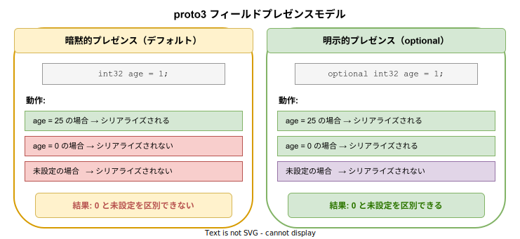
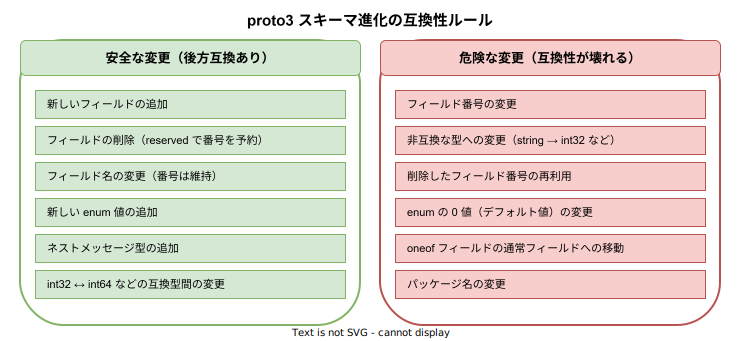

# proto3: 基本

- 対象読者: Protocol Buffers の基本概念を理解している開発者
- 学習目標: proto3 の言語仕様を理解し、フィールドプレゼンス・スキーマ進化・Well-Known Types を適切に使い分けられるようになる
- 所要時間: 約 35 分
- 対象バージョン: proto3（protobuf v3.0+、optional は v3.15+）
- 最終更新日: 2026-04-13

## 1. このドキュメントで学べること

- proto3 と proto2 の主な違いを説明できる
- フィールドプレゼンス（暗黙的・明示的）の動作を理解し使い分けられる
- Well-Known Types を適切に活用できる
- スキーマの後方互換性を保つ変更ルールを理解できる
- proto3 の JSON マッピング仕様を把握できる

## 2. 前提知識

- Protocol Buffers の基本概念（メッセージ定義、スカラー型、フィールド番号）
- 上記が不足する場合: [Protocol Buffers の基本](./protobuf_basics.md) を先に読むこと

## 3. 概要

proto3 は Protocol Buffers の言語仕様の第 3 版であり、2016 年に安定版としてリリースされた。proto2 から大幅に簡素化され、以下の方針で設計されている。

- **すべてのフィールドが暗黙的に optional**: `required` / `optional` キーワードが廃止された（`optional` は v3.15 で再導入）
- **デフォルト値のカスタマイズが不可**: 各型に固定のデフォルト値が割り当てられる
- **JSON マッピングが標準仕様**: proto3 メッセージは JSON との相互変換が規定されている
- **未知フィールドの保持**: デシリアライズ時に未知のフィールドを破棄せず保持する

## 4. 用語の整理

| 用語 | 説明 |
|------|------|
| フィールドプレゼンス | フィールドに値が「設定されたか否か」を追跡する仕組み |
| 暗黙的プレゼンス | proto3 のデフォルト動作。デフォルト値と未設定を区別しない |
| 明示的プレゼンス | `optional` キーワードで有効化。デフォルト値と未設定を区別できる |
| Well-Known Types | Google が提供する汎用メッセージ型（`Timestamp`, `Duration` 等） |
| スキーマ進化 | 既存のデータとの互換性を保ちながらスキーマを変更すること |
| reserved | 削除したフィールド番号や名前の再利用を禁止する宣言 |

## 5. 仕組み・アーキテクチャ

### フィールドプレゼンスモデル

proto3 には 2 種類のフィールドプレゼンスモデルがある。暗黙的プレゼンスではデフォルト値と未設定を区別できない。明示的プレゼンス（`optional`）を使うと区別が可能になる。



### スキーマ進化の互換性ルール

proto3 ではバイナリ互換性を保つために、安全な変更と危険な変更が明確に定義されている。フィールド番号はバイナリエンコーディングの識別子であるため、変更や再利用は互換性を壊す。



## 6. 環境構築

protoc のインストール手順は [Protocol Buffers の基本](./protobuf_basics.md) を参照すること。proto3 を使用する場合、protoc v3.0.0 以上が必要である。`optional` キーワードを使用する場合は v3.15.0 以上が必要である。

## 7. 基本の使い方

### optional によるフィールドプレゼンスの制御

```protobuf
// optional キーワードの使用例

// proto3 構文を使用する
syntax = "proto3";
// パッケージを宣言する
package example;

// ユーザープロファイルを定義する
message UserProfile {
  // ユーザー ID（必ず値が存在する前提のフィールド）
  uint64 id = 1;
  // ユーザー名（必ず値が存在する前提のフィールド）
  string name = 2;
  // ニックネーム（未設定と空文字を区別したいフィールド）
  optional string nickname = 3;
  // 年齢（未設定と 0 を区別したいフィールド）
  optional int32 age = 4;
}
```

### 解説

- `optional` なしのフィールド（`id`, `name`）は暗黙的プレゼンス。値が 0 や空文字でもシリアライズされない
- `optional` ありのフィールド（`nickname`, `age`）は明示的プレゼンス。生成コードに `has_nickname()` 等の判定メソッドが追加される
- 「値が設定されたか」を判定する必要がある場合にのみ `optional` を使用する

## 8. ステップアップ

### 8.1 Well-Known Types

Google が提供する標準メッセージ型であり、`google/protobuf/` パッケージからインポートして使用する。

```protobuf
// Well-Known Types の使用例

// proto3 構文を使用する
syntax = "proto3";
// パッケージを宣言する
package example;

// タイムスタンプ型をインポートする
import "google/protobuf/timestamp.proto";
// 期間型をインポートする
import "google/protobuf/duration.proto";
// 任意型をインポートする
import "google/protobuf/any.proto";

// タスクメッセージを定義する
message Task {
  // タスク名
  string name = 1;
  // 作成日時（Timestamp 型）
  google.protobuf.Timestamp created_at = 2;
  // 制限時間（Duration 型）
  google.protobuf.Duration timeout = 3;
  // 任意の追加データ（Any 型）
  google.protobuf.Any metadata = 4;
}
```

| Well-Known Type | 用途 | JSON 表現 |
|-----------------|------|-----------|
| `Timestamp` | 日時（ナノ秒精度） | `"2026-04-13T10:00:00Z"` |
| `Duration` | 時間の長さ | `"3.5s"` |
| `Any` | 任意のメッセージ型を格納 | `{"@type": "...", ...}` |
| `Struct` | 動的な JSON オブジェクト | `{...}` |
| `FieldMask` | 更新対象フィールドの指定 | `"name,email"` |
| `BoolValue` / `Int32Value` 等 | null 許容のスカラー値 | `null` または値 |

### 8.2 JSON マッピング

proto3 は JSON との相互変換が標準仕様として定義されている。主なルールを以下に示す。

| proto3 型 | JSON 型 | 例 |
|-----------|---------|-----|
| `int32` / `int64` | number / string | `123` または `"123"` |
| `float` / `double` | number | `1.5` |
| `bool` | boolean | `true` |
| `string` | string | `"hello"` |
| `bytes` | string (Base64) | `"SGVsbG8="` |
| `enum` | string (名前) | `"PHONE_TYPE_MOBILE"` |
| `repeated` | array | `[1, 2, 3]` |
| `map<K,V>` | object | `{"key": "value"}` |
| `message` | object | `{"name": "Alice"}` |

JSON シリアライズ時、デフォルト値のフィールドは省略される。この動作は言語ごとのオプションで変更できる。

### 8.3 reserved 文

削除したフィールドの番号や名前を予約し、将来の再利用を防止する。

```protobuf
// reserved 文の使用例

// proto3 構文を使用する
syntax = "proto3";

// ユーザーメッセージを定義する
message User {
  // 削除済みフィールド番号を予約する
  reserved 3, 5, 10 to 15;
  // 削除済みフィールド名を予約する
  reserved "old_email", "legacy_name";

  // ユーザー ID
  uint64 id = 1;
  // ユーザー名
  string name = 2;
  // メールアドレス（番号 4 を使用。3 は予約済み）
  string email = 4;
}
```

## 9. よくある落とし穴

- **optional の過剰使用**: すべてのフィールドに `optional` を付けるとコードが複雑になる。「未設定とデフォルト値を区別する必要がある場合」にのみ使用する
- **proto2 との混在**: proto2 と proto3 のファイルは `import` で相互参照できるが、セマンティクスが異なるため注意が必要である。proto2 の `required` フィールドは proto3 側では通常のフィールドとして扱われる
- **enum の未知値**: 古いスキーマで定義されていない enum 値を受信した場合、proto3 では数値のまま保持される。enum の switch 文では未知値のケースを必ず処理する
- **JSON 変換時のフィールド名**: JSON 変換時のフィールド名は `lowerCamelCase` に変換される（`user_name` → `userName`）。`json_name` オプションで明示的に指定できる

## 10. ベストプラクティス

- フィールド番号 1〜15 は 1 バイトでエンコードされるため、頻出フィールドに割り当てる
- `optional` は API の入力メッセージ（部分更新）で特に有用である。`FieldMask` との組み合わせが推奨される
- enum の 0 値は常に `UNSPECIFIED` とし、有効なビジネス値を 0 に割り当てない
- スキーマ変更時は `buf breaking`（Buf ツール）で互換性チェックを自動化する
- proto3 から Protobuf Editions への移行が進行中である。新規プロジェクトでは Editions の採用も検討する

## 11. 演習問題

1. `optional` ありとなしの `int32` フィールドを含むメッセージを定義し、値が 0 の場合の JSON 出力の違いを予想せよ
2. `Timestamp` と `Duration` を使って「タスクの開始時刻」と「制限時間」を持つメッセージを定義せよ
3. 以下の変更が後方互換性を壊すかどうかを判定せよ:（a）フィールド番号 3 を削除し `reserved 3` を追加（b）`string` 型のフィールドを `int32` に変更（c）新しいフィールド番号 10 を追加

## 12. さらに学ぶには

- 公式 Language Guide: https://protobuf.dev/programming-guides/proto3/
- Field Presence: https://protobuf.dev/programming-guides/field_presence/
- 関連 Knowledge: [Protocol Buffers の基本](./protobuf_basics.md)
- 関連 Knowledge: [gRPC の基本](./gRPC_basics.md)
- Buf ツール: [Buf の基本](../tool/buf_basics.md)

## 13. 参考資料

- Protocol Buffers Language Guide (proto3): https://protobuf.dev/programming-guides/proto3/
- Protocol Buffers Field Presence: https://protobuf.dev/programming-guides/field_presence/
- Protocol Buffers JSON Mapping: https://protobuf.dev/programming-guides/proto3/#json
- Protobuf Editions Overview: https://protobuf.dev/editions/overview/
