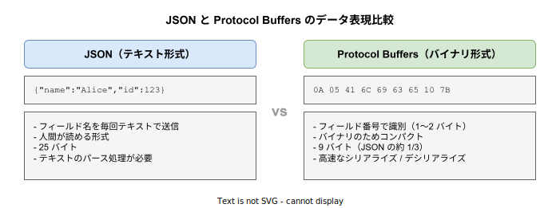

# Protocol Buffers: 基本

- 対象読者: JSON や XML によるデータ交換の経験がある開発者
- 学習目標: Protocol Buffers の設計思想を理解し、proto3 でメッセージ定義を読み書きできるようになる
- 所要時間: 約 30 分
- 対象バージョン: proto3（Protocol Buffers v3）
- 最終更新日: 2026-04-13

## 1. このドキュメントで学べること

- Protocol Buffers がどのような課題を解決するために設計されたかを説明できる
- proto3 構文でメッセージ型を定義できる
- スカラー型・列挙型・ネスト型・repeated・map・oneof を使い分けられる
- `.proto` ファイルからコードを生成するワークフローを理解できる

## 2. 前提知識

- JSON によるデータ交換の基本的な理解
- クライアント・サーバーアーキテクチャの基礎知識
- 何らかのプログラミング言語でのコーディング経験

## 3. 概要

Protocol Buffers（protobuf）は Google が開発した、言語・プラットフォーム非依存のバイナリシリアライゼーション形式である。データ構造を `.proto` ファイルで定義し、コンパイラ（`protoc`）で各言語のコードを自動生成する。

JSON や XML はテキスト形式であるため人間が読めるが、データサイズが大きく、パース処理も遅い。Protocol Buffers はバイナリ形式を採用することで、JSON の約 1/3 のサイズと数倍の処理速度を実現する。gRPC の基盤技術として広く使われている。

## 4. 用語の整理

| 用語 | 説明 |
|------|------|
| `.proto` ファイル | メッセージ型やサービスを定義するスキーマファイル |
| `protoc` | `.proto` ファイルから各言語のコードを生成するコンパイラ |
| メッセージ（Message） | 構造化データを表す型定義。フィールドの集合で構成される |
| フィールド番号（Tag） | 各フィールドに割り当てる一意の整数。バイナリエンコーディングに使われる |
| ワイヤータイプ（Wire Type） | バイナリ上でのデータの読み取り方を示す区分（varint, 固定長, 可変長など） |
| スカラー型 | `int32`, `string`, `bool` などの基本データ型 |
| proto3 | Protocol Buffers の現行構文バージョン。すべてのフィールドが暗黙的に optional |

## 5. 仕組み・アーキテクチャ

Protocol Buffers では、`.proto` ファイルに定義したスキーマを `protoc` でコンパイルし、各プログラミング言語のシリアライズ・デシリアライズコードを自動生成する。生成されたコードを使って、アプリケーション間でバイナリデータを効率的に送受信する。


Protocol Buffers はフィールド名ではなくフィールド番号でデータを識別する。この仕組みにより、JSON と比較してデータサイズが大幅に小さくなる。



## 6. 環境構築

### 6.1 必要なもの

- `protoc`（Protocol Buffers コンパイラ）
- 対象言語用のプラグイン（例: Go の場合 `protoc-gen-go`）

### 6.2 セットアップ手順

```bash
# protoc をインストールする（macOS の場合）
brew install protobuf

# バージョンを確認する
protoc --version
```

### 6.3 動作確認

```bash
# .proto ファイルから Go コードを生成する
protoc --go_out=. person.proto
```

生成されたファイル（`person.pb.go`）が出力されれば成功である。

## 7. 基本の使い方

以下は最も基本的なメッセージ定義である。

```protobuf
// Protocol Buffers のメッセージ定義ファイル

// proto3 構文を使用することを宣言する
syntax = "proto3";

// パッケージ名を宣言する
package example;

// 人物を表すメッセージ型を定義する
message Person {
  // 名前フィールド（フィールド番号 1）
  string name = 1;
  // 一意の識別子（フィールド番号 2）
  int32 id = 2;
  // メールアドレス（フィールド番号 3）
  string email = 3;
}
```

### 解説

- `syntax = "proto3"` で proto3 構文を使用することを宣言する
- `package` でパッケージ名を指定し、名前空間の衝突を防ぐ
- `message` ブロック内に各フィールドを `型 名前 = フィールド番号;` の形式で定義する
- フィールド番号はバイナリエンコーディングに使われるため、一度割り当てたら変更してはならない

### 主なスカラー型

| proto3 型 | 説明 | Go 対応型 | Rust 対応型 |
|-----------|------|-----------|-------------|
| `int32` | 可変長符号付き整数 | `int32` | `i32` |
| `int64` | 可変長符号付き整数 | `int64` | `i64` |
| `uint32` | 可変長符号なし整数 | `uint32` | `u32` |
| `float` | 32 ビット浮動小数点 | `float32` | `f32` |
| `double` | 64 ビット浮動小数点 | `float64` | `f64` |
| `bool` | 真偽値 | `bool` | `bool` |
| `string` | UTF-8 テキスト | `string` | `String` |
| `bytes` | 任意のバイト列 | `[]byte` | `Vec<u8>` |

## 8. ステップアップ

### 8.1 列挙型（enum）

```protobuf
// 列挙型の定義例

// 電話番号の種別を列挙する
enum PhoneType {
  // proto3 では最初の値は必ず 0 にする
  PHONE_TYPE_UNSPECIFIED = 0;
  // 携帯電話
  PHONE_TYPE_MOBILE = 1;
  // 自宅
  PHONE_TYPE_HOME = 2;
  // 勤務先
  PHONE_TYPE_WORK = 3;
}
```

proto3 では列挙型の最初の値は必ず 0 でなければならない。名前には `型名_` のプレフィックスを付けることが推奨される。

### 8.2 repeated・map・oneof

```protobuf
// 高度なフィールド型の定義例

// ユーザー情報を表すメッセージ型を定義する
message User {
  // ユーザー ID
  uint64 id = 1;
  // ユーザー名
  string name = 2;
  // タグのリスト（repeated = 配列）
  repeated string tags = 3;
  // メタデータ（map = キーバリュー）
  map<string, string> metadata = 4;
  // 連絡先（oneof = 排他的フィールド）
  oneof contact {
    // 電話番号
    string phone = 5;
    // メールアドレス
    string email = 6;
  }
}
```

- `repeated`: 同じ型の値を 0 個以上格納するリスト（配列）
- `map<K, V>`: キーバリューのペア。キーは整数型または文字列型のみ
- `oneof`: 排他的フィールド。グループ内で一度に 1 つだけ値を持つ

### 8.3 import とパッケージ

```protobuf
// 他のファイルの型を参照する例

// proto3 構文を使用する
syntax = "proto3";
// パッケージを宣言する
package myapp;

// 共通型を定義したファイルをインポートする
import "common/timestamp.proto";

// イベントメッセージを定義する
message Event {
  // イベント名
  string name = 1;
  // 発生日時（インポートした型を使用）
  common.Timestamp created_at = 2;
}
```

## 9. よくある落とし穴

- **フィールド番号の変更・再利用**: フィールド番号を変更すると後方互換性が壊れる。削除したフィールド番号は `reserved` で予約し再利用を防ぐ
- **デフォルト値の区別**: proto3 ではすべてのフィールドにデフォルト値がある（文字列は空文字、数値は 0、bool は false）。「値が未設定」と「デフォルト値」を区別するには `optional` キーワードを使用する
- **フィールド番号 1〜15 の活用**: フィールド番号 1〜15 は 1 バイトでエンコードされ、16 以上は 2 バイト必要になる。頻繁に使うフィールドには小さい番号を割り当てる
- **enum の 0 値の欠落**: proto3 では enum の最初の値は 0 でなければならない。0 値を `UNSPECIFIED` として定義する

## 10. ベストプラクティス

- `.proto` ファイルは専用リポジトリで管理し、サーバーとクライアントの両方から参照する
- フィールド番号は一度割り当てたら変更しない。削除時は `reserved` で予約する
- enum 値には `型名_` のプレフィックスを付け、名前の衝突を防ぐ
- ネストしたメッセージ型を活用し、関連するデータをグループ化する
- `google.protobuf` パッケージの Well-Known Types（`Timestamp`, `Duration`, `Any` 等）を積極的に活用する

## 11. 演習問題

1. 書籍を表す `Book` メッセージを定義せよ。`title`（文字列）、`author`（文字列）、`price`（整数）、`tags`（文字列のリスト）を含めること
2. 書籍のジャンルを表す `Genre` 列挙型を定義し、`Book` メッセージに `genre` フィールドを追加せよ
3. `Book` メッセージの `price` フィールドを削除し、`reserved` で予約した上で、新しいフィールド `price_cents`（フィールド番号 5）を追加せよ

## 12. さらに学ぶには

- 公式ドキュメント: https://protobuf.dev/
- Language Guide (proto3): https://protobuf.dev/programming-guides/proto3/
- 関連 Knowledge: [gRPC の基本](./gRPC_basics.md)
- Buf（proto 管理ツール）: [Buf の基本](../tool/buf_basics.md)

## 13. 参考資料

- Protocol Buffers Language Guide (proto3): https://protobuf.dev/programming-guides/proto3/
- Protocol Buffers Encoding: https://protobuf.dev/programming-guides/encoding/
- Protocol Buffers Style Guide: https://protobuf.dev/programming-guides/style/
