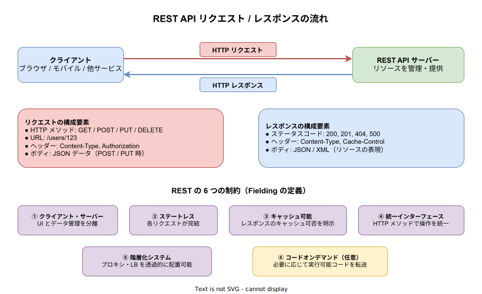
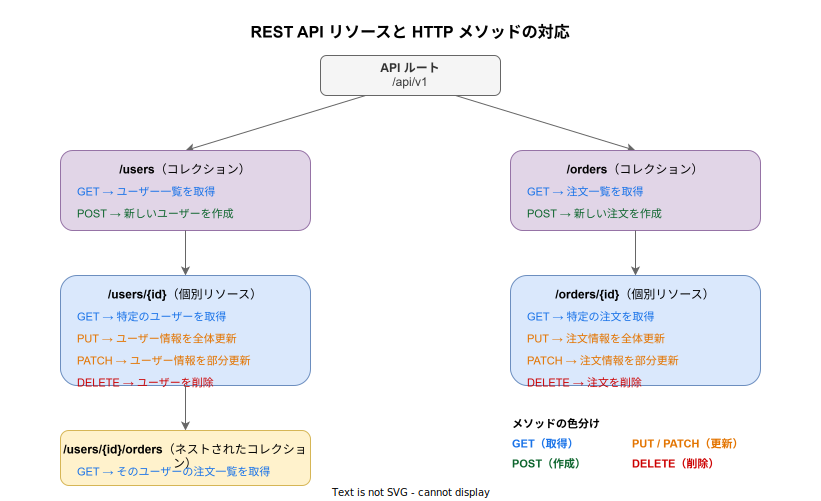

# REST API: 基本

- 対象読者: HTTP 通信の基本（リクエスト/レスポンスモデル）を理解している開発者
- 学習目標: REST の設計原則・HTTP メソッド・ステータスコード・URL 設計を理解し、RESTful な API を設計・利用できるようになる
- 所要時間: 約 30 分
- 対象バージョン: HTTP/1.1（RFC 7230-7235）、REST アーキテクチャスタイル
- 最終更新日: 2026-04-13

## 1. このドキュメントで学べること

- REST がどのような課題を解決するために提唱されたかを説明できる
- REST の 6 つの制約を列挙し、それぞれの意味を説明できる
- HTTP メソッド（GET / POST / PUT / PATCH / DELETE）と CRUD 操作の対応を理解できる
- 主要な HTTP ステータスコードの意味と使い分けを判断できる
- リソース指向の URL 設計ができる

## 2. 前提知識

- HTTP のリクエスト/レスポンスモデルの基本理解
- JSON 形式のデータ構造の読み書き
- コマンドライン操作（curl の基本的な使い方）

## 3. 概要

REST（Representational State Transfer）は、2000 年に Roy Fielding が博士論文で提唱した Web サービスのアーキテクチャスタイルである。プロトコルやフォーマットの仕様ではなく、Web API を設計するための原則と制約の集合である。

REST 以前の Web サービス設計では、SOAP（Simple Object Access Protocol）が主流であった。SOAP は XML ベースの厳密なメッセージ形式と WSDL による型定義を持つが、冗長なペイロードや複雑な仕様が課題となっていた。REST はこれに対し、HTTP プロトコルの機能（メソッド・ステータスコード・ヘッダー）をそのまま活用することで、シンプルかつ直感的な API 設計を可能にした。

REST の核心は「リソース」という概念である。サーバー上のデータや機能を「リソース」として URL で一意に識別し、HTTP メソッドで操作する。リソースの「表現」（Representation）として JSON や XML を返すため、Representational State Transfer と呼ばれる。

## 4. 用語の整理

| 用語 | 説明 |
|------|------|
| リソース（Resource） | API で操作対象となるデータや概念。URL で一意に識別される（例: ユーザー、注文） |
| 表現（Representation） | リソースの状態を表すデータ形式。JSON や XML が一般的 |
| エンドポイント（Endpoint） | リソースにアクセスするための URL パス（例: `/users/123`） |
| コレクション（Collection） | 同種のリソースの集合を表す URL（例: `/users`） |
| CRUD | Create / Read / Update / Delete の頭文字。データ操作の 4 つの基本操作 |
| ステートレス（Stateless） | サーバーがリクエスト間でクライアントの状態を保持しないこと |
| べき等性（Idempotent） | 同じリクエストを何度実行しても同じ結果になる性質 |
| HATEOAS | Hypermedia As The Engine Of Application State。レスポンスに次に取りうるアクションのリンクを含める設計 |

## 5. 仕組み・アーキテクチャ

REST API では、クライアントが HTTP リクエスト（メソッド・URL・ヘッダー・ボディ）をサーバーに送信し、サーバーがリソースの表現を HTTP レスポンス（ステータスコード・ヘッダー・ボディ）として返す。この通信はステートレスであり、各リクエストが必要な情報をすべて含む。



リソースは階層的な URL で識別される。コレクション（`/users`）に対しては一覧取得や新規作成を、個別リソース（`/users/{id}`）に対しては取得・更新・削除を行う。



### HTTP メソッドと CRUD の対応

| HTTP メソッド | CRUD 操作 | べき等性 | 安全性 | 用途 |
|---------------|-----------|----------|--------|------|
| GET | Read | あり | あり | リソースの取得 |
| POST | Create | なし | なし | リソースの新規作成 |
| PUT | Update | あり | なし | リソースの全体置換 |
| PATCH | Update | なし | なし | リソースの部分更新 |
| DELETE | Delete | あり | なし | リソースの削除 |

「安全性」とは、リソースの状態を変更しないことを意味する。GET は安全なメソッドであり、何度呼んでもリソースの状態は変わらない。「べき等性」とは、同じリクエストを複数回実行しても結果が同じになる性質であり、PUT と DELETE はべき等である。

### 主要なステータスコード

| コード | 意味 | 使用場面 |
|--------|------|----------|
| 200 OK | 成功 | GET / PUT / PATCH の成功時 |
| 201 Created | リソース作成成功 | POST による新規作成成功時 |
| 204 No Content | 成功（ボディなし） | DELETE 成功時 |
| 400 Bad Request | リクエスト不正 | バリデーションエラー |
| 401 Unauthorized | 認証が必要 | 認証トークンがない・期限切れ |
| 403 Forbidden | アクセス権限なし | 認証済みだが権限不足 |
| 404 Not Found | リソースが存在しない | 存在しない URL へのアクセス |
| 409 Conflict | 競合 | 既に存在するリソースの重複作成 |
| 500 Internal Server Error | サーバー内部エラー | サーバー側の予期しないエラー |

## 6. 環境構築

REST API の利用に特別なインストールは不要である。HTTP クライアントがあれば任意の REST API にリクエストを送信できる。

### 6.1 必要なもの

- curl（コマンドラインの HTTP クライアント。多くの OS に標準搭載）
- jq（JSON の整形・フィルタリングツール。任意だが推奨）

### 6.2 動作確認

```bash
# curl のインストール確認と公開 API へのリクエスト送信

# curl がインストールされていることを確認する
curl --version

# 公開 API にリクエストを送信してレスポンスを確認する
curl -s https://httpbin.org/get | jq .
```

JSON レスポンスが整形されて表示されれば成功である。

## 7. 基本の使い方

以下は、REST API に対する基本的な CRUD 操作の例である（httpbin.org を使用）。

```bash
# REST API の基本的な CRUD 操作を示すサンプル

# GET: リソースを取得する
curl -s https://httpbin.org/get

# POST: 新しいリソースを作成する（JSON ボディを送信）
curl -s -X POST https://httpbin.org/post \
  -H "Content-Type: application/json" \
  -d '{"name": "田中", "email": "tanaka@example.com"}'

# PUT: リソースを全体更新する
curl -s -X PUT https://httpbin.org/put \
  -H "Content-Type: application/json" \
  -d '{"name": "田中太郎", "email": "tanaka@example.com"}'

# DELETE: リソースを削除する
curl -s -X DELETE https://httpbin.org/delete
```

### 解説

- `-X` で HTTP メソッドを指定する。省略時は GET が使われる
- `-H` でリクエストヘッダーを追加する。JSON を送信する場合は `Content-Type: application/json` を指定する
- `-d` でリクエストボディを指定する。JSON 文字列を渡す
- `-s` はプログレスバーを非表示にするオプションである

## 8. ステップアップ

### 8.1 URL 設計の原則

RESTful な URL はリソースを名詞で表現し、操作は HTTP メソッドで表現する。

| 設計 | 良い例 | 悪い例 |
|------|--------|--------|
| リソースは名詞で表現 | `GET /users` | `GET /getUsers` |
| コレクションは複数形 | `/users` | `/user` |
| 階層はネストで表現 | `/users/123/orders` | `/getUserOrders?id=123` |
| 動詞は使わない | `POST /users` | `POST /createUser` |

### 8.2 ページネーションとフィルタリング

大量のリソースを返す場合、クエリパラメータでページネーションやフィルタリングを実装する。

```text
GET /users?page=2&per_page=20&sort=name&order=asc
GET /users?status=active&role=admin
```

レスポンスには総件数やページ情報をヘッダーまたはボディに含めることが推奨される。

### 8.3 API バージョニング

API の破壊的変更に備え、バージョン管理を行う。主な方式は以下の通りである。

| 方式 | 例 | 特徴 |
|------|-----|------|
| URL パス | `/api/v1/users` | 最も直感的で広く採用されている |
| ヘッダー | `Accept: application/vnd.api.v1+json` | URL がクリーンだが実装は複雑 |
| クエリパラメータ | `/users?version=1` | 簡易だがキャッシュに影響する場合がある |

## 9. よくある落とし穴

- **動詞を URL に含める**: `/createUser` や `/deleteUser/123` は RESTful ではない。リソースを名詞で表し、操作は HTTP メソッドで表現する
- **GET でリソースを変更する**: GET は安全なメソッドであり、副作用があってはならない。リソースの変更には POST / PUT / PATCH / DELETE を使う
- **適切でないステータスコード**: すべてのエラーを `200 OK` + エラーメッセージで返す設計は、クライアント側のエラーハンドリングを困難にする
- **PUT と PATCH の混同**: PUT はリソースの全体置換であり、送信しなかったフィールドはデフォルト値にリセットされる。部分更新には PATCH を使用する
- **ステートフルな設計**: サーバー側でセッション状態に依存する設計は、スケーラビリティを損なう。認証情報はリクエストごとにトークン等で送信する

## 10. ベストプラクティス

- URL は名詞・複数形で統一し、HTTP メソッドで操作を表現する
- ステータスコードを正しく使い分け、クライアントがレスポンスを機械的に判別できるようにする
- エラーレスポンスには一貫した JSON 構造（エラーコード・メッセージ・詳細）を返す
- API バージョニングを導入し、破壊的変更時に既存クライアントへの影響を最小化する
- 大量データの取得にはページネーションを実装し、レスポンスサイズを制御する
- HTTPS を使用してすべての通信を暗号化する
- レートリミットを設定し、API の過負荷を防止する

## 11. 演習問題

1. ブックストア API の URL 設計を行え。「書籍一覧の取得」「書籍の新規登録」「特定の書籍の詳細取得」「書籍情報の更新」「書籍の削除」「特定の書籍のレビュー一覧取得」に対応する URL と HTTP メソッドを設計すること
2. curl を使い、httpbin.org に対して GET / POST / PUT / DELETE リクエストを送信し、レスポンスのステータスコードとボディを確認せよ
3. PUT と PATCH の違いを、具体的な JSON リクエストボディの例を用いて説明せよ

## 12. さらに学ぶには

- Roy Fielding の博士論文 第 5 章（REST の定義）: <https://www.ics.uci.edu/~fielding/pubs/dissertation/rest_arch_style.htm>
- MDN Web Docs - HTTP: <https://developer.mozilla.org/ja/docs/Web/HTTP>
- 関連 Knowledge: [gRPC の基本](./gRPC_basics.md)（REST との比較を含む）
- 関連 Knowledge: [WebSocket の基本](./websocket_basics.md)（双方向通信との比較）

## 13. 参考資料

- Fielding, R. T. (2000). Architectural Styles and the Design of Network-based Software Architectures. Doctoral dissertation, University of California, Irvine.
- RFC 7230-7235 - HTTP/1.1: <https://datatracker.ietf.org/doc/html/rfc7230>
- RFC 5789 - PATCH Method for HTTP: <https://datatracker.ietf.org/doc/html/rfc5789>
