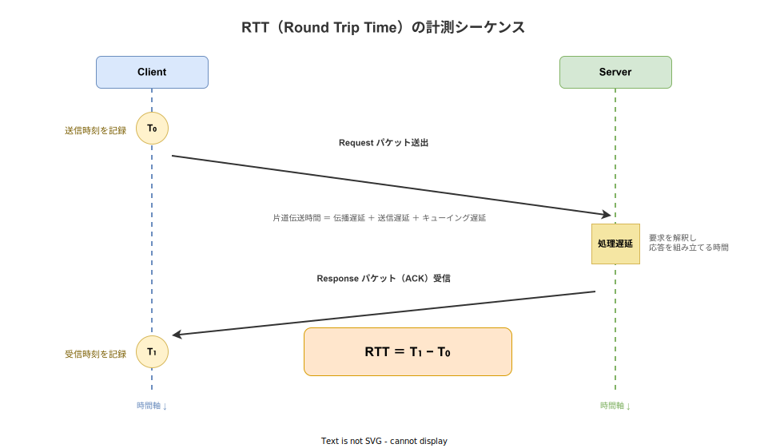
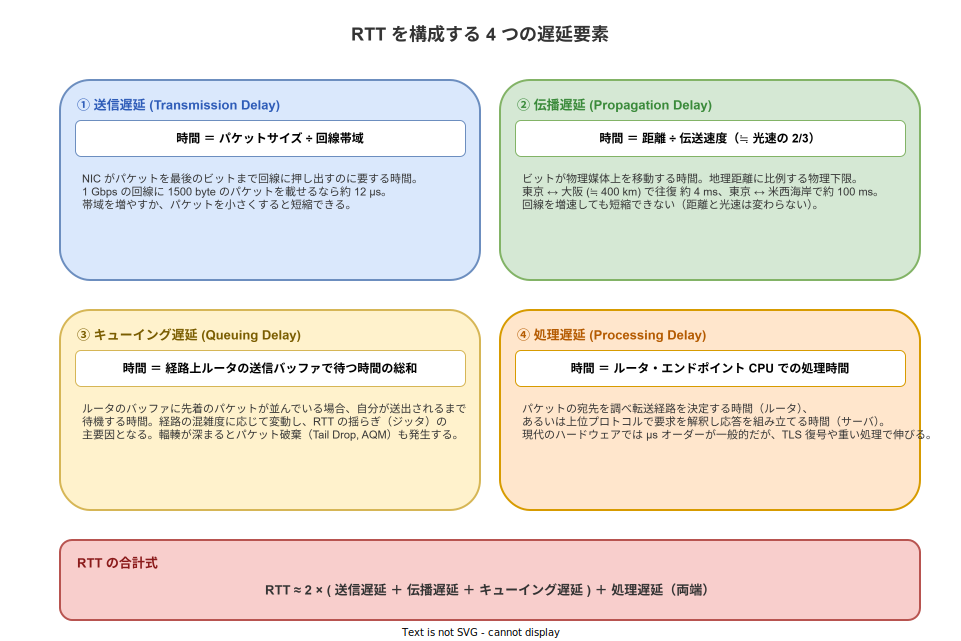

# RTT: 概要

- 対象読者: TCP/IP の基本（3-way ハンドシェイク・ACK）を知っているが、RTT という指標を体系的に学んだことがない開発者
- 学習目標: RTT の定義・構成要素・計測手法を説明でき、TCP/QUIC の挙動や Web アプリのレイテンシ最適化と結びつけて理解できるようになる
- 所要時間: 約 35 分
- 対象バージョン: RFC 6298（TCP RTO 計算、2011）、RFC 7323（TCP 拡張・Timestamps、2014）、RFC 9000（QUIC、2021）
- 最終更新日: 2026-04-16

## 1. このドキュメントで学べること

- RTT（Round Trip Time）の定義と、「なぜ」ネットワーク性能の中心指標なのかを説明できる
- RTT を構成する 4 つの遅延要素（送信・伝播・キューイング・処理）を区別できる
- TCP / ICMP / QUIC における RTT の計測方式の違いを説明できる
- SRTT・RTTVAR・RTO の関係、Karn / Jacobson-Karels アルゴリズムの骨子を理解できる
- BDP（Bandwidth-Delay Product）を使ってスループット上限を見積もれるようになる

## 2. 前提知識

- TCP/IP の基礎（SYN / ACK、ハンドシェイク、シーケンス番号）
- OSI 参照モデル、特に L3（IP）と L4（TCP/UDP）の役割分担
- 光速・帯域・遅延の単位（ms / µs / Gbps）への感覚
- 関連: [gRPC の概要](./gRPC_basics.md)、[WebSocket の概要](./websocket_basics.md)（HTTP/2・常時接続のレイテンシ特性を理解する際の前提）

## 3. 概要

RTT（Round Trip Time）とは、「あるパケットを送信してから、その返信を受信するまでに要した時間」である。単位は通常ミリ秒（ms）。`ping` コマンドが返す値が最もよく知られた RTT の例で、ICMP Echo Request とその Reply の往復時間をそのまま示している。

RTT はレイテンシ系指標の中で最も基本的な量であり、次のいずれの議論においても中核となる。

- **対話型アプリの応答性**: 1 回のリクエスト／レスポンスが最低でも 1 RTT かかるため、UX の下限を決める
- **TCP のスループット**: 受信側がデータ受信を確認（ACK）するまで送信側は一定量以上送れない。帯域が十分に太くても RTT が長ければスループットは伸びない
- **再送タイマー (RTO)**: TCP は計測した RTT から「何秒応答がなければ再送すべきか」を動的に決める
- **輻輳制御**: Reno/CUBIC/BBR などの輻輳制御アルゴリズムは RTT の変動を輻輳のシグナルとして利用する

RTT は片道遅延（One-Way Delay）と対になる概念だが、ネットワーク機器の時刻同期が難しいため、実務上は RTT のほうが計測しやすく広く使われる。

## 4. 用語の整理

| 用語 | 説明 |
|------|------|
| RTT | 送信から応答受信までの往復時間。単一サンプル値を指す |
| SRTT | Smoothed RTT。直近の RTT サンプルを指数平滑したもの。TCP の RTO 計算に使う |
| RTTVAR | RTT の分散（揺らぎ）の推定値。ジッタに追従させるために用いる |
| RTO | Retransmission Timeout。ACK が返らなかった場合に再送を開始するまでの待機時間 |
| Jitter | RTT の時間方向の揺らぎ。キューイング遅延の変動が主因 |
| BDP | Bandwidth-Delay Product。帯域×RTT で計算する「経路上を飛行中のビット量」の容量 |
| LFN | Long Fat Network。BDP が 65 535 byte を超える高帯域長 RTT 経路。TCP Window Scale が必須となる |
| One-Way Delay | 片道遅延。送信から宛先到達までの時間 |
| MDEV | Mean Deviation。Linux の `ss` や `ping` が表示する RTTVAR と類似の指標 |
| Karn's Algorithm | 再送したセグメントの ACK を RTT サンプルから除外するルール |

## 5. 仕組み・アーキテクチャ

### 5.1 RTT の計測シーケンス

RTT の定義は単純だが、「いつの T₀ と T₁ を基準に取るか」で値は変わる。送信側アプリで `sendmsg` した瞬間から ACK を受信した瞬間までを取るのが標準的で、NIC 到達直前・OS カーネル内のバッファ時間は通常 RTT に含めない。



TCP では ACK 自体がプロトコルに組み込まれているため、データ送信用の同じセッション内で RTT が自動的に得られる。RFC 7323 の TCP Timestamps オプションを有効にすると、再送の影響を受けず正確な RTT が取れる。

### 5.2 RTT を構成する 4 つの遅延要素

RTT はネットワーク経路上で発生する複数の遅延の合計である。それぞれの要素は発生原因も短縮方法も異なるため、問題解決の際は切り分けが重要になる。



送信遅延と伝播遅延は物理層に由来するため、アプリケーションからはほぼ制御できない。一方でキューイング遅延はネットワーク全体の負荷、処理遅延はサーバ側の実装に依存するため、最適化の余地が大きい。

### 5.3 TCP における SRTT と RTO の推定

TCP は単一 RTT サンプルをそのまま再送タイマーに使わず、RFC 6298 の平滑化アルゴリズムで揺らぎに強い RTO を算出する。`R'` を新しい RTT サンプルとすると次のように更新する。

```
RTTVAR ← (1 − β) × RTTVAR + β × |SRTT − R'|
SRTT   ← (1 − α) × SRTT   + α × R'
RTO    ← SRTT + max(G, K × RTTVAR)
```

推奨値は α = 1/8、β = 1/4、K = 4、G = クロック粒度（通常 1 s 以下）。Karn's Algorithm により、再送されたセグメントの RTT サンプルは SRTT 更新から除外する（どちらの送出に対する ACK か判定できないため）。

## 6. 環境構築

### 6.1 必要なもの

- Linux もしくは macOS シェル（`ping`, `ss`, `tcpdump` が使える環境）
- Rust 1.77 以上（Edition 2024 でコンパイル）
- 任意: `mtr`（Linux、ホップ毎の RTT を可視化）

### 6.2 ping で素の RTT を確認

1. 任意のホストへ ICMP Echo を送信する
   ```bash
   ping -c 5 1.1.1.1
   ```
2. 出力の `time=XX.X ms` が各パケットの RTT サンプル
3. 末尾の `rtt min/avg/max/mdev = …` が統計量（mdev は RTTVAR 相当）

### 6.3 TCP の SRTT/RTO を確認

Linux では既存 TCP コネクションごとの SRTT / RTTVAR / RTO がカーネルから参照できる。

```bash
ss -tin
```

出力中の `rtt:X/Y rto:Z` が「SRTT/RTTVAR rto:RTO」である（単位は ms）。

## 7. 基本の使い方

Rust から TCP 接続の RTT を手計測する最小例を示す。`std::time::Instant` で送信直前／応答受信直後の時刻を記録し、差分を RTT として取得する。

```rust
// TCP 接続時の 3-way ハンドシェイク相当の RTT を手計測するサンプル。
// TcpStream::connect 完了までの経過時間を 1 回ぶんの RTT サンプルとして扱う。
use std::net::{TcpStream, ToSocketAddrs};
use std::time::{Duration, Instant};

// エントリポイント。
fn main() -> std::io::Result<()> {
    // 計測対象のホスト名とポートを指定する。
    let target = "example.com:443";
    // 名前解決結果を複数含みうるため最初のアドレスだけ使う。
    let addr = target.to_socket_addrs()?.next().expect("no address");
    // 5 回ぶん連続で計測して平均と分散を観察する。
    let mut samples = Vec::new();
    for _ in 0..5 {
        // 送信直前の時刻を取得する。
        let t0 = Instant::now();
        // タイムアウト付きで TCP 接続（SYN → SYN-ACK → ACK）を完了させる。
        let _stream = TcpStream::connect_timeout(&addr, Duration::from_secs(2))?;
        // ACK 受信直後の時刻を取得する。
        let rtt = t0.elapsed();
        // サンプル値をミリ秒で記録する。
        samples.push(rtt.as_secs_f64() * 1000.0);
    }
    // 5 サンプルの単純平均を RTT 推定値として出力する。
    let avg = samples.iter().sum::<f64>() / samples.len() as f64;
    println!("samples(ms) = {:?}, avg = {:.2} ms", samples, avg);
    Ok(())
}
```

### 解説

- `TcpStream::connect` は 3-way ハンドシェイクの完了までブロックする。ハンドシェイクは 1 RTT 分の遅延なので、この差分はトランスポート層 RTT とほぼ一致する。
- より厳密には HTTPS の場合 TLS 1.3 でさらに 1 RTT 分追加される。純粋な L4 RTT を測るなら TLS 無しのポート（例: `:80`）を使う。
- 同じ接続を使い続けると OS のパス MTU キャッシュや TCP Fast Open の影響で値がぶれる。比較検証の際は毎回新規接続にする。

## 8. ステップアップ

### 8.1 帯域遅延積（BDP）とウィンドウサイズ

送信側がまだ ACK を受け取っていない「飛行中の」データ量の上限が TCP のウィンドウサイズ（`CWND` と `RWND` の小さい方）である。最大スループットは次の式で近似できる。

```
Throughput ≈ WindowSize ÷ RTT
```

例えば RTT = 100 ms で 1 Gbps（125 MB/s）を出し切るには、BDP = 125 MB/s × 0.1 s = 12.5 MB のウィンドウが必要になる。デフォルトの 64 KB では 640 KB/s 程度しか出せず、TCP Window Scale（RFC 7323）必須となる。これが LFN 問題である。

### 8.2 QUIC における RTT の扱い

QUIC（RFC 9000）は RTT 計測を UDP の上に再実装しており、独自の `min_rtt` と `smoothed_rtt` を保持する。TCP と違い Ack Delay が明示的にパケットに含まれるため、サーバ処理遅延を差し引いた純粋なネットワーク RTT を得られる。0-RTT / 1-RTT セッション再開も RTT 最適化の文脈で設計されている。

### 8.3 輻輳制御と RTT

CUBIC（Linux デフォルト）はパケットロスを輻輳シグナルとするが、BBR（Google 2016）は `min_rtt` と最大帯域の 2 指標だけで送信レートを決める。BBR は RTT の上昇をバッファ蓄積の兆候とみなし、キューイング遅延が増えたら送信を抑える。このように輻輳制御アルゴリズムの選択は RTT プロファイルに強く依存する。

### 8.4 中継経路の RTT を分解する

`mtr` や `traceroute` を使うと、各ホップまでの RTT を段階的に計測できる。特定区間で急激に RTT が跳ね上がる場合、その先のリンクで輻輳や物理的遠距離（海底ケーブル等）が発生していると推測できる。

## 9. よくある落とし穴

- **平均だけ見る**: ジッタが大きい経路では P50 と P99 が 10 倍以上乖離する。RTT は分布で評価する
- **`ping` の値を TCP RTT と等しいと見なす**: ICMP はルータで優先度を下げられることがあり、実 TCP RTT より小さく／大きく出うる
- **アプリ計測値に OS バッファを含める**: `write()` から `read()` までの時間は OS 側のバッファ待ちを含む。純 RTT には TCP Timestamps や QUIC の `smoothed_rtt` を使う
- **再送セグメントの RTT サンプル採用**: Karn's Algorithm に従い、再送された ACK は RTT 計算から除外する必要がある
- **RTO を極端に短くする**: 偽再送（Spurious Retransmission）を誘発し、輻輳制御が縮退する。RFC 6298 は RTO の下限を 1 秒と規定
- **RTT を短縮すれば帯域が増える**と誤解: 帯域は回線仕様で決まる上限。RTT を短くするとウィンドウ制約下のスループットは改善するが、物理帯域は増えない
- **片道遅延 ≒ RTT / 2 と仮定**: 経路が非対称（行きと帰りで別ルート）な場合は成り立たない

## 10. ベストプラクティス

- アプリ層 SLO を決める際は、対象リージョン間の RTT の P50 と P99 を実測してから逆算する
- 対話型 API は「1 RTT あたりの情報量」を最大化する設計にする（HTTP/2 多重化、バッチ化、パイプライン）
- 地理分散アプリは CDN / エッジキャッシュで RTT の物理下限（伝播遅延）そのものを短縮する
- 長距離経路では TCP Window Scale、Selective ACK、TCP Timestamps を有効化する
- モニタリングは SRTT/RTTVAR を時系列記録し、輻輳の兆候を早期検知する（`ss -tin` を cron 採取、もしくは eBPF）
- 新しい輻輳制御（BBRv3 / CUBIC）を導入する際は、対象パスの RTT プロファイルでベンチマークしてから採用する
- 多地域展開の RPC 設計では、1 操作を 1 RTT に収める（リトライ込みでも 2 RTT 以内）ことを目標にする

## 11. 演習問題

1. `ping` と HTTPS 接続時間（`curl -w '%{time_connect}'`）をそれぞれ計測し、TLS 1.3 のハンドシェイクで何 RTT 追加されるか確認せよ
2. RTT = 80 ms、帯域 = 1 Gbps の LFN で、デフォルト 64 KB ウィンドウと Window Scale 有効時（8 MB）の理論最大スループットを計算せよ
3. Linux で `tc qdisc add dev lo root netem delay 100ms` を使いループバックに遅延を注入し、`ss -tin` の SRTT/RTTVAR が収束する様子を観察せよ
4. 同じホストに対して ICMP ping と TCP SYN の RTT を同時計測し、値が乖離する原因を考察せよ

## 12. さらに学ぶには

- RFC 6298「Computing TCP's Retransmission Timer」: https://www.rfc-editor.org/rfc/rfc6298
- RFC 7323「TCP Extensions for High Performance」: https://www.rfc-editor.org/rfc/rfc7323
- RFC 9000「QUIC: A UDP-Based Multiplexed and Secure Transport」: https://www.rfc-editor.org/rfc/rfc9000
- High Performance Browser Networking（Ilya Grigorik 著、O'Reilly、無料公開）: https://hpbn.co/
- 関連 Knowledge: [gRPC の概要](./gRPC_basics.md)

## 13. 参考資料

- RFC 793 / 9293 Transmission Control Protocol
- RFC 6298 Computing TCP's Retransmission Timer（2011）
- RFC 7323 TCP Extensions for High Performance（2014）
- RFC 9000 QUIC Protocol（2021）
- Jacobson, V. "Congestion Avoidance and Control," SIGCOMM 1988
- Cardwell, N. et al. "BBR: Congestion-Based Congestion Control," ACM Queue, 2016
