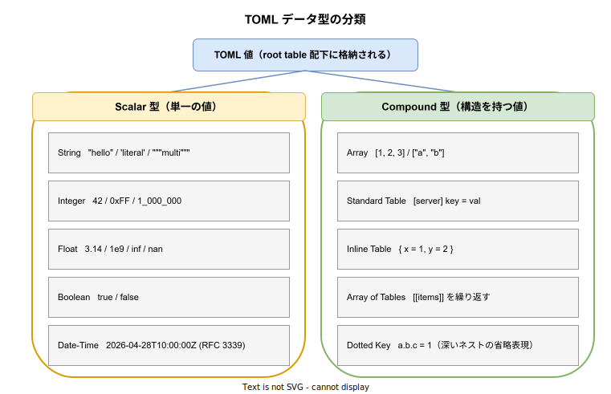
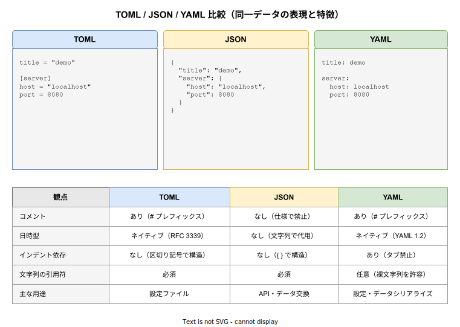

# TOML: 基本

- 対象読者: 設定ファイルの編集経験がある開発者（INI / JSON / YAML のいずれかに触れたことを想定）
- 学習目標: TOML の構文と型システムを理解し、`Cargo.toml` や `pyproject.toml` のような実用設定ファイルを読み書きできるようになる
- 所要時間: 約 30 分
- 対象バージョン: TOML v1.0.0（2021-01-12 公開）
- 最終更新日: 2026-04-28

## 1. このドキュメントで学べること

- TOML の設計目標と JSON / YAML との位置付けを説明できる
- スカラ型・複合型の構文を網羅的に書ける
- Standard Table / Inline Table / Array of Tables / Dotted Key の使い分けを判断できる
- `Cargo.toml` で頻出する記法を読み解ける
- 後方互換を意識した編集ができる

## 2. 前提知識

- 何らかの設定ファイル形式（INI・JSON・YAML のいずれか）の編集経験
- ハッシュテーブル（連想配列）の概念

## 3. 概要

TOML（Tom's Obvious, Minimal Language）は、人間にとって読み書きしやすい設定ファイル向けのテキストフォーマットである。GitHub 共同創業者 Tom Preston-Werner が 2013 年に提案し、2021 年 1 月に v1.0.0 が安定版として確定した。

TOML の設計目標は次の 3 点に集約される。

- 人間にとって明示的で読みやすいこと
- ハッシュテーブル（dict / map）に**一意に**マップできること
- 多くの言語で実装しやすいこと

JSON と比べてコメントが書け、日時型を持つ。YAML と比べてインデントに依存せず、構文が明示的で曖昧さが少ない。Rust の `Cargo.toml`、Python の `pyproject.toml`（PEP 518 / 621）、Hugo・Zola など静的サイトジェネレータの設定で広く採用されている。

## 4. 用語の整理

| 用語 | 説明 |
|------|------|
| キー / 値 | `key = value` 形式の最小単位 |
| Table | キーをグループ化する単位（`[section]`）。JSON のオブジェクトに相当 |
| Inline Table | `{ k = v, ... }` 形式で 1 行に書くテーブル |
| Array of Tables | `[[name]]` を繰り返して同名テーブルの配列を作る記法 |
| Bare Key | クォート不要で書ける英数字キー（`A-Za-z0-9_-` のみ） |
| Dotted Key | `a.b.c = 1` の形でネストを 1 行で表すキー |
| Basic String | `"..."` の文字列。エスケープシーケンスを解釈する |
| Literal String | `'...'` の文字列。エスケープを解釈せずバイト列をそのまま保持 |

## 5. 仕組み・アーキテクチャ

TOML 文書はパース後、ルートテーブル直下にスカラ・配列・サブテーブルが入った階層構造へ写像される。スカラ型と複合型の分類を整理すると次のとおり。



JSON / YAML と並べると、TOML がどのトレードオフ点に位置するかが見えやすい。同一のデータを 3 形式で表現した比較を以下に示す。



## 6. 環境構築

TOML は仕様であり、実利用には言語ごとの実装ライブラリが必要となる。

### 6.1 必要なもの

- TOML を扱う言語と実装ライブラリ
  - Rust: [`toml`](https://docs.rs/toml/) crate
  - Python: 標準 [`tomllib`](https://docs.python.org/3/library/tomllib.html)（読み取り、3.11+） / `tomli_w`（書き込み）
  - Go: [`github.com/BurntSushi/toml`](https://github.com/BurntSushi/toml)

### 6.2 セットアップ手順（Rust 版）

1. 新規 Rust プロジェクトを作成する: `cargo new toml-demo`
2. `Cargo.toml` の `[dependencies]` に `toml = "0.8"` と `serde = { version = "1", features = ["derive"] }` を追加する

### 6.3 動作確認

`cargo build` が成功すれば準備完了。次節のサンプルを `src/main.rs` に貼り付けて `cargo run` で実行確認する。

## 7. 基本の使い方

```rust
// TOML ドキュメントを Rust 構造体にデシリアライズする最小例
// シリアライズ/デシリアライズ用のトレイトを取り込む
use serde::Deserialize;

// TOML を受け取る Rust 構造体を定義する
#[derive(Deserialize, Debug)]
struct Config {
    // [server] テーブルにマップされるフィールド
    server: Server,
}

// server サブテーブルの構造体
#[derive(Deserialize, Debug)]
struct Server {
    // ホスト名
    host: String,
    // 待ち受けポート
    port: u16,
}

fn main() {
    // 入力 TOML 文字列
    let src = r#"
        [server]
        host = "localhost"
        port = 8080
    "#;
    // toml クレートで Rust 構造体に変換する
    let cfg: Config = toml::from_str(src).expect("parse error");
    // 値を確認のため出力する
    println!("{cfg:?}");
}
```

### 解説

- `[server]` のテーブルが構造体の `server` フィールドへマップされる
- `host` / `port` の値は Rust の型（`String` / `u16`）へ自動変換される
- 型不一致は `from_str` がエラーで返すため、設定ミスは起動時に検出できる

## 8. ステップアップ

### 8.1 主要なデータ型

```toml
# TOML 主要型の網羅例

# 文字列（Basic、エスケープを解釈する）
title = "TOML Example"
# 文字列（Literal、エスケープを解釈しない）
path  = 'C:\Users\nodriver'
# 整数（10 進、アンダースコアで桁区切り可）
count = 1_000_000
# 浮動小数点
ratio = 3.14
# 真偽値
debug = true
# Offset Date-Time（RFC 3339）
released = 2021-01-12T00:00:00Z
# 配列（v1.0 から異種混合も許容）
ports = [8000, 8001, 8002]
```

### 8.2 Table と Dotted Key

```toml
# Table と Dotted Key は同じデータ構造に展開される

# 標準テーブル形式
[server]
host = "localhost"
port = 8080

# Dotted Key 形式（上と等価）
server.host = "localhost"
server.port = 8080
```

複数キーをまとめて書く場合は `[server]` 形式、深い階層に単一値を入れる場合は Dotted Key が読みやすい。

### 8.3 Array of Tables（[[name]]）

```toml
# 同名テーブルの配列を表現する

# 1 つ目のユーザ
[[users]]
name = "Alice"
# Inline Table をネストして配列に格納する
roles = ["admin", "editor"]

# 2 つ目のユーザ
[[users]]
name = "Bob"
roles = ["viewer"]
```

`[[users]]` を繰り返すたびに `users` 配列に新しいテーブルが追加される。同じデータを Inline で書くなら `users = [{ name = "Alice", ... }, { name = "Bob", ... }]` となる。

### 8.4 Cargo.toml で頻出する記法

```toml
# crate のメタデータ
[package]
name = "demo"
version = "0.1.0"
edition = "2024"

# 依存関係（Inline Table で詳細を指定する典型パターン）
[dependencies]
serde = { version = "1", features = ["derive"] }
tokio = { version = "1", features = ["full"] }

# プロファイル別の最適化指定（ネストしたテーブル名）
[profile.release]
lto = true
codegen-units = 1
```

## 9. よくある落とし穴

- **テーブル定義の重複**: 同じ `[section]` を 2 回宣言するとエラー。サブテーブルを後から増やしたい場合は `[section.sub]` を使う
- **Dotted Key とテーブル名の衝突**: `a.b = 1` の後に `[a]` を宣言すると `a` の二重定義として扱われる。データモデル上で衝突しないか確認する
- **Literal String の誤用**: `'...'` 内ではエスケープが解釈されない。改行を含めたい場合は Multi-line Literal `'''...'''` を使う
- **配列の異種混合**: TOML 0.5 まで配列は同型必須だった。v1.0 で異種混合は許可されたが、可読性のため避けるのが無難
- **YAML との混同**: TOML はインデントを意味として解釈しない。整形目的の空白は何個でも自由に入れられる

## 10. ベストプラクティス

- セクション名は `lower_snake_case` に統一し、Cargo / Poetry など既存ツールの慣習と合わせる
- 文字列リテラルにバックスラッシュを含む場合（Windows パス・正規表現）は Literal String を選ぶ
- 大きな配列は要素ごとに改行する形に揃え、レビュー時の差分を読みやすくする
- 整形ぶれ防止には [`taplo`](https://taplo.tamasfe.dev/) などの formatter / linter を CI に組み込む
- 仕様バージョンが固定でないツールを扱う場合は対応版を確認する（例: Python の標準 `tomllib` は TOML 1.0 のみ対応）

## 11. 演習問題

1. `[package]` テーブルと `[dependencies]` テーブルを持つ最小の `Cargo.toml` を書き、`tokio` の version と features を Inline Table 形式で指定せよ
2. 3 つのサーバ情報を保持する TOML を書け。Array of Tables 形式と Dotted Key 形式の両方で書き比較せよ
3. JSON `{"db": {"hosts": ["a","b"], "user": "x"}}` を TOML に書き換えよ。Standard Table 形式と Inline Table 形式の両方で書き分けること

## 12. さらに学ぶには

- TOML 公式仕様: <https://toml.io/en/v1.0.0>
- 関連 Knowledge: [Rust の基本](../language/rust_basics.md)（`Cargo.toml` の文脈）
- フォーマッタ taplo: <https://taplo.tamasfe.dev/>

## 13. 参考資料

- TOML v1.0.0 Specification: <https://toml.io/en/v1.0.0>
- TOML 公式リポジトリ: <https://github.com/toml-lang/toml>
- toml crate（Rust）: <https://docs.rs/toml/latest/toml/>
- Python tomllib（PEP 680）: <https://peps.python.org/pep-0680/>
