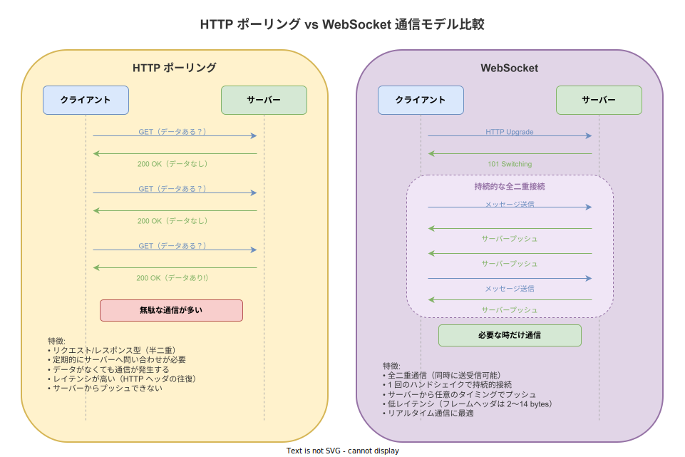
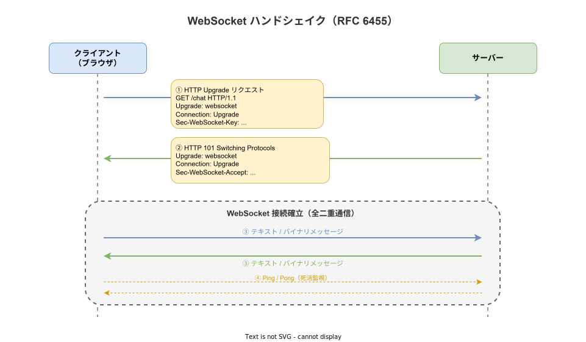

# WebSocket: 概要

- 対象読者: HTTP の基本（リクエスト/レスポンスモデル）を理解している開発者
- 学習目標: WebSocket の仕組み・ハンドシェイク・通信フローを理解し、HTTP との違いを説明できるようになる
- 所要時間: 約 30 分
- 対象バージョン: RFC 6455（2011 年策定、現行仕様）
- 最終更新日: 2026-04-12

## 1. このドキュメントで学べること

- WebSocket がどのような課題を解決するために設計されたかを説明できる
- HTTP ポーリングと WebSocket の違いを比較して説明できる
- ハンドシェイクの流れを理解できる
- フレームの種類（テキスト・バイナリ・制御フレーム）を区別できる
- 接続のライフサイクル（開始・通信・切断）を理解できる

## 2. 前提知識

- HTTP のリクエスト/レスポンスモデルの基本理解
- TCP/IP の基礎知識（コネクションの概念）
- ブラウザでの JavaScript の基本操作

## 3. 概要

WebSocket は、クライアントとサーバー間で**持続的な全二重（双方向同時）通信**を実現するプロトコルである。RFC 6455 で標準化され、URI スキームとして `ws://`（平文）および `wss://`（TLS 暗号化）を使用する。

従来の HTTP は「クライアントがリクエストを送り、サーバーがレスポンスを返す」という半二重モデルである。チャットやリアルタイム通知のように、サーバー側からクライアントへ即座にデータを届けたい場面では、HTTP ポーリング（定期的にリクエストを送る方式）に頼る必要があり、無駄な通信とレイテンシが発生していた。

WebSocket は、最初に HTTP でハンドシェイクを行った後、同じ TCP コネクション上でプロトコルを切り替え（Upgrade）、以降は HTTP を介さずに軽量なフレーム形式でデータを双方向にやり取りする。

## 4. 用語の整理

| 用語 | 説明 |
|------|------|
| 全二重通信（Full-duplex） | クライアントとサーバーが同時にデータを送受信できる通信方式 |
| ハンドシェイク | WebSocket 接続を確立するための最初の HTTP リクエスト/レスポンスのやり取り |
| Upgrade | HTTP コネクションを WebSocket プロトコルに切り替えること |
| フレーム（Frame） | WebSocket でデータを送受信する最小単位。ヘッダ + ペイロードで構成される |
| Ping / Pong | 接続の死活監視に使う制御フレーム。Ping を受信した側は Pong を返す |
| Close フレーム | 接続を正常に終了するための制御フレーム。ステータスコードと理由を含む |
| サブプロトコル | WebSocket 上で使用するアプリケーションレベルのプロトコル（例: `chat`, `graphql-ws`） |
| Origin | ブラウザが送信する接続元情報。サーバー側でアクセス制御に使用する |

## 5. 仕組み・アーキテクチャ

### 5.1 HTTP ポーリングとの比較

HTTP ポーリングではクライアントが定期的にサーバーへ問い合わせるため、データがなくても通信が発生する。WebSocket では 1 回のハンドシェイク後に持続的な接続を維持し、必要な時だけデータを送受信する。



### 5.2 ハンドシェイクの流れ

WebSocket 接続は、HTTP の Upgrade メカニズムを利用して確立される。クライアントが `Upgrade: websocket` ヘッダを含む GET リクエストを送信し、サーバーが `101 Switching Protocols` で応答すると、以降は WebSocket プロトコルで通信する。



`Sec-WebSocket-Key` と `Sec-WebSocket-Accept` は、プロキシが HTTP レスポンスをキャッシュすることを防ぐためのセキュリティ機構である。暗号化ではなく、WebSocket を理解するサーバーであることの証明に使われる。

### 5.3 フレームの種類

WebSocket の通信はフレーム単位で行われる。フレームは以下の種類に分類される。

| 種類 | オペコード | 用途 |
|------|-----------|------|
| テキストフレーム | 0x1 | UTF-8 テキストデータの送信 |
| バイナリフレーム | 0x2 | バイナリデータ（画像・音声等）の送信 |
| Close フレーム | 0x8 | 接続の正常終了を通知 |
| Ping フレーム | 0x9 | 接続の死活確認を要求 |
| Pong フレーム | 0xA | Ping への応答 |
| 継続フレーム | 0x0 | 大きなメッセージを分割して送信する際に使用 |

フレームヘッダは最小 2 バイトであり、HTTP ヘッダ（数百バイト〜数 KB）と比べて大幅にオーバーヘッドが小さい。

## 6. 環境構築

WebSocket はプロトコル仕様であり、特定のインストールは不要である。ブラウザ側は標準の `WebSocket` API を、サーバー側は各言語のライブラリを使用する。

### 6.1 主要なサーバー側ライブラリ

| 言語 | ライブラリ |
|------|-----------|
| Go | gorilla/websocket, coder/websocket |
| Rust | tokio-tungstenite, actix-web（WebSocket サポート内蔵） |
| Node.js | ws, Socket.IO |
| Python | websockets, FastAPI（WebSocket サポート内蔵） |

## 7. 基本の使い方

### ブラウザ側（JavaScript）

```javascript
// WebSocket クライアントの基本的な使い方を示すサンプル

// WebSocket 接続を作成する
const ws = new WebSocket("ws://localhost:8080/ws");

// 接続が開いた時のイベントハンドラを設定する
ws.onopen = () => {
  // サーバーにテキストメッセージを送信する
  ws.send("Hello, Server!");
};

// メッセージを受信した時のイベントハンドラを設定する
ws.onmessage = (event) => {
  // 受信したデータをコンソールに表示する
  console.log("受信:", event.data);
};

// エラー発生時のイベントハンドラを設定する
ws.onerror = (error) => {
  // エラー内容をコンソールに表示する
  console.error("エラー:", error);
};

// 接続が閉じた時のイベントハンドラを設定する
ws.onclose = (event) => {
  // 終了コードと理由を表示する
  console.log(`切断: code=${event.code}, reason=${event.reason}`);
};
```

### 解説

- `new WebSocket(url)` でサーバーへの接続を開始する。この時点でハンドシェイクが自動的に行われる
- `onopen` はハンドシェイク完了後に呼ばれる。この中で `send()` を使ってメッセージを送信する
- `onmessage` はサーバーからメッセージを受信するたびに呼ばれる。`event.data` にペイロードが格納される
- `onclose` は接続終了時に呼ばれる。`event.code` には RFC 6455 で定義されたステータスコードが入る

## 8. ステップアップ

### 8.1 接続の死活監視（Ping / Pong）

WebSocket 接続は長時間維持されるため、途中でネットワーク障害が起きても検知できない場合がある。Ping/Pong フレームを定期的に送受信することで、接続が生きているかを確認する。ブラウザの `WebSocket` API は Ping/Pong を自動処理するため、開発者が明示的に扱う必要はない。サーバー側では実装が必要であり、一般的に 15〜30 秒間隔で Ping を送信し、一定時間 Pong が返らなければ接続を切断する。

### 8.2 接続の正常終了（Close ハンドシェイク）

WebSocket の切断は Close フレームによる双方向のハンドシェイクで行う。一方が Close フレームを送信し、相手が Close フレームで応答した後に TCP コネクションが閉じられる。主要なステータスコードは以下の通りである。

| コード | 意味 |
|--------|------|
| 1000 | 正常終了 |
| 1001 | エンドポイントが去る（ページ遷移等） |
| 1006 | 異常終了（Close フレームなしで切断） |
| 1008 | ポリシー違反 |
| 1011 | サーバー内部エラー |

### 8.3 セキュリティ上の考慮事項

- 本番環境では `wss://`（WebSocket over TLS）を必ず使用する
- サーバー側で `Origin` ヘッダを検証し、許可されたオリジンからの接続のみ受け入れる
- メッセージサイズの上限（`ReadLimit`）を設定し、メモリ枯渇攻撃を防ぐ
- 認証はハンドシェイク時の HTTP ヘッダ（Cookie や Authorization）で行う

## 9. よくある落とし穴

- **再接続の未実装**: WebSocket は切断後に自動再接続しない。ネットワーク障害やサーバー再起動に備え、`onclose` で再接続ロジックを実装する必要がある
- **Ping/Pong の未実装**: サーバー側で死活監視を行わないと、切断に気づかずリソースを消費し続ける
- **メッセージ順序の誤解**: WebSocket は TCP 上で動作するため、メッセージの順序は保証される。ただし、複数の WebSocket 接続間の順序は保証されない
- **HTTP プロキシとの相性**: 一部のプロキシやロードバランサーは WebSocket の Upgrade を正しく処理できない。`wss://` を使うことで多くの問題を回避できる
- **バイナリとテキストの混同**: テキストフレームは UTF-8 でなければならない。バイナリデータをテキストフレームで送ると文字化けやエラーが発生する

## 10. ベストプラクティス

- 本番環境では常に `wss://`（TLS）を使用する
- サーバー側で Ping/Pong による死活監視を実装する（推奨間隔: 15〜30 秒）
- メッセージサイズの上限を設定してメモリ枯渇を防ぐ
- 指数バックオフ付きの再接続ロジックを実装する
- アプリケーションレベルのプロトコルを設計する（JSON 形式でメッセージタイプを定義するなど）
- 接続数の上限を設定し、リソースの枯渇を防止する

## 11. 演習問題

1. ブラウザの開発者ツール（Network タブ）で WebSocket 接続を観察し、ハンドシェイクのリクエスト/レスポンスヘッダを確認せよ
2. JavaScript の `WebSocket` API を使い、接続→メッセージ送信→受信→切断の一連のフローを実装せよ
3. HTTP ポーリングと WebSocket で同じ機能（1 秒ごとの時刻表示）を実装し、ネットワークタブで通信量の差を比較せよ

## 12. さらに学ぶには

- RFC 6455（WebSocket Protocol）: https://datatracker.ietf.org/doc/html/rfc6455
- MDN Web Docs - WebSocket API: https://developer.mozilla.org/ja/docs/Web/API/WebSocket
- RFC 7692（WebSocket Per-Message Compression）: https://datatracker.ietf.org/doc/html/rfc7692
- RFC 8441（Bootstrapping WebSockets with HTTP/2）: https://datatracker.ietf.org/doc/html/rfc8441

## 13. 参考資料

- RFC 6455 - The WebSocket Protocol: https://datatracker.ietf.org/doc/html/rfc6455
- MDN Web Docs - WebSocket: https://developer.mozilla.org/ja/docs/Web/API/WebSocket
- Gorilla WebSocket（Go 実装）: https://github.com/gorilla/websocket
- Coder WebSocket（Go 実装）: https://github.com/coder/websocket
