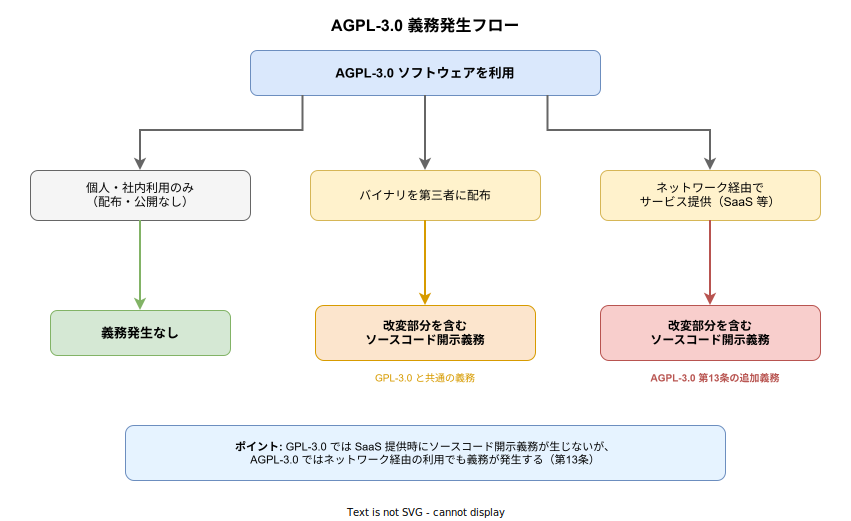

# AGPL-3.0: 基本

- 対象読者: OSS ライセンスの基本概念（著作権、ライセンス許諾）を理解している開発者
- 学習目標: AGPL-3.0 の義務と権利を正しく理解し、利用・適用の判断ができるようになる
- 所要時間: 約 25 分
- 対象バージョン: GNU Affero General Public License v3.0（2007 年 11 月公開）
- 最終更新日: 2026-04-12

## 1. このドキュメントで学べること

- AGPL-3.0 がどのようなライセンスかを説明できる
- GPL-3.0 との決定的な違い（第 13 条: ネットワーク利用条項）を理解できる
- AGPL-3.0 ソフトウェアを利用する際の義務を判断できる
- 自プロジェクトに AGPL-3.0 を適用する手順を理解できる

## 2. 前提知識

- ソフトウェアライセンスの基本概念（著作権、許諾、コピーレフト）
- OSS の配布と利用の一般的な流れ

## 3. 概要

AGPL-3.0（GNU Affero General Public License version 3）は、Free Software Foundation（FSF）が 2007 年に公開した強力なコピーレフト型 OSS ライセンスである。

GPL-3.0 の全条項を継承したうえで、第 13 条「Remote Network Interaction（リモートネットワークインタラクション）」を追加している。GPL-3.0 ではソフトウェアを「配布」した場合にのみソースコード開示義務が発生するが、AGPL-3.0 ではネットワーク経由でサービスを提供する場合にも同様の義務が発生する。

この追加条項は、SaaS の普及により、ソフトウェアを配布せずにサーバー上で実行するだけで GPL の義務を回避できる「ASP 抜け穴（ASP loophole）」を塞ぐ目的で設計された。

## 4. 用語の整理

| 用語 | 説明 |
|------|------|
| コピーレフト | 派生物にも同一ライセンスの適用を義務付ける性質 |
| FSF | Free Software Foundation。GPL / AGPL ライセンスの策定元 |
| ASP 抜け穴 | ソフトウェアを配布せずサーバー上で実行することで GPL の義務を回避する手法 |
| 第 13 条 | AGPL-3.0 固有の条項。ネットワーク経由の利用にもソースコード開示義務を課す |
| 対応するソース | 改変を含むソフトウェア全体のソースコード（Corresponding Source） |
| 配布（Convey） | 第三者がコピーを作成・受領できる形での伝達行為 |
| 伝播（Propagate） | 著作権法上の許諾が必要な行為（複製・改変・配布など） |

## 5. 仕組み・アーキテクチャ

AGPL-3.0 の義務が発生する条件を以下の図に示す。



### 義務発生の 3 つのシナリオ

| シナリオ | 義務 | GPL-3.0 との比較 |
|---------|------|-----------------|
| 個人・社内利用のみ（配布・公開なし） | 義務なし | 同じ |
| バイナリを第三者に配布 | ソースコード開示義務 | 同じ（GPL-3.0 第 6 条） |
| ネットワーク経由でサービス提供（SaaS 等） | ソースコード開示義務 | **AGPL-3.0 のみ**（第 13 条） |

第 13 条の要件として、ネットワーク経由でソフトウェアを利用するユーザーに対して、「対応するソース」をダウンロードできる手段を提供する必要がある。

## 6. 適用方法

### 6.1 必要なもの

- ライセンス本文ファイル（COPYING または LICENSE）
- 各ソースファイルの先頭に付与するライセンスヘッダー

### 6.2 自プロジェクトへの適用手順

1. プロジェクトのルートに `LICENSE` ファイルとして AGPL-3.0 の全文を配置する
2. 各ソースファイルの先頭に以下のライセンスヘッダーを追加する

```text
<プログラム名> - <簡単な説明>
Copyright (C) <年> <著者名>

This program is free software: you can redistribute it and/or modify
it under the terms of the GNU Affero General Public License as
published by the Free Software Foundation, either version 3 of the
License, or (at your option) any later version.

This program is distributed in the hope that it will be useful,
but WITHOUT ANY WARRANTY; without even the implied warranty of
MERCHANTABILITY or FITNESS FOR A PARTICULAR PURPOSE. See the
GNU Affero General Public License for more details.

You should have received a copy of the GNU Affero General Public License
along with this program. If not, see <https://www.gnu.org/licenses/>.
```

### 6.3 ソースコード提供の実装

AGPL-3.0 第 13 条を満たすために、ネットワーク経由の利用者がソースコードをダウンロードできる手段を実装する。一般的な方法は以下の通りである。

- アプリケーション内に「ソースコード」リンクを設置し、Git リポジトリ等へ誘導する
- `/source` エンドポイントを設け、ソースコードのアーカイブをダウンロード可能にする

## 7. 他ライセンスとの比較

| 特性 | MIT | Apache-2.0 | GPL-3.0 | AGPL-3.0 |
|-----|-----|-----------|---------|---------|
| コピーレフト | なし | なし | あり | あり（強化） |
| 配布時のソース開示 | 不要 | 不要 | 必要 | 必要 |
| SaaS 時のソース開示 | 不要 | 不要 | 不要 | **必要** |
| 特許付与 | 明示なし | あり | あり | あり |
| 互換性 | 広い | 広い | GPL 系のみ | AGPL 系のみ |

## 8. ステップアップ

### 8.1 AGPL-3.0 ソフトウェアの組み込み判断

AGPL-3.0 のソフトウェアをプロジェクトに組み込む場合、プロジェクト全体が AGPL-3.0 の義務を負う可能性がある。以下の判断基準で検討する。

- **リンク・結合の有無**: AGPL-3.0 コードとリンク（動的・静的）すると、結合した著作物全体に AGPL-3.0 が適用される
- **プロセス分離**: 別プロセスとして API 経由で通信する場合、ライセンスの伝播範囲は限定的とされる（ただし法的な確定見解ではない）
- **データベース等のツール利用**: AGPL-3.0 のデータベースをネットワーク経由で使用する場合、クライアント側のコードには通常伝播しない（例: MongoDB のドライバは Apache-2.0）

### 8.2 デュアルライセンス戦略

多くの企業は、AGPL-3.0 と商用ライセンスのデュアルライセンスを採用している。

- **OSS コミュニティ向け**: AGPL-3.0 で公開し、貢献を促す
- **商用利用者向け**: ソースコード開示を回避したい企業に有償の商用ライセンスを提供する

代表的な採用例: Grafana、Nextcloud、Mattermost

## 9. よくある落とし穴

- **「社内利用だから義務はない」と誤解する**: グループ会社や外部パートナーにアクセスを提供する場合は「ネットワーク経由のサービス提供」に該当する可能性がある
- **未改変なら開示不要と判断する**: 未改変でも、配布やネットワーク提供を行う場合はソースコードの提供手段を確保する必要がある
- **AGPL-3.0 コンポーネントの混在を見落とす**: 依存ライブラリに AGPL-3.0 が含まれていると、プロジェクト全体に影響する。ライセンススキャンツールで定期的に確認する
- **GPL-3.0 との互換性を誤解する**: GPL-3.0 のコードを AGPL-3.0 プロジェクトに組み込むことは可能だが、逆（AGPL-3.0 → GPL-3.0）はできない

## 10. ベストプラクティス

- AGPL-3.0 ソフトウェアの利用前に、自プロジェクトのライセンスとの互換性を確認する
- CI/CD パイプラインにライセンススキャンツール（FOSSA、Snyk 等）を組み込む
- AGPL-3.0 コンポーネントを利用する場合は、ソースコード提供の仕組みを設計段階で組み込む
- 法的判断が必要な場合は、OSS ライセンスに詳しい弁護士に相談する
- SBOM（Software Bill of Materials）を管理し、全依存関係のライセンスを把握する

## 11. 演習問題

1. 自社の Web アプリケーションが AGPL-3.0 ライセンスのライブラリを使用している場合、どのような義務が発生するか説明せよ
2. GPL-3.0 と AGPL-3.0 の義務発生条件の違いを、SaaS シナリオを例に説明せよ
3. AGPL-3.0 ソフトウェアを利用しつつ、自社コードのソースコード開示を避けたい場合、どのようなアーキテクチャ上の選択肢があるか検討せよ

## 12. さらに学ぶには

- AGPL-3.0 ライセンス全文（英語）: https://www.gnu.org/licenses/agpl-3.0.html
- FSF による GPL の FAQ: https://www.gnu.org/licenses/gpl-faq.html
- Choose a License: https://choosealicense.com/licenses/agpl-3.0/

## 13. 参考資料

- GNU Affero General Public License v3.0: https://www.gnu.org/licenses/agpl-3.0.html
- FSF License List: https://www.gnu.org/licenses/license-list.html
- Open Source Initiative - AGPL-3.0: https://opensource.org/licenses/AGPL-3.0
- SPDX License Identifier: AGPL-3.0-only / AGPL-3.0-or-later
