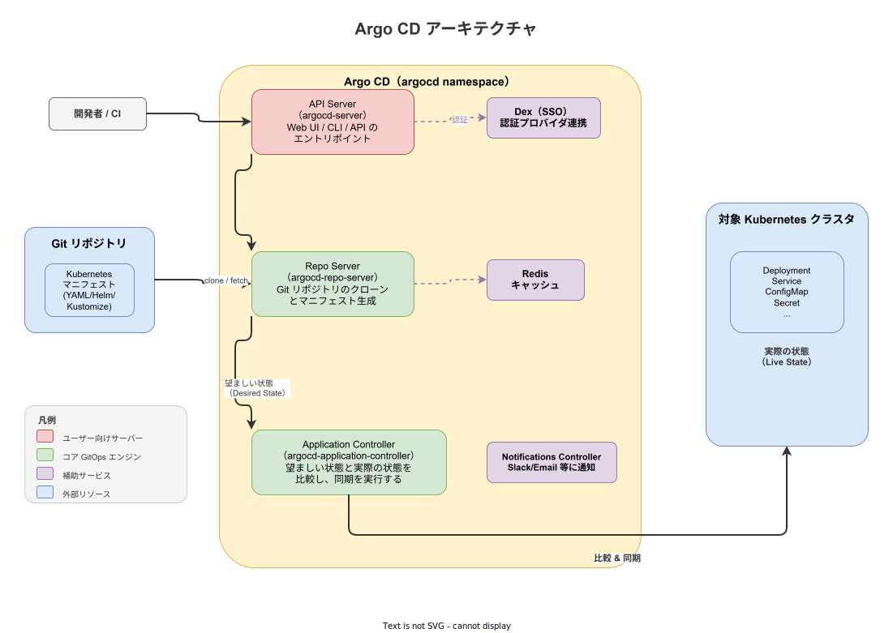
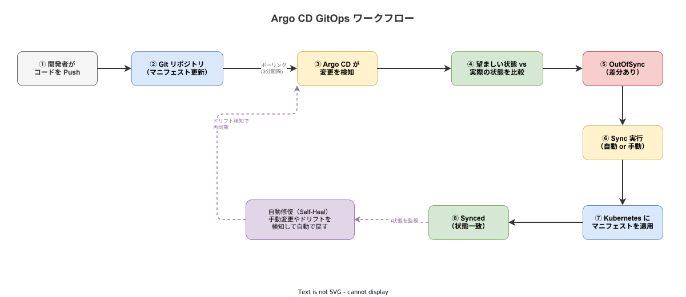

# Argo CD: 基本

- 対象読者: Kubernetes の基本操作（kubectl, マニフェスト適用）を理解している開発者
- 学習目標: Argo CD の仕組みを理解し、GitOps によるアプリケーションデプロイを実行できるようになる
- 所要時間: 約 40 分
- 対象バージョン: Argo CD v2.14
- 最終更新日: 2026-04-12

## 1. このドキュメントで学べること

- GitOps の考え方と Argo CD が解決する課題を説明できる
- Argo CD のアーキテクチャと主要コンポーネントの役割を理解できる
- Application リソースを作成してアプリケーションをデプロイできる
- Sync（同期）と Self-Heal（自動修復）の仕組みを説明できる

## 2. 前提知識

- Kubernetes の基本概念（Pod, Deployment, Service, Namespace）
- kubectl によるマニフェスト適用の経験
- Git の基本操作（clone, commit, push）
- YAML の基本的な記法

## 3. 概要

Argo CD は、Kubernetes 向けの宣言的な GitOps 継続的デリバリーツールである。CNCF の Graduated プロジェクトとして広く採用されている。

従来の CD パイプラインでは、CI ツール（Jenkins 等）がビルド後に `kubectl apply` を実行してデプロイしていた。この方式には以下の課題がある。

- クラスタの実際の状態と Git の定義がずれる（構成ドリフト）
- 誰がいつ何を変更したか追跡しにくい
- CI ツールにクラスタへの強い権限を与える必要がある

Argo CD は「Git リポジトリを唯一の信頼源（Single Source of Truth）とし、クラスタの状態を常に Git と一致させる」という GitOps の原則を実現する。Git に定義されたマニフェストと Kubernetes クラスタの実際の状態を常に比較し、差分があれば自動または手動で同期する。

## 4. 用語の整理

| 用語 | 説明 |
|------|------|
| GitOps | Git をインフラとアプリケーションの唯一の信頼源として運用する手法 |
| Application | Argo CD が管理するデプロイ単位。Git のソースとデプロイ先を定義する CRD |
| AppProject | Application をグループ化し、アクセス制御を行うための CRD |
| Sync | Git の望ましい状態を Kubernetes クラスタに適用する操作 |
| Desired State | Git リポジトリに定義されたマニフェストの状態 |
| Live State | Kubernetes クラスタ上の実際のリソース状態 |
| OutOfSync | Desired State と Live State が一致していない状態 |
| Synced | Desired State と Live State が一致している状態 |
| Self-Heal | クラスタ上で手動変更が行われた場合に Git の状態へ自動で戻す機能 |
| Prune | Git から削除されたリソースをクラスタからも削除する機能 |

## 5. 仕組み・アーキテクチャ

Argo CD は Kubernetes クラスタ上にデプロイされる複数のコンポーネントで構成される。



| コンポーネント | 役割 |
|---------------|------|
| API Server | Web UI・CLI・API のエントリポイント。認証・認可を処理する |
| Repo Server | Git リポジトリをクローンし、Helm/Kustomize 等からマニフェストを生成する |
| Application Controller | Desired State と Live State を比較し、Sync を実行する中核エンジン |
| Redis | マニフェストのキャッシュ。Kubernetes API と Git への負荷を軽減する |
| Dex | SSO 認証プロバイダとの連携を担当する（OIDC, SAML 等） |
| Notifications Controller | Sync 結果を Slack・Email 等に通知する |

### GitOps ワークフロー

以下の図は、コード変更からデプロイまでの一連の流れを示している。



Argo CD はデフォルトで 3 分間隔で Git リポジトリをポーリングし、変更を検知する。Webhook を設定すれば即時検知も可能である。

## 6. 環境構築

### 6.1 必要なもの

- Kubernetes クラスタ（minikube, kind 等でも可）
- kubectl
- Argo CD CLI（argocd コマンド）

### 6.2 セットアップ手順

```bash
# argocd 用の namespace を作成する
kubectl create namespace argocd

# Argo CD をインストールする
kubectl apply -n argocd -f https://raw.githubusercontent.com/argoproj/argo-cd/stable/manifests/install.yaml

# API Server にポートフォワードでアクセスする
kubectl port-forward svc/argocd-server -n argocd 8080:443
```

### 6.3 動作確認

```bash
# 初期管理者パスワードを取得する
argocd admin initial-password -n argocd

# CLI でログインする（ユーザー名: admin）
argocd login localhost:8080
```

ブラウザで `https://localhost:8080` にアクセスし、Web UI が表示されればセットアップ完了である。

## 7. 基本の使い方

以下は、サンプルアプリケーション（guestbook）をデプロイする最小構成の例である。

```yaml
# Argo CD Application リソースの定義
# guestbook アプリケーションを Git リポジトリからデプロイする
apiVersion: argoproj.io/v1alpha1
kind: Application
metadata:
  # Application の名前を定義する
  name: guestbook
  # Argo CD がインストールされた namespace を指定する
  namespace: argocd
spec:
  # 所属する Project を指定する（default は組み込みプロジェクト）
  project: default
  source:
    # マニフェストが格納された Git リポジトリの URL を指定する
    repoURL: https://github.com/argoproj/argocd-example-apps.git
    # 対象のブランチまたはタグを指定する
    targetRevision: HEAD
    # リポジトリ内のマニフェストのパスを指定する
    path: guestbook
  destination:
    # デプロイ先クラスタの API サーバーを指定する
    server: https://kubernetes.default.svc
    # デプロイ先の namespace を指定する
    namespace: default
```

### 解説

- `source`: Git リポジトリの情報を指定する。`repoURL` にリポジトリ、`path` にマニフェストのディレクトリを指定する
- `destination`: デプロイ先クラスタと namespace を指定する。同一クラスタの場合は `https://kubernetes.default.svc` を使用する
- `project`: Application の所属先。権限管理に使用する。`default` は制約なしの組み込みプロジェクト

```bash
# マニフェストを適用して Application を作成する
kubectl apply -f application.yaml

# CLI で Application の状態を確認する
argocd app get guestbook

# 手動で Sync を実行する
argocd app sync guestbook
```

## 8. ステップアップ

### 8.1 自動同期（Auto-Sync）の有効化

手動 Sync ではなく、Git の変更を自動で反映させるには `syncPolicy` を設定する。

```yaml
# 自動同期ポリシーの設定例
spec:
  syncPolicy:
    # 自動同期を有効にする
    automated:
      # Git から削除されたリソースをクラスタからも削除する
      prune: true
      # 手動変更を検知して Git の状態に自動で戻す
      selfHeal: true
```

### 8.2 AppProject によるアクセス制御

本番環境では `default` プロジェクトではなく、専用の AppProject を作成してデプロイ先やソースリポジトリを制限する。

```yaml
# 本番環境用の AppProject 定義
apiVersion: argoproj.io/v1alpha1
kind: AppProject
metadata:
  # プロジェクト名を定義する
  name: production
  # argocd namespace に配置する
  namespace: argocd
spec:
  # プロジェクトの説明を記載する
  description: Production applications
  # 許可するソースリポジトリを制限する
  sourceRepos:
    - 'https://github.com/myorg/*'
  # 許可するデプロイ先を制限する
  destinations:
    - namespace: 'production'
      server: https://kubernetes.default.svc
```

## 9. よくある落とし穴

- **namespace の未作成**: `destination.namespace` に指定した namespace が存在しないとデプロイが失敗する。`CreateNamespace=true` の Sync Option で自動作成できる
- **Sync しても OutOfSync のまま**: Helm の `helm.sh/hook` アノテーション付きリソースが原因になることがある。Sync Option で除外設定を確認する
- **Git リポジトリの認証エラー**: プライベートリポジトリの場合、事前に `argocd repo add` で認証情報を登録する必要がある
- **自動 Sync の無限ループ**: Admission Webhook がリソースを変更する環境では、Argo CD が差分を検知し続ける。`ignoreDifferences` で除外フィールドを設定する

## 10. ベストプラクティス

- アプリケーションのソースコードとマニフェストは別リポジトリに分離する
- `selfHeal: true` を設定して構成ドリフトを自動修復する
- AppProject で最小権限の原則を適用し、デプロイ先を制限する
- Webhook を設定して Git の変更を即時検知する（ポーリング 3 分間隔の遅延を回避）
- Notifications Controller で Sync 結果をチームに通知する

## 11. 演習問題

1. Argo CD をローカルクラスタにインストールし、Web UI にログインせよ
2. guestbook アプリケーションの Application リソースを作成し、手動 Sync でデプロイせよ
3. `syncPolicy.automated` を追加し、Git のマニフェストを変更した際に自動で反映されることを確認せよ
4. `kubectl` でデプロイ済みリソースを直接編集し、Self-Heal により元に戻ることを確認せよ

## 12. さらに学ぶには

- 公式ドキュメント: https://argo-cd.readthedocs.io/en/stable/
- Argo CD Getting Started: https://argo-cd.readthedocs.io/en/stable/getting_started/
- ApplicationSet（複数クラスタ・環境への一括デプロイ）: https://argo-cd.readthedocs.io/en/stable/user-guide/application-set/

## 13. 参考資料

- Argo CD GitHub リポジトリ: https://github.com/argoproj/argo-cd
- Argo CD Architecture: https://argo-cd.readthedocs.io/en/stable/operator-manual/architecture/
- GitOps の原則（OpenGitOps）: https://opengitops.dev/
- CNCF Argo Project: https://www.cncf.io/projects/argo/
