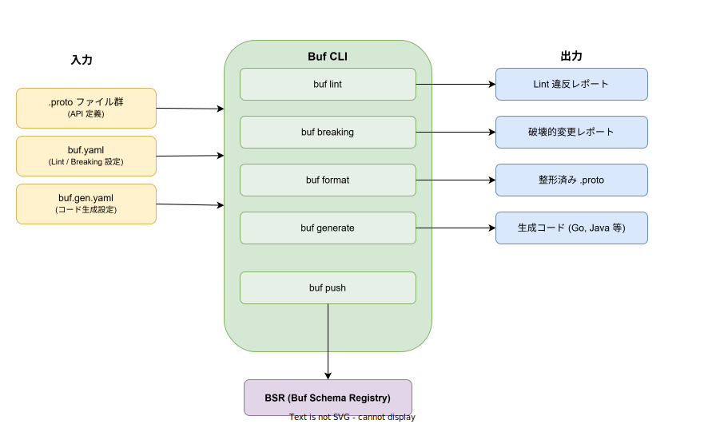
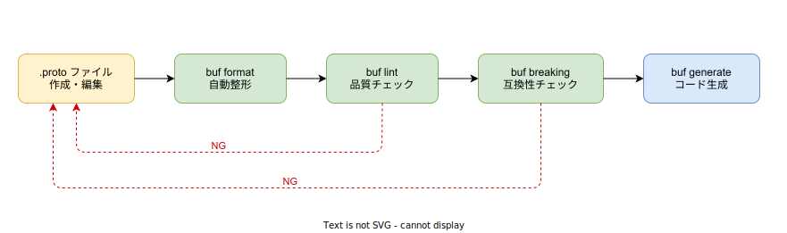

# Buf: 基本

- 対象読者: gRPC や Protocol Buffers を使うプロジェクトに参加する開発者
- 学習目標: Buf CLI を使って .proto ファイルの Lint・破壊的変更検出・コード生成を一通り実行できるようになる
- 所要時間: 約 30 分
- 対象バージョン: Buf CLI v1.42.x
- 最終更新日: 2026-04-12

## 1. このドキュメントで学べること

- Buf が解決する課題と protoc との違いを説明できる
- `buf.yaml` と `buf.gen.yaml` の役割を区別できる
- `buf lint` / `buf breaking` / `buf format` / `buf generate` を実行できる
- BSR（Buf Schema Registry）の位置づけを理解できる

## 2. 前提知識

- Protocol Buffers の基本（`.proto` ファイルの構文、`message` / `service` の概念）
- ターミナル操作の基本

## 3. 概要

Buf は Protocol Buffers（Protobuf）を扱うための統合 CLI ツールである。従来の `protoc` を中心としたワークフローでは、`.proto` ファイルのパス管理・プラグインの手動設定・命名規則の手動レビューなど、多くの手作業が発生していた。Buf はこれらを 1 つのツールに統合し、Lint（静的解析）、破壊的変更の検出、コード生成、フォーマットをコマンド一つで実行できる環境を提供する。

## 4. 用語の整理

| 用語 | 説明 |
|------|------|
| Buf CLI | Protobuf ファイルの管理・検証・生成を統合的に行うコマンドラインツール |
| buf.yaml | Buf のモジュール定義・Lint ルール・Breaking ルールを記述する設定ファイル |
| buf.gen.yaml | コード生成のプラグインや出力先を記述する設定ファイル |
| BSR | Buf Schema Registry の略。Protobuf スキーマを公開・共有するためのレジストリ |
| モジュール | Buf が管理する .proto ファイルのまとまり。`buf.yaml` の `modules` で定義する |
| 破壊的変更 | 既存のクライアントやサーバーとの互換性を壊すスキーマ変更のこと |
| Managed Mode | `buf.gen.yaml` で有効にすると、言語固有のオプション（`go_package` 等）を Buf が自動管理する機能 |

## 5. 仕組み・アーキテクチャ

Buf CLI は「入力ファイル」「CLI コマンド群」「出力」の 3 層で構成される。`.proto` ファイルと設定ファイルを入力として受け取り、各コマンドが検証・変換・生成を行い、結果を出力する。



開発ワークフローでは、`.proto` ファイルの作成後に `buf format` → `buf lint` → `buf breaking` → `buf generate` の順に実行する。Lint や Breaking で違反が検出された場合は `.proto` を修正して再実行する。



## 6. 環境構築

### 6.1 必要なもの

- ターミナル（bash / zsh / PowerShell）
- コード生成に使うプラグイン（例: `protoc-gen-go`）

### 6.2 セットアップ手順

```bash
# Buf CLI をインストールする（macOS / Linux）
brew install bufbuild/buf/buf

# Windows の場合は Scoop を使用する
# scoop install buf

# Go プラグインをインストールする（Go でコード生成する場合）
go install google.golang.org/protobuf/cmd/protoc-gen-go@latest
```

### 6.3 動作確認

```bash
# バージョンを確認する
buf --version
```

## 7. 基本の使い方

### プロジェクトの初期化

```bash
# buf.yaml を生成する
buf config init
```

生成される `buf.yaml` の内容は以下のとおりである。

```yaml
# buf.yaml: Buf のモジュール設定ファイル
# バージョンを指定する
version: v2
# Lint ルールを設定する
lint:
  # STANDARD ルールセットを使用する
  use:
    - STANDARD
# 破壊的変更検出ルールを設定する
breaking:
  # FILE レベルの検出を使用する
  use:
    - FILE
```

### .proto ファイルの例

```protobuf
// pet.proto: ペットサービスの API 定義ファイル

// proto3 構文を使用する
syntax = "proto3";

// パッケージ名を定義する
package pet.v1;

// ペットのメッセージ型を定義する
message Pet {
  // ペットの一意識別子を定義する
  string pet_id = 1;
  // ペットの名前を定義する
  string name = 2;
}

// ペットサービスの RPC を定義する
service PetService {
  // ペットを取得する RPC を定義する
  rpc GetPet(GetPetRequest) returns (GetPetResponse);
}

// GetPet リクエストのメッセージ型を定義する
message GetPetRequest {
  // 取得対象のペット ID を定義する
  string pet_id = 1;
}

// GetPet レスポンスのメッセージ型を定義する
message GetPetResponse {
  // 取得したペット情報を定義する
  Pet pet = 1;
}
```

### Lint の実行

```bash
# .proto ファイルの品質チェックを実行する
buf lint
```

### 破壊的変更の検出

```bash
# main ブランチとの差分で破壊的変更を検出する
buf breaking --against ".git#branch=main"
```

### コード生成

`buf.gen.yaml` を作成する。

```yaml
# buf.gen.yaml: コード生成の設定ファイル
# バージョンを指定する
version: v2
# プラグイン設定を定義する
plugins:
  # protoc-gen-go プラグインを使用する
  - local: protoc-gen-go
    # 出力先ディレクトリを指定する
    out: gen/go
    # ソース相対パスオプションを指定する
    opt: paths=source_relative
```

```bash
# コードを生成する
buf generate
```

## 8. ステップアップ

### 8.1 Managed Mode によるオプション自動管理

`buf.gen.yaml` で `managed.enabled: true` を設定すると、`go_package` などの言語固有オプションを Buf が自動で付与する。`.proto` ファイルから言語依存の記述を排除できる。

### 8.2 BSR を使った依存管理

`buf.yaml` の `deps` に BSR 上のモジュールを指定すると、外部スキーマを依存として取り込める。`buf dep update` で依存を解決し `buf.lock` が生成される。

## 9. よくある落とし穴

- **`buf.yaml` を配置せずに実行する**: Buf はカレントディレクトリから `buf.yaml` を探す。未配置の場合はデフォルト設定で動作し、意図しない結果になる
- **`--against` の指定ミス**: `buf breaking` は比較対象が必須である。Git ブランチを指定する場合、`.git#branch=main` のように `.git` プレフィックスが必要
- **protoc プラグインの PATH 未設定**: `buf generate` はローカルプラグインを PATH から検索する。`protoc-gen-go` 等が PATH に含まれていないとエラーになる
- **パッケージ名のバージョニング忘れ**: `package pet;` ではなく `package pet.v1;` のようにバージョンを含めないと、STANDARD Lint ルールで警告される

## 10. ベストプラクティス

- CI/CD パイプラインに `buf lint` と `buf breaking --against` を組み込み、マージ前に品質を自動検証する
- Managed Mode を有効にし、`.proto` ファイルから言語固有のオプションを除去する
- パッケージ名にはバージョン（`v1`, `v2` 等）を含め、API の進化に対応する
- Breaking ルールは `FILE` レベル（最も厳格）から始め、必要に応じて `PACKAGE` や `WIRE_JSON` に緩和する

## 11. 演習問題

1. `buf config init` でプロジェクトを初期化し、サンプルの `.proto` ファイルに対して `buf lint` を実行せよ。警告が出た場合は修正せよ
2. `.proto` ファイルのフィールド型を変更し、`buf breaking --against` で破壊的変更として検出されることを確認せよ
3. `buf.gen.yaml` を作成し、`buf generate` で Go コードを生成せよ

## 12. さらに学ぶには

- 公式ドキュメント: https://buf.build/docs
- Buf CLI クイックスタート: https://buf.build/docs/cli/quickstart
- BSR ドキュメント: https://buf.build/docs/bsr/introduction
- 関連 Knowledge: gRPC の基本は `../protocol/grpc_basics.md` を参照（作成予定）

## 13. 参考資料

- Buf 公式サイト: https://buf.build
- Buf CLI GitHub リポジトリ: https://github.com/bufbuild/buf
- Buf CLI ドキュメント: https://buf.build/docs/cli/quickstart
- Breaking Change Detection: https://buf.build/docs/breaking/quickstart
